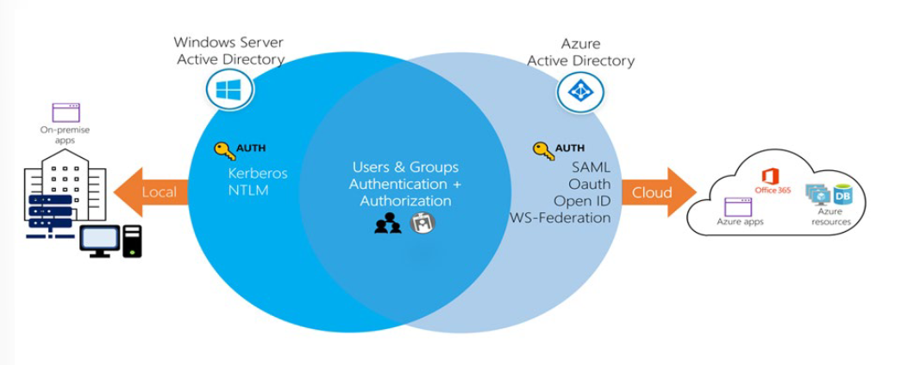
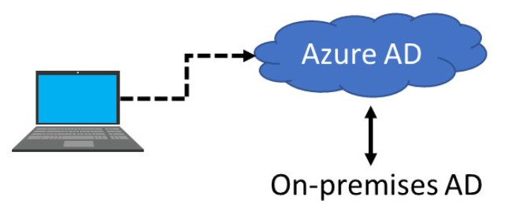
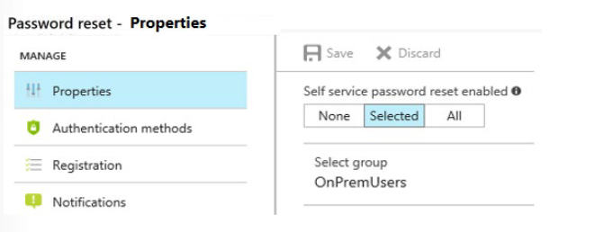
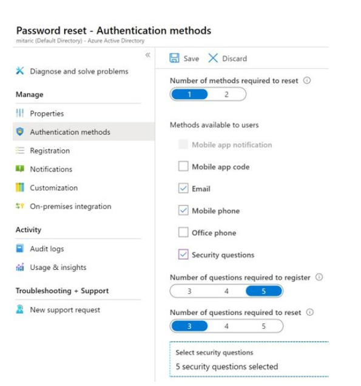
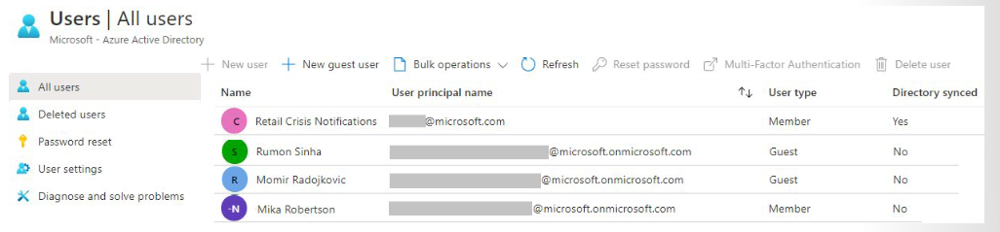
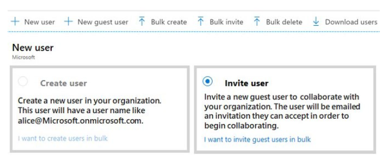
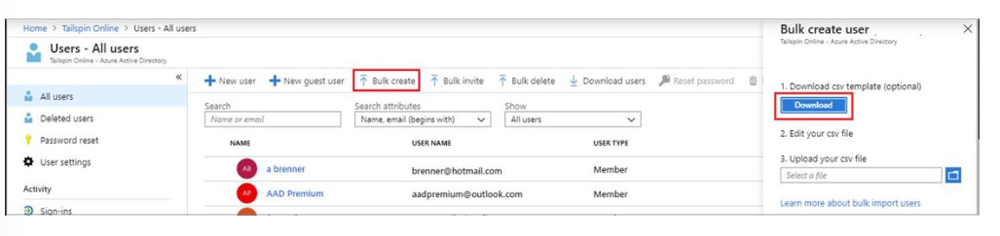
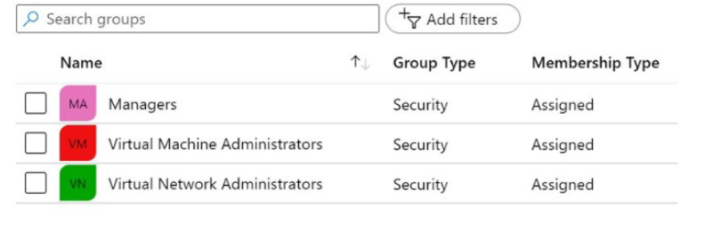

# AZ-104: Module 01 - Administer Identity (Kimlik Yönetimi)

AZ-104 (Microsoft Azure Administrator) sertifikasyon sınavının ilk bölümü olan **Administer Identity (Kimlik Yönetimi)** modülü, sınav sorularının yaklaşık **%15 - %20'sini** oluşturur. Bu doküman, sınav hazırlığınız ve pratik yapabilmeniz için hem **detaylı Türkçe ders notlarını** hem de altyapıyı otomatik dağıtabileceğiniz **Terraform lab kodlarını** tek bir kaynakta bir araya getirir.

---

## 📚 Bölüm 1: Detaylı Ders Notları

Bu modül iki temel ana başlıktan oluşur:
1. **Configure Azure Active Directory (Azure AD / Microsoft Entra ID Yapılandırması)**
2. **Configure User and Group Accounts (Kullanıcı ve Grup Hesaplarının Yönetimi)**

---

### 1.1 Azure Active Directory (Azure AD) Temelleri

#### Azure AD Nedir?
Azure Active Directory (güncel adıyla **Microsoft Entra ID**), Microsoft'un bulut tabanlı çok kiracılı (multi-tenant) kimlik ve erişim yönetim hizmetidir. Bulut ve şirket içi (on-premises) uygulamalara güvenli bir şekilde Single Sign-On (SSO - Tek Oturum Açma) yapılmasını sağlar.

#### Temel Kavramlar
* **Identity (Kimlik):** Doğrulanabilen (authenticated) nesnedir. Bir kullanıcı (kullanıcı adı/parola), uygulama veya servis hesabı olabilir.
* **Account (Hesap):** Bir kimliğe bağlı verilerin tutulduğu yapıdır. Kimlik olmadan hesap olamaz.
* **Azure AD Account (İş veya Okul Hesabı):** Azure AD veya Microsoft 365 üzerinde oluşturulan ve bulut hizmetlerine erişim sağlayan kimliklerdir.
* **Tenant (Kiracı / Directory):** Bir organizasyonun Microsoft bulut hizmetlerine kaydolurken aldığı özel ve adanmış Azure AD örneğidir (instance).
* **Subscription (Abonelik):** Azure kaynaklarının kullanımını ve faturalandırmasını takip eden mantıksal konteynerdir. Bir Azure AD Kiracısına birden fazla abonelik bağlanabilir.



#### Avantajları ve Temel Özellikleri (Benefits and Features)
* **Bulut ve Şirket İçi Web Uygulamalarına Single Sign-On (SSO):** Microsoft 365, Salesforce, Workday, DocuSign, ServiceNow ve Box gibi binlerce SaaS uygulamasının yanı sıra şirket içi web uygulamalarına da güvenli SSO erişimi sağlar.
* **Çoklu Platform Desteği (iOS, macOS, Android, Windows):** Kullanıcılar; özelleştirilmiş web tabanlı erişim paneli, mobil uygulama, Microsoft 365 veya kurumsal portal üzerinden mevcut iş kimlikleriyle erişim sağlayabilirler. Deneyim tüm işletim sistemlerinde aynıdır.
* **Güvenli Uzaktan Erişim ile Şirket İçi Web Uygulamalarını Koruma:** Şirket içi web uygulamalarına her yerden erişim imkanı sunarken Multi-Factor Authentication (MFA), Conditional Access (Koşullu Erişim) ve grup tabanlı erişim politikalarıyla koruma sağlar. Kullanıcılar SaaS ve on-premise uygulamalara aynı portal üzerinden erişebilir.
* **Active Directory'yi Buluta Kolayca Genişletme:** Şirket içi Active Directory yapısı birkaç adımda Azure Active Directory'ye bağlanabilir. Bu bağlantı, her iki ortamda da tutarlı kullanıcı, grup, parola ve cihaz kümesi oluşturur.
* **Hassas Veri ve Uygulamaları Koruma:** Benzersiz kimlik koruma yetenekleriyle erişim güvenliği artırılır. Şüpheli oturum açma etkinlikleri ve potansiyel zafiyetler için konsolide görünüm, gelişmiş güvenlik raporları, risk tabanlı politikalar ve çözüm önerileri sunar.
* **Self-Service Özellikler ile Maliyet Azaltma ve Güvenlik Artırma:** Parola sıfırlama, grup oluşturma/yönetme ve self-service uygulama erişimi gibi kritik görevler çalışanlara devredilebilir. Bu durum Helpdesk çağrılarını azaltır.

> 💡 **Önemli Not:** Bir Microsoft 365, Azure veya Dynamics CRM Online müşterisiyseniz, halihazırda Azure AD kullanıyorsunuz demektir. Her M365, Azure ve Dynamics CRM kiracısı zaten bir Azure AD kiracısıdır.

---

### 1.2 Azure AD Sürümleri (Editions & Pricing)

* **Azure Active Directory Free:**
  * Kullanıcı ve grup yönetimi sunar.
  * Şirket içi dizin senkronizasyonunu (On-premises directory synchronization / Azure AD Connect) destekler.
  * Temel raporlar ile Azure, Microsoft 365 ve birçok popüler SaaS uygulaması genelinde Single Sign-On (SSO) sağlar.

* **Azure Active Directory Microsoft 365 Apps:**
  * Office 365 / Microsoft 365 abonelikleri ile birlikte gelir.
  * Free sürümünün tüm özelliklerine ek olarak; Microsoft 365 uygulamaları için Kimlik ve Erişim Yönetimi, özel şirket markalaması (Branding), Çok Faktörlü Kimlik Doğrulama (MFA), grup erişim yönetimi ve bulut kullanıcıları için Self-Service Parola Sıfırlama (SSPR) sunar.

* **Azure Active Directory Premium P1:**
  * Free ve M365 Apps özelliklerine ek olarak hibrit kullanıcıların hem şirket içi (on-premises) hem de bulut kaynaklarına erişmesine imkan tanır.
  * Gelişmiş yönetim özellikleri içerir: Dinamik Gruplar (Dynamic Groups), self-service grup yönetimi, Microsoft Identity Manager (MIM) ve şirket içi kullanıcıların SSPR yapabilmesini sağlayan buluta geri yazma (Cloud Write-Back) yetenekleri (Password Writeback).

* **Azure Active Directory Premium P2:**
  * Free, M365 Apps ve P1 sürümlerinin tüm özelliklerini kapsar.
  * **Azure Active Directory Identity Protection:** Uygulamalarınıza ve kritik şirket verilerinize risk tabanlı Koşullu Erişim (Risk-based Conditional Access) sağlamak için kullanılır.
  * **Privileged Identity Management (PIM):** Yöneticileri ve kaynak erişimlerini keşfetmek, kısıtlamak, izlemek ve gerektiğinde Tam Zamanında Erişim (Just-In-Time / JIT access) sağlamak için dahili olarak sunulur.

---

### 1.3 AD DS (Geleneksel Active Directory) vs. Azure AD Karşılaştırması

| Özellik | Geleneksel AD DS (On-Premises) | Azure AD (Bulut) |
| :--- | :--- | :--- |
| **Mimari** | Hierarchical (OU yapısı var) | Flat Structure (Düz yapı, OU ve GPO **yoktur**) |
| **Sorgulama Protokolü** | LDAP / Kerberos / NTLM | REST API / HTTP(S) |
| **Kimlik Doğrulama** | Kerberos, NTLM | SAML, WS-Federation, OpenID Connect, OAuth |
| **Cihaz Yönetimi** | Group Policy Objects (GPO) | MDM (Microsoft Intune), Azure AD Join |

> 📌 **Sınav İpucu:** Azure AD bir "Sunucu/Sanal Makine" üzerinde çalışan Domain Controller değildir. Microsoft tarafından yönetilen bir PaaS / SaaS kimlik hizmetidir.

---

### 1.4 Azure AD Cihaz Yönetimi ve Azure AD Join Uygulaması

Azure AD; cihazlara, uygulamalara ve servisere her yerden Single Sign-On (SSO) erişimi sağlar. IT yöneticileri kurumsal varlıkların korunduğundan, cihazların güvenlik ve uyumluluk standartlarını karşıladığından emin olmalıdır.

#### Cihaz Bağlantı Seçenekleri (Connection Options)



Bir cihazı Azure AD kontrolü altına almak için iki temel seçenek bulunur:

* **Registering a device (Azure AD Registered):** Cihaz kimliğini yönetmeyi sağlar. Kullanıcı Azure AD'de oturum açtığında cihaz doğrulanır. Cihazı etkinleştirmek veya devre dışı bırakmak mümkündür.
  > 💡 **MDM Notu:** Registration işlemi Microsoft Intune gibi bir MDM (Mobile Device Management) çözümüyle birleştirildiğinde Azure AD'ye ek cihaz öznitelikleri aktarılır. Bu sayede cihazların güvenlik standartlarına uyumunu zorunlu kılan Koşullu Erişim (Conditional Access) kuralları yazılabilir.
* **Joining a device (Azure AD Joined):** Registration yeteneklerinin tamamını kapsar ve cihazın yerel durumunu değiştirir. Kullanıcıların kişisel hesap yerine kurumsal iş/okul hesaplarıyla (`user@company.com`) cihaza doğrudan oturum açmasını sağlar.

#### Azure AD Join Avantajları
* **Azure Tarafından Yönetilen SaaS ve Servislere SSO:** Kurumsal kaynaklara erişirken ek kimlik doğrulama adımları çıkmaz. Kullanıcılar domain ağına bağlı olmasalar bile SSO çalışır.
* **Kurumsal Ayarların Gezinmesi (Enterprise Compliant Roaming):** Kullanıcıların ayarlarını cihazlar arasında senkronize etmek için kişisel Microsoft hesaplarına (Hotmail, Outlook vb.) ihtiyacı yoktur.
* **Microsoft Store for Business Erişimi:** Kullanıcılar organizasyon tarafından önceden seçilmiş uygulama envanterine Azure AD hesaplarıyla erişebilir.
* **Windows Hello Desteği:** Kurumsal kaynaklara güvenli ve pratik erişim sağlar.
* **Uyumlu Cihaz Kısıtlaması:** Uygulamalara erişim, sadece güvenlik ve uyumluluk politikalarını karşılayan cihazlarla sınırlandırılabilir.
* **Şirket İçi Kaynaklara Sorunsuz Erişim:** Cihaz şirket içi Domain Controller (DC) ile görüşebildiği (line-of-sight) durumlarda şirket içi kaynaklara kesintisiz erişim sunar.

> 📌 **Mimarî Not:** Azure AD Join temel olarak şirket içi Windows Server Active Directory altyapısı bulunmayan organizasyonlar için tasarlanmış olsa da şube/şantiye (branch office) senaryolarında da yaygın olarak kullanılır.

---

### 1.5 Self-Service Password Reset (SSPR) Uygulaması

Helpdesk çağrılarının büyük kısmı parola sıfırlama taleplerinden oluşur. SSPR'ı etkinleştirmeler kullanıcıların Helpdesk'e ihtiyaç duymadan kendi parolalarını sıfırlamalarını sağlar.

#### SSPR Konfigürasyonu ve Kapsam Seçenekleri



Azure Portal üzerinde **Microsoft Entra ID (Azure AD) > Password reset** sekmesinden yapılandırılır. Üç temel erişim seçeneği bulunur:
* **None:** SSPR tüm kullanıcılar için kapalıdır.
* **Selected:** Belirli grupların SSPR kullanmasını sağlar. Tüm organizasyona dağıtmadan önce PoC veya test grupları oluşturmak için idealdir.
* **All:** Kiracıdaki tüm kullanıcı hesapları için SSPR'ı aktif eder.

#### Kimlik Doğrulama Yöntemleri (Authentication Methods)
SSPR etkinleştirildikten sonra parola sıfırlama için gereken doğrulama yöntemi sayısı ve kullanıcılara sunulacak yöntemler belirlenir:
* **Yöntem Sayısı:** Parola sıfırlama için en az 1 yöntem gereklidir (birden fazla yöntem sunmak önerilir).
* **Sunulabilen Yöntemler:** E-posta bildirimi, mobil veya iş telefonuna SMS/arama, mobil uygulama kodu veya Güvenlik Soruları (Security Questions).
* **Güvenlik Soruları (Security Questions):** Kiracıdaki kullanıcıların yanıtlaması gereken soru sayısı ve doğru bilinmesi gereken yanıt sayısı ayarlanabilir. *Diğer kullanıcılar yanıtları tahmin edebileceğinden güvenlik soruları diğer yöntemlere kıyasla daha düşük güvenlik sunar.*



---

### 1.6 Kullanıcı ve Grup Yönetimi

#### Kullanıcı Türleri
1. **Cloud Identities:** Doğrudan Azure AD üzerinde oluşturulan hesaplardır.
2. **Directory-Synchronized Identities:** Şirket içi Active Directory'den Azure AD Connect ile senkronize edilen hesaplardır.
3. **Guest Users (B2B):** Dış organizasyonlardan veya kişisel Microsoft hesaplarından davet edilen konuk kullanıcılardır.



> 🗑️ **Silinen Kullanıcılar:** Silinen bir kullanıcı hesabı **30 gün** boyunca "Deleted Users" alanında saklanır ve bu süre içinde geri yüklenebilir (Soft Delete).

---

#### Toplu Kullanıcı Oluşturma (Create Bulk User Accounts)
Azure AD, CSV şablon dosyası ile toplu kullanıcı oluşturma, silme ve kullanıcı listelerini indirme işlemlerini destekler.
* **Yetki Gereksinimi:** Azure Portal üzerinde toplu kullanıcı oluşturmak için **Global Administrator** veya **User Administrator** rolüne sahip olunmalıdır.
* **Şablon Kullanımında Dikkat Edilecek Hususlar:**
  * **İsimlendirme Standartları (Naming Conventions):** Kullanıcı adları (UPN), görünen adlar ve takma adlar (alias) için kurumsal bir standart belirlenmelidir (Örn: `Soyad.Ad@contoso.com`).
  * **İlk Parola Yönetimi:** Yeni oluşturulan kullanıcıların geçici parolaları için bir standart belirlenmeli ve bu parolaların kullanıcıya/yöneticisine güvenli ulaştırılması sağlanmalıdır (Örn: Rastgele parola üretip e-posta ile iletme).





> 💡 **İpucu:** Toplu kullanıcı yükleme işlemleri Azure Portal'ın yanı sıra **PowerShell** (Microsoft Graph PowerShell modülü) kullanılarak da gerçekleştirilebilir.

---

#### Grup Hesapları Oluşturma ve Üyelik Türleri (Create Group Accounts)

Azure AD üzerinde iki temel grup türü tanımlanabilir:
* **Security Groups (Güvenlik Grupları):** Kullanıcı ve bilgisayarların paylaşılan kaynaklara erişim yetkilerini yönetmek için kullanılır. İzinler kullanıcılara tek tek atanmak yerine gruba tek seferde tanımlanır. *Sadece Azure AD yöneticileri tarafından oluşturulabilir.*
* **Microsoft 365 Groups:** Ortak çalışma (collaboration) imkanı sunar. Üyelere paylaşılan e-posta kutusu, takvim, dosyalar, SharePoint sitesi ve Teams erişimi sağlar. Organizasyon dışındaki kişilere de erişim verilebilir. *Hem kullanıcılar hem de yöneticiler tarafından oluşturulabilir.*



**Grup Üyelik Tipleri (Adding Members to Groups):**
* **Assigned (Elle Atamalı):** Belirli kullanıcılar gruba elle üye yapılır ve özgün izinler alırlar.
* **Dynamic User (Dinamik Kullanıcı):** Kullanıcı özniteliklerine (Department, Title vb.) göre otomatik üye ekleme/çıkarma kuralları tanımlanır. Kullanıcının öznitelikleri değiştiğinde Azure kuralları kontrol ederek üyeliği günceller.
* **Dynamic Device (Dinamik Cihaz - Sadece Güvenlik Grupları):** Cihaz özniteliklerine göre cihazları otomatik gruba ekler veya çıkarır. Cihaz durumu değiştiğinde grup üyeliği otomatik güncellenir.

---

#### Administrative Units (Yönetsel Birimler)

Bölüm veya fakülte gibi bağımsız birimlerden oluşan organizasyonlarda yönetsel yetki kapsamını (administrative scope) sınırlandırmak için kullanılır.

* **Örnek Senaryo:**
  Bir üniversitede İşletme Fakültesi ve Mühendislik Fakültesi gibi özerk okullar bulunsun. Merkezi yönetici (Central Admin):
  1. İşletme Fakültesi için bir Administrative Unit (AU) oluşturur.
  2. Bu AU içerisine sadece İşletme Fakültesi öğrenci ve personelini ekler.
  3. Sadece bu AU kapsamındaki kullanıcıları yönetebilecek özel bir rol oluşturur.
  4. İşletme Fakültesi IT ekibine bu sınırlandırılmış yetkiyi (scope) atar.

* **Önemli Hususlar:**
  * AU'lar **Azure Portal**, **PowerShell** veya **Microsoft Graph API** kullanılarak yönetilebilir.
  * Portal üzerinden AU yönetimi için **Global Administrator** veya **Privileged Role Administrator** rolü gereklidir.
  * **Kapsam Sınırı:** AU'lar sadece *yönetim yetkilerini (management permissions)* sınırlandırır. Kullanıcıların veya yöneticilerin varsayılan kullanıcı yetkilerini kullanarak AU dışındaki diğer kullanıcıları, grupları veya kaynakları gözlemlemesini (browse) engellemez.

---

## 🛠️ Bölüm 2: Terraform Lab Ortamı

Bu bölüm, yukarıda öğrenilen teorik konuları (Kullanıcılar, Dinamik ve Atamalı Gruplar, Administrative Unit) Azure ortamında test edebilmeniz için hazırlanan IaC (Infrastructure as Code) kodunu içerir.

### 2.1 Ön Gereksinimler
1. Bilgisayarınızda **Terraform** (>= 1.0.0) ve **Azure CLI (`az`)** kurulu olmalıdır.
2. Terminalinizden `az login` komutu ile Azure hesabınıza giriş yapılmış olmalıdır.

---

### 2.2 Terraform Kod Bloğu (`main.tf`)

```hcl
terraform {
  required_version = ">= 1.0.0"
  required_providers {
    azuread = {
      source  = "hashicorp/azuread"
      version = "~> 2.40.0"
    }
  }
}

provider "azuread" {}

# 1. Kiracı Domain Bilgisini Alma
data "azuread_domains" "default" {
  only_initial = true
}

locals {
  domain_name = data.azuread_domains.default.domains[0].domain_name
}

# 2. Kullanıcı 1: Cloud Administrator (Dinamik Gruba Düşecek)
resource "azuread_user" "user1" {
  user_principal_name   = "az104-01a-user1@${local.domain_name}"
  display_name          = "AZ104 Cloud Admin User"
  mail_nickname         = "az104-01a-user1"
  password              = "P@ssw0rd123456!"
  job_title             = "Cloud Administrator"
  department            = "IT"
  force_password_change = true
}

# 3. Kullanıcı 2: System Administrator (Atamalı Gruba Düşecek)
resource "azuread_user" "user2" {
  user_principal_name   = "az104-01a-user2@${local.domain_name}"
  display_name          = "AZ104 System Admin User"
  mail_nickname         = "az104-01a-user2"
  password              = "P@ssw0rd123456!"
  job_title             = "System Administrator"
  department            = "IT"
  force_password_change = true
}

# 4. Dinamik Güvenlik Grubu (Job Title = Cloud Administrator olanlar otomatik eklenir)
resource "azuread_group" "dynamic_group" {
  display_name     = "IT Cloud Administrators"
  security_enabled = true
  types            = ["DynamicMembership"]

  dynamic_membership {
    enabled = true
    rule    = "user.jobTitle -eq "Cloud Administrator""
  }
}

# 5. Elle Atamalı (Assigned) Güvenlik Grubu
resource "azuread_group" "assigned_group" {
  display_name     = "IT Systems Group"
  security_enabled = true
}

# 6. Kullanıcı 2'yi Elle Atamalı Gruba Ekleme
resource "azuread_group_member" "member_user2" {
  group_object_id  = azuread_group.assigned_group.object_id
  member_object_id = azuread_user.user2.object_id
}

# 7. Administrative Unit (Yönetsel Birim) Oluşturma
resource "azuread_administrative_unit" "it_au" {
  display_name = "IT Department AU"
  description  = "Administrative Unit for IT Personnel"
}

# 8. Kullanıcı 1'i Administrative Unit'e Ekleme
resource "azuread_administrative_unit_member" "au_member" {
  administrative_unit_object_id = azuread_administrative_unit.it_au.id
  member_object_id              = azuread_user.user1.id
}

output "created_users" {
  value = [
    azuread_user.user1.user_principal_name,
    azuread_user.user2.user_principal_name
  ]
}
```

---

### 2.3 Lab Kurulum ve Doğrulama Adımları

1. Kodları bilgisayarınızda bir klasöre `main.tf` olarak kaydedin.
2. Terminalden ilgili klasöre geçip bağımlılıkları yükleyin:
   ```bash
   terraform init
   ```
3. Oluşturulacak kaynakları kontrol edin:
   ```bash
   terraform plan
   ```
4. Lab ortamını Azure üzerinde dağıtın:
   ```bash
   terraform apply
   ```
5. **Azure Portal Doğrulaması:**
   * **Microsoft Entra ID > Users:** `az104-01a-user1` ve `az104-01a-user2` hesaplarını kontrol edin.
   * **Microsoft Entra ID > Groups:** `IT Cloud Administrators` dinamik grubunda `user1`'in otomatik üye olduğunu, `IT Systems Group` grubunda ise `user2`'nin ekli olduğunu doğrulayın.
   * **Microsoft Entra ID > Administrative units:** `IT Department AU` içerisinde `user1` hesabı yer almalıdır.

### 2.4 Temizlik
Pratik çalışmanız tamamlandıktan sonra kaynakları silmek için:
```bash
terraform destroy
```
