# Modül 10: Veri Koruma Yönetimi (Administer Data Protection)

## Giriş

### Senaryo
Şirketiniz, kritik uyumluluk (compliance) bilgilerini Azure dosya paylaşımlarında (Azure file shares) saklamaktadır[cite: 1]. Veri kaybı veya veri bozulması yaşanması durumunda bu içeriğin eksiksiz geri kurtarılabildiğinden emin olmanız gerekmektedir[cite: 1].

Şirketinizin mevzuat ve düzenleme ihtiyaçlarını karşılayan yedekleme (backup) ve geri yükleme (restore) ilkelerini yapılandırmaktan sorumlusunuz[cite: 1].

### Ölçülen Yetenekler (Skills Measured)
Yedekleme ve geri yükleme **Exam AZ-104: Microsoft Azure Administrator** sınavının bir parçasıdır[cite: 1].
* **Azure Kaynaklarını İzleme ve Yedekleme (%10–15)**[cite: 1]
* **Yedekleme ve Kurtarmayı Uygulama:**[cite: 1]
  * Recovery Services vault (Kurtarma Hizmetleri kasası) oluşturma[cite: 1].
  * Yedekleme ilkesi (backup policy) oluşturma ve yapılandırma[cite: 1].
  * Azure Backup kullanarak yedekleme ve geri yükleme işlemlerini gerçekleştirme[cite: 1].
  * Yedekleme raporlarını yapılandırma ve inceleme[cite: 1].

### Öğrenme Hedefleri
Bu modülde şunları öğreneceksiniz:
* Azure Backup özelliklerini ve kullanım senaryolarını belirleme[cite: 1].
* Recovery Services Vault yedekleme seçeneklerini yapılandırma[cite: 1].
* Şirket içi (on-premises) dosya ve klasör yedeklemesini uygulama[cite: 1].
* Microsoft Azure Recovery Services (MARS) Ajanını yapılandırma[cite: 1].

### Önkoşullar
Bulunmamaktadır[cite: 1].

---

## Azure Backup Avantajlarını İnceleme (Describe Azure Backup Benefits)

Azure Backup, Microsoft bulutunda verilerinizi yedeklemek (veya korumak) ve geri yüklemek için kullanabileceğiniz bulut tabanlı bir hizmettir[cite: 1]. Şirket içi veya tesis dışı mevcut yedekleme çözümlerinizin yerini güvenilir, güvenli ve maliyet açısından rekabetçi bir bulut çözümüyle alır[cite: 1].

Verileri korumak istediğiniz ortama bağlı olarak indirip dağıtabileceğiniz bileşenler (ajanlar) içerir[cite: 1]. Veriler ister şirket içinde ister bulutta olsun, tüm Azure Backup bileşenleri verileri Azure'daki bir **Recovery Services vault** kasasına yedeklemek için kullanılır[cite: 1].

### Temel Avantajlar (Key Benefits):
* **Şirket İçi Yedekleme Yükünü Azaltma (Offload on-premises backup):** Şirket içi kaynakları karmaşık yerel altyapılar kurmadan buluta yedekleme imkanı sunar[cite: 1]. Kısa ve uzun vadeli yedekleme sağlar[cite: 1].
* **Azure IaaS VM'lerini Yedekleme:** Orijinal verilerin kazara silinmesine karşı koruma sağlamak için bağımsız ve izole yedekler oluşturur[cite: 1]. Kurtarma noktaları (recovery points) yönetimi kasada yerleşiktir[cite: 1].
* **Sınırsız Veri Aktarımı (Unlimited data transfer):** Azure Backup, aktarılan gelen (inbound) veya giden (outbound) veri miktarına sınır koymaz ve veri aktarım ücreti almaz[cite: 1]. *(Sadece Azure Import/Export ile yapılan çevrimdışı ilk aktarımlarda maliyet oluşur)*[cite: 1].
* **Veri Güvenliği (Keep data secure):** Veri şifreleme (encryption) sayesinde veriler bulutta güvenle iletilir ve saklanır[cite: 1]. Şifreleme parolası (passphrase) yerel olarak saklanır ve kesinlikle Azure'a iletilmez[cite: 1].
* **Uygulama Düzeyinde Tutarlı Yedekler (App-consistent backups):** Veri geri yükleme sırasında ek düzeltme veya veritabanı onarımı gerektirmeden verinin doğrudan çalışır duruma gelmesini sağlar[cite: 1].
* **Kısa ve Uzun Vadeli Saklama (Retain short and long-term data):** Verilerin kasada kalma süresinde bir sınır yoktur[cite: 1]. Protected instance başına **9.999 kurtarma noktasına** kadar destek sunar[cite: 1].
* **Otomatik Depolama Yönetimi (Automatic storage management):** Kullandıkça öde (pay-as-you-use) modeliyle yalnızca tüketilen depolama alanı ödenir; şirket içi depolama cihazı maliyeti oluşmaz[cite: 1].
* **Çoklu Depolama Seçenekleri (Multiple storage options):**
  * **Locally Redundant Storage (LRS):** Verileri aynı bölgedeki bir veri merkezinde 3 kez kopyalar[cite: 1]. Düşük maliyetli yerel donanım korumasıdır[cite: 1].
  * **Geo-Redundant Storage (GRS):** Varsayılan ve önerilen seçenektir[cite: 1]. Verileri birincil bölgeden yüzlerce mil uzaktaki ikincil bir bölgeye çoğaltarak bölgesel felaketlere karşı en yüksek dayanıklılığı sağlar[cite: 1].

---

## Azure Backup Center Kurulumu (Implement Azure Backup Center)

Backup Center, işletmelerin ölçeklenebilir yedeklemeleri yönetmesi, izlemesi ve analiz etmesi için Azure üzerinde tek bir birleşik yönetim deneyimi (single pane of glass) sunar[cite: 1].

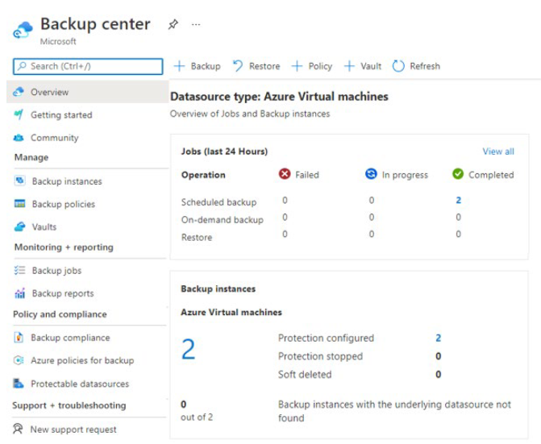

### Öne Çıkan Özellikler:
* **Tek Pencereden Yönetim:** Birden fazla iş yükü türü, kasa (vault), abonelik, bölge ve tenant (kiracı) genelindeki yedeklemeleri tek bir ekrandan yönetir[cite: 1].
* **Veri Kaynağı Odaklı Yönetim (Datasource-centric):** VM'ler ve veritabanları gibi yedeklenen veri kaynaklarını temel alan görünümler ve filtreler sunar[cite: 1]. Abonelik, kaynak grubu veya etiketlere (tags) göre filtreleme imkanı tanır[cite: 1].
* **Yerleşik Entegrasyonlar:** Yönetim ölçeğini genişletmek için **Azure Policy** (yönetim politikaları) ve **Azure Monitor Logs / Workbooks** (raporlama) ile doğrudan entegre çalışır[cite: 1].

> **Desteklenen Senaryolar:** Azure VM, SQL in Azure VM, SAP HANA in Azure VM, Azure Files, Azure Blobs, Azure-managed disks ve Azure Database for PostgreSQL Server yedeklemeleri desteklenmektedir[cite: 1].

---

## Recovery Services Vault Yedekleme Seçenekleri (Setup Recovery Service Vault Backup Options)

Recovery Services vault, Azure üzerinde veri depolayan ve yedekleme verilerini düzenleyen bir depolama kaynağıdır[cite: 1].

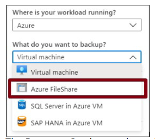

* IaaS VM'leri (Linux/Windows), Azure SQL veritabanları, Azure File Shares ve şirket içi dosya/klasörlerin yedeklerini saklar[cite: 1].
* System Center DPM, Windows Server ve Azure Backup Server hizmetlerini destekler[cite: 1].

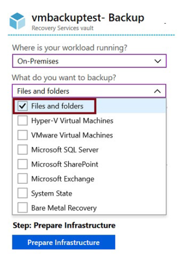

> **Kısıtlama:** Bir Azure aboneliği içinde, bölge başına en fazla **25 adet Recovery Services vault** oluşturulabilir[cite: 1].

---

## Terraform Uygulama Örneği

Aşağıdaki HCL kodu; Geo-Redundant (GRS) depolama tipinde bir **Recovery Services Vault**, günlük yedekleme yapan bir **Backup Policy** ve bir **Azure File Share** yedekleme koruma tanımını dağıtmaktadır:

```hcl
# Kaynak Grubu
resource "azurerm_resource_group" "rg" {
  name     = "rg-backup-prod"
  location = "westeurope"
}

# Recovery Services Vault (GRS Kasa)
resource "azurerm_recovery_services_vault" "vault" {
  name                = "rsv-prod-westeurope"
  location            = azurerm_resource_group.rg.location
  resource_group_name = azurerm_resource_group.rg.name
  sku                 = "Standard"
  storage_mode_type   = "GeoRedundant" # GRS Yedeklilik
}

# Azure File Share için Yedekleme Politikası (Backup Policy)
resource "azurerm_backup_policy_file_share" "policy" {
  name                = "policy-fileshare-daily"
  resource_group_name = azurerm_resource_group.rg.name
  recovery_vault_name = azurerm_recovery_services_vault.vault.name

  timezone = "UTC"

  backup {
    frequency = "Daily"
    time      = "23:00"
  }

  retention_daily {
    count = 30 # 30 Günlük Saklama
  }
}

# Depolama Hesabı ve File Share
resource "azurerm_storage_account" "sa" {
  name                     = "stcompliancefiles2026"
  resource_group_name      = azurerm_resource_group.rg.name
  location                 = azurerm_resource_group.rg.location
  account_tier             = "Standard"
  account_replication_type = "LRS"
}

resource "azurerm_storage_share" "share" {
  name                 = "compliance-data"
  storage_account_name = azurerm_storage_account.sa.name
  quota                = 500
}

# File Share'i Recovery Services Vault ile Korumaya Alma
resource "azurerm_backup_container_storage_account" "container" {
  resource_group_name = azurerm_resource_group.rg.name
  recovery_vault_name = azurerm_recovery_services_vault.vault.name
  storage_account_id  = azurerm_storage_account.sa.id
}

resource "azurerm_backup_protected_file_share" "protected_share" {
  resource_group_name       = azurerm_resource_group.rg.name
  recovery_vault_name       = azurerm_recovery_services_vault.vault.name
  source_storage_account_id = azurerm_backup_container_storage_account.container.storage_account_id
  source_file_share_name    = azurerm_storage_share.share.name
  backup_policy_id          = azurerm_backup_policy_file_share.policy.id
}
```


# Şirket İçi Dosya ve Klasör Yedeklemesini Yapılandırma (Configure On-Premises File and Folder Backups)

## Giriş

Şirket içi (on-premises) dosya ve klasörlerin Azure'a yedeklenmesini yapılandırmak için birkaç adım mevcuttur[cite: 1]. 

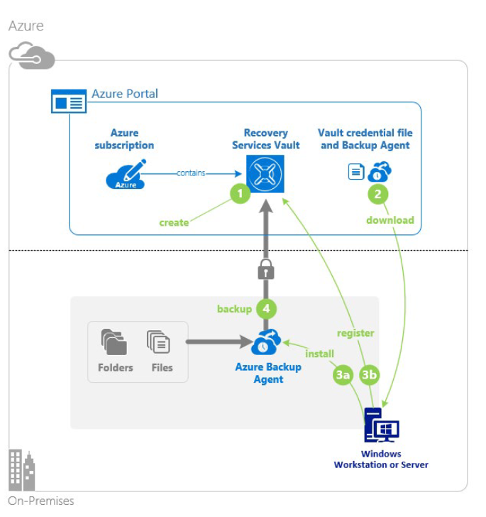

> **Not:** Yedekleme ajanı herhangi bir Windows Server VM veya fiziksel makine üzerine dağıtılabilir[cite: 1].

---

## Adım Adım Yapılandırma Süreci

1. **Recovery Services Vault Oluşturma (Create the recovery services vault):** Azure aboneliğiniz içinde yedeklerin saklanacağı bir Kurtarma Hizmetleri kasası oluşturmanız gerekir[cite: 1].
2. **Ajan ve Kimlik Bilgisi Dosyasını İndirme (Download the agent and credential file):** Recovery Services vault, Azure Backup Agent'ı indirmek için bir bağlantı sağlar[cite: 1]. Ajan yerel makineye kurulacaktır[cite: 1]. Ajan kurulumu sırasında gerekli olan bir kimlik bilgisi (credentials) dosyası da indirilir[cite: 1]. Ajanın en son sürümüne sahip olmanız gerekir; **2.0.9083.0** altındaki ajan sürümleri kaldırılarak yeniden yüklenmelidir[cite: 1].
3. **Ajanı Kurma ve Kaydetme (Install and register agent):** Yükleyici; kurulum konumunu, vekil sunucuyu (proxy server) ve parola bilgisini (passphrase) yapılandırmak için bir sihirbaz sunar[cite: 1]. İndirilen kimlik bilgisi dosyası ajanı kasaya kaydetmek için kullanılır[cite: 1].
4. **Yedeklemeyi Yapılandırma (Configure the backup):** Ajanı kullanarak ne zaman yedekleme yapılacağı, nelerin yedekleneceği, verilerin ne kadar süre saklanacağı ve ağ bant genişliği kısıtlaması (network throttling) gibi ayarları içeren bir yedekleme ilkesi (backup policy) oluşturulur[cite: 1].

---

## Microsoft Azure Recovery Services (MARS) Ajanını Yönetme (Manage the Azure Recovery Services Agent)

Dosya ve klasörler için Azure Backup, Windows istemci veya sunucusuna yüklenecek **Microsoft Azure Recovery Services (MARS)** ajanına dayanır[cite: 1]. MARS ajanı birçok özelliğe sahip tam donanımlı bir ajandır[cite: 1].

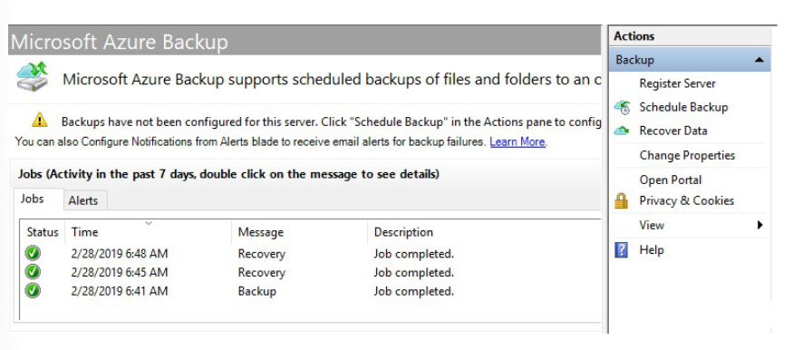

### MARS Ajanı Özellikleri:
* Fiziksel veya sanal Windows işletim sistemlerindeki dosya ve klasörleri yedekler (VM'ler şirket içinde veya Azure'da olabilir)[cite: 1].
* Ayrı bir yedekleme sunucusu (backup server) gerektirmez[cite: 1].
* **Uygulama düzeyinde duyarlı değildir (Not application aware);** yalnızca dosya, klasör ve birim (volume) düzeyinde geri yükleme yapar[cite: 1].
* İçeriği yedekler ve geri yükler[cite: 1].

---

## PowerShell İle MARS Yedekleme Yapılandırması Örneği

MARS ajanı sunucuya kurulduktan sonra PowerShell kullanarak dosya yedekleme ilkesini otomatik olarak yapılandırmak için aşağıdaki adımlar takip edilebilir:

```powershell
# 1. Yedekleme Politikası Oluşturma
$policy = New-AZBackupPolicy -Name "DailyFileBackup"

# 2. Yedeklenecek Klasör Dizinlerini Belirleme (Örn: C:\Data ve D:\Logs)
$filesToBackup = New-AzRecoveryServicesBackupItem -Path "C:\Data", "D:\Logs"

# 3. Günlük Yedekleme Zamanlaması Tanımlama (Her gün saat 22:00)
$schedule = New-AzRecoveryServicesBackupSchedulePolicy -Daily -At 22:00

# 4. Saklama İlkesi Oluşturma (30 Günlük Saklama)
$retention = New-AzRecoveryServicesBackupRetentionPolicy -Daily -RetentionCount 30

# 5. İlkeyi Kasaya Kaydetme ve Sunucuya Eşleme
Enable-AzRecoveryServicesBackupProtection -Policy $policy -Item$filesToBackup
```


# Sanal Makine Yedeklemelerini Yapılandırma (Configure Virtual Machine Backups)

## Giriş

### Senaryo
Şirketinizin Azure üzerinde çalışan çok sayıda kritik sanal makine (VM) iş yükü bulunmaktadır. Veri kaybı veya bozulması durumunda bu sanal makinelerin eksiksiz şekilde kurtarılabildiğinden emin olmanız gerekmektedir. Şirket içi ve Azure iş yüklerini korumak amacıyla Azure Backup'ın yerleşik yetenekleri kullanılacaktır.

### Ölçülen Yetenekler (Skills Measured)
Yedekleme ve kurtarma **Exam AZ-104: Microsoft Azure Administrator** sınavının bir parçasıdır.
* **Azure Kaynaklarını İzleme ve Yedekleme (%10–15)**
  * **Yedekleme ve Kurtarmayı Uygulama:**
    * Recovery Services vault (Kurtarma Hizmetleri kasası) oluşturma.
    * Yedekleme ilkesi (backup policy) oluşturma ve yapılandırma.
    * Azure Backup kullanarak yedekleme ve geri yükleme işlemlerini gerçekleştirme.
    * Azure Site Recovery kullanarak siteden siteye (site-to-site) kurtarma gerçekleştirme.
    * Yedekleme raporlarını yapılandırma ve inceleme.

### Öğrenme Hedefleri
Bu modülde şunları öğreneceksiniz:
* Farklı Azure yedekleme yöntemlerinin özelliklerini ve kullanım senaryolarını belirleme.
* Sanal makine anlık görüntülerini (snapshots) ve yedekleme seçeneklerini yapılandırma.
* Hassas silme (soft delete) dahil olmak üzere sanal makine yedekleme ve geri yüklemesini uygulama.
* Azure Backup (MARS) ajanını Azure Backup Server (MABS) ile karşılaştırma.
* Azure Site Recovery kullanarak siteden siteye kurtarma gerçekleştirme.

### Önkoşullar
Bulunmamaktadır.

---

## Sanal Makine Verilerini Korumayı İnceleme (Protect Virtual Machine Data)

Azure üzerinde VM iş yüklerini korumak için kullanım senaryolarına göre farklı yöntemler mevcuttur:

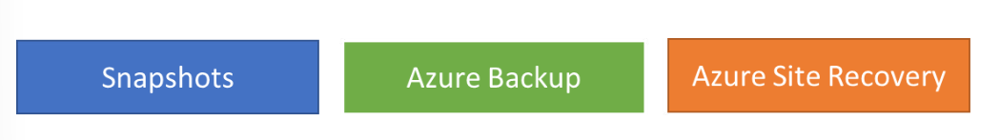

* **Azure Backup:** Canlı üretim (production) VM iş yükleri için kullanılır. Hem Windows hem de Linux için uygulama düzeyinde tutarlı (application-consistent) yedeklemeleri destekler. Kurtarma noktaları (recovery points) coğrafi olarak yedekli (geo-redundant) kasalarda saklanır. Tüm VM veya sadece belirli dosyalar geri yüklenebilir.
* **Azure Site Recovery (ASR):** Doğal afetler veya geniş çaplı hizmet kesintilerinde tüm bir Azure bölgesinin çökmesi senaryosuna karşı korur. Seçilen başka bir Azure bölgesine felaket kurtarma (DR) hedefli çoğaltma (replication) sağlar.
* **Yönetilen Disk Anlık Görüntüleri (Managed Disk Snapshots):** Geliştirme ve test (dev/test) ortamları için hızlı ve basit bir çözümdür. Yönetilen diskin belirli bir andaki salt okunur (read-only) kopyasıdır. Sağlanan disk kapasitesine değil, yalnızca **gerçekten kullanılan veri boyutuna** (ör. 64 GB diskte kullanılan 10 GB veri için 10 GB) göre ücretlendirilir.
* **Özel İmajlar (Managed Custom Images):** Genelleştirilmiş (sysprepped) ve serbest bırakılmış (deallocated) bir VM'nin tüm disklerinin (OS ve veri diskleri) kopyasını yakalar. Bu imajdan yüzlerce yeni VM türetilebilir.

> **Snapshot vs. Image Farkı:** Snapshot tek bir diskin belirli bir andaki durumunu yakalar ve diğer disklerle (ör. şeritli/striped diskler) koordinasyonu yoktur. Custom Image ise VM'ye bağlı tüm diskleri kapsayan genelleştirilmiş bir şablondur.

---

## Sanal Makine Anlık Görüntüleri Oluşturma (Create Virtual Machine Snapshots)

Bir Azure VM yedekleme işi iki aşamadan oluşur:
1. Sanal makinenin anlık görüntüsü (snapshot) alınır.
2. Anlık görüntü Recovery Services vault kasasına aktarılır.

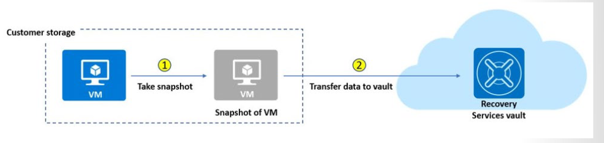

Bir kurtarma noktası ancak iki adım tamamlandığında tam olarak oluşur. Ancak Anında Kurtarma (Instant Restore) özelliği sayesinde, snapshot tamamlanır tamamlanmaz kasanın aktarım yapmasını beklemeden geri yükleme yapılabilir. Portalda bu durum ilk aşamada type: **"snapshot"**, aktarım bittiğinde **"snapshot and vault"** olarak görünür.

### Öne Çıkan Detaylar:
* **Yerel Saklama Süresi:** Snapshot'lar varsayılan olarak yerelde **2 gün** saklanır (1 ila 5 gün arasında yapılandırılabilir). Bu özellik kasadan veri kopyalama süresini ortadan kaldırarak geri yükleme hızını ciddi oranda artırır.
* **Disk Desteği:** 32 TB'a kadar olan diskleri, Standard HDD, Standard SSD ve Premium SSD türlerini destekler.
* Artımlı snapshot'lar sayfa blob'ları (page blobs) olarak saklanır.
* Instant restore upgrade işlemi tek yönlüdür; bir kez etkinleştirildikten sonra eski sürüme dönülemez.

---

## Recovery Services Vault Yedekleme Seçeneklerini Kurma (Setup Recovery Services Vault Backup Options)

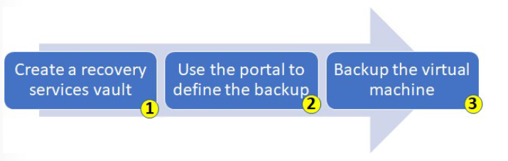

Recovery Services Vault; Azure IaaS VM'leri (Linux/Windows), Azure SQL veritabanları gibi Azure kaynaklarının yanı sıra şirket içi Hyper-V, VMware, System State ve Bare Metal Recovery (BMR) yedeklerini depolayan mantıksal bir kaynaktır.

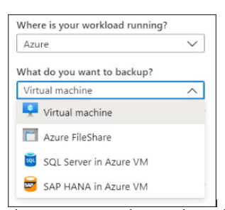

### Adım Adım Azure VM Yedekleme:
1. **Vault Oluşturma:** Verilerin saklanacağı bölgede bir kasanın oluşturulması gerekir. Depolama yedekleme türü varsayılan olarak **Geo-Redundant (GRS)** seçilidir. Birincil hedef Azure ise GRS, birincil olmayan/maliyet odaklı senaryolarda **Locally Redundant (LRS)** tercih edilmelidir.
2. **Yedekleme İlkesi (Backup Policy) Tanımlama:** Hangi zaman aralıklarında snapshot alınacağını ve bunların ne kadar süre saklanacağını tanımlayan ilkedir. Günlük yedekleme tetikleyicileri kurulabilir.
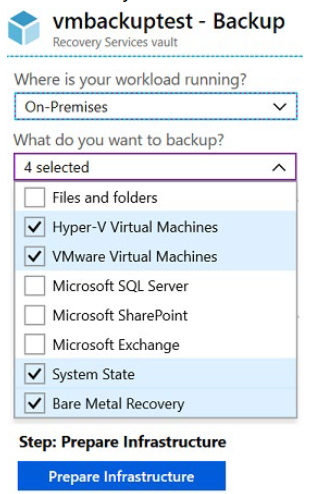
3. **Azure VM Ajanı:** Yedekleme uzantısının (backup extension) çalışabilmesi için VM içinde Azure VM Agent yüklü olmalıdır. Azure Galeri'den dağıtılan VM'lerde hazır gelir; şirket içinden taşınan (migrated) VM'lere manuel yüklenmelidir.


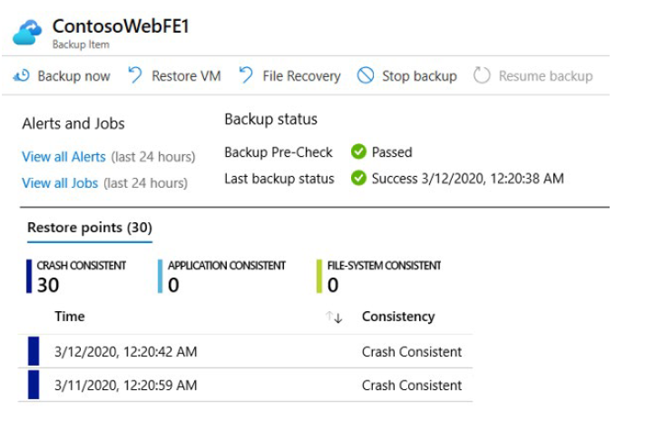
---

## Azure Backup Server (MABS) Uygulama (Implement Azure Backup Server)

Özel iş yükleri (SharePoint, Exchange, SQL Server) veya gelişmiş senaryolar için **Microsoft Azure Backup Server (MABS)** veya System Center DPM kullanılır.

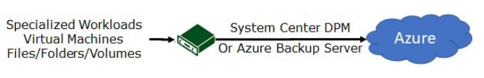

### MABS / DPM Avantajları:
* SharePoint, Exchange ve SQL Server için uygulama düzeyinde duyarlı (app-aware) gelişmiş yedekleme sağlar.
* Şirket içi makinelerde her sunucuya MARS ajanı yükleme zorunluluğunu ortadan kaldırır; korunan sunuculara hafif DPM/MABS koruma ajanı, yalnızca MABS sunucusunun kendisine ise MARS ajanı yüklenir.
* Daha esnek ve detaylı zamanlama seçenekleri sunar.
* Çeşitli katmanlardaki çoklu makineleri Koruma Grupları (Protection Groups) altında birleştirerek tek konsoldan yönetme imkanı tanır.

---

## Yedekleme Seçeneklerini Karşılaştırma (Compare Backup Options)

| Bileşen | Avantajları | Limitleri / Kısıtlamaları | Neleri Korur? | Yedekler Nerede Saklanır? |
| :--- | :--- | :--- | :--- | :--- |
| **Azure Backup (MARS) Agent** | Fiziksel/sanal Windows OS üzerinde dosya ve klasörleri yedekler; ayrı bir yedekleme sunucusu gerektirmez. | Günde maks 3 kez yedek alır; uygulama duyarlı değildir; yalnızca dosya/klasör/birim düzeyinde geri yükler; Linux desteği yoktur. | Dosyalar ve Klasörler | Recovery Services Vault |
| **Azure Backup Server (MABS)** | Uygulama duyarlı anlık görüntüler; tam zamanlama esnekliği; detaylı geri yükleme; Hyper-V/VMware üzerindeki Linux VM desteği; System Center lisansı gerektirmez. | Oracle iş yüklerini yedekleyemez; her zaman aktif bir Azure aboneliği gerektirir; teyp (tape) yedekleme desteği yoktur. | Dosyalar, klasörler, birimler, VM'ler, uygulamalar ve iş yükleri | Recovery Services Vault ve Yerel Bağlı Disk |

---

## Hassas Silmeyi Yönetme (Manage Soft Delete)

Hassas Silme (Soft Delete), VM yedeklerinin yanlışlıkla veya kötü niyetle silinmesine karşı koruma sağlar.

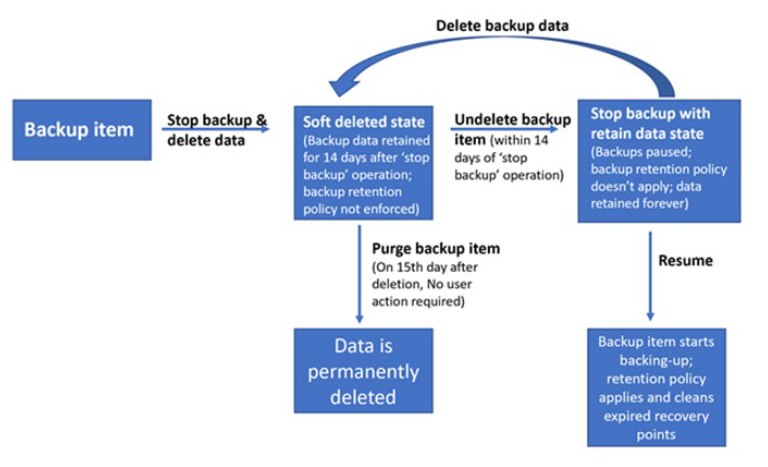

### Çalışma Mantığı:
1. Bir VM'nin yedek verilerini silmek için önce yedeklemenin durdurulması gerekir.
2. Veriler silindiğinde hemen kalıcı olarak kaybolmaz; **14 gün boyunca** hassas silinmiş (soft-deleted) durumda tutulur.
3. Bu 14 günlük sürede kasada ilgili VM'nin yanında kırmızı bir simge görünür ve kasanın kendisi silinemez.
4. Verileri kurtarmak için önce **Undelete (Geri Al)** seçeneği seçilir, ardından VM geri yüklenir.
5. İşlem bittikten sonra ilke tekrar atanarak yedekleme başlatılır (`Resume backup`).

> **Önemli Not:** Soft Delete yalnızca **silinen yedek verilerini** korur. Yedeklenmemiş bir VM silindiğinde Soft Delete veriyi kurtaramaz.

---

## Azure Site Recovery Uygulama (Implement Azure Site Recovery)

Site Recovery, ana veri merkezinde kesinti yaşandığında iş yüklerini ikincil bir konuma devrederek (failover) iş sürekliliğini sağlar. Ana konum düzeldiğinde geri dönülebilir (failback).

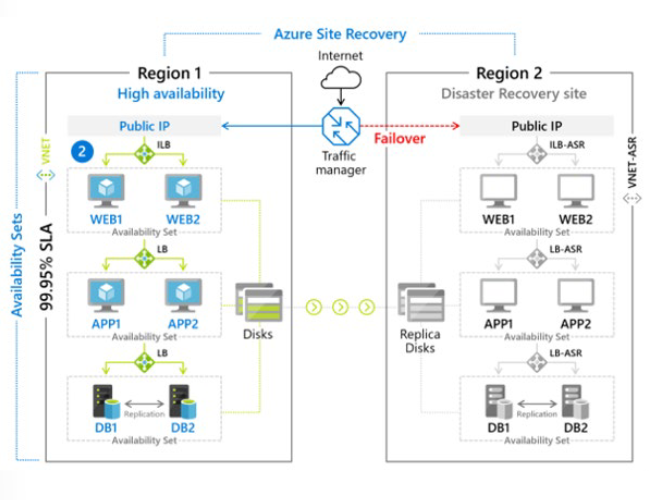

### Çoğaltma (Replication) Senaryoları:
* Azure VM'lerini bir Azure bölgesinden diğerine çoğaltma.
* Şirket içi VMware VM'leri, Hyper-V VM'leri, fiziksel sunucuları (Windows/Linux) Azure'a çoğaltma.
* AWS Windows örneklerini Azure'a çoğaltma.
* Şirket içi kaynakları ikincil bir şirket içi veri merkezine çoğaltma.

### Temel Özellikler:
* Azure Portal üzerinden tek noktadan orkestrasyon ve yönetim.
* İkincil bir fiziksel veri merkezi bulundurma maliyetini ortadan kaldırır.
* Hyper-V için 30 saniyeye varan düşük çoğaltma sıklığı (replication frequency) ve sürekli (continuous) çoğaltma.
* Ağ geçişlerini kolaylaştırmak için IP adresi koruma, Load Balancer ve Azure Traffic Manager entegrasyonu.

---

## Terraform Uygulama Örneği

Aşağıdaki HCL kodu; bir Azure Sanal Makinesi için **Recovery Services Vault** ortamında **Hassas Silme (Soft Delete)** ve **Instant Restore (2 Gün)** özelliklerine sahip günlük bir yedekleme ilkesi dağıtmaktadır:

```hcl
# Kaynak Grubu
resource "azurerm_resource_group" "rg" {
  name     = "rg-vmbackup-prod"
  location = "westeurope"
}

# Recovery Services Vault (Soft Delete Etkin)
resource "azurerm_recovery_services_vault" "vault" {
  name                = "rsv-vm-prod-westeurope"
  location            = azurerm_resource_group.rg.location
  resource_group_name = azurerm_resource_group.rg.name
  sku                 = "Standard"
  storage_mode_type   = "GeoRedundant"
  soft_delete_enabled = true # Soft Delete Koruması
}

# VM Yedekleme İlkesi (Instant Restore ile)
resource "azurerm_backup_policy_vm" "vm_policy" {
  name                = "policy-vm-daily"
  resource_group_name = azurerm_resource_group.rg.name
  recovery_vault_name = azurerm_recovery_services_vault.vault.name

  timezone = "UTC"

  backup {
    frequency = "Daily"
    time      = "22:00"
  }

  retention_daily {
    count = 30 # 30 Günlük Kasa Saklaması
  }

  # Anında Kurtarma (Instant Restore) Snapshot Saklama Süresi (1-5 Gün Arası)
  instant_restore_retention_days = 2
}

# Sanal Makineyi Yedekleme Korumasına Alma
resource "azurerm_backup_protected_vm" "protected_vm" {
  resource_group_name = azurerm_resource_group.rg.name
  recovery_vault_name = azurerm_recovery_services_vault.vault.name
  source_vm_id        = "/subscriptions/.../virtualMachines/prodwe-webvm01"
  backup_policy_id    = azurerm_backup_policy_vm.vm_policy.id
}
``` 