# AZ-104: Module 02 - Administer Governance and Compliance (Yönetişim ve Uyumluluk Yönetimi)

AZ-104 (Microsoft Azure Administrator) sertifikasyon sınavının ikinci bölümü olan **Administer Governance and Compliance (Yönetişim ve Uyumluluk Yönetimi)** modülü, sınav sorularının yaklaşık **%15 - %20'sini** oluşturur [cite: 1, 7, 8]. Bu doküman, müfredat başlıklarıyla birebir senkronize Türkçe ders notlarını ve altyapıyı otomatik dağıtabileceğiniz **3 farklı Terraform lab kodunu** tek bir kaynakta bir araya getirir.

---

## 📚 Bölüm 1: Detaylı Ders Notları
## Configure Subscriptions

---

### Identify Regions

Microsoft Azure, dünya geneline yayılmış veri merkezlerinden oluşur [cite: 7, 8]. Veri merkezleri coğrafi alanlara göre **Bölge (Region)** olarak düzenlenir [cite: 7, 8]. Bir bölge, düşük gecikmeli (low-latency) ağ ile birbirine bağlı en az bir veya birden fazla veri merkezini kapsar (Örn: *West US*, *Canada Central*, *West Europe*, *Australia East*, *Japan West*) [cite: 7, 8]. Azure, 60'tan fazla bölgede ve 140'tan fazla ülkede kullanılabilmektedir [cite: 7, 8].

#### Things to know about regions
* Azure, diğer bulut sağlayıcılarından daha fazla küresel bölgeye sahiptir [cite: 7, 8].
* Uygulamaları kullanıcılara yakınlaştırarak esneklik ve ölçeklenebilirlik sağlar [cite: 7, 8].
* Veri ikametgahı (data residency) uyumluluğunu ve esneklik (resiliency) seçeneklerini korur [cite: 7, 8].
* Çoğu Azure servisinde kaynak oluştururken kaynağın dağıtılacağı bölge seçilir [cite: 7, 8].
* Bazı özel VM boyutları veya depolama türleri sadece belirli bölgelerde bulunabilir [cite: 7, 8].
* **Küresel (Global) Servisler:** Azure Active Directory (Microsoft Entra ID), Azure Traffic Manager ve Azure DNS gibi küresel servislerde bölge seçimi yapılmaz [cite: 7, 8].

#### Things to know about regional pairs
Brezilya Güney (*Brazil South*) hariç, her Azure bölgesi aynı coğrafya içinde yer alan başka bir bölge ile eşleştirilerek bir **Bölgesel Çift (Regional Pair)** oluşturur [cite: 7, 8].
* **Physical isolation:** Azure, bölgesel çiftler arasında en az 300 mil (yaklaşık 480 km) mesafe olmasını tercih eder [cite: 7, 8]. Bu durum doğal afet, elektrik kesintisi veya ağ çökmesi gibi felaketlerin iki bölgeyi aynı anda etkileme riskini azaltır [cite: 7, 8].
* **Platform-provided replication:** Geo-Redundant Storage (GRS) gibi servisler veriyi eşleşen bölgeye otomatik kopyalar [cite: 7, 8].
* **Region recovery order:** Geniş çaplı bir kesintide her çiftin bir bölgesinin kurtarılmasına öncelik verilir [cite: 7, 8].
* **Sequential updates:** Planlı Azure sistem güncellemeleri eşleşen bölgelere aynı anda değil, sırayla uygulanır [cite: 7, 8]. Kesinti ve hata riski en aza indirilir [cite: 7, 8].
* **Data residency:** Vergi ve yasal düzenlemelere uyum için eşleştirme aynı coğrafi sınırlar içinde tutulur (*Brazil South hariç*) [cite: 7, 8].

---

### Implement Azure Subscriptions

Bir Azure aboneliği, bir Azure hesabına bağlı mantıksal bir servis birimidir [cite: 7, 8]. Azure servislerinin faturalandırılması abonelik bazında gerçekleştirilir [cite: 7, 8]. Eğer hesabınız bir abonelikle ilişkili tek hesapsa, faturalandırmadan doğrudan siz sorumlu olursunuz [cite: 7, 8].

Abonelikler, bulut servis kaynaklarına olan erişimi organize etmenize yardımcı olur [cite: 7, 8]. Ayrıca kaynak kullanımının nasıl raporlanacağını, faturalandırılacağını ve ödeneceğini kontrol etmenizi sağlar [cite: 7, 8]. Her aboneliğin farklı bir faturalandırma ve ödeme yapılandırması olabileceği için; departmanlara, projelere, bölgesel ofislere vb. göre farklı abonelikler ve planlar tanımlayabilirsiniz [cite: 7, 8]. Her bulut servisi bir aboneliğe aittir ve programmatik (kodla) yürütülen operasyonlar için **Subscription ID** gerekebilir [cite: 7, 8].

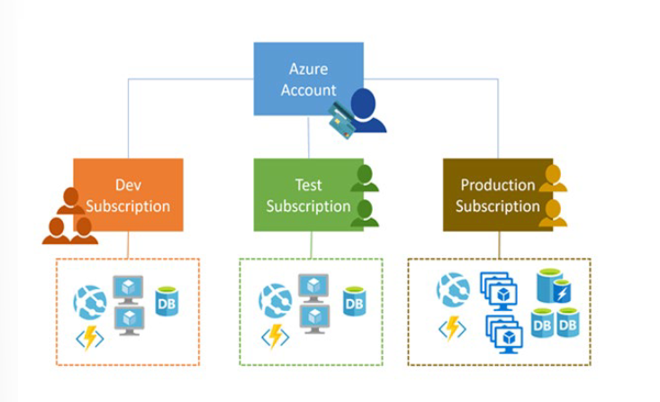

#### Azure Accounts
Aboneliklerin hesapları bulunur [cite: 7, 8]. Bir Azure hesabı, en temel tanımıyla Azure Active Directory (Azure AD / Microsoft Entra ID) içerisindeki bir kimlik veya iş/okul organizasyonu gibi Azure AD'nin güvendiği bir dizindeki kimliktir [cite: 7, 8]. Bu tür bir organizasyona ait değilseniz, Azure AD tarafından güvenilen kişisel **Microsoft Hesabınızı** (MSA) kullanarak da bir Azure hesabı oluşturabilirsiniz [cite: 7, 8].

#### Getting access to resources
Her Azure aboneliği bir Azure Active Directory (Azure AD) ile ilişkilidir [cite: 7, 8]. Abonelikteki kaynaklara erişmek isteyen tüm kullanıcılar ve servisler öncelikle Azure AD ile kimlik doğrulaması (authentication) yapmak zorundadır [cite: 7, 8].

#### Obtain a Subscription
Bir Azure aboneliği edinmenin birkaç farklı yolu vardır [cite: 7, 8]:

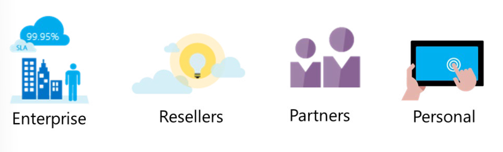

* **Enterprise agreements:** Kurumsal Sözleşme (EA) müşterileri, Azure'a yıllık parasal bir taahhütte bulunarak Azure'u sözleşmelerine ekleyebilirler [cite: 7, 8]. Bu taahhüt, yıl boyunca Azure'un sunduğu geniş bulut servis yelpazesi kullanılarak tüketilir [cite: 7, 8]. Kurumsal sözleşmeler **%99.95** aylık SLA garantisine sahiptir [cite: 7, 8].
* **Reseller:** Microsoft reseller (yeniden satıcı) kanalınız üzerinden bulut servisleri satın almanın basit ve esnek bir yolu olan **Open Licensing** programı aracılığıyla Azure satın alabilirsiniz [cite: 7, 8].
* **Partners:** Şirketinize özel Azure bulut çözümünü tasarlayıp uygulayabilecek bir Microsoft ortağı (Partner) ile çalışabilirsiniz [cite: 7, 8].
* **Personal free account:** Ücretsiz deneme hesabı ile Azure'u hemen kullanmaya başlayabilirsiniz; siz yükseltme (upgrade) yapmayı seçene kadar tarafınızdan herhangi bir ücret tahsil edilmez [cite: 7, 8].

#### Identify Subscription Usage
Azure, farklı ihtiyaç ve gereksinimlere uygun ücretsiz ve ücretli abonelik seçenekleri sunar [cite: 7, 8]. En yaygın kullanılan abonelik türleri şunlardır [cite: 7, 8]:
* **Free:** İlk 30 gün boyunca harcanabilecek $200 kredi, en popüler ürünlere 12 ay ücretsiz erişim ve 25+ ürüne her zaman ücretsiz erişim sunar [cite: 7, 8]. Kimlik doğrulaması için kredi kartı gereklidir ancak yükseltme yapılmadıkça ücret tahsil edilmez [cite: 7, 8].
* **Pay-As-You-Go:** Faturalandırma döneminde kullanılan servisler için aylık ücret ödenen esnek aboneliktir [cite: 7, 8].
* **Enterprise Agreement:** Büyük ölçekli organizasyonlar için lisans ve Software Assurance indirimleri sunar [cite: 7, 8].
* **Student:** Öğrencilere kredi kartı gerektirmeden 12 ay geçerli $100 kredi ve seçili ücretsiz servisler sunar (okul e-postası doğrulaması gerektirir) [cite: 7, 8].

---

### Implement Cost Management

Azure ürün ve servisleriyle sadece kullandığınız kadar ödersiniz [cite: 7, 8]. Azure kaynaklarını oluşturdukça ve kullandıkça ücretlendirilirsiniz [cite: 7, 8]. 

Faturalandırma yönetim görevlerini yürütmek ve maliyetlere erişimi yönetmek için **Azure Cost Management and Billing** özelliklerini kullanırsınız [cite: 7, 8]. Ayrıca harcamaları izlemek, kontrol etmek ve kaynak kullanımını optimize etmek için de bu özelliklerden yararlanırsınız [cite: 7, 8].

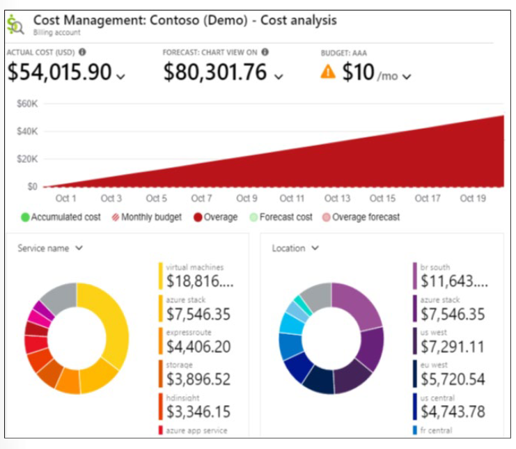

Cost Management, gelişmiş analitikler ile organizasyonel maliyet ve kullanım kalıplarını gösterir [cite: 7, 8]. Raporlar; Azure servisleri ve 3. taraf Marketplace çözümleri tarafından tüketilen kullanım tabanlı maliyetleri sunar [cite: 7, 8]. Maliyetler, anlaşmalı fiyatlara dayanır ve Azure Reservations ile Azure Hybrid Benefit indirimlerini hesaba katar [cite: 7, 8]. Tahminleyici analitikler (predictive analytics) de mevcuttur [cite: 7, 8].

#### Plan and control expenses
Cost Management harcamalarınızı planlamanıza ve kontrol etmenize şu yollarla yardımcı olur [cite: 7, 8]:
* **Cost analysis:** Maliyetlerin nerede biriktiğini anlamak ve harcama trendlerini tespit etmek için kullanılır [cite: 7, 8].
* **Budgets:** Organizasyonda finansal sorumluluk oluşturmayı ve belirlenen bütçe limitlerinin aşılmasını önlemeyi sağlar [cite: 7, 8]. Bütçe aşımında sadece bildirim tetiklenir, tüketim durdurulmaz [cite: 7, 8].
* **Recommendations:** Atıl (idle) ve az kullanılan kaynakları tespit ederek maliyet optimizasyonu ve tasarruf önerileri sunar [cite: 7, 8].
* **Exporting cost management data:** Maliyet verilerini günlük olarak otomatik olarak CSV formatında Azure Storage'a aktarmanıza (export) olanak tanır [cite: 7, 8].

---

### Apply Resource Tagging

Azure kaynaklarınızı kategorilere göre mantıksal olarak düzenlemek için etiketler (Tags) uygulayabilirsiniz [cite: 7, 8]. Her etiket bir **Ad (Name)** ve bir **Değer (Value)** çiftinden oluşur (Örn: `Environment: Production`) [cite: 7, 8].

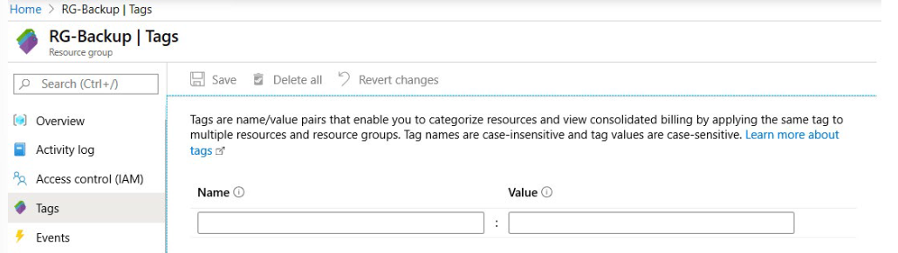

#### Considerations
* Her kaynak veya kaynak grubu en fazla **50 etiket** çiftine sahip olabilir [cite: 7, 8].
* Kaynak grubuna uygulanan etiketler, o kaynak grubunun içindeki alt kaynaklara **otomatik olarak miras alınmaz (not inherited)** [cite: 7, 8].
* Etiketlerin en iyi kullanım alanlarından biri faturalandırma verilerini gruplamaktır (CSV indirmelerinde görünür) [cite: 7, 8].

---

### Apply Cost Savings

* **Reservations:** 1 yıllık veya 3 yıllık taahhütlerle kullandıkça öde fiyatlarına kıyasla **%72'ye varan** indirim sağlar [cite: 7, 8]. Kaynakların çalışma durumunu etkilemez, sadece bir faturalandırma indirimidir [cite: 7, 8].
* **Azure Hybrid Benefit (AHB):** Software Assurance (SA) kapsamındaki mevcut Windows Server veya SQL Server lisanslarınızı Azure'a taşıyarak maliyet avantajı sağlama imkanıdır [cite: 7, 8].
* **Azure Credits:** Visual Studio aboneleri gibi geliştiricilere aylık tanımlanan ücretsiz test/dev kredisidir [cite: 7, 8].
* **Pricing Calculator:** Dağıtım öncesinde tüm Azure servislerinin tahmini maliyetlerini hesaplamaya yarayan web tabanlı araçtır [cite: 7, 8].

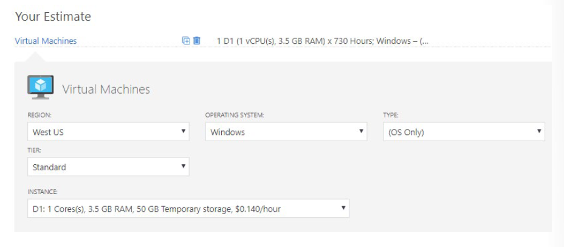

---

## Configure Azure Policy

### Create Management Groups

Birkaç aboneliğiniz varsa erişimi, ilkeleri ve uyumluluğu yönetmek için **Azure Management Groups (Yönetim Grupları)** kullanılır [cite: 8]. Aboneliklerin üzerinde bir hiyerarşi katmanıdır [cite: 8].

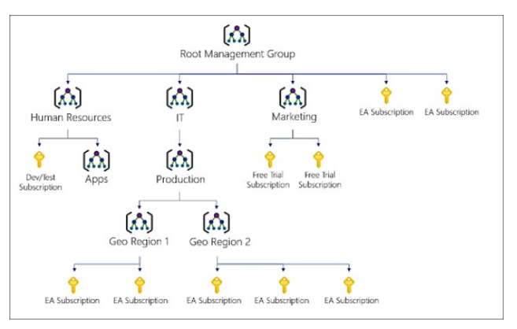

* **Management Group ID:** Dizin genelinde benzersiz olan kilit tanımlayıcıdır. *Oluşturulduktan sonra değiştirilemez.* [cite: 8]
* **Display Name:** Portal içinde görünen esnek isimdir, istenildiği zaman değiştirilebilir [cite: 8].
* **Hiyerarşik Miras:** Yönetim grubuna atanan ilkeler ve bütçeler altındaki abonelik ve kaynaklara otomatik miras kalır [cite: 8].

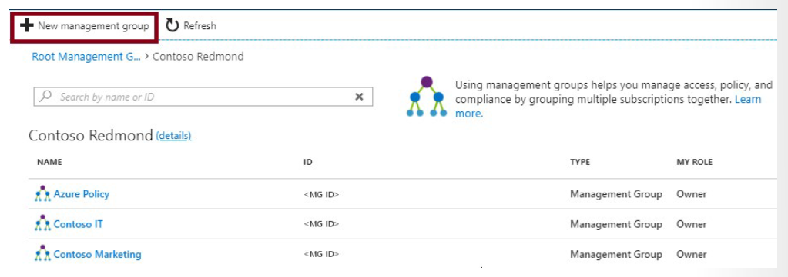

---

### Implement Azure Policies

Azure Policy, kaynaklarınızın kurumsal standartlara ve SLA sözleşmelerine uygunluğunu zorunlu kılan ve değerlendiren bir hizmettir [cite: 8].

#### Use Cases
* İzin verilen kaynak türlerini (Resource Types) kısıtlama [cite: 8].
* İzin verilen sanal makine boyutlarını (VM SKUs) belirleme [cite: 8].
* Dağıtım yapılabilecek coğrafi bölgeleri sınırlandırma (Allowed Locations) [cite: 8].
* Zorunlu etiket ve değerlerini zorunlu kılma [cite: 8].
* Tüm VM'lerde Azure Backup servisinin aktifliğini denetleme (Audit) [cite: 8].

#### Create Azure Policies (Adım Adım)
1. **Browse Policy Definitions:** Koşul ve etki (Effect: Deny, Audit, Modify vb.) içeren kural tanımları incelenir veya yazılır [cite: 7, 8].
2. **Create Initiative Definitions:** Birden fazla ilke tanımı tek bir **İnisiyatif (Initiative)** seti altında toplanır [cite: 8].
3. **Scope the Initiative Definition:** İnisiyatif veya ilke Management Group, Subscription veya Resource Group kapsamına atanır [cite: 8].
4. **Determine Compliance:** Periyodik taranan kaynakların uyumluluk durumu (Compliant / Non-Compliant) izlenir [cite: 8]. Gerekirse **Exclusion (Kapsam Dışı Bırakma)** tanımlanır [cite: 7, 8].

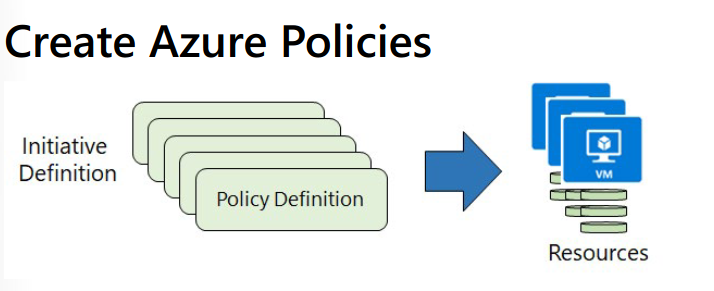

#### Create Policy Definitions
Seçebileceğiniz birçok yerleşik (Built-in) ilke tanımı bulunmaktadır [cite: 8]. Kategoriye göre sıralama yapmak ihtiyacınız olan ilkeyi bulmanıza yardımcı olur [cite: 8]:
* **Allowed Virtual Machine SKUs:** Organizasyonunuzun dağıtabileceği sanal makine boyutları (SKU) kümesini belirlemenizi sağlar [cite: 8].
* **Allowed Locations:** Organizasyonunuzun kaynak dağıtırken belirtebileceği konumları/bölgeleri kısıtlar [cite: 8]. Jeo-uyumluluk (geo-compliance) gereksinimlerinizi zorunlu kılmak için kullanılır [cite: 8].

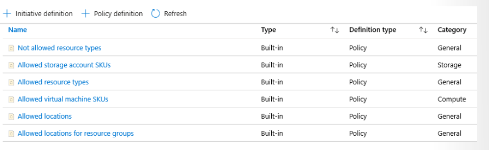

Uygulanabilir bir ilke bulunmadığında yeni bir **Policy Definition** ekleyebilirsiniz [cite: 8]. GitHub üzerinden ilke tanımlarını içe aktarabilirsiniz (import) [cite: 8].
> 📌 **Not:** İlke tanımları (Policy Definitions) özel bir **JSON** biçimine sahiptir [cite: 8].

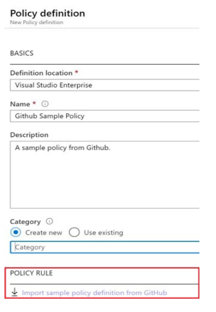


#### Create Initiative Definitions
İhtiyacınız olan ilke tanımlarını belirledikten sonra bir **Initiative Definition** oluşturursunuz [cite: 8]. Bu tanım bir veya birden fazla ilkeyi içerir [cite: 8]. Yeni İnisiyatif tanımı sayfasının sağ tarafında seçim yapabileceğiniz bir seçim listesi bulunur [cite: 8].

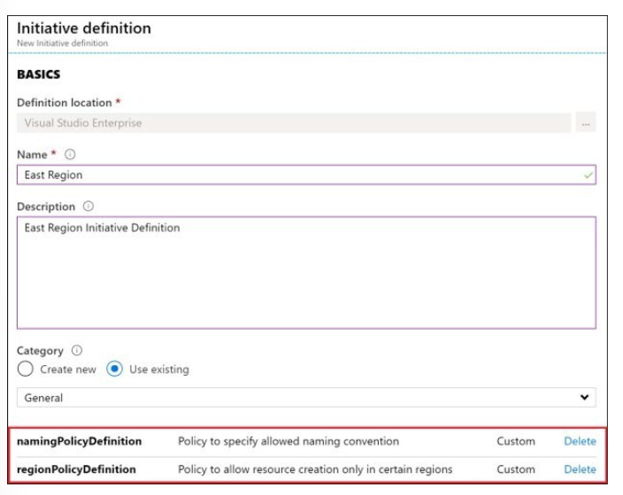

#### Scope the Initiative Definition
İnisiyatif tanımı oluşturulduktan sonra, kapsamını (scope) belirlemek için tanımı atarsınız [cite: 8]. Bir kapsam, ilke atamasının hangi kaynaklar veya kaynak grupları üzerinde zorunlu kılınacağını belirler [cite: 8]. Abonelik ve isteğe bağlı olarak bir Kaynak Grubu seçebilirsiniz [cite: 8].

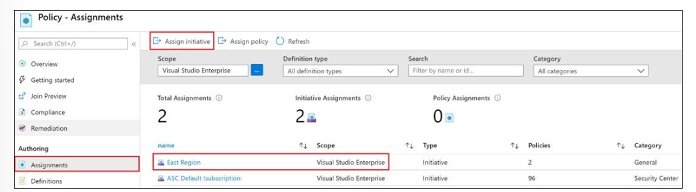

#### Determine Compliance
İlkeniz yürürlüğe girdikten sonra, uyumsuz inisiyatifleri, ilkeyi ve kaynakları incelemek için **Compliance** sekmesini kullanabilirsiniz [cite: 8].

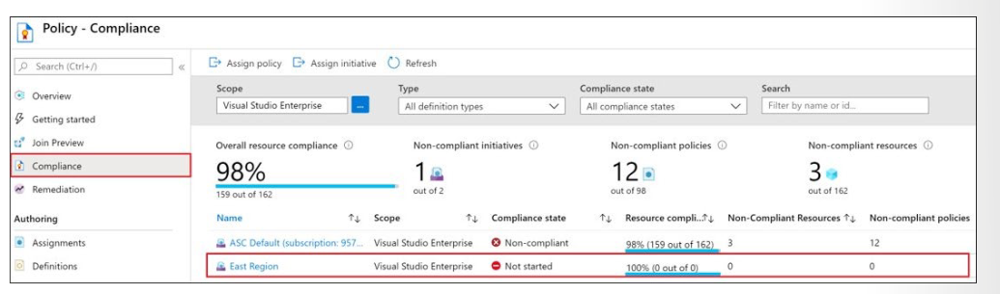

İlke koşulları mevcut kaynaklarınıza karşı değerlendirilir [cite: 8]. Koşul karşılandığında (ihlal edildiğinde), bu kaynaklar **uyumsuz (non-compliant)** olarak işaretlenir [cite: 8]. Portal değerlendirme mantığını göstermese de uyumluluk durumu sonuçlarını sunar [cite: 8]. Uyumluluk durumu sonucu ya **compliant (uyumlu)** ya da **non-compliant (uyumsuz)** şeklindedir [cite: 8].
> 📌 **Not:** İlke değerlendirmesi (policy evaluation) yaklaşık **saatte bir (once an hour)** gerçekleşir [cite: 8].

---

### Configure Role-Based Access Control

Role-Based Access Control (RBAC), Azure Resource Manager (ARM) üzerinde kaynaklara ince ayarlı (fine-grained) erişim yönetimi sağlayan yetkilendirme sistemidir [cite: 8].

#### Concepts
* **Security Principal:** Erişim isteyen nesne (User, Group, Service Principal, Managed Identity) [cite: 7, 8].
* **Role Definition:** Yapılabilecek (`Actions`) ve yapılamayacak (`NotActions`) işlemleri listeleyen JSON tanımı [cite: 7, 8].
* **Scope:** İznin geçerli olduğu sınır (Management Group, Subscription, Resource Group, Resource) [cite: 7, 8].
* **Assignment:** Rol tanımının bir güvenlik sorumlusuna belirli bir kapsamda bağlanması [cite: 7, 8].

#### Create a Role Definition
Her rol, bir JSON dosyasında tanımlanan özellikler kümesidir. Bu rol tanımı **Name**, **Id** ve **Description** alanlarını içerir. Tanım ayrıca rol için izin verilen yetkileri (**Actions**), reddedilen yetkileri (**NotActions**) ve geçerli olduğu kapsamı (**AssignableScopes**) kapsar.

Örnek **Owner** rol tanımı JSON yapısı:
* **Name:** Owner
* **ID:** `8e3af657-a8ff-443c-a75c-2fe8c4bcb65`
* **IsCustom:** False
* **Description:** Manage everything, including access to resources
* **Actions:** `{*}` (Tüm eylemler)
* **NotActions:** `{}` (Engellenen eylem yok)
* **AssignableScopes:** `{/}` (Tüm hiyerarşi)

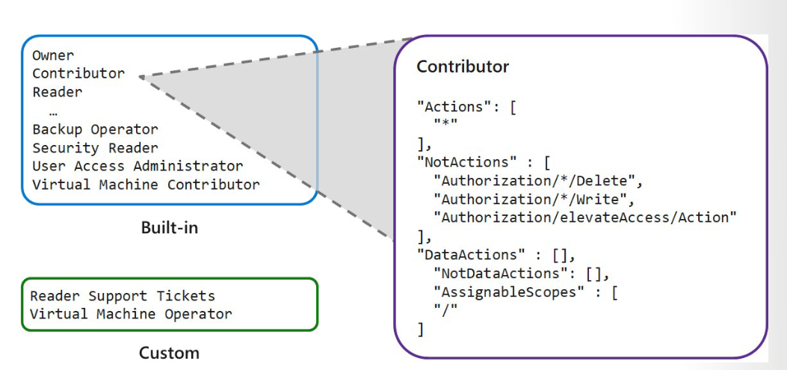

#### Actions and NotActions
`Actions` ve `NotActions` özellikleri, ihtiyacınız olan tam izinleri vermek ve reddetmek için özelleştirilebilir. Temel yerleşik (Built-in) roller şu şekildedir:

| Built-in Role | Actions | NotActions |
| :--- | :--- | :--- |
| **Owner** | `*` (Tüm eylemlere izin verilir) | - |
| **Contributor** | `*` (Tüm eylemlere izin verilir) | `Microsoft.Authorization/*/Delete`<br>`Microsoft.Authorization/*/Write`<br>`Microsoft.Authorization/elevateAccess/Action`<br>*(Rol ataması yazma/silme hariç)* |
| **Reader** | `*/read` (Tüm okuma eylemlerine izin verilir) | - |


#### Scope your role
`Actions` ve `NotActions` özelliklerini belirledikten sonra rolün kapsamını (scope) tanımlamanız gerekir. Rolün `AssignableScopes` özelliği bu rolün atanabileceği seviyeleri belirtir (Subscription, Resource Group veya Resource):
* **Abonelik Kapsamı:** `/subscriptions/[subscription id]`
* **Kaynak Grubu Kapsamı:** `/subscriptions/[subscription id]/resourceGroups/[resource group name]`
* **Kaynak Kapsamı:** `/subscriptions/[subscription id]/resourceGroups/[resource group name]/providers/[provider]/[resource]`

* **Örnek 1:** Rolün iki ayrı abonelikte atanabilir olması:
  `"/subscriptions/c276fc76-9cd4-44c9-99a7-4fd71546436e"`, `"/subscriptions/e91d47c4-76f3-4271-a796-21b4ecfe3624"`
* **Örnek 2:** Rolün yalnızca *Network* kaynak grubunda atanabilir olması:
  `"/subscriptions/c276fc76-9cd4-44c9-99a7-4fd71546436e/resourceGroups/Network"`

#### Create a Role Assignment
Bir rol ataması (Role Assignment), bir rol tanımını (Role Definition) bir kullanıcıya, gruba, servis sorumlusuna (Service Principal) veya yönetilen kimliğe (Managed Identity) belirli bir kapsamda bağlama işlemidir. Rol atamasının amacı erişim sağlamaktır; erişim rol ataması kaldırılarak iptal edilir.

> 📌 **Not:** Bir kaynak, erişim izinlerini ve rol atamalarını üst kaynağından (**parent resource**) otomatik olarak **miras alır (inherits)**.

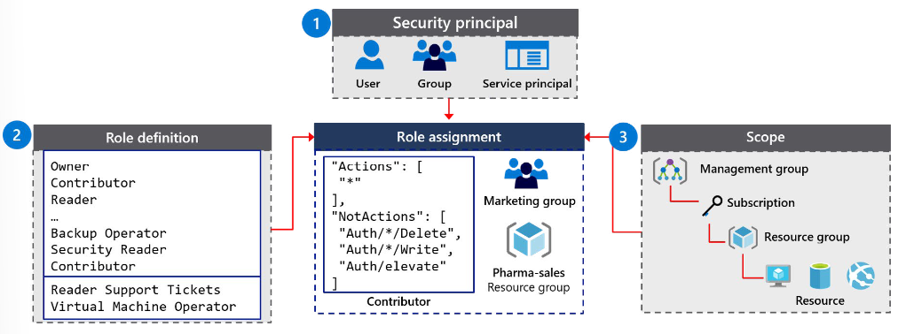

#### Determine Azure RBAC Roles (Built-in Roles)
* **Owner:** Tam yetki + başkalarına erişim atama yetkisi [cite: 7, 8].
* **Contributor:** Tam yönetim yetkisi fakat **başkalarına yetki atayamaz** [cite: 7, 8].
* **Reader:** Kaynakları sadece görüntüler [cite: 7, 8].
* **User Access Administrator:** Kaynakları yönetmez, sadece kullanıcı erişim izinlerini (RBAC) yönetir [cite: 7, 8].

#### Compare Azure RBAC Roles to Azure AD Roles
Azure'da izin yapısını anlamak için **Azure RBAC** ve **Azure AD (Entra ID)** rollerinin farklarını bilmek kritiktir:
* **Klasik Abonelik Yöneticisi Rolleri (Classic Roles):** Azure ilk çıktığında Account Administrator, Service Administrator ve Co-Administrator olmak üzere 3 rol vardı. *(Bugün bunların yerine Azure Resource Manager / RBAC rollerinin kullanılması önerilir).*
* **Azure RBAC Rolleri:** Azure kaynaklarına (VM, VNet, Storage vb.) erişimi ve yönetimi kontrol eder. Birden fazla kapsamda (MG, Sub, RG, Resource) uygulanabilir.
* **Azure AD (Entra ID) Rolleri:** Azure Active Directory kaynaklarını (kullanıcılar, gruplar, domainler vb.) yönetmek için kullanılır. Kapsamı Kiracı (Tenant) seviyesindedir.

| Karşılaştırma Kriteri | Azure RBAC Rolleri | Azure AD Rolleri |
| :--- | :--- | :--- |
| **Yönetim Alanı** | Azure kaynaklarına erişimi yönetir [cite: 8, 10, 11]. | Azure Active Directory kaynaklarını yönetir [cite: 8, 10, 11]. |
| **Kapsam (Scope)** | Management Group, Subscription, Resource Group, Resource seviyelerinde tanımlanır [cite: 8, 10, 11]. | Kiracı (Tenant) seviyesindedir [cite: 8, 10, 11]. |
| **Erişim Araçları** | Azure portal, Azure CLI, Azure PowerShell, ARM templates, REST API [cite: 8, 10, 11]. | Azure admin portal, Microsoft 365 admin portal, Microsoft Graph, AzureAD PowerShell [cite: 8, 10, 11]. |

#### Apply RBAC Authentication
Azure RBAC ve Azure AD yönetici rollerinin birlikte nasıl çalıştığını anlamak kimlik doğrulama ve yetkilendirme mimarisinin temelini oluşturur. Azure AD kullanıcının kimliğini doğrular (Authentication), verilen Azure RBAC rolleri ise kullanıcının Azure kaynakları üzerindeki yetkisini (Authorization) belirler.

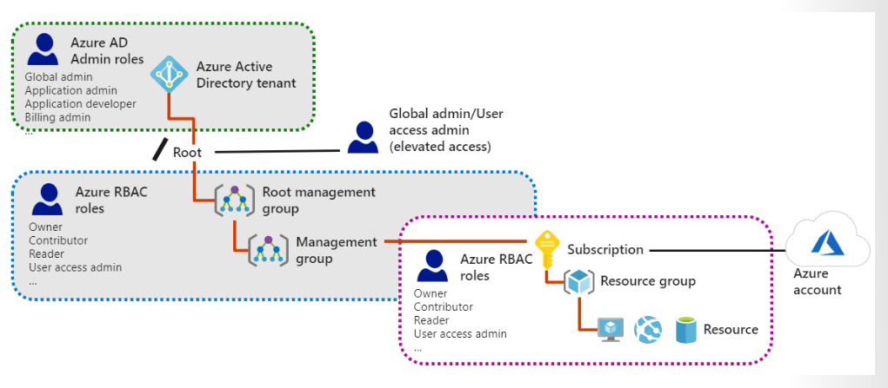

---

## 🛠️ Bölüm 2: Terraform Lab Ortamları

---

### 🧪 LAB 1: Management Groups & Azure Policy Initiatives (`lab1_main.tf`)

```hcl
terraform {
  required_version = ">= 1.0.0"
  required_providers {
    azurerm = {
      source  = "hashicorp/azurerm"
      version = "~> 3.70.0"
    }
  }
}

provider "azurerm" {
  features {}
}

# 1. Management Group Hiyerarşisi
resource "azurerm_management_group" "corp_root" {
  name         = "mg-contoso-corp"
  display_name = "Contoso Corporate Root MG"
}

resource "azurerm_management_group" "corp_landingzones" {
  name                       = "mg-contoso-landingzones"
  display_name               = "Contoso Landing Zones"
  parent_management_group_id = azurerm_management_group.corp_root.id
}

# 2. Policy Initiative (İnisiyatif) Oluşturma
resource "azurerm_policy_set_definition" "governance_initiative" {
  name         = "initiative-governance-baseline"
  policy_type  = "Custom"
  mode         = "All"
  display_name = "Contoso Governance Baseline Initiative"

  policy_definition_reference {
    policy_definition_id = "/providers/Microsoft.Authorization/policyDefinitions/e562320d-329c-4e0b-9323-ed30f27a9729" # Allowed Locations
    parameter_values     = jsonencode({
      listOfAllowedLocations = { value = ["westeurope", "northeurope"] }
    })
  }

  policy_definition_reference {
    policy_definition_id = "/providers/Microsoft.Authorization/policyDefinitions/871b6d14-10a5-4acc-853f-36f1c2e9e057" # Require Tag
    parameter_values     = jsonencode({
      tagName = { value = "Environment" }
    })
  }
}

# 3. İnisiyatifi Yönetim Grubuna Atama
resource "azurerm_management_group_policy_assignment" "assign_initiative" {
  name                 = "assign-gov-baseline"
  management_group_id  = azurerm_management_group.corp_landingzones.id
  policy_definition_id = azurerm_policy_set_definition.governance_initiative.id
}
```

---

### 🧪 LAB 2: Resource Locks, Tagging & Budget Management (`lab2_main.tf`)

```hcl
terraform {
  required_version = ">= 1.0.0"
  required_providers {
    azurerm = {
      source  = "hashicorp/azurerm"
      version = "~> 3.70.0"
    }
  }
}

provider "azurerm" {
  features {}
}

# 1. Etiketlenmiş Kaynak Grubu
resource "azurerm_resource_group" "lab_rg" {
  name     = "rg-az104-lab2-governance"
  location = "westeurope"

  tags = {
    Environment = "Production"
    CostCenter  = "IT-Operations"
  }
}

# 2. Kaynak Kilidi (CanNotDelete)
resource "azurerm_management_lock" "rg_lock" {
  name       = "lock-prevent-accidental-delete"
  scope      = azurerm_resource_group.lab_rg.id
  lock_level = "CanNotDelete"
}

# 3. Consumption Budget (Bütçe Uyarısı)
resource "azurerm_consumption_budget_resource_group" "rg_budget" {
  name              = "budget-lab2-monthly"
  resource_group_id = azurerm_resource_group.lab_rg.id

  amount     = 200
  time_grain = "Monthly"

  time_period {
    start_date = "2026-09-01T00:00:00Z"
    end_date   = "2027-09-01T00:00:00Z"
  }

  notification {
    enabled        = true
    threshold      = 80
    operator       = "GreaterThan"
    threshold_type = "Actual"
    contact_emails = ["sysadmin@contoso.com"]
  }
}
```

---

### 🧪 LAB 3: Custom RBAC Role & Role Assignment Scoping (`lab3_main.tf`)

```hcl
terraform {
  required_version = ">= 1.0.0"
  required_providers {
    azurerm = {
      source  = "hashicorp/azurerm"
      version = "~> 3.70.0"
    }
    azuread = {
      source  = "hashicorp/azuread"
      version = "~> 2.40.0"
    }
  }
}

provider "azurerm" {
  features {}
}

provider "azuread" {}

data "azurerm_subscription" "current" {}
data "azuread_domains" "default" { only_initial = true }

# 1. Hedef Kaynak Grubu
resource "azurerm_resource_group" "rbac_rg" {
  name     = "rg-az104-lab3-rbac"
  location = "westeurope"
}

# 2. Özel RBAC Rol Tanımı (Custom Role)
resource "azurerm_role_definition" "custom_vm_operator" {
  name        = "AZ104 Custom VM Restart Administrator"
  scope       = data.azurerm_subscription.current.id
  description = "Sadece VM okuma ve yeniden baslatma yetkisi verir."

  permissions {
    actions = [
      "Microsoft.Resources/subscriptions/resourceGroups/read",
      "Microsoft.Compute/virtualMachines/read",
      "Microsoft.Compute/virtualMachines/restart/action"
    ]
    not_actions = []
  }

  assignable_scopes = [data.azurerm_subscription.current.id]
}

# 3. Test Kullanıcısı Oluşturma
resource "azuread_user" "operator_user" {
  user_principal_name   = "az104-vm-operator@${data.azuread_domains.default.domains[0].domain_name}"
  display_name          = "AZ104 VM Operator User"
  mail_nickname         = "az104-vm-operator"
  password              = "P@ssw0rd123456!"
  force_password_change = true
}

# 4. Rolü Kaynak Grubu Kapsamında Kullanıcıya Atama (Role Assignment)
resource "azurerm_role_assignment" "assign_custom_role" {
  scope                = azurerm_resource_group.rbac_rg.id
  role_definition_id   = azurerm_role_definition.custom_vm_operator.role_definition_resource_id
  principal_id         = azuread_user.operator_user.object_id
}
```
