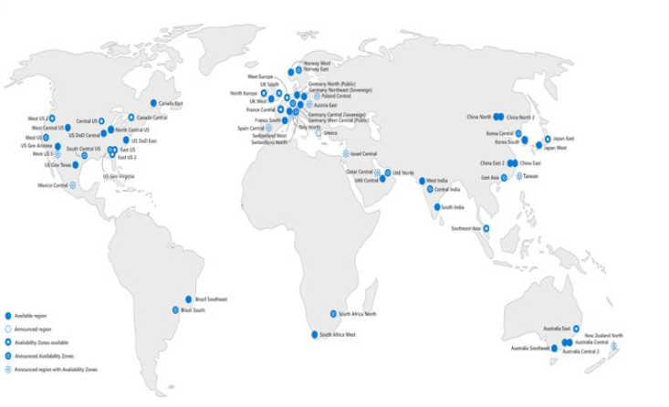

# AZ-104: Module 02 - Administer Governance and Compliance (Yönetişim ve Uyumluluk Yönetimi)

AZ-104 (Microsoft Azure Administrator) sertifikasyon sınavının ikinci bölümü olan **Administer Governance and Compliance (Yönetişim ve Uyumluluk Yönetimi)** modülü, sınav sorularının yaklaşık **%15 - %20'sini** oluşturur [cite: 1, 7, 8]. Bu doküman, sınav hazırlığınız ve pratik yapabilmeniz için hem **detaylı Türkçe ders notlarını** hem de altyapıyı otomatik dağıtabileceğiniz **3 farklı Terraform lab kodunu** tek bir kaynakta bir araya getirir.

---

## 📚 Bölüm 1: Detaylı Ders Notları

Bu modül aşağıdaki temel ana başlıklardan oluşur:
1. **Regions and Regional Pairs (Bölgeler ve Bölgesel Çiftler)** [cite: 7, 8]
2. **Subscriptions and Accounts (Abonelikler ve Hesaplar)** [cite: 7, 8]
3. **Subscriptions Usage and Acquisition (Abonelik Türleri ve Edinme Yolları)** [cite: 7, 8]
4. **Cost Management and Planning (Maliyet Yönetimi ve Planlama)** [cite: 7, 8]
5. **Resource Tagging (Kaynak Etiketleme)** [cite: 7, 8]
6. **Cost Savings Strategies (Maliyet Tasarruf Stratejileri)** [cite: 7, 8]
7. **Management Groups (Yönetim Grupları)** [cite: 7, 8]
8. **Azure Policy & Initiatives (İlke ve İnisiyatif Yönetimi)** [cite: 7, 8]
9. **Configure Resource Locks (Kaynak Kilitlerinin Yapılandırılması)** [cite: 7, 8]
10. **Role-Based Access Control - Azure RBAC (Rol Tabanlı Erişim Kontrolü)** [cite: 7, 8]
11. **Azure RBAC vs. Azure AD (Entra ID) Rolleri Karşılaştırması** [cite: 8]

---

### 2.1 Azure Bölgeleri ve Bölgesel Çiftler (Regions & Regional Pairs)

#### Azure Bölgeleri (Azure Regions)
Microsoft Azure, dünya geneline yayılmış veri merkezlerinden oluşur [cite: 7, 8]. Veri merkezleri coğrafi alanlara göre **Bölge (Region)** olarak düzenlenir [cite: 7, 8]. Bir bölge, düşük gecikmeli (low-latency) ağ ile birbirine bağlı en az bir veya birden fazla veri merkezini kapsar (Örn: *West US*, *Canada Central*, *West Europe*, *Australia East*, *Japan West*) [cite: 7, 8]. Azure, 60'tan fazla bölgede ve 140'tan fazla ülkede kullanılabilmektedir [cite: 7, 8].



* **Bölgeler Hakkında Bilinmesi Gerekenler:**
  * Azure, diğer bulut sağlayıcılarından daha fazla küresel bölgeye sahiptir [cite: 7, 8].
  * Uygulamaları kullanıcılara yakınlaştırarak esneklik ve ölçeklenebilirlik sağlar [cite: 7, 8].
  * Veri ikametgahı (data residency) uyumluluğunu ve esneklik (resiliency) seçeneklerini korur [cite: 7, 8].
  * Çoğu Azure servisinde kaynak oluştururken kaynağın dağıtılacağı bölge seçilir [cite: 7, 8].
  * Bazı özel VM boyutları veya depolama türleri sadece belirli bölgelerde bulunabilir [cite: 7, 8].
  * **Küresel (Global) Servisler:** Azure Active Directory (Microsoft Entra ID), Azure Traffic Manager ve Azure DNS gibi küresel servislerde bölge seçimi yapılmaz [cite: 7, 8].

#### Bölgesel Çiftler (Regional Pairs)
Brezilya Güney (*Brazil South*) hariç, her Azure bölgesi aynı coğrafya içinde yer alan başka bir bölge ile eşleştirilerek bir **Bölgesel Çift (Regional Pair)** oluşturur [cite: 7, 8].

* **Bölgesel Çiftlerin Avantajları:**
  * **Fiziksel İzolasyon (Physical Isolation):** Azure, bölgesel çiftler arasında en az 300 mil (yaklaşık 480 km) mesafe olmasını tercih eder [cite: 7, 8]. Bu durum doğal afet, elektrik kesintisi veya ağ çökmesi gibi felaketlerin iki bölgeyi aynı anda etkileme riskini azaltır [cite: 7, 8].
  * **Platform Sağlamalı Senkronizasyon (Platform-provided Replication):** Geo-Redundant Storage (GRS) gibi servisler veriyi eşleşen bölgeye otomatik kopyalar [cite: 7, 8].
  * **Bölge Kurtarma Sıralaması (Region Recovery Order):** Geniş çaplı bir kesintide her çiftin bir bölgesinin kurtarılmasına öncelik verilir [cite: 7, 8].
  * **Sıralı Güncellemeler (Sequential Updates):** Planlı Azure sistem güncellemeleri eşleşen bölgelere aynı anda değil, sırayla uygulanır [cite: 7, 8]. Kesinti ve hata riski en aza indirilir [cite: 7, 8].
  * **Veri İkametgahı (Data Residency):** Vergi ve yasal düzenlemelere uyum için eşleştirme aynı coğrafi sınırlar içinde tutulur (*Brazil South hariç*) [cite: 7, 8].

---

### 2.2 Abonelikler ve Hesaplar (Subscriptions & Accounts)

#### Azure Aboneliği (Azure Subscription)
Azure aboneliği, bir Azure hesabına bağlı mantıksal bir servis birimidir [cite: 7, 8]. Faturalandırma abonelik bazında yapılır [cite: 7, 8]. Kaynak erişimini organize etmeyi, kullanım raporlamasını ve ödeme yönetimini kolaylaştırır [cite: 7, 8]. Departman, proje veya bölgesel ofis bazında ayrı abonelikler ve planlar tanımlanabilir [cite: 7, 8].

#### Azure Hesapları ve Kaynak Erişimi (Azure Accounts)
Bir Azure hesabı, Azure Active Directory (Microsoft Entra ID) üzerinde veya Azure AD'nin güvendiği bir organizasyon dizinindeki kimliktir (veya kişisel Microsoft Hesabıdır) [cite: 7, 8]. Bir abonelikteki kaynaklara erişmek isteyen tüm kullanıcı ve servislerin önce Azure AD ile kimlik doğrulaması (authentication) yapması gerekir [cite: 7, 8].

#### Abonelik Edinme Yolları (Obtain a Subscription)
* **Enterprise Agreements (EA):** Kurumsal müşterilerin yıllık parasal taahhüt vererek Azure servislerini indirimli kullandığı sözleşmelerdir (%99.95 aylık SLA sunar) [cite: 7, 8].
* **Reseller (Yeniden Satıcı):** Open Licensing programı üzerinden Microsoft reseller kanalıyla kredi veya lisans satın alınabilir [cite: 7, 8].
* **Partners:** Şirkete özel Azure çözümleri tasarlayıp uygulayan Microsoft ortakları üzerinden edinilebilir [cite: 7, 8].
* **Personal Free Account (Kişisel Ücretsiz Hesap):** Yeni başlayanlar için deneme hesabı [cite: 7, 8].

#### Abonelik Kullanım Türleri (Identify Subscription Usage)
* **Free (Ücretsiz):** İlk 30 gün için $200 kredi, 12 ay boyunca popüler servislerin ücretsiz kullanımı ve 25+ servise her zaman ücretsiz erişim sunar [cite: 7, 8].
* **Pay-As-You-Go (Kullandıkça Öde - PAYG):** Faturalandırma döneminde kullanılan servisler için aylık ücret ödenen esnek aboneliktir [cite: 7, 8].
* **Enterprise Agreement (EA):** Büyük ölçekli organizasyonlar için toplu lisanslama ve indirim avantajları sunar [cite: 7, 8].
* **Azure for Students:** Öğrencilere kredi kartı gerektirmeden 12 ay geçerli $100 kredi ve ücretsiz servisler sunar [cite: 7, 8].

---

### 2.3 Maliyet Yönetimi ve Planlama (Cost Management)

Azure Cost Management ve Billing araçları, harcamaları izlemek, kontrol etmek ve optimize etmek için gelişmiş analitikler sunar [cite: 7, 8].

#### Maliyet Planlama ve Kontrol Yöntemleri
* **Cost Analysis (Maliyet Analizi):** Kurumsal maliyetleri keşfetmeye ve analiz etmeye yarar [cite: 7, 8]. Zaman içindeki harcama trendlerini ve bütçeye göre durumunu gösterir [cite: 7, 8].
* **Budgets (Bütçeler):** Belirli dönemler için finansal sınırlar koymayı sağlar [cite: 7, 8]. Bütçe eşikleri aşıldığında bildirim (notification) tetiklenir (*Abonelik durdurulmaz, kaynak kullanımı engellenmez*) [cite: 7, 8].
* **Recommendations (Tavsiyeler):** Atıl veya az kullanılan kaynakları tespit ederek maliyet optimizasyonu ve tasarruf önerileri sunar [cite: 7, 8].
* **Exporting Cost Data (Maliyet Verilerini Dışa Aktarma):** Harcama verileri günlük olarak CSV formatında Azure Storage'a otomatik aktarılabilir ve harici sistemlerde işlenebilir [cite: 7, 8].
* **Pricing Calculator (Fiyatlandırma Hesaplayıcı):** Dağıtım öncesinde Azure servislerinin tahmini maliyetlerini hesaplamaya yarayan araçtır [cite: 7, 8].

---

### 2.4 Kaynak Etiketleme (Resource Tagging)

Kaynakları mantıksal olarak kategorize etmek için **Ad (Name)** ve **Değer (Value)** çiftlerinden oluşan etiketler kullanılır [cite: 7, 8].

* **Etiketleme Hususları (Considerations):**
  * Bir kaynağa veya kaynak grubuna en fazla **50 etiket** eklenebilir [cite: 7, 8].
  * Kaynak grubuna uygulanan etiketler alt kaynaklara **otomatik olarak miras alınmaz (not inherited)** [cite: 7, 8].
  * Etiketler faturalandırma verilerini gruplamak (CSV indirmelerinde) ve farklı kaynak gruplarındaki ilişkili ögeleri süzmek için en ideal yöntemdir [cite: 7, 8].

---

### 2.5 Maliyet Tasarruf Stratejileri (Apply Cost Savings)

* **Azure Reservations (Ayrılmış Kaynaklar):** VM, SQL Database veya Cosmos DB kapasiteleri için 1 yıllık veya 3 yıllık ön ödeme yapılarak kullandıkça öde fiyatlarına kıyasla **%72'ye varan** indirim elde edilir [cite: 7, 8]. *Çalışma zamanı performansını etkilemez, sadece faturalandırma indirimidir.* [cite: 7, 8]
* **Azure Hybrid Benefit (AHB):** Software Assurance (SA) garantisine sahip mevcut Windows Server veya SQL Server lisanslarını Azure'a taşıyarak maliyet avantajı sağlama imkanıdır [cite: 7, 8].
* **Azure Credits:** Visual Studio aboneleri gibi geliştiricilere aylık tanımlanan ücretsiz test/geliştirme kredisidir [cite: 7, 8].
* **Regional Pricing (Bölgesel Fiyatlandırma Farkları):** Azure servis fiyatları bölgeden bölgeye farklılık gösterebilir [cite: 7, 8].

---

### 2.6 Yönetim Grupları (Management Groups)

Azure Yönetim Grupları (Management Groups), aboneliklerin üzerinde yer alan bir hiyerarşi katmanıdır [cite: 8]. Birden fazla abonelik genelinde erişim (RBAC), ilke (Policy) ve bütçe yönetimini merkezi olarak uygulamayı sağlar [cite: 8].

* **Kritik Özellikler & Parametreler:**
  * **Hiyerarşik Miras (Inheritance):** Yönetim grubuna atanan ilke veya yetkiler altındaki tüm yönetim gruplarına, aboneliklere ve kaynaklara otomatik uygulanır [cite: 8].
  * **Management Group ID:** Kimliği benzersiz kılan tekil dizin tanımlayıcısıdır [cite: 8]. *Oluşturulduktan sonra değiştirilemez.* [cite: 8]
  * **Display Name:** Azure Portal üzerinde görünen addır ve istenildiği zaman değiştirilebilir [cite: 8].
  * **Limitler:** Bir kiracıda en fazla **10.000** yönetim grubu ve Root haricinde en fazla **6 seviye** derinlik desteklenir [cite: 7, 8].

---

### 2.7 Azure Policy ve İnisiyatif Yönetimi (Policies & Initiatives)

Azure Policy, kaynaklarınızın kurumsal standartlara ve uyumluluk kurallarına uygunluğunu gerçek zamanlı değerlendiren ve zorunlu kılan (enforce) servistir [cite: 8].

#### Kullanım Senaryoları (Use Cases)
* İzin verilen sanal makine boyutlarını (VM SKUs) sınırlama [cite: 8].
* Kaynakların dağıtılabileceği coğrafi bölgeleri kısıtlama (Allowed Locations) [cite: 8].
* Kaynaklarda zorunlu etiket (Tag) ve değer şartı koşma [cite: 8].
* Tüm sanal makinelerde Azure Backup servisinin aktif olup olmadığını denetleme (Audit) [cite: 8].

#### Adım Adım İlke Uygulama Süreci
1. **Browse/Create Policy Definitions:** Değerlendirilecek koşulu ve alınacak eylemi (Effect: Deny, Audit, Modify, DeployIfNotExists vb.) belirten JSON kuralları incelenir veya oluşturulur [cite: 7, 8].
2. **Create Initiative Definitions (Policy Set):** Tek tek ilkeleri yönetmek yerine benzer amaçlı ilkeler tek bir **İnisiyatif (Initiative)** çatısı altında gruplanır [cite: 8].
3. **Scope the Initiative Definition:** İnisiyatif veya ilke belirli bir kapsama (Management Group, Subscription veya Resource Group) atanır [cite: 8].
4. **Determine Compliance & View Results:** İlke koşulları periyodik olarak (yaklaşık saatte bir) ve istek anında taranır [cite: 8]. Uyumsuz kaynaklar belirlenir [cite: 8]. Gerekirse belirli kaynaklar için **Exclusion (Kapsam Dışı Bırakma)** tanımlanır [cite: 7, 8].

---

### 2.8 Kaynak Kilitleri (Resource Locks)

Kritik Azure kaynaklarının kazara silinmesini veya değiştirilmesini önlemek için uygulanan koruma mekanizmalarıdır [cite: 7, 8].
* **CanNotDelete (Delete):** Silmeyi engeller, okuma ve değiştirmeye izin verir [cite: 7, 8].
* **ReadOnly:** Değişiklik yapmayı ve silmeyi engeller [cite: 7, 8].
* **Miras:** Kilitler üst seviyeden (RG veya Subscription) alt kaynaklara miras kalır [cite: 7, 8]. Kullanıcının `Owner` yetkisine sahip olması kilitli bir kaynağı kilit kaldırılmadan silmesine izin vermez [cite: 7, 8].

---

### 2.9 Rol Tabanlı Erişim Kontrolü (Azure RBAC)

Azure RBAC (Role-Based Access Control), Azure Resource Manager (ARM) altyapısı üzerinde ince ayarlı (fine-grained) erişim yönetimi sunan yetkilendirme sistemidir [cite: 8].

#### Yapı Taşları
1. **Security Principal (Güvenlik Sorumlusu):** Erişim talep eden nesne (User, Group, Service Principal, Managed Identity) [cite: 7, 8].
2. **Role Definition (Rol Tanımı):** Yapılabilecek (`Actions`) ve yapılamayacak (`NotActions`) işlemleri belirten JSON dosyası [cite: 7, 8].
3. **Scope (Kapsam):** İznin geçerli olduğu seviye (Management Group, Subscription, Resource Group, Resource) [cite: 7, 8].
4. **Assignment (Atama):** Rol tanımının bir güvenlik sorumlusuna belirli bir kapsamda bağlanması [cite: 7, 8].

#### Temel Dahili Roller (Built-in Roles)
* **Owner:** Tüm kaynaklar üzerinde tam yetki + başkalarına erişim izni verme (RBAC ataması) yetkisi [cite: 7, 8].
* **Contributor:** Tüm kaynakları oluşturabilir ve yönetebilir ancak **başkalarına erişim veremez (RBAC atayamaz)** [cite: 7, 8].
* **Reader:** Kaynakları sadece görüntüler [cite: 7, 8].
* **User Access Administrator:** Kaynakları yönetmez, sadece kullanıcı erişim izinlerini (RBAC) yönetir [cite: 7, 8].

---

### 2.10 Azure RBAC Rolleri vs. Azure AD (Entra ID) Rolleri

| Özellik | Azure RBAC Rolleri | Azure AD (Microsoft Entra ID) Rolleri |
| :--- | :--- | :--- |
| **Yönetim Alanı** | Azure kaynaklarına erişimi yönetir (VM, VNet, Storage vb.) [cite: 8]. | Azure Active Directory kaynaklarını yönetir (Kullanıcılar, Gruplar, Domainler vb.) [cite: 8]. |
| **Kapsam (Scope)** | Management Group, Subscription, Resource Group, Resource seviyelerinde tanımlanır [cite: 8]. | Kiracı (Tenant) seviyesindedir [cite: 8]. |
| **Erişim Araçları** | Azure Portal, Azure CLI, PowerShell, ARM Templates, REST API [cite: 8]. | Azure Admin Portal, M365 Admin Portal, Microsoft Graph API, PowerShell [cite: 8]. |

---

## 🛠️ Bölüm 2: Terraform Lab Ortamları

Bu modülde öğrenilen teorik konuları uygulamak için **3 ayrı modüler Terraform lab projesi** hazırlanmıştır.

---

### 🧪 LAB 1: Management Groups & Azure Policy Initiatives

Bu lab ortamı, bir Kurumsal Yönetim Grubu hiyerarşisi ve özel bir **Policy Initiative (İnisiyatif)** oluşturup yönetim grubuna atar.

#### 📄 `lab1_main.tf`
```hcl
terraform {
  required_version = ">= 1.0.0"
  required_providers {
    azurerm = {
      source  = "hashicorp/azurerm"
      version = "~> 3.70.0"
    }
  }
}

provider "azurerm" {
  features {}
}

# 1. Üst Yönetim Grubu (Parent Management Group)
resource "azurerm_management_group" "corp_root" {
  name         = "mg-contoso-corp"
  display_name = "Contoso Corporate Root MG"
}

# 2. Alt Yönetim Grubu (Child Management Group)
resource "azurerm_management_group" "corp_landingzones" {
  name                       = "mg-contoso-landingzones"
  display_name               = "Contoso Landing Zones"
  parent_management_group_id = azurerm_management_group.corp_root.id
}

# 3. Özel Policy Initiative (İnisiyatif) Oluşturma
resource "azurerm_policy_set_definition" "governance_initiative" {
  name         = "initiative-governance-baseline"
  policy_type  = "Custom"
  mode         = "All"
  display_name = "Contoso Governance Baseline Initiative"
  description  = "Kurumsal bolge kısıtlamaları ve zorunlu etiket ilkelerini kapsar."

  # Built-in Policy 1: Allowed Locations
  policy_definition_reference {
    policy_definition_id = "/providers/Microsoft.Authorization/policyDefinitions/e562320d-329c-4e0b-9323-ed30f27a9729"
    parameter_values     = jsonencode({
      listOfAllowedLocations = {
        value = ["westeurope", "northeurope"]
      }
    })
  }

  # Built-in Policy 2: Require Tag on Resource Groups
  policy_definition_reference {
    policy_definition_id = "/providers/Microsoft.Authorization/policyDefinitions/871b6d14-10a5-4acc-853f-36f1c2e9e057"
    parameter_values     = jsonencode({
      tagName = {
        value = "Environment"
      }
    })
  }
}

# 4. İnisiyatifi Yönetim Grubuna Atama (Assignment at Scope)
resource "azurerm_management_group_policy_assignment" "assign_initiative" {
  name                 = "assign-gov-baseline"
  management_group_id  = azurerm_management_group.corp_landingzones.id
  policy_definition_id = azurerm_policy_set_definition.governance_initiative.id
  display_name         = "Contoso Governance Baseline Assignment"
}
```

---

### 🧪 LAB 2: Resource Locks, Tagging & Budget Management

Bu lab ortamı; Etiketlenmiş Kaynak Grubu, **CanNotDelete Kaynak Kilidi** ve **Aylık Bütçe (Consumption Budget)** uyarısı yapılandırır.

#### 📄 `lab2_main.tf`
```hcl
terraform {
  required_version = ">= 1.0.0"
  required_providers {
    azurerm = {
      source  = "hashicorp/azurerm"
      version = "~> 3.70.0"
    }
  }
}

provider "azurerm" {
  features {}
}

data "azurerm_subscription" "current" {}

# 1. Etiketlenmiş Kaynak Grubu (Resource Group with Tags)
resource "azurerm_resource_group" "lab_rg" {
  name     = "rg-az104-lab2-governance"
  location = "westeurope"

  tags = {
    Environment = "Production"
    CostCenter  = "IT-Operations"
    Owner       = "SysAdmin"
  }
}

# 2. Kaynak Kilidi (CanNotDelete Lock)
resource "azurerm_management_lock" "rg_lock" {
  name       = "lock-prevent-accidental-delete"
  scope      = azurerm_resource_group.lab_rg.id
  lock_level = "CanNotDelete"
  notes      = "Bu kaynak grubu silinmelere karsi kilitlenmistir."
}

# 3. Kaynak Grubu Seviyesinde Bütçe (Consumption Budget)
resource "azurerm_consumption_budget_resource_group" "rg_budget" {
  name              = "budget-lab2-monthly"
  resource_group_id = azurerm_resource_group.lab_rg.id

  amount     = 200
  time_grain = "Monthly"

  time_period {
    start_date = "2026-09-01T00:00:00Z"
    end_date   = "2027-09-01T00:00:00Z"
  }

  notification {
    enabled        = true
    threshold      = 80
    operator       = "GreaterThan"
    threshold_type = "Actual"

    contact_emails = [
      "sysadmin@contoso.com"
    ]
  }
}
```

---

### 🧪 LAB 3: Custom RBAC Role & Role Assignment Scoping

Bu lab ortamı; JSON formatında sınırlı izinlere sahip bir **Özel Azure RBAC Rolü (Custom Role)** tanımlar, test kullanıcısı açar ve rolü belirli bir **Kaynak Grubu Kapsamında (Scope)** kullanıcıya atar.

#### 📄 `lab3_main.tf`
```hcl
terraform {
  required_version = ">= 1.0.0"
  required_providers {
    azurerm = {
      source  = "hashicorp/azurerm"
      version = "~> 3.70.0"
    }
    azuread = {
      source  = "hashicorp/azuread"
      version = "~> 2.40.0"
    }
  }
}

provider "azurerm" {
  features {}
}

provider "azuread" {}

data "azurerm_subscription" "current" {}
data "azuread_domains" "default" {
  only_initial = true
}

# 1. Hedef Kaynak Grubu
resource "azurerm_resource_group" "rbac_rg" {
  name     = "rg-az104-lab3-rbac"
  location = "westeurope"
}

# 2. Özel RBAC Rol Tanımı (Custom Role Definition)
resource "azurerm_role_definition" "custom_vm_operator" {
  name        = "AZ104 Custom VM Restart Administrator"
  scope       = data.azurerm_subscription.current.id
  description = "Sadece VM okuma ve yeniden baslatma yetkisi verir."

  permissions {
    actions = [
      "Microsoft.Resources/subscriptions/resourceGroups/read",
      "Microsoft.Compute/virtualMachines/read",
      "Microsoft.Compute/virtualMachines/restart/action"
    ]
    not_actions = []
  }

  assignable_scopes = [
    data.azurerm_subscription.current.id
  ]
}

# 3. Test Kullanıcısı Oluşturma
resource "azuread_user" "operator_user" {
  user_principal_name   = "az104-vm-operator@${data.azuread_domains.default.domains[0].domain_name}"
  display_name          = "AZ104 VM Operator User"
  mail_nickname         = "az104-vm-operator"
  password              = "P@ssw0rd123456!"
  force_password_change = true
}

# 4. Rolü Kaynak Grubu Kapsamında Kullanıcıya Atama (Role Assignment)
resource "azurerm_role_assignment" "assign_custom_role" {
  scope                = azurerm_resource_group.rbac_rg.id
  role_definition_id   = azurerm_role_definition.custom_vm_operator.role_definition_resource_id
  principal_id         = azuread_user.operator_user.object_id
}

output "assigned_user_upn" {
  value = azuread_user.operator_user.user_principal_name
}
```

---

### 🚀 Labları Çalıştırma ve Temizlik
Her lab dosyasını (`lab1_main.tf`, `lab2_main.tf`, `lab3_main.tf`) ayrı klasörlere `main.tf` adıyla koyarak sırayla test edebilirsiniz:

1. **Kurulum:** `terraform init`
2. **Planlama:** `terraform plan`
3. **Uygulama:** `terraform apply`
4. **Temizlik:** `terraform destroy`
