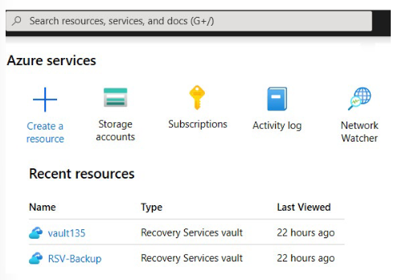
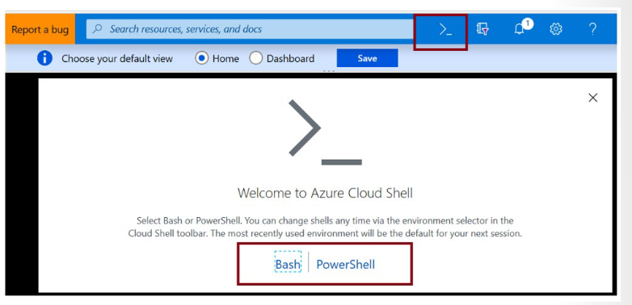
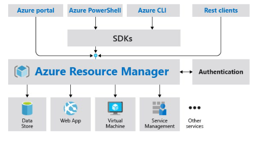
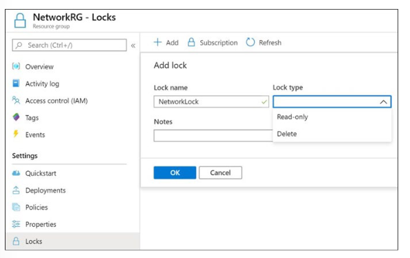
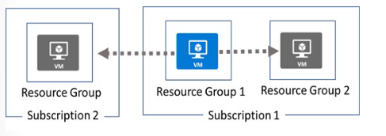
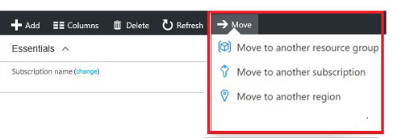
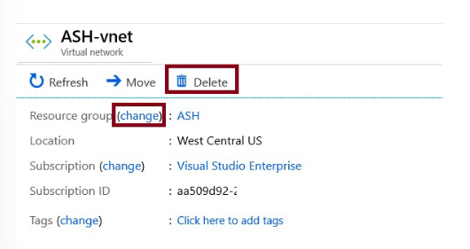
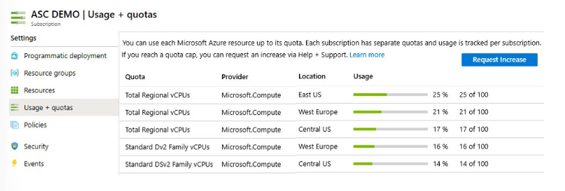

# AZ-104: Module 03 - Administer Azure Resources (Azure Kaynaklarının Yönetimi)

AZ-104 (Microsoft Azure Administrator) sertifikasyon sınavının üçüncü bölümü olan **Administer Azure Resources (Azure Kaynaklarının Yönetimi)** modülü; Azure kaynaklarını yönetmek, otomatikleştirmek, ARM şablonları (ARM Templates) kullanmak ve izlemek için kullanılan temel yönetim araçlarını kapsar [cite: 13, 18].

---

## 📚 Bölüm 1: Detaylı Ders Notları

---

### Configure Azure Resources with Tools

#### Introduction
Azure Yöneticileri, bulut ortamıyla etkileşim kurmak, kaynak dağıtımlarını otomatikleştirmek ve altyapı hizmetlerini yapılandırmak için çeşitli yönetim araçlarından yararlanırlar.

#### Scenario
Azure Yöneticileri aşağıdaki gibi kritik görevleri yürütmek için gelişmiş araçlar kullanırlar:
* Aynı anda onlarca veya yüzlerce kaynağı dağıtmak.
* Bireysel servisleri programatik (kod ile) olarak yapılandırmak.
* Kullanım, sağlık durumu, maliyetler ve daha fazlası hakkında zengin raporları görüntülemek.

Bu süreçte ihtiyacınıza uygun bir araç seçeneği belirlemeniz gerekir. Seçenekleriniz şunlardır: **Azure Portal**, **Azure PowerShell**, **Azure CLI** ve **Azure Cloud Shell**.

#### Skills measured
Bu yönetim araçlarının doğrudan kullanımı AZ-104 sınavında teorik soru olarak doğrudan test edilmeyebilir; ancak **uygulama tabanlı (performance-based)** sınav bölümlerinde ve pratik senaryolarda aktif olarak kullanılır.

#### Learning objectives
Bu modülde aşağıdaki becerileri edineceksiniz:
* Azure Portal ile kaynakları yönetmek.
* Azure Cloud Shell ile kaynakları yönetmek.
* Azure PowerShell ile kaynakları yönetmek.
* Azure CLI ile kaynakları yönetmek.

---

### Use the Azure Portal

Azure Portal; basit web uygulamalarından karmaşık bulut çözümlerine kadar her şeyi tek bir birleşik konsoldan oluşturmanıza, yönetmenize ve izlemenize olanak tanır.



* **Arama Yapma:** Kaynakları, servisleri ve dokümanları hızlıca arama (Search bar).
* **Kaynak Yönetimi:** Tüm Azure servislerinin yapılandırılması ve görsel yönetimi.
* **Özelleştirme:** Özel panolar (dashboards) ve sık kullanılanlar (favorites) menüsü oluşturma.
* **Cloud Shell Erişimi:** Doğrudan portal üst menüsünden kabuk ortamına erişim.
* **Bildirimler:** Sistem ve işlem bildirimlerini anlık görüntüleme.
* **Dokümantasyon:** İlgili servis dokümanlarına doğrudan bağlantılar.

> 📌 **Portal Adresi:** Azure Portal'a [https://portal.azure.com](https://portal.azure.com) adresi üzerinden erişebilirsiniz.

---

### Use Azure Cloud Shell

Azure Cloud Shell, Azure kaynaklarını yönetmek için tarayıcı üzerinden erişilebilen etkileşimli bir kabuk (shell) ortamıdır. Çalışma alışkanlıklarınıza en uygun kabuk deneyimini seçme esnekliği sunar: Linux kullanıcıları **Bash**, Windows kullanıcıları ise **PowerShell** deneyimini tercih edebilir.



Cloud Shell, yerel bir makineye bağımlı kalmadan yalnızca bulutun sağlayabileceği esneklikle çalışmanızı sağlar.

#### Azure Cloud Shell features
* **Geçici Yapı ve Depolama Gereksinimi:** Geçicidir (temporary) ve veri kalıcılığı için monte edilecek yeni veya mevcut bir **Azure Files** dosya paylaşımı (Azure File Share) gerektirir.
* **Entegre Düzenleyici:** Açık kaynaklı *Monaco Editor* tabanlı entegre bir grafiksel metin düzenleyici (`code .`) sunar.
* **Otomatik Kimlik Doğrulama:** Kaynaklarınıza anında erişim sağlamak için portal oturumunuz üzerinden otomatik kimlik doğrulaması yapar.
* **Kullanıcı/Oturum Bazlı Oturum:** Oturum başına ve kullanıcı bazında sağlanan geçici bir host (ana makine) üzerinde çalışır.
* **Zaman Aşımı (Timeout):** Etkileşimsiz geçen **20 dakika** sonunda oturum otomatik olarak sonlandırılır.
* **Gerekli Kaynaklar:** Çalışabilmesi için bir Kaynak Grubu (Resource Group), Depolama Hesabı (Storage Account) ve Azure File Share gereklidir.
* **Ortak Depolama:** Hem Bash hem de PowerShell modları aynı Azure File Share yapısını kullanır.
* **Tekil Makine Ataması:** Kullanıcı hesabı başına tek bir sanal makine atanır.
* **Kalıcı Dizin ($HOME):** Dosya paylaşımınızda saklanan **5 GB'lık bir disk imajı** ile `$HOME` dizininizi kalıcı hale getirir.
* **İzinler:** Bash oturumunda izinler standart bir Linux kullanıcısı seviyesindedir.

---

### Use Azure PowerShell

Azure PowerShell, Windows PowerShell veya PowerShell Core ortamlarına ekleyerek Azure aboneliğinize bağlanmanızı ve kaynakları yönetmenizi sağlayan bir modüller bütünüdür. Azure PowerShell'in çalışması için temel PowerShell altyapısı gereklidir (komut satırı penceresi ve komut ayrıştırma hizmetleri PowerShell tarafından sağlanır; Azure PowerShell ise Azure'a özel cmdlet'leri ekler).

Örneğin, aboneliğinizde yeni bir sanal makine oluşturmak için `New-AzVm` komutu kullanılır:

```powershell
New-AzVm `
  -ResourceGroupName "CrmTestingResourceGroup" `
  -Name "CrmUnitTests" `
  -Image "UbuntuLTS"
```

Azure PowerShell iki farklı şekilde kullanılabilir: Tarayıcı içinde **Azure Cloud Shell** üzerinden veya Windows, Linux, macOS işletim sistemlerine **yerel kurulum (local installation)** yapılarak. Her iki durumda da iki farklı çalışma modu vardır:
1. **Interactive Mode (Etkileşimli Mod):** Komutların tek tek elle çalıştırıldığı mod.
2. **Scripting Mode (Betik Modu):** Birden fazla komut içeren betiklerin (script) otomatik yürütüldüğü mod.

#### What is the Az module?
* **Az Modülü:** Azure özellikleriyle çalışmak için gerekli cmdlet'leri içeren resmi Azure PowerShell modülünün adıdır.
* **Geniş Kapsam:** Azure kaynaklarının hemen her yönünü kontrol etmenizi sağlayan yüzlerce cmdlet içerir.
* **Geriye Dönük Uyumluluk (Backwards Compatibility):** Aralık 2018'de duyurulan Az modülü, eski `AzureRM` modülünün yerini almıştır. Az modülü kısaltılmış `-Az` önekini kullanır ve eski `AzureRM` komutlarıyla geriye dönük uyumluluk sunar.
* **Açık Kaynak:** Az modülü GitHub üzerinde açık kaynaklı bir proje olarak geliştirilmektedir.

---

### Use Azure CLI

Azure CLI, Azure'a bağlanmak ve Azure kaynakları üzerinde yönetim komutlarını yürütmek için kullanılan çapraz platform bir komut satırı programıdır. Linux, macOS ve Windows üzerinde çalışır; yöneticilerin ve geliştiricilerin komutlarını web tarayıcısı yerine terminal veya betik (script) üzerinden çalıştırmalarına olanak tanır.

Örneğin, bir sanal makineyi yeniden başlatmak için aşağıdaki komut kullanılır:
```bash
az vm restart -g MyResourceGroup -n MyVm
```

Azure CLI, yerel kurulumla veya tarayıcı üzerinden **Azure Cloud Shell** ile kullanılabilir. İki farklı kullanım modu vardır:
* **Interactive (Etkileşimli):** Windows'ta `cmd.exe`/PowerShell, Linux/macOS'ta `Bash` açarak komutların tek tek çalıştırılması.
* **Scripted (Betikli):** Seçilen kabuğun sözdizimine uygun olarak komutların bir betik dosyasına toplanıp çalıştırılması.

#### CLI Komut Yapısı ve Arama Araçları
Azure CLI komutları **Gruplar (Groups)** ve **Alt Gruplar (Subgroups)** halinde düzenlenmiştir. Her grup Azure tarafından sunulan bir servisi, alt gruplar ise bu servislerin komutlarını mantıksal bölümlere ayırır (Örn: `az storage` grubu altında `account`, `blob`, `queue` alt grupları yer alır).

* **Komut Arama (`az find`):** İhtiyacınız olan komutu bulmak için kullanılır.
  ```bash
  az find blob
  ```
* **Yardım Alma (`--help`):** İlgili alt grupları ve komut detaylarını listeler.
  ```bash
  az storage blob --help
  ```

---

### Use Azure Resource Manager

#### Scenario
Şirketiniz Azure'da kaynak oluşturmaya başlamıştır ancak standartlaştırma için organizasyonel bir plan yoktur. Kritik kaynakların kazara silindiği vakalar yaşanmış ve hangi kaynağın kime ait olduğunu belirlemek zorlaşmıştır. Şirket kaynaklarını düzenlemek için **Resource Group (Kaynak Grubu)** yapısını kullanmanız gerekmektedir [cite: 13].

#### Skills measured & Learning objectives
* Azure Resource Manager özelliklerini ve kullanım senaryolarını tanımlamak [cite: 13].
* Kaynak grupları ile kaynakları organize etmek [cite: 13].
* ARM kilitlerini (Resource Locks) uygulamak [cite: 13].
* Kaynakları gruplar, abonelikler ve bölgeler arasında taşımak [cite: 13].
* Kaynak limitlerini izlemek ve yönetmek [cite: 13].

---

### Review Resource Manager Benefits

Uygulama altyapınız VM, Storage Account, VNet veya Web App, Database gibi birbirine bağlı ve bağımlı bileşenlerden oluşur [cite: 13]. Bunlar ayrı varlıklar değil, tek bir sistemin parçalarıdır [cite: 13].

Azure Resource Manager (ARM), çözümünüzdeki tüm kaynaklarla tek bir grup olarak çalışmanıza olanak tanır [cite: 13]. Tek bir koordineli operasyonla tüm kaynakları dağıtabilir, güncelleyebilir veya silebilirsiniz [cite: 13].

#### Consistent management layer (Tutarli Yönetim Katmanı)
ARM; Azure PowerShell, Azure CLI, Azure Portal, REST API ve Client SDK'lar üzerinden yapılan tüm işlemler için tutarlı bir yönetim katmanı sağlar [cite: 13]. Tüm araçlar aynı ARM API'sine istek gönderir; ARM isteği doğrular, yetkilendirir ve ilgili **Resource Provider**'a yönlendirir [cite: 13].



#### Avantajlar (Benefits)
* Kaynakları tek tek ele almak yerine toplu olarak dağıtma, yönetme ve izleme imkanı [cite: 13].
* Bildirimsel şablonlar (**declarative templates**) ile altyapı yönetimi [cite: 13].
* Bağımlılık (dependency) tanımlayarak doğru sırayla dağıtım yapabilme [cite: 13].
* Yerleşik RBAC ve etiketleme (Tagging) entegrasyonu [cite: 13].

---

### Review Azure Resource Terminology

* **resource (kaynak):** Azure üzerinden yönetilebilen öge (VM, Storage Account, VNet, SQL DB vb.) [cite: 13].
* **resource group (kaynak grubu):** İlgili Azure kaynaklarını bir arada tutan mantıksal konteyner [cite: 13].
* **resource provider (kaynak sağlayıcı):** ARM üzerinden dağıtılabilen kaynak türlerini sunan servis (Örn: `Microsoft.Compute`, `Microsoft.Storage`, `Microsoft.Web`, `Microsoft.KeyVault`) [cite: 13].
  * Biçim: `{resource-provider}/{resource-type}` (Örn: `Microsoft.KeyVault/vaults`) [cite: 13].
* **ARM template:** Bir kaynak grubuna dağıtılacak kaynakları ve bağımlılıkları tanımlayan JSON dosyası [cite: 13].
* **declarative syntax:** "Ne oluşturulmak istendiğini" kodlama adımları yazmadan belirten sözdizimi yaklaşımı [cite: 13].

---

### Create Resource Groups

Kaynaklar yeni veya mevcut bir kaynak grubuna dağıtılabilir [cite: 13]. Kaynak grubu dağıtımları artımlıdır (incremental); grupta 2 web app varsa üçüncüyü dağıtmak mevcutları silmez [cite: 13].

#### Kurallar ve Faktörler (Considerations)
* Bir kaynak yalnızca **tek bir kaynak grubunda** var olabilir [cite: 13].
* **Kaynak Grupları yeniden adlandırılamaz (cannot be renamed)** [cite: 13].
* Farklı bölgelerden ve farklı türlerden servisler aynı kaynak grubunda bulunabilir [cite: 13].
* Aynı yaşam döngüsüne (lifecycle) sahip kaynaklar aynı kaynak grubunda toplanmalıdır [cite: 13].
* **Location Seçimi:** Kaynak grubu konumu, o kaynak grubuna ait **metadatanın saklanacağı bölgeyi** belirler [cite: 13].

---

### Create Resource Manager Locks

Kritik kaynakların yanlışlıkla silinmesini veya değiştirilmesini önlemek için kullanılır [cite: 13].
* Subscription, Resource Group veya Resource seviyesinde uygulanabilir [cite: 13].
* Alt kaynaklara **miras alınır (inherited)** [cite: 13].
* **Kilit Türleri:**
  1. **Read-Only:** Değişiklik yapılmasını ve silinmesini engeller [cite: 13].
  2. **Delete:** Silinmeyi engeller [cite: 13].
* 📌 *Not: Kilitleri yalnızca `Owner` ve `User Access Administrator` rollerine sahip kullanıcılar oluşturabilir veya silebilir* [cite: 13].



---

### Reorganize Azure Resources

Kaynakları farklı bir kaynak grubuna veya aboneliğe taşıyabilirsiniz [cite: 13].
* **Taşıma Sırasındaki Kilitlenme:** Taşıma işlemi sırasında hem kaynak grubu hem de hedef grup kilitlenir (yazma ve silme işlemleri engellenir) [cite: 13].
* Uygulama/servis erişimi taşıma esnasında kesintiye uğramaz (VM çalışmaya devam eder) [cite: 13].
* Bağımlı kaynakların birlikte taşınması gerekir (Örn: VNet taşınırken bağlı gateway de taşınmalıdır) [cite: 13].



---

### Implementation (Uygulama)

Kaynakları taşımak için, bu kaynakları içeren kaynak grubunu (resource group) seçin ve ardından Move (Taşı) düğmesine tıklayın. Taşınacak kaynakları ve hedef kaynak grubunu seçin. Betikleri/script'leri güncellemeniz gerekeceğini onaylayın (Acknowledge).



### Remove Resources and Resource Groups

* **Kaynak Grubu Silme:** `Remove-AzResourceGroup -Name "ContosoRG01"` komutu kullanıldığında, grup içindeki **tüm alt kaynaklar silinir** [cite: 13].
* Tekil kaynak silme işlemleri de kaynak grubu içerisinden gerçekleştirilebilir [cite: 13].


---

### Using PowerShell to delete resource groups (Kaynak gruplarını silmek için PowerShell kullanımı)

Bir kaynak grubunu kaldırmak için Remove-AzResourceGroup komutunu kullanın. Bu örnekte, ContosoRG01 kaynak grubunu abonelikten kaldırıyoruz. Cmdlet sizden onay ister ve herhangi bir çıktı döndürmez.  

```PowerShell
Remove-AzResourceGroup -Name "ContosoRG01"
```

### Removing Resources (Kaynakları Kaldırma)

Bir kaynak grubu içindeki tekil kaynakları da silebilirsiniz. Örneğin, burada bir sanal ağı (virtual network) siliyoruz. Bu sayfada kaynak grubunu değiştirebileceğinize dikkat edin



### Determine Resource Limits

Azure, abonelik limitlerinizi ve mevcut kullanımınızı izlemenizi sağlar [cite: 13].
* Limit artırımı için **Request Increase** bağlantısı kullanılır [cite: 13].
* Mimaride izin verilen maksimum limite ulaşıldıysa limit daha fazla artırılamaz [cite: 13].



---

### Configure Resources ARM Templates

#### Review ARM Template Advantages
ARM şablonları, dağıtımlarınızı hızlı, hatasız ve tekrarlanabilir (repeatable) hale getirir [cite: 18]:
* **Tutarlılık (Consistency):** Ortamlar arası standartlaşma sağlar [cite: 18].
* **Karmaşık Dağıtımlar:** Bağımlılıkları Haritalandırarak kaynakları doğru sırayla oluşturur [cite: 18].
* **Infrastructure as Code (IaC):** Kod olarak sürüm kontrol sistemlerinde (Git) saklanabilir, test edilebilir [cite: 18].
* **Modülerlik ve Parametreler:** Parametreler sayesinde aynı şablon staging ve production ortamlarında tekrar kullanılabilir [cite: 18].

#### Explore the ARM Template Schema
ARM şablonları JSON formatında yazılır [cite: 18]. Temel yapısı şu bölümlerden oluşur [cite: 18]:

```json
{
  "$schema": "http://schema.management.azure.com/schemas/2019-04-01/deploymentTemplate.json#",
  "contentVersion": "1.0.0.0",
  "parameters": {},
  "variables": {},
  "functions": [],
  "resources": [],
  "outputs": {}
}
```

| Eleman Adı | Zorunlu mu? | Açıklama |
| :--- | :--- | :--- |
| **$schema** | Evet | Şablon dili sürümünü tanımlayan JSON şema dosyasının konumu [cite: 18]. |
| **contentVersion** | Evet | Şablonun sürümü (Örn: 1.0.0.0) [cite: 18]. |
| **parameters** | Hayır | Dağıtım sırasında dışarıdan girilecek değerler [cite: 18]. |
| **variables** | Hayır | Karmaşık ifadeleri sadeleştiren dahili değişkenler [cite: 18]. |
| **functions** | Hayır | Şablon içinde tanımlanan özel fonksiyonlar [cite: 18]. |
| **resources** | Evet | Dağıtılacak veya güncellenecek kaynak türleri [cite: 18]. |
| **outputs** | Hayır | Dağıtım tamamlandıktan sonra döndürülecek değerler [cite: 18]. |

#### Explore the ARM Template Parameters
Parametreler dağıtımı özelleştirmeyi sağlar (`type`, `defaultValue`, `allowedValues`, `minValue`, `maxValue`, `minLength`, `maxLength`, `metadata`) [cite: 18].
* 📌 *Bir şablonda en fazla **256 parametre** tanımlanabilir* [cite: 18].

#### Review QuickStart Templates
Topluluk tarafından sağlanan **Azure Quickstart Templates** örnek altyapı şablonları sunar [cite: 18]:
* **README.md:** Şablon açıklaması [cite: 18].
* **azuredeploy.json:** Dağıtılacak kaynak tanımları [cite: 18].
* **azuredeploy.parameters.json:** Şablon için gerekli varsayılan parametre değerleri [cite: 18].

---

## 🛠️ Bölüm 2: Terraform Lab Ortamı (`lab_module3_v2_main.tf`)

Bu lab ortamında; **Cloud Shell depolama alanı**, **Resource Group**, **Resource Lock (Delete Lock)** ve **ARM Template Dağıtımı (azurerm_resource_group_template_deployment)** tek bir Terraform projesinde hazırlanmıştır [cite: 13, 18].

```hcl
terraform {
  required_version = ">= 1.0.0"
  required_providers {
    azurerm = {
      source  = "hashicorp/azurerm"
      version = "~> 3.70.0"
    }
    random = {
      source  = "hashicorp/random"
      version = "~> 3.5.0"
    }
  }
}

provider "azurerm" {
  features {}
}

# 1. Benzersiz İsim Üreteci
resource "random_string" "suffix" {
  length  = 5
  special = false
  upper   = false
}

# 2. Ana Kaynak Grubu
resource "azurerm_resource_group" "m3_rg" {
  name     = "rg-az104-module3-advanced"
  location = "westeurope"

  tags = {
    Environment = "Training"
    ManagedBy   = "Terraform"
  }
}

# 3. Kaynak Kilidi (Delete Lock)
resource "azurerm_management_lock" "m3_lock" {
  name       = "lock-prevent-rg-delete"
  scope      = azurerm_resource_group.m3_rg.id
  lock_level = "CanNotDelete"
  notes      = "Module 3 - Kazara silinmeyi onleme kilidi."
}

# 4. Cloud Shell Depolama Hesabı ve File Share
resource "azurerm_storage_account" "clshell_sa" {
  name                     = "stclshell${random_string.suffix.result}"
  resource_group_name      = azurerm_resource_group.m3_rg.name
  location                 = azurerm_resource_group.m3_rg.location
  account_tier             = "Standard"
  account_replication_type = "LRS"
}

resource "azurerm_storage_share" "clshell_share" {
  name                 = "cloudshell-share"
  storage_account_name = azurerm_storage_account.clshell_sa.name
  quota                = 5
}

# 5. ARM Template Üzerinden Kaynak Dağıtımı (ARM Integration in Terraform)
resource "azurerm_resource_group_template_deployment" "arm_example" {
  name                = "arm-deploy-storage-${random_string.suffix.result}"
  resource_group_name = azurerm_resource_group.m3_rg.name
  deployment_mode     = "Incremental"

  template_content = jsonencode({
    "$schema"        = "https://schema.management.azure.com/schemas/2019-04-01/deploymentTemplate.json#"
    "contentVersion" = "1.0.0.0"
    "parameters"     = {
      "storageAccountName" = {
        "type"         = "string"
        "defaultValue" = "starm${random_string.suffix.result}"
      }
    }
    "resources" = [
      {
        "type"       = "Microsoft.Storage/storageAccounts"
        "apiVersion" = "2021-09-01"
        "name"       = "[parameters('storageAccountName')]"
        "location"   = azurerm_resource_group.m3_rg.location
        "sku"        = { "name" = "Standard_LRS" }
        "kind"       = "StorageV2"
      }
    ]
  })
}

output "resource_group_name" {
  value = azurerm_resource_group.m3_rg.name
}

output "arm_deployed_storage_name" {
  value = "starm${random_string.suffix.result}"
}
```

---

### 🚀 Lab Kurulum Adımları
1. Kodu `main.tf` adıyla bir klasöre kaydedin.
2. `terraform init` -> `terraform plan` -> `terraform apply` adımlarını çalıştırın.
3. Portal üzerinden ARM şablonu ile dağıtılan depolama hesabını ve kaynak grubundaki `CanNotDelete` kilidini inceleyin [cite: 13, 18].
4. Temizlik için: `terraform destroy`
