# AZ-104: Module 04 - Administer Virtual Networking (Sanal Ağların Yönetimi)

AZ-104 (Microsoft Azure Administrator) sertifikasyon sınavının dördüncü bölümü olan bu modül, Azure üzerindeki ağ altyapısının tasarlanması, Virtual Network (VNet) ve Subnet mimarilerinin kurulması, Statik/Dinamik IP yapılandırmaları ile Public ve Private IP adreslerinin yönetimini kapsar.

---

## 📚 Bölüm 1: Detaylı Ders Notları

---

### Configure Virtual Networks

#### Scenario
Şirketiniz Azure'a geçiş yapmaktadır ve şirket içi (on-premises) ağ yapısını bulut ortamında birebir karşılamak istemektedir. Azure kaynaklarının sanal ağlar (VNets) ve alt ağlar (Subnets) halinde organize edilmesi gerekmektedir. Şirketinizin esneklik, büyüme payı ve şirket içi ağlarla entegrasyon sağlayan bir Azure IP adresleme şemasına ihtiyacı vardır. 

Şema; sistemlerin internete açık kalma riskini (public exposure) en aza indirmeli ve ağ tasarımında esneklik sunmalıdır. Doğru tasarlanmazsa sistemler birbiriyle haberleşemez ve düzeltme için ekstra iş gücü gerekir. Bu doğrultuda gerekli sanal ağları, alt ağları ve IP adresleme mimarisini yapılandırmanız gerekmektedir.

#### Skills measured
Sanal ağlar ve alt ağlar, AZ-104 sınavının **%25–%30** ağırlığa sahip *"Configure and manage virtual networking"* bölümünün temelini oluşturur:
* **Create and configure virtual networks:** Sanal ağları oluşturma ve yapılandırma.
* **Implement subnets:** Alt ağları (Subnets) uygulama.
* **Configure private and public IP addresses:** Özel (Private) ve Genel (Public) IP adreslerini yapılandırma.

#### Learning objectives
Bu modülde aşağıdaki becerileri edineceksiniz:
* Sanal ağ bileşenlerini ve özelliklerini tanımlamak.
* Alt ağların (Subnets) kullanım senaryolarını ve özelliklerini belirlemek.
* Private ve Public IP adreslerinin kullanım alanlarını ayırt etmek.
* Public ve Private IP adresi gerektiren kaynakları belirlemek ve oluşturmak.
* Sanal ağlar (VNets) oluşturmak.

---

### Plan Virtual Networks

Azure gibi bulut çözümlerine geçişin en büyük avantajlarından biri, sunucu kaynaklarını buluta taşıyarak kesintisiz güç kaynakları (UPS), jeneratörler veya karmaşık fiziksel veri merkezlerini yönetme zorunluluğunu ortadan kaldırmaktır.

Ağ kaynakları buluta taşındığında, şirket içi dağıtımlarla aynı ağ işlevselliğine ve belirli senaryolarda ağ izolasyonuna ihtiyaç duyarlar.

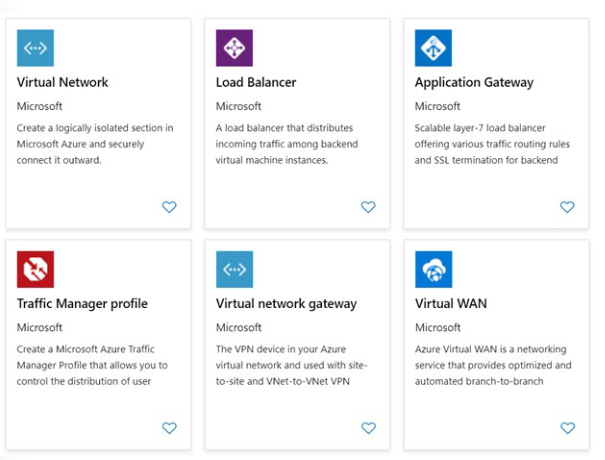

#### Implementation
Azure Virtual Network (VNet), kendi ağınızın buluttaki mantıksal temsilidir. Aboneliğinize özel olarak ayrılmış Azure bulutunun mantıksal izolasyonudur. VNets ile sanal özel ağlar (VPN) oluşturabilir, bunları diğer VNets ile veya şirket içi (on-premises) altyapınızla bağlayarak hibrit çözümler üretebilirsiniz.

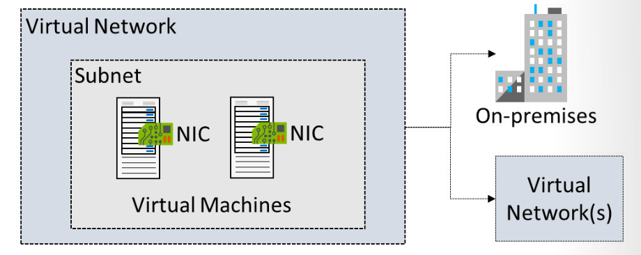

* **CIDR Blokları:** Her VNet kendi CIDR bloğuna sahiptir. Adres blokları çakışmadığı (non-overlapping) sürece diğer sanal ağlarla veya şirket içi ağlarla bağlanabilir.
* **DNS ve Segmentasyon:** VNet içindeki DNS sunucu ayarlarını ve VNet'in alt ağlara (Subnets) bölünmesini tamamen siz yönetirsiniz.

#### Kullanım Senaryoları (Usage Cases)
* **Dedicated Private Cloud-Only VNet:** Şirket içi bağlantı gerektirmeyen çözümlerde sadece bulut içi güvenli haberleşme sağlar.
* **Securely Extend Your Data Center:** Veri merkezinizi güvenli şekilde ölçeklendirmek için geleneksel Site-to-Site (S2S) IPsec VPN bağlantıları kurulabilir.
* **Enable Hybrid Cloud Scenarios:** Bulut uygulamalarını şirket içindeki ana makine (mainframe) veya Unix sistemlerine güvenle bağlama esnekliği sunar.

---

### Create Subnets

Sanal ağlar bir veya birden fazla alt ağa (Subnet) bölünebilir. Alt ağlar ağınızda mantıksal bölümler oluşturarak güvenliği artırır, performansı yükseltir ve ağ yönetimini kolaylaştırır.

* Her alt ağ, VNet adres alanı içinde benzersiz (çakışmayan) bir IP aralığına sahip olmalıdır.
* Adres aralığı **CIDR** notasyonu ile belirtilir (Örn: `10.0.1.0/24`).

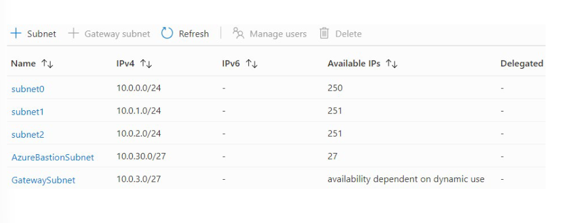

#### Considerations (Alt Ağ Tasarım Hususları)
* **Service Requirements (Servis Gereksinimleri):** Doğrudan sanal ağa dağıtılan bazı Azure servisleri kendilerine ait özel alt ağlara ihtiyaç duyar. Örn: VNet'i şirket içi ağa bağlamak için kullanılan Azure VPN Gateway için **`GatewaySubnet`** adında dedicated bir subnet ayrılması zorunludur.
* **Virtual Appliances (NVA - Ağ Sanal Cihazları):** Azure, varsayılan olarak tüm alt ağlar arasında trafiği yönlendirir (default routing). Trafiğin bir güvenlik duvarından (NVA/Firewall) geçmesini istiyorsanız kaynakları farklı alt ağlara dağıtıp varsayılan yönlendirmeyi ezmeniz gerekir.
* **Service Endpoints:** Azure Storage veya Azure SQL gibi servislere erişimi sadece belirli alt ağlarla sınırlandırıp internet erişimini kapatabilirsiniz.
* **Network Security Groups (NSG):** Her alt ağa en fazla **bir** NSG bağlanabilir. NSG kuralları giren ve çıkan trafiği denetler.

> ⚠️ **Ağ Ayrılmış IP Adresleri (Reserved IP Addresses):**
> Azure, her alt ağ içerisinden **5 adet IP adresini** kendi iç kullanımı için ayırır ve bu IP'ler kaynaklara atanamaz:
> * **`x.x.x.0`**: Network adresi.
> * **`x.x.x.1`**: Azure varsayılan ağ geçidi (Default Gateway).
> * **`x.x.x.2`, `x.x.x.3`**: Azure DNS IP'lerini VNet alanına eşlemek için ayrılmıştır.
> * **`x.x.x.255`**: Network broadcast adresi.

---

### Create Virtual Networks

Sanal ağlar istenildiği zaman veya bir Sanal Makine (VM) oluşturulurken eklenebilir.
* Tanımlama sırasında adres alanı (address space) ve en az bir alt ağ (subnet) belirtilmelidir.
* Varsayılan kotalarda abonelik başına bölge bazlı **50 VNet** oluşturulabilir (Destek talebi ile 500'e çıkarılabilir).
* 📌 *İpucu: Şirketinizde (ister on-prem ister cloud) hâlihazırda kullanılan IP adres blokları ile çakışmayacak bir adres alanı planlayın.*

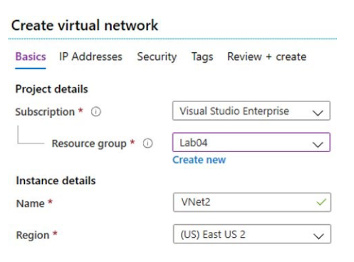

---

### Plan IP Addressing

Azure kaynakları diğer Azure kaynaklarıyla, şirket içi ağınızla ve internetle haberleşmek için IP adresleri kullanır. İki tür IP adresi vardır:

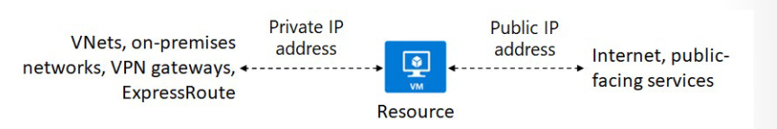

1. **Private IP Addresses (Özel IP):** VNet içi iletişim ve VPN/ExpressRoute ile şirket içi ağa uzanan hibrit iletişim için kullanılır.
2. **Public IP Addresses (Genel IP):** İnternetle ve dışa açık Azure servisleriyle iletişim için kullanılır.
* 📌 *Önemli: IP adresleri asla sanal makinenin işletim sistemi içerisinden elle yapılandırılmaz; her zaman Azure altyapısı/portal üzerinden yönetilir.*


#### Static vs Dynamic Addressing
* **Dynamic (Dinamik):** Varsayılan yöntemdir. İlgili kaynak durdurulduğunda/silindiğinde IP değişebilir.
* **Static (Statik):** Adres sabittir ve değişmez. 
  * *Kullanım Alanları:* DNS sunucuları, Domain Controller VM'leri, TSL/SSL sertifikalı yapılar, IP tabanlı güvenlik duvarı kuralları.

---

### Create Public IP Addresses

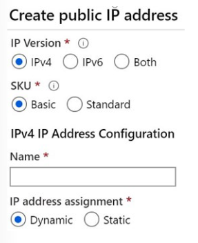

#### IP Version & SKU Seçenekleri
* **IP Version:** IPv4, IPv6 veya Her İkisi (Both).
* **SKU Seçimi:** **Basic** veya **Standard**. *(SKU oluşturulduktan sonra değiştirilemez).*
  * Availability Set veya Scale Set içindeki VM'lerin SKU'ları karıştırılamaz; hepsi aynı SKU'da olmalıdır.

#### IP Address Assignment (Atama Yöntemleri)
* **Dynamic:** Yalnızca Public IP kaynağı bir Azure kaynağına bağlanıp kaynak ilk kez başlatıldığında atanır. Sanal makine durdurulduğunda (deallocated) IP adresi serbest kalır ve değişebilir. (Sadece yeniden başlatmada -reboot- IP korunur).
* **Static:** Public IP oluşturulduğu anda atanır. Kaynak silinene kadar serbest bırakılmaz.
  * *Standard SKU varsayılan olarak tamamen **Static** atama kullanır.*

#### SKU Karşılaştırması

| Özellik | Basic SKU | Standard SKU |
| :--- | :--- | :--- |
| **IP Atama Yöntemi** | Static veya Dynamic | Sadece **Static** |
| **Güvenlik (Security)** | Varsayılan olarak açık (Open by default) | Varsayılan olarak **Güvenli ve Kapalı** (NSG zorunludur) |
| **Bölgesel Yedeklilik (Redundancy)** | Alan yedekli değil (Not zone redundant) | Varsayılan olarak **Zone-Redundant** |
| **Bağlanabilir Kaynaklar** | NIC, VPN Gateway, App Gateway, Basic Load Balancer | NIC, Standard Load Balancer, App Gateway |

---

### Associate Public IP Addresses

Public IP kaynakları aşağıdaki bileşenlere bağlanabilir:

| Kaynak Bağlantısı | Bağlantı Noktası (Association) | Dynamic Desteği | Static Desteği |
| :--- | :--- | :--- | :--- |
| **Virtual Machine** | Network Interface (NIC) | Evet | Evet |
| **Load Balancer** | Front-end IP Configuration | Evet | Evet |
| **VPN Gateway** | Gateway IP Configuration | Evet | Evet* |
| **Application Gateway** | Front-end IP Configuration | Evet | Evet* |

*( *İşaretli olanlarda statik IP seçeneği belirli SKU'larda geçerlidir ).*

---

### Associate Private IP Addresses

Private IP adresleri sanal ağ alt ağının (subnet) IP aralığından tahsis edilir. NIC, Internal Load Balancer ve Application Gateway yapılarına bağlanabilir.

* **Dynamic (Dinamik - Varsayılan):** Azure, alt ağdaki sıradaki boş veya ayrılmamış ilk IP adresini otomatik atar (Örn: `10.0.0.4 - 10.0.0.9` doluysa `10.0.0.10` atanır).
* **Static (Statik):** Alt ağ aralığından kullanılabilir olan boş bir IP adresi manuel olarak seçilip dondurulur.

---

## 🛠️ Bölüm 2: Terraform Lab Ortamı (`lab_module4_main.tf`)

Bu lab projesi; **VNet**, **Web & Gateway Subnet'leri**, **NSG Atamaları**, **Standard Static Public IP** ve **Statik Private IP'ye sahip Sanal Ağ Kartı (NIC)** bileşenlerini içeren eksiksiz bir Azure ağ altyapısını kod olarak dağıtır.

```hcl
terraform {
  required_version = ">= 1.0.0"
  required_providers {
    azurerm = {
      source  = "hashicorp/azurerm"
      version = "~> 3.70.0"
    }
  }
}

provider "azurerm" {
  features {}
}

# 1. Kaynak Grubu
resource "azurerm_resource_group" "network_rg" {
  name     = "rg-az104-module4-networking"
  location = "westeurope"

  tags = {
    Environment = "Production"
    Module      = "AZ104-Module04"
    ManagedBy   = "Terraform"
  }
}

# 2. Virtual Network (VNet)
resource "azurerm_virtual_network" "vnet" {
  name                = "vnet-az104-corp-weu"
  location            = azurerm_resource_group.network_rg.location
  resource_group_name = azurerm_resource_group.network_rg.name
  address_space       = ["10.10.0.0/16"]

  tags = {
    CostCenter = "IT-Networking"
  }
}

# 3. Web Subnet
resource "azurerm_subnet" "web_subnet" {
  name                 = "snet-web-01"
  resource_group_name  = azurerm_resource_group.network_rg.name
  virtual_network_name = azurerm_virtual_network.vnet.name
  address_prefixes     = ["10.10.1.0/24"]
}

# 4. VPN Gateway Subnet (Zorunlu İsimlendirme: GatewaySubnet)
resource "azurerm_subnet" "gateway_subnet" {
  name                 = "GatewaySubnet"
  resource_group_name  = azurerm_resource_group.network_rg.name
  virtual_network_name = azurerm_virtual_network.vnet.name
  address_prefixes     = ["10.10.255.0/27"]
}

# 5. Network Security Group (NSG)
resource "azurerm_network_security_group" "web_nsg" {
  name                = "nsg-web-01"
  location            = azurerm_resource_group.network_rg.location
  resource_group_name = azurerm_resource_group.network_rg.name

  security_rule {
    name                       = "AllowHTTPSInbound"
    priority                   = 100
    direction                  = "Inbound"
    access                     = "Allow"
    protocol                   = "Tcp"
    source_port_range          = "*"
    destination_port_range     = "443"
    source_address_prefix      = "*"
    destination_address_prefix = "*"
  }
}

# 6. NSG ve Subnet İlişkilendirmesi
resource "azurerm_subnet_network_security_group_association" "web_nsg_assoc" {
  subnet_id                 = azurerm_subnet.web_subnet.id
  network_security_group_id = azurerm_network_security_group.web_nsg.id
}

# 7. Standard SKU Static Public IP Adresi
resource "azurerm_public_ip" "web_pip" {
  name                = "pip-web-server-01"
  location            = azurerm_resource_group.network_rg.location
  resource_group_name = azurerm_resource_group.network_rg.name
  allocation_method   = "Static"
  sku                 = "Standard"

  tags = {
    Usage = "WebServerPublicIP"
  }
}

# 8. Network Interface (NIC) - Statik Private IP ve Public IP Bağlantısı
resource "azurerm_network_interface" "web_nic" {
  name                = "nic-web-server-01"
  location            = azurerm_resource_group.network_rg.location
  resource_group_name = azurerm_resource_group.network_rg.name

  ip_configuration {
    name                          = "ipconfig1"
    subnet_id                     = azurerm_subnet.web_subnet.id
    private_ip_address_allocation = "Static"
    private_ip_address            = "10.10.1.10" # İlk 5 IP Azure tarafından ayrıldığı için .10 seçildi
    public_ip_address_id          = azurerm_public_ip.web_pip.id
  }
}

# Çıktılar (Outputs)
output "vnet_id" {
  value = azurerm_virtual_network.vnet.id
}

output "assigned_public_ip" {
  value = azurerm_public_ip.web_pip.ip_address
}

output "assigned_private_ip" {
  value = azurerm_network_interface.web_nic.ip_configuration[0].private_ip_address
}
```

---

# AZ-104: Module 04 - Administer Virtual Networking (Sanal Ağların Yönetimi)

AZ-104 (Microsoft Azure Administrator) sertifikasyon sınavının dördüncü bölümü olan bu modül, Azure üzerindeki ağ altyapısının tasarlanması, Virtual Network (VNet) ve Subnet mimarilerinin kurulması, Statik/Dinamik IP yapılandırmaları, Public/Private IP adreslerinin yönetimi ve Network Security Groups (NSG) ile ağ güvenliğinin sağlanmasını kapsar.

---

## 📚 Bölüm 2: Detaylı Ders Notları

---

### Configure Virtual Networks

#### Scenario
Şirketinizin birden fazla şubesi bulunmakta ve çalışanların Azure'a taşınacak olan kurumsal kaynak planlama (ERP) uygulamasını kullanması gerekmektedir. Şirket, ancak sıkı güvenlik gereksinimlerinin karşılanması ve uygulamayı çalıştıran sunuculara hangi bilgisayarların erişebileceğinin tam kontrol altına alınması durumunda sistemleri buluta taşımayı kabul etmektedir. Ağ güvenlik stratejinizin bir parçası olarak hem Sanal Makine (VM) hem de Azure servis ağlarını güvenceye almak, istenmeyen trafiği engellemek ve kuralların doğru uygulandığından emin olmak için Network Security Groups (NSG) yapılandırmanız gerekmektedir.

#### Skills Measured & Learning Objectives
* **Create security rules:** Güvenlik kuralları oluşturmak.
* **Associate an NSG to a subnet or network interface:** Bir NSG'yi alt ağa (Subnet) veya sanal ağ kartına (NIC) bağlamak.
* **Evaluate effective security rules:** Etkin güvenlik kurallarını (Effective Rules) değerlendirmek.

---

### Implement Network Security Groups (NSG)

Bir Sanal Ağ (VNet) içindeki kaynaklara gelen ve giden ağ trafiğini kısıtlamak için **Network Security Group (NSG)** kullanılır. NSG, trafiğe izin veren veya engelleyen güvenlik kuralları içerir.

* **Subnets (Alt Ağlar):** NSG'ler alt ağlara atanarak korumalı alanlar (DMZ) oluşturulabilir. Bir alt ağda **en fazla bir (0 veya 1)** NSG bulunabilir.
* **Network Interfaces (NIC):** NSG'ler ağ kartına atanarak karttan geçen tüm trafik kontrol edilebilir. Bir NIC üzerinde en fazla bir (0 veya 1) NSG bulunabilir.
* **Associations:** Bir NSG hem bir alt ağa hem de aynı alt ağ içindeki bir NIC'e aynı anda bağlanabilir veya birden fazla alt ağa/NIC'e atabilir.

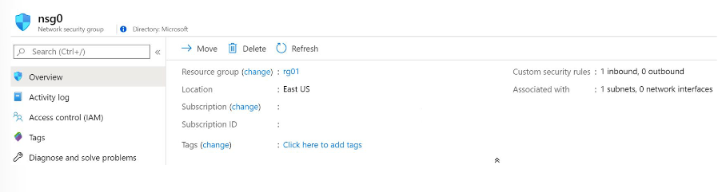

---

### Determine NSG Rules & Effective Rules

Her NSG oluşturulduğunda varsayılan kurallar (default rules) otomatik eklenir. Varsayılan kurallar silinemez; ancak daha küçük öncelik numarasına (yani daha yüksek önceliğe) sahip kurallar yazılarak **ezilebilir (override)**.

#### Kural Bileşenleri
* **Name, Priority (100-4096), Port / Port Ranges, Protocol, Source, Destination, Action (Allow/Deny).**
* **Priority (Öncelik): Kuralların işlenme sırası (100 ile 4096 arasında benzersiz sayı).**
* **Port / Port Ranges: Tek bir port, port aralığı veya virgülle ayrılmış liste. * tüm portları kapsar.**
* **Protocol: Any, TCP, UDP veya ICMP.**
* **Source (Kaynak): Any, IP Adresleri veya Service Tag.**
* **Destination (Hedef): Any, IP Adresleri veya Virtual Network.**
* **Action (Eylem): Allow (İzin Ver) veya Deny (Engelle).**

#### Varsayılan Kurallar
* **Default Inbound:** VNet içi trafiğe ve Azure Load Balancer trafiğine izin verir; dışarıdan gelen **diğer tüm trafiği engeller (DenyAllInbound)**.
* **Default Outbound:** VNet içine ve İnternet'e giden trafiğe izin verir; **diğer tüm giden trafiği engeller (DenyAllOutbound)**.

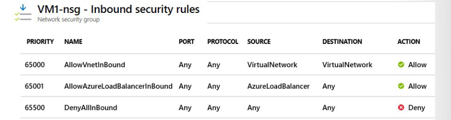

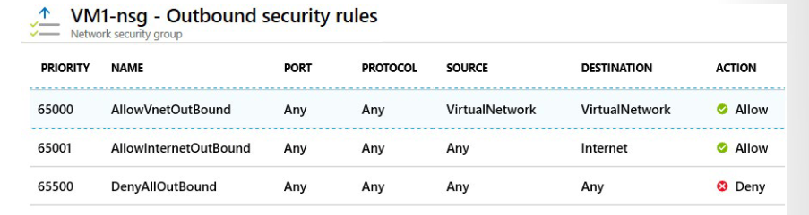


#### Trafik Değerlendirme Mantığı (Effective Rules)
Trafiğin hedefe ulaşabilmesi için hem Subnet hem de NIC seviyesinde **ALLOW** kuralının bulunması zorunludur.
* **Inbound (Gelen):** Önce **Subnet NSG** -> Sonra **NIC NSG** taranır.
* **Outbound (Giden):** Önce **NIC NSG** -> Sonra **Subnet NSG** taranır.

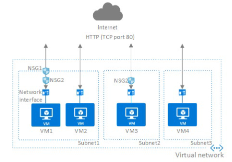

> 📌 **Effective Security Rules:** Portal üzerindeki "Effective security rules" ekranından uygulanan aktif kurallar doğrulanabilir.


#### Create NSG Rules

Kural oluştururken Basic ve Advanced seçenekleri sunulur. Advanced sayfasında HTTPS (443), RDP (3389), SSH (22) veya DNS (53) gibi servisler seçildiğinde protokol ve port bilgileri otomatik doldurulur.

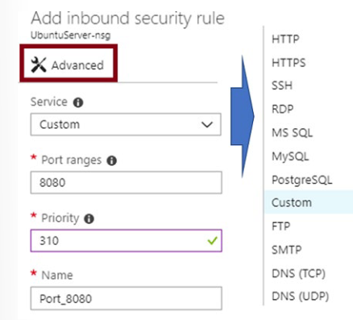

* **Servis (Service):** Servis, bu kural için hedef protokolü ve port aralığını belirtir. HTTPS ve SSH gibi önceden tanımlanmış bir servis seçebilirsiniz. Bir servis seçtiğinizde, Port aralığı otomatik olarak tamamlanır. Kendi port aralığınızı sağlamak için özel (custom) seçeneğini seçin.
* **ort aralıkları (Port ranges):** Port aralıkları tek bir port, bir port aralığı veya virgülle ayrılmış bir port listesi içerebilir. Portlar, trafiğin bu kural tarafından izin verileceğini veya engelleneceğini belirtir. Herhangi bir port üzerinden trafiğe izin vermek için bir yıldız işareti (*) koyun.
* **Priority:** Kurallar öncelik sırasına göre işlenir. Sayı ne kadar düşükse, öncelik o kadar yüksektir. Yeni kurallar eklemeyi kolaylaştırmak için kurallar arasında boşluk bırakmanızı öneririz. Değer 100-4096 arasındadır ve ağ güvenlik grubu içindeki tüm güvenlik kuralları için benzersizdir.

---

## 🛠️ Bölüm 2: Terraform Lab Ortamı (`lab_module4_complete_main.tf`)

Aşağıdaki Terraform kodu; **VNet**, **Web & App Subnet'leri**, **Subnet NSG**, **NIC NSG (Least Privilege)**, **Standard Static Public IP** ve **Statik Private IP** yapılandırmasını tek bir projede dağıtır.

```hcl
terraform {
  required_version = ">= 1.0.0"
  required_providers {
    azurerm = {
      source  = "hashicorp/azurerm"
      version = "~> 3.70.0"
    }
  }
}

provider "azurerm" {
  features {}
}

# 1. Kaynak Grubu
resource "azurerm_resource_group" "network_rg" {
  name     = "rg-az104-module4-full"
  location = "westeurope"

  tags = {
    Environment = "Production"
    Module      = "AZ104-Module04"
    ManagedBy   = "Terraform"
  }
}

# 2. Virtual Network (VNet)
resource "azurerm_virtual_network" "vnet" {
  name                = "vnet-az104-corp-weu"
  location            = azurerm_resource_group.network_rg.location
  resource_group_name = azurerm_resource_group.network_rg.name
  address_space       = ["10.20.0.0/16"]
}

# 3. Subnet Tanımları
resource "azurerm_subnet" "web_subnet" {
  name                 = "snet-web-tier"
  resource_group_name  = azurerm_resource_group.network_rg.name
  virtual_network_name = azurerm_virtual_network.vnet.name
  address_prefixes     = ["10.20.1.0/24"]
}

resource "azurerm_subnet" "app_subnet" {
  name                 = "snet-app-tier"
  resource_group_name  = azurerm_resource_group.network_rg.name
  virtual_network_name = azurerm_virtual_network.vnet.name
  address_prefixes     = ["10.20.2.0/24"]
}

resource "azurerm_subnet" "gateway_subnet" {
  name                 = "GatewaySubnet"
  resource_group_name  = azurerm_resource_group.network_rg.name
  virtual_network_name = azurerm_virtual_network.vnet.name
  address_prefixes     = ["10.20.255.0/27"]
}

# 4. Web Tier Subnet NSG (HTTPS & HTTP İzni)
resource "azurerm_network_security_group" "web_nsg" {
  name                = "nsg-web-subnet"
  location            = azurerm_resource_group.network_rg.location
  resource_group_name = azurerm_resource_group.network_rg.name

  security_rule {
    name                       = "AllowHTTPSInbound"
    priority                   = 100
    direction                  = "Inbound"
    access                     = "Allow"
    protocol                   = "Tcp"
    source_port_range          = "*"
    destination_port_range     = "443"
    source_address_prefix      = "Internet"
    destination_address_prefix = "*"
  }

  security_rule {
    name                       = "AllowHTTPInbound"
    priority                   = 110
    direction                  = "Inbound"
    access                     = "Allow"
    protocol                   = "Tcp"
    source_port_range          = "*"
    destination_port_range     = "80"
    source_address_prefix      = "Internet"
    destination_address_prefix = "*"
  }
}

# Subnet - NSG Bağlantısı
resource "azurerm_subnet_network_security_group_association" "web_nsg_assoc" {
  subnet_id                 = azurerm_subnet.web_subnet.id
  network_security_group_id = azurerm_network_security_group.web_nsg.id
}

# 5. Standard Static Public IP
resource "azurerm_public_ip" "web_pip" {
  name                = "pip-web-server-01"
  location            = azurerm_resource_group.network_rg.location
  resource_group_name = azurerm_resource_group.network_rg.name
  allocation_method   = "Static"
  sku                 = "Standard"
}

# 6. Web Server Network Interface (NIC) - Statik Private IP ile
resource "azurerm_network_interface" "web_nic" {
  name                = "nic-web-server-01"
  location            = azurerm_resource_group.network_rg.location
  resource_group_name = azurerm_resource_group.network_rg.name

  ip_configuration {
    name                          = "ipconfig1"
    subnet_id                     = azurerm_subnet.web_subnet.id
    private_ip_address_allocation = "Static"
    private_ip_address            = "10.20.1.10"
    public_ip_address_id          = azurerm_public_ip.web_pip.id
  }
}

# 7. App Tier NIC ve NIC Seviyesinde NSG (Sadece Web Subnet'ten gelen trafiğe izin)
resource "azurerm_network_interface" "app_nic" {
  name                = "nic-app-server-01"
  location            = azurerm_resource_group.network_rg.location
  resource_group_name = azurerm_resource_group.network_rg.name

  ip_configuration {
    name                          = "ipconfig1"
    subnet_id                     = azurerm_subnet.app_subnet.id
    private_ip_address_allocation = "Dynamic"
  }
}

resource "azurerm_network_security_group" "app_nic_nsg" {
  name                = "nsg-app-nic-01"
  location            = azurerm_resource_group.network_rg.location
  resource_group_name = azurerm_resource_group.network_rg.name

  security_rule {
    name                       = "AllowWebSubnetToApp"
    priority                   = 100
    direction                  = "Inbound"
    access                     = "Allow"
    protocol                   = "Tcp"
    source_port_range          = "*"
    destination_port_range     = "8080"
    source_address_prefix      = "10.20.1.0/24"
    destination_address_prefix = "*"
  }
}

resource "azurerm_network_interface_security_group_association" "app_nic_assoc" {
  network_interface_id      = azurerm_network_interface.app_nic.id
  network_security_group_id = azurerm_network_security_group.app_nic_nsg.id
}

# Outputs
output "web_public_ip" {
  value = azurerm_public_ip.web_pip.ip_address
}

output "web_private_ip" {
  value = azurerm_network_interface.web_nic.ip_configuration[0].private_ip_address
}
```

---

### Configure Azure Firewall

#### Scenario
Şirketiniz birden fazla Azure bölgesine yayılmış durumdadır[cite: 13]. Ağ altyapısı birden fazla sanal ağ ve şirket içi ağa (on-premises) yapılan bağlantıları içerir[cite: 13]. BT ekibi, kötü niyetli aktörlerin ağa sızmaya çalışmasından endişe duymaktadır[cite: 13]. Meşru trafiğe izin verirken gelen ve giden tehditleri engellemek için **Azure Firewall** mimarisinin kurulması gerekmektedir[cite: 13].

---

### Determine Azure Firewall Uses

Azure Firewall, Azure Virtual Network kaynaklarınızı koruyan, bulut tabanlı, yönetilen bir ağ güvenlik hizmetidir (Firewall-as-a-Service)[cite: 13]. Yüksek erişilebilirlik (built-in high availability) ve sınırsız ölçeklenebilirliğe sahip tam durum bilgili (fully stateful) bir güvenlik duvarıdır[cite: 13].

Abonelikler ve sanal ağlar genelinde uygulama ve ağ bağlantı ilkelerini merkezi olarak oluşturabilir, zorunlu kılabilir ve günlükleyebilirsiniz[cite: 13]. Dış güvenlik duvarlarının trafiği tanıması için **statik bir public IP adresi** kullanır ve Azure Monitor ile tam entegre çalışır[cite: 13].

#### Azure Firewall Features (Özellikleri)
* **Built-in high availability:** Dahili yüksek erişilebilirlik sunar, harici yük dengeleyici (Load Balancer) yapılandırması gerektirmez[cite: 13].
* **Availability Zones:** Dağıtım sırasında yüksek erişilebilirliği artırmak için birden fazla Kullanılabilirlik Alanına (Availability Zones) yayılacak şekilde yapılandırılabilir[cite: 13].
* **Unrestricted cloud scalability:** Trafik akışındaki değişikliklere göre otomatik ölçeklenir (scale up)[cite: 13].
* **Application FQDN filtering rules:** Giden HTTP/S veya Azure SQL trafiğini FQDN (Tam Nitelikli Alan Adı) ve wildcard (`*.contoso.com`) seviyesinde kısıtlayabilirsiniz[cite: 13].
* **Network traffic filtering rules:** Kaynak/hedef IP adresi, port ve protokole göre izin verme veya engelleme kuralları oluşturulabilir[cite: 13]. Stateful yapısı sayesinde meşru bağlantıları ayırt edebilir[cite: 13].
* **Threat intelligence:** Microsoft Threat Intelligence akışından beslenerek bilinen kötü niyetli IP adresi ve alan adlarından gelen/giden trafiği tespit eder ve engeller[cite: 13].
* **Multiple public IP addresses:** Esnek yapılandırmalar için tek bir güvenlik duvarına 100'e kadar Public IP adresi bağlanabilir[cite: 13].

---

### Create Azure Firewalls (Hub-Spoke Topology)

Azure Firewall dağıtılırken **Hub-Spoke** ağ topolojisinin kullanılması önerilir[cite: 13]:
* **Hub (Merkez VNet):** Şirket içi ağınız ve dış dünya için merkezi bağlantı noktasıdır[cite: 13]. Shared Services (DNS, NVA, Azure Firewall) burada yer alır[cite: 13].
* **Spoke (Açılan VNet'ler):** Hub ile Peering yapılan, iş yüklerinin (DevOps, App Tier vb.) izole şekilde çalıştığı sanal ağlardır[cite: 13].
* **Traffic Flow:** Şirket içi veri merkezi ile Hub arasındaki trafik ExpressRoute veya VPN Gateway üzerinden akar[cite: 13].

#### Hub-Spoke Avantajları
* **Maliyet Tasarrufu:** Güvenlik duvarı ve DNS gibi ortak servisleri tek bir merkezde toplar[cite: 13].
* **Abonelik Limitlerini Aşma:** Farklı aboneliklerdeki VNet'leri merkeze bağlayarak limitleri esnetir[cite: 13].
* **Rol Ayrışması:** Merkezi BT/Güvenlik ekipleri (SecOps) ile uygulama ekipleri (DevOps) arasında yetki ayrımı sağlar[cite: 13].

---

### Create Azure Firewall Rules

Azure Firewall **varsayılan olarak tüm trafiği engeller (Deny All)**[cite: 13]. İzin vermek için aşağıdaki 3 kural türü kullanılır[cite: 13]:

#### 1. NAT Rules (DNAT - Destination NAT)
İnternet üzerinden gelen giden trafiği iç ağdaki alt ağlara yönlendirmek ve filtrelemek için kullanılır[cite: 13]. Firewall Public IP adresi ve portunu, iç ağdaki private IP ve porta çevirir (Örn: SSH, RDP veya web dışı uygulamaları dışarıya açmak)[cite: 13].
> 📌 *Not: DNAT kuralı ile gelen trafiğe izin verilebilmesi için eşleşen bir Network Rule ile desteklenmesi gerekir.*[cite: 13]

#### 2. Network Rules
HTTP/S dışındaki giden/gelen tüm trafik için kullanılan filtreleme kurallarıdır (Örn: Subnet'ler arası haberleşme veya IP/Port tabanlı engellemeler)[cite: 13]. TCP, UDP, ICMP veya Any desteklenir[cite: 13].

#### 3. Application Rules
Subnet'lerden erişilebilecek FQDN'leri (alan adlarını) tanımlar[cite: 13].
* **Protocol:Port:** HTTP/HTTPS ve web sunucusunun dinlediği port[cite: 13].
* **Target FQDNs:** `www.contoso.com` veya `*.microsoft.com`[cite: 13].
* **FQDN Tags:** Microsoft servislerine ait FQDN gruplarıdır (Örn: *Windows Update*, *Azure Backup*, *App Service Environment*)[cite: 13].

#### Rule Processing (Kural İşlenme Sırası)
Gelen veya giden bir paket incelenirken kurallar **kesin sıra** ile değerlendirilir[cite: 13]:
1. **DNAT Rules** (İnternetten gelen trafikte ilk kontrol edilir)[cite: 13]
2. **Network Rules**[cite: 13]
3. **Application Rules**[cite: 13]

> 📌 *Paket eşleşen bir "ALLOW" kuralı bulduğu anda değerlendirme durdurulur (First Match Wins) ve sonraki kurallara bakılmaz.*[cite: 13]

---

## 🛠️ Bölüm 2: Terraform Lab Ortamı (`lab_module4_firewall_main.tf`)

Bu lab projesi; **Hub-Spoke VNet Mimarisi**, zorunlu **`AzureFirewallSubnet`**, **Azure Firewall (Standard SKU)**, **Public IP** ve **Firewall Rule Collections (Network & Application Rules)** yapılandırmasını eksiksiz olarak dağıtır[cite: 13].

```hcl
terraform {
  required_version = ">= 1.0.0"
  required_providers {
    azurerm = {
      source  = "hashicorp/azurerm"
      version = "~> 3.70.0"
    }
  }
}

provider "azurerm" {
  features {}
}

# 1. Kaynak Grubu
resource "azurerm_resource_group" "fw_rg" {
  name     = "rg-az104-module4-firewall"
  location = "westeurope"

  tags = {
    Environment = "Production"
    Module      = "AZ104-Module04-Firewall"
    ManagedBy   = "Terraform"
  }
}

# 2. Hub VNet (Merkez Ağ)
resource "azurerm_virtual_network" "hub_vnet" {
  name                = "vnet-hub-weu-01"
  location            = azurerm_resource_group.fw_rg.location
  resource_group_name = azurerm_resource_group.fw_rg.name
  address_space       = ["10.100.0.0/16"]
}

# 3. Azure Firewall Subnet (İsim Zorunluluğu: AzureFirewallSubnet & min /26 prefix)
resource "azurerm_subnet" "fw_subnet" {
  name                 = "AzureFirewallSubnet"
  resource_group_name  = azurerm_resource_group.fw_rg.name
  virtual_network_name = azurerm_virtual_network.hub_vnet.name
  address_prefixes     = ["10.100.1.0/26"]
}

# 4. Spoke VNet (İş Yükü Ağı)
resource "azurerm_virtual_network" "spoke_vnet" {
  name                = "vnet-spoke-workloads-01"
  location            = azurerm_resource_group.fw_rg.location
  resource_group_name = azurerm_resource_group.fw_rg.name
  address_space       = ["10.200.0.0/16"]
}

resource "azurerm_subnet" "workload_subnet" {
  name                 = "snet-workload-01"
  resource_group_name  = azurerm_resource_group.fw_rg.name
  virtual_network_name = azurerm_virtual_network.spoke_vnet.name
  address_prefixes     = ["10.200.1.0/24"]
}

# 5. Hub - Spoke Peering
resource "azurerm_virtual_network_peering" "hub_to_spoke" {
  name                      = "peer-hub-to-spoke"
  resource_group_name       = azurerm_resource_group.fw_rg.name
  virtual_network_name      = azurerm_virtual_network.hub_vnet.name
  remote_virtual_network_id = azurerm_virtual_network.spoke_vnet.id
}

resource "azurerm_virtual_network_peering" "spoke_to_hub" {
  name                      = "peer-spoke-to-hub"
  resource_group_name       = azurerm_resource_group.fw_rg.name
  virtual_network_name      = azurerm_virtual_network.spoke_vnet.name
  remote_virtual_network_id = azurerm_virtual_network.hub_vnet.id
}

# 6. Azure Firewall Public IP (Standard SKU & Static)
resource "azurerm_public_ip" "fw_pip" {
  name                = "pip-azfw-weu-01"
  location            = azurerm_resource_group.fw_rg.location
  resource_group_name = azurerm_resource_group.fw_rg.name
  allocation_method   = "Static"
  sku                 = "Standard"
}

# 7. Azure Firewall Örneği (AZ Firewall Standard)
resource "azurerm_firewall" "az_fw" {
  name                = "fw-corp-central-01"
  location            = azurerm_resource_group.fw_rg.location
  resource_group_name = azurerm_resource_group.fw_rg.name
  sku_name            = "AZFW_VNet"
  sku_tier            = "Standard"

  ip_configuration {
    name                 = "fw-ipconfig"
    subnet_id            = azurerm_subnet.fw_subnet.id
    public_ip_address_id = azurerm_public_ip.fw_pip.id
  }
}

# 8. Firewall Network Rule Collection (IP/Port Tabanlı İzinler)
resource "azurerm_firewall_network_rule_collection" "net_rules" {
  name                = "net-rule-collection-01"
  azure_firewall_name = azurerm_firewall.az_fw.name
  resource_group_name = azurerm_resource_group.fw_rg.name
  priority            = 100
  action              = "Allow"

  rule {
    name                  = "AllowDNSOutbound"
    source_addresses      = ["10.200.1.0/24"]
    destination_ports     = ["53"]
    destination_addresses = ["8.8.8.8", "1.1.1.1"]
    protocols             = ["UDP", "TCP"]
  }
}

# 9. Firewall Application Rule Collection (FQDN Tabanlı İzinler)
resource "azurerm_firewall_application_rule_collection" "app_rules" {
  name                = "app-rule-collection-01"
  azure_firewall_name = azurerm_firewall.az_fw.name
  resource_group_name = azurerm_resource_group.fw_rg.name
  priority            = 200
  action              = "Allow"

  rule {
    name             = "AllowWindowsUpdateAndUbuntu"
    source_addresses = ["10.200.1.0/24"]
    target_fqdns     = ["*.microsoft.com", "canonical.com", "ubuntu.com"]

    protocol {
      port = "443"
      type = "Https"
    }
  }
}

# Outputs
output "firewall_private_ip" {
  value       = azurerm_firewall.az_fw.ip_configuration[0].private_ip_address
  description = "Spoke ağlarından trafiği yönlendirmek için Route Table (UDR)'da kullanılacak Firewall Private IP Adresi"
}

output "firewall_public_ip" {
  value       = azurerm_public_ip.fw_pip.ip_address
  description = "Dış dünyadan gelen istekler (DNAT) için kullanılacak Public IP"
}
```

---


### Configure Azure DNS

#### Scenario
Azure DNS enables you to host your DNS records for your domains on Azure infrastructure [cite: 124]. With Azure DNS, you can use the same credentials, APIs, tools, and billing as your other Azure services [cite: 124].
Your company obtains a custom domain name for a new website [cite: 124]. You need to use Azure DNS to manage this domain [cite: 124].

#### Skills measured
Configuring Azure DNS is part of Exam AZ-104: Microsoft Azure Administrator [cite: 124].
Configure and manage virtual networking (25–30%) [cite: 124]
Implement and manage virtual networking [cite: 124]
* **Configure Azure DNS, including custom DNS settings and private or public DNS zones.** [cite: 124]

#### Learning objectives
In this module, you will learn how to:
* Identify features and usage cases for domains, custom domains, and private zones [cite: 124].
* Verify custom domain names using DNS records [cite: 124].
* Implement DNS zones, DNS delegation, and DNS record sets [cite: 124].

#### Identify Domains and Custom Domains
* **Initial domain name:** When you create an Azure subscription, an Azure AD domain is automatically created [cite: 124]. This instance of the domain has an initial domain name in the form `domainname.onmicrosoft.com` [cite: 124]. The initial domain name is intended to be used until a custom domain name is verified [cite: 124].
* **Custom domain name:** The initial domain name can't be changed or deleted [cite: 124]. You can however add a routable custom domain name you control [cite: 124]. A custom domain name simplifies the user sign-on experience [cite: 124]. Users can use credentials they are familiar with [cite: 124]. For example, a `contosogold.onmicrosoft.com` could be assigned to `contosogold.com` [cite: 124].
* **Practical information about domain names:**
  * You must be a global administrator to perform domain management tasks [cite: 125]. The global administrator is the user who created the subscription [cite: 125].
  * Domain names in Azure AD are globally unique [cite: 125]. When one Azure AD directory has verified a domain name, other directories can't use that name [cite: 125].
  * Before a custom domain name can be used by Azure AD, the custom domain name must be added to your directory and verified [cite: 125].

#### Verify Custom Domain Names
When an administrator adds a custom domain name to an Azure AD, it is initially in an unverified state [cite: 125]. Azure AD won't allow any directory resources to use an unverified domain name [cite: 125]. Only one directory can use a domain name, the organization that owns the domain name [cite: 125].

After adding the custom domain name, you must verify ownership of the domain name [cite: 125]. Verification is performed by adding a DNS record [cite: 125]. The DNS record can be MX or TXT [cite: 125]. Once the DNS record is added, Azure will query the DNS domain for the presence of the record [cite: 125]. This could take several minutes or several hours [cite: 125]. When Azure verifies the presence of the DNS record, it will then add the domain name to the subscription [cite: 125].

#### Create Azure DNS Zones
Azure DNS provides a reliable, secure DNS service to manage and resolve domain names in a virtual network without needing to add a custom DNS solution [cite: 126].
A DNS zone hosts the DNS records for a domain [cite: 126]. So, to start hosting your domain in Azure DNS, you need to create a DNS zone for that domain name [cite: 126]. Each DNS record for your domain is then created inside this DNS zone [cite: 126].
From the Azure portal, you can easily add a DNS zone [cite: 126]. Information for the DNS zone includes name, number of records, resource group, location, subscription, and name servers [cite: 126].

* **Considerations:**
  * The name of the zone must be unique within the resource group, and the zone must not exist already [cite: 127].
  * The same zone name can be reused in a different resource group or a different Azure subscription [cite: 127].
  * Where multiple zones share the same name, each instance is assigned different name server addresses [cite: 127].
  * Root/Parent domain is registered at the registrar and pointed to Azure NS [cite: 127].
  * Child domains are registered in AzureDNS directly [cite: 127].
  * *Note:* You do not have to own a domain name to create a DNS zone with that domain name in Azure DNS [cite: 127]. However, you do need to own the domain to configure the domain [cite: 127].

#### Delegate DNS Domains
To delegate your domain to Azure DNS, you first need to know the name server names for your zone [cite: 127]. Each time a DNS zone is created Azure DNS allocates name servers from a pool [cite: 127]. Once the Name Servers are assigned, Azure DNS automatically creates authoritative NS records in your zone [cite: 127].

* *Note:* When you copy each name server address, make sure you copy the trailing period at the end of the address [cite: 127]. The trailing period indicates the end of a fully qualified domain name [cite: 127]. Some registrars append the period if the NS name doesn't have it at the end [cite: 127]. To be compliant with the DNS RFC, include the trailing period [cite: 127].

The easiest way to locate the name servers assigned to your zone is through the Azure portal [cite: 127]. In this example, the zone ‘contoso.net’ has been assigned four name servers: `ns1-01.azure-dns.com`, `ns2-01.azure-dns.net`, `ns3-01.azure-dns.org`, and `ns4-01.azure-dns.info` [cite: 127].
Once the DNS zone is created, and you have the name servers, you need to update the parent domain [cite: 127]. Each registrar has their own DNS management tools to change the name server records for a domain [cite: 127]. In the registrar’s DNS management page, edit the NS records and replace the NS records with the ones Azure DNS created [cite: 127].
* *Note:* When delegating a domain to Azure DNS, you must use the name server names provided by Azure DNS [cite: 127]. You should always use all four name server names, regardless of the name of your domain [cite: 127].

#### Child Domains
If you want to set up a separate child zone, you can delegate a subdomain in Azure DNS [cite: 128]. For example, after configuring `contoso.com` in Azure DNS, you could configure a separate child zone for `partners.contoso.com` [cite: 128].
Setting up a subdomain follows the same process as typical delegation [cite: 128]. The only difference is that NS records must be created in the parent zone `contoso.com` in Azure DNS, rather than in the domain registrar [cite: 128].
* *Note:* The parent and child zones can be in the same or different resource group [cite: 128]. Notice that the record set name in the parent zone matches the child zone name, in this case `partners` [cite: 128].

#### Add DNS Record Sets
It's important to understand the difference between DNS record sets and individual DNS records [cite: 128]. A record set is a collection of records in a zone that have the same name and are the same type [cite: 128].
A record set cannot contain two identical records [cite: 128, 129]. Empty record sets (with zero records) can be created, but do not appear on the Azure DNS name servers [cite: 129]. Record sets of type CNAME can contain one record at most [cite: 129].
The Add record set page will change depending on the type of record you select [cite: 129]. For an A record, you will need the TTL (Time to Live) and IP address [cite: 129]. The time to live, or TTL, specifies how long each record is cached by clients before being requeried [cite: 129].

#### Plan for Private DNS Zones
When using private DNS zones, you can use your own custom domain names rather than the Azure-provided names [cite: 129]. Using custom domain names helps you to tailor your virtual network architecture to best suit your organization's needs [cite: 129]. It provides name resolution for virtual machines (VMs) within a virtual network and between virtual networks [cite: 129]. Additionally, you can configure zones names with a split-horizon view, which allows a private and a public DNS zone to share the name [cite: 129].

The DNS records for the private zone are not viewable or retrievable [cite: 129, 130]. But, the DNS records are registered and will resolve successfully [cite: 130].

**Azure Private DNS benefits:**
* **Removes the need for custom DNS solutions:** Previously, many customers created custom DNS solutions to manage DNS zones in their virtual network [cite: 130]. You can now perform DNS zone management by using the native Azure infrastructure [cite: 130]. This removes the burden of creating and managing custom DNS solutions [cite: 130].
* **Use all common DNS records types:** Azure DNS supports A, AAAA, CNAME, MX, PTR, SOA, SRV, and TXT records [cite: 130].
* **Automatic hostname record management:** Along with hosting your custom DNS records, Azure automatically maintains hostname records for the VMs in the specified virtual networks [cite: 130]. In this scenario, you can optimize the domain names you use without needing to create custom DNS solutions or modify applications [cite: 130].
* **Hostname resolution between virtual networks:** Unlike Azure-provided host names, private DNS zones can be shared between virtual networks [cite: 130]. This capability simplifies cross-network and service-discovery scenarios, such as virtual network peering [cite: 130].
* **Familiar tools and user experience:** To reduce the learning curve, this new offering uses well-established Azure DNS tools (PowerShell, Azure Resource Manager templates, and the REST API) [cite: 130].
* **Split-horizon DNS support:** With Azure DNS, you can create zones with the same name that resolve to different answers from within a virtual network and from the public internet [cite: 130]. A typical scenario for split-horizon DNS is to provide a dedicated version of a service for use inside your virtual network [cite: 130].
* **Available in all Azure regions:** The Azure DNS private zones feature is available in all Azure regions in the Azure public cloud [cite: 130].

#### Determine Private Zone Scenarios
* **Scenario 1: Name resolution scoped to a single virtual network**
  In this scenario, you have a virtual network and resources in Azure, including virtual machines (VMs) [cite: 131]. You want to resolve the resources from within the virtual network via a specific domain name (DNS zone) [cite: 131]. You also need the name resolution to be private and not accessible from the internet [cite: 131]. Furthermore, for the VMs within the VNET, you need Azure to automatically register them into the DNS zone [cite: 131].
  In this setup, VNET1 contains two VMs (VM1 and VM2) [cite: 131]. Each VM has a private IP address [cite: 131]. When you create a Private Zone (`contoso.lab`) linked to the Registration virtual network, Azure DNS will automatically create two A records in the zone [cite: 131]. DNS queries from VM1 to resolve `VM2.contoso.lab` will receive a DNS response that contains the Private IP of VM2 [cite: 131]. And, a Reverse DNS query (PTR) for the Private IP of VM1 (10.0.0.4) issued from VM2 will receive a DNS response that contains the FQDN of VM1, as expected [cite: 131].

* **Scenario 2: Name resolution for multiple networks**
  Name resolution across multiple virtual networks is probably the most common usage for DNS private zones [cite: 131].
  * VNet1 is designated as a Registration virtual network and VNET2 is designated as a Resolution virtual network [cite: 131].
  * The intent is for both virtual networks to share a common zone `contoso.lab` [cite: 131].
  * The Resolution and Registration virtual networks are linked to the zone [cite: 131].
  * DNS records for the Registration VNet VMs are automatically created [cite: 131]. You can manually add DNS records for VMs in the Resolution virtual network [cite: 131].

  In this configuration:
  1. DNS queries across the virtual networks are resolved [cite: 131, 132]. A DNS query from a VM in the Resolution VNet, for a VM in the Registration VNet, will receive a DNS response containing the Private IP of VM [cite: 132].
  2. Reverse DNS queries are scoped to the same virtual network [cite: 132]. A Reverse DNS (PTR) query from a VM in the Resolution virtual network, for a VM in the Registration VNet, will receive a DNS response containing the FQDN of the VM [cite: 132]. But, a reverse DNS query from a VM in the Resolution VNet, for a VM in the same VNet, will receive `NXDOMAIN` [cite: 132].

---

## 🛠️ Bölüm 2: Terraform Lab Ortamı (`lab_module4_dns_main.tf`)

Aşağıdaki Terraform kodu; **Public DNS Zone**, **Private DNS Zone**, **Registration VNet (Otomatik Kayıt)** ve **Resolution VNet (Sadece Çözümleme)** yapısını tek bir lab projesinde dağıtır [cite: 7, 8, 9, 10, 11].

```hcl
terraform {
  required_version = ">= 1.0.0"
  required_providers {
    azurerm = {
      source  = "hashicorp/azurerm"
      version = "~> 3.70.0"
    }
  }
}

provider "azurerm" {
  features {}
}

# 1. Kaynak Grubu
resource "azurerm_resource_group" "dns_rg" {
  name     = "rg-az104-module4-dns"
  location = "westeurope"

  tags = {
    Environment = "Production"
    Module      = "AZ104-Module04-DNS"
    ManagedBy   = "Terraform"
  }
}

# 2. Public DNS Zone (Harici Etki Alanı)
resource "azurerm_dns_zone" "public_zone" {
  name                = "contosogold.com"
  resource_group_name = azurerm_resource_group.dns_rg.name
}

# Public A Kaydı
resource "azurerm_dns_a_record" "web_public_record" {
  name                = "www"
  zone_name           = azurerm_dns_zone.public_zone.name
  resource_group_name = azurerm_resource_group.dns_rg.name
  ttl                 = 3600
  records             = ["20.50.100.1"]
}

# 3. Sanal Ağlar (VNet1: Registration, VNet2: Resolution)
resource "azurerm_virtual_network" "vnet1" {
  name                = "vnet-reg-01"
  location            = azurerm_resource_group.dns_rg.location
  resource_group_name = azurerm_resource_group.dns_rg.name
  address_space       = ["10.1.0.0/16"]
}

resource "azurerm_virtual_network" "vnet2" {
  name                = "vnet-res-01"
  location            = azurerm_resource_group.dns_rg.location
  resource_group_name = azurerm_resource_group.dns_rg.name
  address_space       = ["10.2.0.0/16"]
}

# 4. Private DNS Zone (İç Ağ Etki Alanı)
resource "azurerm_private_dns_zone" "private_zone" {
  name                = "contoso.lab"
  resource_group_name = azurerm_resource_group.dns_rg.name
}

# 5. VNet Links (Registration ve Resolution Bağlantıları)
# VNet1: Registration Enable (VM'ler Otomatik Kaydolur)
resource "azurerm_private_dns_zone_virtual_network_link" "vnet1_registration_link" {
  name                  = "link-vnet1-registration"
  resource_group_name   = azurerm_resource_group.dns_rg.name
  private_dns_zone_name = azurerm_private_dns_zone.private_zone.name
  virtual_network_id    = azurerm_virtual_network.vnet1.id
  registration_enabled  = true
}

# VNet2: Resolution Only (Sadece Çözümleme Yapar, Otomatik Kayıt Yok)
resource "azurerm_private_dns_zone_virtual_network_link" "vnet2_resolution_link" {
  name                  = "link-vnet2-resolution"
  resource_group_name   = azurerm_resource_group.dns_rg.name
  private_dns_zone_name = azurerm_private_dns_zone.private_zone.name
  virtual_network_id    = azurerm_virtual_network.vnet2.id
  registration_enabled  = false
}

# 6. Manuel Private A Kaydı (Resolution VNet VM'i veya Özel Sunucu İçin)
resource "azurerm_private_dns_a_record" "db_private_record" {
  name                = "db01"
  zone_name           = azurerm_private_dns_zone.private_zone.name
  resource_group_name = azurerm_resource_group.dns_rg.name
  ttl                 = 300
  records             = ["10.2.1.50"]
}

# Outputs
output "public_name_servers" {
  value       = azurerm_dns_zone.public_zone.name_servers
  description = "Domain Registrar paneline girilecek Azure Name Server adresleri"
}

output "private_zone_id" {
  value       = azurerm_private_dns_zone.private_zone.id
  description = "Oluşturulan Private DNS Zone ID'si"
}
```

---