# AZ-104: Module 05 - Administer Intersite Connectivity (Siteler Arası Bağlantının Yönetimi)

AZ-104 (Microsoft Azure Administrator) sertifikasyon sınavının beşinci modülü olan bu bölüm; Azure üzerindeki farklı sanal ağların (VNets) birbiriyle güvenli, yüksek hızlı ve internete açılmadan haberleşmesini sağlayan **VNet Peering**, Gateway Transit, Service Chaining ve Hub-Spoke mimarilerini kapsar.

---

## 📚 Bölüm 1: Detaylı Ders Notları

---

### Sanal Ağ Eşlemesini Yapılandırma (Configure VNet Peering)

#### Senaryo (Scenario)
Mühendislik şirketiniz servislerini Azure'a taşımaktadır. Şirket, servisleri ayrı sanal ağlara (VNets) dağıtmış ancak bu sanal ağlar arasında özel bir bağlantı yapılandırmamıştır. Birden fazla iş birimi, bu sanal ağlarda yer alan ve birbiriyle haberleşmesi gereken servisler tanımlamıştır. Bu bağlantıyı etkinleştirmeniz gerekmektedir ancak bu servisleri internete maruz bırakmak istemiyorsunuz. Ayrıca entegrasyonu mümkün olduğunca basit tutmak istiyorsunuz.

Geçiş ve bağlantı gereksinimlerini karşılayan bir sanal ağ eşleme (VNet peering) çözümü uygulamanız gerekmektedir.


#### Ölçülen Beceriler (Skills measured)
Sanal ağ eşlemesini yapılandırmak, AZ-104 sınavının **%25–%30** ağırlığa sahip *"Configure and manage virtual networking"* bölümünün kritik bir parçasıdır:
* **Sanal ağları (eşleme - peering dahil) oluşturma ve yapılandırma (Create and configure virtual networks, including peering).**

#### Öğrenme Hedefleri (Learning objectives)
Bu modülde aşağıdaki becerileri edineceksiniz:
* Sanal ağ eşlemesinin (VNet peering) kullanım senaryolarını ve ürün özelliklerini belirlemek.
* Ağ geçidi geçişini (Gateway transit), bağlantıyı ve servis zincirlemesini (Service chaining) yapılandırmak.

---

### Sanal Ağ Eşleme Kullanım Alanlarını Belirleme (Determine VNet Peering Uses)

Sanal ağlarınızı bağlamanın en basit ve en hızlı yolu VNet Peering kullanmaktır. Sanal ağ eşlemesi, iki Azure sanal ağını kesintisiz bir şekilde bağlamanızı sağlar. Eşlendiğinde, sanal ağlar bağlantı açısından tek bir ağ gibi görünür. İki tür VNet eşlemesi vardır:

* **Regional VNet Peering (Bölgesel VNet Eşlemesi):** Aynı Azure bölgesindeki sanal ağları birbirine bağlar.
* **Global VNet Peering (Küresel VNet Eşlemesi):** Farklı Azure bölgelerindeki sanal ağları birbirine bağlar. Küresel bir eşleme oluştururken, eşlenen sanal ağlar herhangi bir Azure genel bulut bölgesinde veya Çin bulut bölgesinde bulunabilir, ancak Government (Hükümet) bulut bölgelerinde bulunamaz. Azure Government bulut bölgelerinde yalnızca aynı bölgedeki sanal ağları eşleyebilirsiniz.

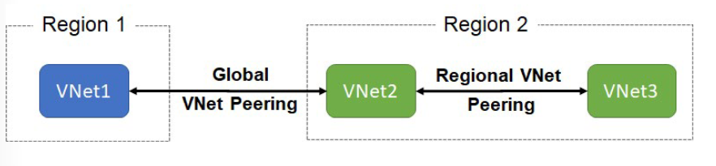

#### Sanal Ağ Eşlemesinin Avantajları (Benefits of virtual network peering)
Yerel veya küresel sanal ağ eşlemesi kullanmanın avantajları şunlardır:
* **Özel / Gizli (Private):** Eşlenen sanal ağlar arasındaki ağ trafiği özeldir. Sanal ağlar arasındaki trafik Microsoft omurga ağında (backbone network) tutulur. Sanal ağlar arasındaki iletişimde kamuya açık internet, ağ geçitleri (gateways) veya şifreleme gerekmez.
* **Performans (Performance):** Farklı sanal ağlardaki kaynaklar arasında düşük gecikmeli (low-latency), yüksek bant genişlikli (high-bandwidth) bir bağlantı sağlar.
* **İletişim (Communication):** Sanal ağlar eşlendiğinde, bir sanal ağdaki kaynakların farklı bir sanal ağdaki kaynaklarla iletişim kurabilmesini sağlar.
* **Kesintisiz (Seamless):** Azure abonelikleri, dağıtım modelleri ve Azure bölgeleri arasında veri aktarımı yapabilme yeteneği sunar.
* **Kesinti Olmaması (No disruption):** Eşleme oluşturulurken veya eşleme oluşturulduktan sonra hiçbir sanal ağdaki kaynaklarda kesinti (downtime) yaşanmaz.

---

### Ağ Geçidi Geçişi ve Bağlantıyı Belirleme (Determine Gateway Transit and Connectivity Needs)

Sanal ağlar eşlendiğinde, eşlenen sanal ağdaki bir VPN ağ geçidini (VPN Gateway) bir geçiş noktası (transit point) olarak yapılandırabilirsiniz. Bu durumda, eşlenen bir sanal ağ diğer kaynaklara erişim sağlamak için uzak ağ geçidini (remote gateway) kullanır. Bir sanal ağ yalnızca bir ağ geçidine sahip olabilir. Ağ geçidi geçişi (Gateway transit) hem VNet Peering hem de Global VNet Peering için desteklenir.

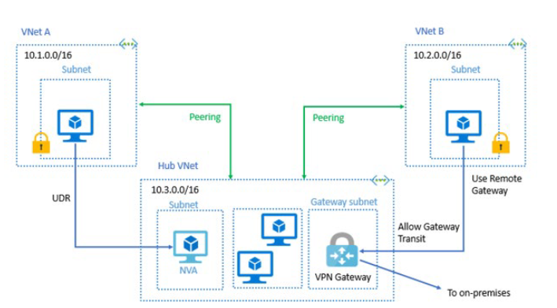

**Allow Gateway Transit (Ağ Geçidi Geçişine İzin Ver)** seçeneğini etkinleştirdiğinizde sanal ağ, eşlemenin dışındaki kaynaklarla iletişim kurabilir. Örneğin alt ağ ağ geçidi (subnet gateway) şunları yapabilir:
* Şirket içi bir ağa bağlanmak için Site-to-Site (S2S) VPN kullanabilir.
* Başka bir sanal ağa bağlanmak için VNet-to-VNet bağlantısı kullanabilir.
* Bir istemciye bağlanmak için Point-to-Site (P2S) VPN kullanabilir.

Bu senaryolarda ağ geçidi geçişi, eşlenen sanal ağların ağ geçidini paylaşmasına ve kaynaklara erişmesine olanak tanır. Bu, eşlenen sanal ağda bir VPN ağ geçidi dağıtmanız gerekmediği anlamına gelir.

> 📌 **Not:** Diğer sanal ağlara veya alt ağlara erişimi engellemek için her iki sanal ağda da Ağ Güvenlik Grupları (NSG) uygulanabilir. Sanal ağ eşlemesini yapılandırırken, sanal ağlar arasındaki ağ güvenlik grubu kurallarını açabilir veya kapatabilirsiniz.

---

### VNet Eşlemesi Oluşturma (Create VNet Peering)

VNet eşlemesini yapılandırma adımları aşağıdadır. İki sanal ağa ihtiyacınız olacaktır. Eşlemeyi test etmek için her ağda bir sanal makineye ihtiyacınız olacaktır. Başlangıçta VM'ler iletişim kuramayacak, ancak yapılandırmadan sonra iletişim çalışacaktır.

1. İki sanal ağ oluşturun.
2. Sanal ağları eşleyin (peer).
3. Her sanal ağda sanal makineler oluşturun.
4. Sanal makineler arasındaki iletişimi test edin.

Eşlemeyi yapılandırmak için **Add peering** sayfasını kullanın.

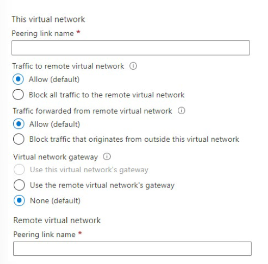

> 📌 **Önemli Not:** Bir sanal ağa eşleme eklediğinizde, ikinci sanal ağ eşleme yapılandırması otomatik olarak eklenir (çift yönlü oluşturulur).

---

### Servis Zincirleme Kullanım Alanlarını Belirleme (Determine Service Chaining Uses)

VNet Eşlemesi **geçişli değildir (nontransitive)**. VNet1 ile VNet2 arasında ve VNet2 ile VNet3 arasında VNet eşlemesi kurduğunuzda, VNet eşleme yetenekleri VNet1 ile VNet3 arasında doğrudan geçerli olmaz. Ancak, geçişliliği (transitivity) sağlamak için Kullanıcı Tanımlı Rotalar (User-Defined Routes - UDR) ve Servis Zincirlemesi (Service Chaining) yapılandırabilirsiniz. Bu şunları yapmanızı sağlar:
* Çok seviyeli bir hub and spoke mimarisi uygulamak.
* Sanal ağ başına VNet eşleme sayısı sınırını aşmak.

#### Hub and Spoke Mimarisi (Hub and spoke architecture)
Hub-and-spoke ağları dağıttığınızda, merkez (hub) sanal ağ; Ağ Sanal Cihazı (NVA - Firewall vb.) veya VPN Gateway gibi altyapı bileşenlerini barındırabilir. Tüm bağlı (spoke) sanal ağlar daha sonra hub sanal ağı ile eşleşebilir. Trafik, hub sanal ağındaki ağ sanal cihazları veya VPN ağ geçitleri üzerinden akabilir.

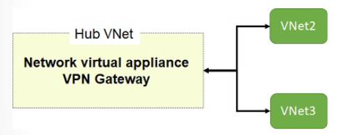

#### Kullanıcı Tanımlı Rotalar ve Servis Zincirlemesi (User-defined routes and service chaining)
Sanal ağ eşlemesi, kullanıcı tanımlı bir rotadaki bir sonraki durağın (next hop) eşlenen sanal ağdaki bir sanal makinenin veya VPN ağ geçidinin IP adresi olmasını sağlar.

Servis zincirlemesi (service chaining), kullanıcı rotalarını tanımlamanıza olanak tanır. Bu rotalar, trafiği bir sanal ağdan bir sanal cihaza (NVA/Firewall) veya sanal ağ geçidine yönlendirir.

#### Bağlantıyı Kontrol Etme (Checking connectivity)
VNet eşlemesinin durumunu kontrol edebilirsiniz:
* **Initiated (Başlatıldı):** İlk sanal ağdan ikinci sanal ağa eşlemeyi oluşturduğunuzda, eşleme durumu *Initiated* olur.
* **Connected (Bağlandı):** İkinci sanal ağdan ilk sanal ağa eşleme oluşturulduğunda eşleme durumu *Connected* olur. İlk sanal ağ için eşleme durumunu görüntülediğinizde, durumunun *Initiated* yerine *Connected* olarak değiştiğini görürsünüz. Her iki sanal ağ eşlemesi için eşleme durumu *Connected* olana kadar eşleme başarıyla kurulmuş sayılmaz.


---

## 🛠️ Bölüm 2: Terraform Lab Ortamı (`lab_module5_peering_main.tf`)

Aşağıdaki Terraform kodu; **Hub VNet** ve **Spoke VNet** mimarisini kurar, aralarında çift yönlü **VNet Peering** ilişkisi tanımlar ve eşleme parametrelerini (Gateway Transit, Allow Forwarded Traffic vb.) eksiksiz yapılandırır.

```hcl
terraform {
  required_version = ">= 1.0.0"
  required_providers {
    azurerm = {
      source  = "hashicorp/azurerm"
      version = "~> 3.70.0"
    }
  }
}

provider "azurerm" {
  features {}
}

# 1. Kaynak Grubu
resource "azurerm_resource_group" "peering_rg" {
  name     = "rg-az104-module5-peering"
  location = "westeurope"

  tags = {
    Environment = "Production"
    Module      = "AZ104-Module05-VNetPeering"
    ManagedBy   = "Terraform"
  }
}

# 2. Hub Virtual Network (Merkez Ağ)
resource "azurerm_virtual_network" "hub_vnet" {
  name                = "vnet-hub-westeurope"
  location            = azurerm_resource_group.peering_rg.location
  resource_group_name = azurerm_resource_group.peering_rg.name
  address_space       = ["10.100.0.0/16"]
}

resource "azurerm_subnet" "hub_default_subnet" {
  name                 = "snet-hub-core"
  resource_group_name  = azurerm_resource_group.peering_rg.name
  virtual_network_name = azurerm_virtual_network.hub_vnet.name
  address_prefixes     = ["10.100.1.0/24"]
}

# 3. Spoke Virtual Network (Açılan İş Yükü Ağı)
resource "azurerm_virtual_network" "spoke_vnet" {
  name                = "vnet-spoke-workloads"
  location            = azurerm_resource_group.peering_rg.location
  resource_group_name = azurerm_resource_group.peering_rg.name
  address_space       = ["10.200.0.0/16"]
}

resource "azurerm_subnet" "spoke_app_subnet" {
  name                 = "snet-spoke-apps"
  resource_group_name  = azurerm_resource_group.peering_rg.name
  virtual_network_name = azurerm_virtual_network.spoke_vnet.name
  address_prefixes     = ["10.200.1.0/24"]
}

# 4. VNet Peering: Hub -> Spoke Eşlemesi
resource "azurerm_virtual_network_peering" "hub_to_spoke" {
  name                         = "peer-hub-to-spoke"
  resource_group_name          = azurerm_resource_group.peering_rg.name
  virtual_network_name         = azurerm_virtual_network.hub_vnet.name
  remote_virtual_network_id    = azurerm_virtual_network.spoke_vnet.id
  allow_virtual_network_access = true
  allow_forwarded_traffic      = true
  allow_gateway_transit        = false # Hub üzerinde bir Gateway kurulduğunda 'true' yapılır
  use_remote_gateways          = false
}

# 5. VNet Peering: Spoke -> Hub Eşlemesi
resource "azurerm_virtual_network_peering" "spoke_to_hub" {
  name                         = "peer-spoke-to-hub"
  resource_group_name          = azurerm_resource_group.peering_rg.name
  virtual_network_name         = azurerm_virtual_network.spoke_vnet.name
  remote_virtual_network_id    = azurerm_virtual_network.hub_vnet.id
  allow_virtual_network_access = true
  allow_forwarded_traffic      = true
  allow_gateway_transit        = false
  use_remote_gateways          = false # Hub üzerindeki Gateway'i kullanmak için 'true' yapılır
}

# Outputs
output "hub_vnet_id" {
  value = azurerm_virtual_network.hub_vnet.id
}

output "spoke_vnet_id" {
  value = azurerm_virtual_network.spoke_vnet.id
}

output "peering_hub_to_spoke_status" {
  value = azurerm_virtual_network_peering.hub_to_spoke.id
}
```

# AZ-104: Module 05 - Configure VPN Gateway (VPN Ağ Geçidini Yapılandırma)

AZ-104 (Microsoft Azure Administrator) sertifikasyon sınavının beşinci modülünün bu bölümü; şirket içi (on-premises) veri merkezlerini, uzak tesisleri ve istemci cihazlarını Azure Sanal Ağlarına (VNet) şifreli ve güvenli bir şekilde bağlayan **Azure VPN Gateway**, Local Network Gateway, S2S/P2S/VNet-to-VNet bağlantı türleri ve Yüksek Erişilebilirlik (Active/Active, Active/Standby) mimarilerini kapsar[cite: 4].


---

### VPN Ağ Geçidini Yapılandırma (Configure VPN Gateway)

#### Senaryo (Scenario)
Şirketiniz, veri merkezinizi ve diğer büyük bölgesel tesislerinizi Azure'a bağlamak istemektedir. Ağ üzerinden taşınırken hasta sağlık bilgilerinin (PHI) korunması için güvenli bir bağlantıya ihtiyacınız vardır. Şu anda adanmış bir devre (ExpressRoute gibi) için bant genişliği gereksinimleriniz yoktur ve bu ağları maliyet etkin bir şekilde entegre etmenin bir yolunu arıyorsunuz.

Şirket sahalarınızı Azure'a güvenli bir şekilde bağlamak için VPN ağ geçitleri (VPN Gateways) oluşturmanız gerekmektedir.

#### Ölçülen Beceriler (Skills measured)
VPN Ağ Geçitlerini yapılandırmak, AZ-104 sınavının **%25–%30** ağırlığa sahip *"Configure and manage virtual networking"* bölümünün kritik bir parçasıdır[cite: 4]:
* **Şirket içi ağı bir Azure sanal ağıyla entegre etme (Integrate an on-premises network with an Azure virtual network)[cite: 4].**
  * **Azure VPN ağ geçidi oluşturma ve yapılandırma (Create and configure Azure VPN gateway)[cite: 4].**

#### Öğrenme Hedefleri (Learning objectives)
Bu bölümde aşağıdaki becerileri edineceksiniz:
* VPN ağ geçitlerinin özelliklerini ve kullanım senaryolarını belirlemek.
* Yüksek erişilebilirlik (High Availability) senaryolarını uygulamak.
* Bir VPN ağ geçidi kullanarak Siteler Arası (Site-to-Site) VPN bağlantılarını yapılandırmak.

---

### VPN Ağ Geçidi Kullanım Alanlarını Belirleme (Determine VPN Gateway Uses)

Bir VPN ağ geçidi (VPN Gateway), bir Azure sanal ağı ile şirket içi bir konum arasında kamuya açık İnternet üzerinden şifrelenmiş trafik göndermek için kullanılan özel bir sanal ağ geçidi türüdür. Ayrıca Microsoft ağı üzerinden Azure sanal ağları arasında şifrelenmiş trafik göndermek için de bir VPN ağ geçidi kullanırsınız.

Her sanal ağ **yalnızca bir VPN ağ geçidine** sahip olabilir. Ancak aynı VPN ağ geçidine birden fazla bağlantı oluşturabilirsiniz. Aynı VPN ağ geçidine birden fazla bağlantı oluşturduğunuzda, tüm VPN tünelleri mevcut ağ geçidi bant genişliğini paylaşır.

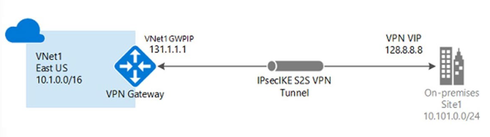

* **Site-to-Site (S2S) Bağlantıları:** Şirket içi veri merkezlerini Azure sanal ağlarına bağlar.
* **VNet-to-VNet Bağlantıları:** Azure sanal ağlarını birbirine bağlar.
* **Point-to-Site (P2S / User VPN) Bağlantıları:** Bireysel cihazları (mobil çalışanlar vb.) Azure sanal ağlarına bağlar.

Bir sanal ağ geçidi, oluşturduğunuz ve **`GatewaySubnet`** adı verilen özel bir alt ağa dağıtılan iki veya daha fazla VM'den oluşur. Sanal ağ geçidi VM'leri yönlendirme tabloları içerir ve belirli ağ geçidi hizmetlerini çalıştırır. Bu VM'ler sanal ağ geçidini oluşturduğunuzda otomatik olarak oluşturulur. Sanal ağ geçidinin parçası olan VM'leri doğrudan yapılandıramazsınız.

VPN ağ geçitleri **Azure Availability Zones (Kullanılabilirlik Alanları)** içerisinde dağıtılabilir. Kullanılabilirlik alanları; sanal ağ geçitlerine esneklik, ölçeklenebilirlik ve daha yüksek erişilebilirlik kazandırır. Şirket içi ağınızın Azure bağlantısını alan düzeyindeki arızalardan korurken, bir bölgedeki ağ geçitlerini fiziksel ve mantıksal olarak ayırır.

> 📌 **Önemli Not:** Bir sanal ağ geçidinin (Virtual Network Gateway) oluşturulması **45 dakikaya kadar** sürebilir.

---

### Siteler Arası (Site-to-Site) Bağlantılar Oluşturma (Create Site to Site Connections)

Bir VNet-to-VNet veya Site-to-Site bağlantısı oluşturmanın temel adımları aşağıdadır:

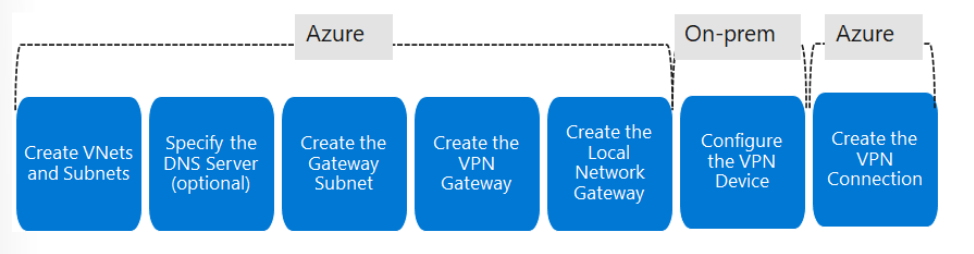

1. **VNet'leri ve Alt Ağları Oluşturun (Create VNets and subnets):** Bu VNet'in şirket içi bir konuma bağlanacağını unutmayın. Bu sanal ağ için bir IP adresi aralığı rezerve etmek üzere şirket içi ağ yöneticinizle iletişime geçin.
2. **DNS Sunucusunu Belirtin - İsteğe Bağlı (Specify the DNS server):** Site-to-Site bağlantısı oluşturmak için DNS gerekli değildir. Ancak sanal ağınıza dağıtılan kaynaklar için ad çözümlemesine ihtiyacınız varsa, sanal ağ yapılandırmasında bir DNS sunucusu belirtmelisiniz.

> ⚠️ **Uyarı:** Ağ yapılandırmanızı dikkatlice planlamaya zaman ayırın. VPN bağlantısının her iki tarafında **çakışan (duplicate) bir IP adresi aralığı** varsa, trafik beklediğiniz şekilde yönlendirilmez.

#### Ağ Geçidi Alt Ağını Oluşturma (Create the Gateway Subnet)
Sanal ağınız için bir sanal ağ geçidi oluşturmadan önce, ilk olarak **Ağ Geçidi Alt Ağını (Gateway Subnet)** oluşturmanız gerekir. Ağ geçidi alt ağı, sanal ağ geçidi tarafından kullanılan IP adreslerini içerir. Gelecekteki yapılandırma gereksinimlerini karşılayacak yeterli IP adresini sağlamak için ağ geçidi alt ağını **`/28` veya `/27`** CIDR bloğu kullanarak oluşturmak en iyisidir.

Ağ geçidi alt ağınızı oluşturduğunuzda, ağ geçidi VM'leri bu alt ağa dağıtılır ve gerekli VPN ağ geçidi ayarlarıyla yapılandırılır. Ağ geçidi alt ağına **asla başka kaynaklar (örneğin ek VM'ler) dağıtmayın**. Ağ geçidi alt ağının adı **kesinlikle `GatewaySubnet` olmalıdır**.

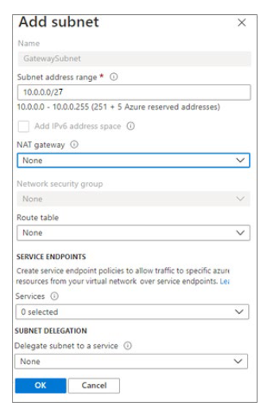

#### VPN Ağ Geçidini Oluşturma (Create the VPN Gateway)
Seçtiğiniz VPN ağ geçidi ayarları, başarılı bir bağlantı oluşturmak için kritik öneme sahiptir:

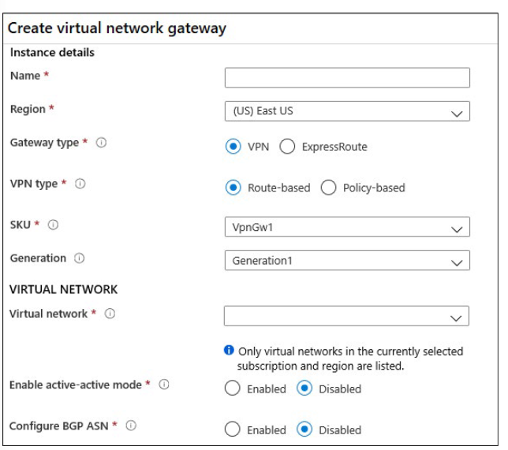

* **Gateway type (Ağ Geçidi Türü):** `VPN` veya `ExpressRoute`.
* **VPN Type (VPN Türü):** `Route-based` (Rota tabanlı) veya `Policy-based` (İlke tabanlı). Seçtiğiniz VPN türü, VPN cihazınızın markasına/modeline ve oluşturmak istediğiniz VPN bağlantısının türüne bağlıdır. Tipik rota tabanlı ağ geçidi senaryoları; Point-to-Site, sanal ağlar arası (VNet-to-VNet) veya birden fazla Site-to-Site bağlantısını içerir. Bir ExpressRoute ağ geçidi ile birlikte çalışma (coexist) gerekiyorsa veya IKEv2 kullanmanız gerekiyorsa da Rota tabanlı seçilir. İlke tabanlı (Policy-based) ağ geçitleri yalnızca IKEv1'i destekler.
* **SKU:** Ağ geçidi SKU'sunu seçin. Seçiminiz sahip olabileceğiniz tünel sayısını ve toplam bant genişliği performansını (aggregate throughput) etkiler.
* **Generation (Nesil):** `Generation1` veya `Generation2`. Nesiller veya nesiller arası SKU'lar değiştirilemez. Basic ve VpnGw1 SKU'ları yalnızca Generation1'de desteklenir. VpnGw4 ve VpnGw5 SKU'ları yalnızca Generation2'de desteklenir.
* **Virtual Networks (Sanal Ağlar):** Sanal ağ geçidi üzerinden trafik gönderebilecek ve alabilecek sanal ağ. Bir sanal ağ birden fazla ağ geçidiyle ilişkilendirilemez.

---

### VPN Ağ Geçidi Türünü ve SKU'sunu Belirleme (Determine VPN Gateway Type, SKU and Generation)

#### VPN Türleri (VPN Types)

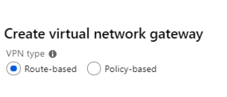

* **Route-based VPNs (Rota Tabanlı VPN'ler):** Paketleri karşılık gelen tünel arabirimlerine yönlendirmek için IP yönlendirme veya yönlendirme tablosundaki rotaları kullanır. Tünel arabirimleri daha sonra paketleri tünellere sokarken ve tünellerden çıkarırken şifreler veya şifresini çözer. Rota tabanlı VPN'ler için trafik seçici ilkesi *any-to-any* (veya wildcard) olarak yapılandırılır.
* **Policy-based VPNs (İlke Tabanlı VPN'ler):** Şirket içi ağınız ile Azure VNet arasındaki adres ön eklerinin kombinasyonlarıyla yapılandırılan IPsec ilkelerine göre paketleri IPsec tünelleri üzerinden şifreler ve yönlendirir. İlke tabanlı VPN kullanılırken aşağıdaki kısıtlamalara dikkat edilmelidir:
  * Yalnızca **Basic SKU** ağ geçidinde kullanılabilir, diğer SKU'larla uyumsuzdur.
  * Yalnızca **tek bir tünel (1 tunnel)** oluşturulabilir.
  * Yalnızca S2S bağlantıları için kullanılabilir.

> 📌 **Not:** Sanal ağ geçidi oluşturulduktan sonra **VPN türünü (Route-based / Policy-based) değiştiremezsiniz**.

#### Ağ Geçidi SKU ve Nesil Karşılaştırması (Gateway SKU and Generation)

| Generation | SKU | S2S / VNet-to-VNet Tünel Limiti | P2S IKEv2 Bağlantı Limiti | Toplam Performans Benchmark'ı |
| :---: | :---: | :---: | :---: | :---: |
| **Gen1** | VpnGw1 / Az | Max 30 | Max 250 | 650 Mbps |
| **Gen1** | VpnGw2 / Az | Max 30 | Max 500 | 1.0 Gbps |
| **Gen2** | VpnGw2 / Az | Max 30 | Max 500 | 1.25 Gbps |
| **Gen1** | VPNGw3 / Az | Max 30 | Max 1000 | 1.25 Gbps |
| **Gen2** | VPNGw3 / Az | Max 30 | Max 1000 | 2.5 Gbps |
| **Gen2** | VPNGw4 / Az | Max 30 | Max 5000 | 5.0 Gbps |

*\* Not: Eski (Legacy) kabul edilen Basic SKU tabloda yer almamaktadır. Toplam Performans Benchmark'ı, S2S + P2S birleşik değeridir.*

---

### Yerel Ağ Geçidi ve Bağlantı Oluşturma (Create Local Network Gateway & Connection)

#### Yerel Ağ Geçidi Oluşturma (Create the Local Network Gateway)
Yerel ağ geçidi (Local Network Gateway) genellikle **şirket içi (on-premises) konumu** temsil eder. Azure'un bu sahaya hitap edebilmesi için sahaya bir isim verir, ardından bağlantı için şirket içi VPN cihazının Genel (Public) IP adresini veya FQDN'ini belirtirsiniz. Ayrıca, VPN ağ geçidi üzerinden VPN cihazına yönlendirilecek IP adresi ön eklerini (şirket içi ağınızda bulunan subnet blokları) belirtirsiniz.

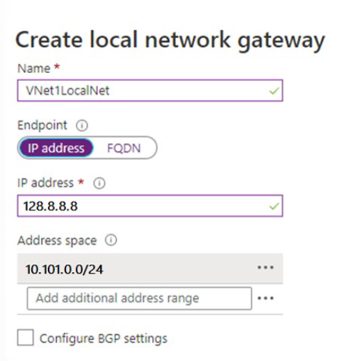

* **IP Address:** Yerel ağ geçidinin (şirket içi firewall/router) Public IP adresi.
* **Address Space:** Yerel ağınızın adres alanını tanımlayan bir veya daha fazla IP adresi aralığı (CIDR notasyonunda).

#### Şirket İçi VPN Cihazını Ayarlama (Setup the On-Premises VPN Device)
VPN cihazınızı yapılandırmak için şunlara ihtiyacınız olacaktır:
* **Paylaşılan Anahtar (Shared Key / PSK):** VPN bağlantısını oluştururken belirttiğiniz paylaşılan anahtarın aynısı.
* **Azure VPN Ağ Geçidinizin Public IP Adresi.**

#### VPN Bağlantısını Oluşturma ve Doğrulama (Create & Verify the Connection)
VPN ağ geçitleriniz ve Local Network Gateway oluşturulduktan sonra aralarındaki bağlantıyı (Connection) oluşturursunuz.
* **Connection type:** `Site-to-Site (IPSec)` seçilir.
* **Shared key (PSK):** Şirket içi cihazınız ile Azure sanal ağ geçidi bağlantınız arasında eşleşen gizli anahtar.

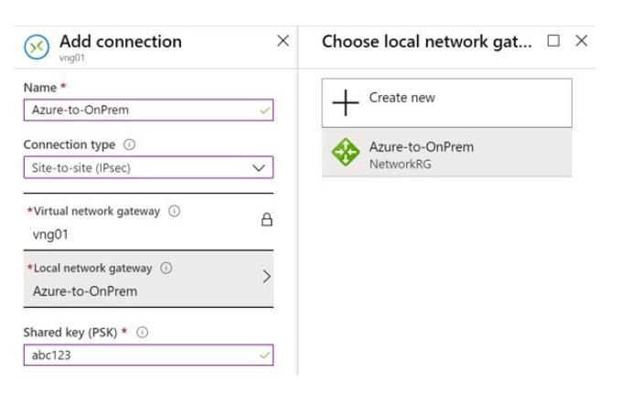

---

### Yüksek Erişilebilirlik Senaryolarını Belirleme (Determine High Availability Scenarios)

#### Active / Standby (Etkin / Yedek)
Her Azure VPN ağ geçidi, **Active/Standby** yapılandırmasında iki VM örneğinden oluşur. Etkin örnekte meydana gelen herhangi bir planlı bakım veya plansız kesintide, yedek örnek otomatik olarak görevi devralır (failover) ve S2S VPN veya VNet-to-VNet bağlantılarını devam ettirir.

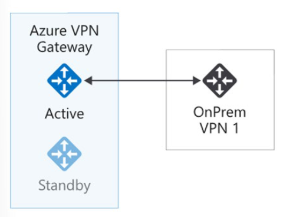

* **Planlı Bakım:** Bağlantı **10 ila 15 saniye** içinde geri yüklenir.
* **Plansız Kesinti:** Bağlantının kurtarılması en kötü durumda **1 ila 1.5 dakika** sürer.
* **P2S Bağlantıları:** İstemcilerin bağlantısı kesilir ve kullanıcıların yeniden bağlanması gerekir.

#### Active / Active (Etkin / Etkin)
Azure VPN ağ geçidinizi, ağ geçidi VM'lerinin her iki örneğinin de şirket içi VPN cihazınıza S2S VPN tünelleri kuracağı bir **Active/Active** yapılandırmasında oluşturabilirsiniz.

* Bu yapılandırmada, her Azure ağ geçidi örneğinin **benzersiz bir Public IP adresi** vardır.
* Her ikisi de şirket içi VPN cihazınıza bağımsız bir IPsec/IKE S2S VPN tüneli kurar.
* Azure sanal ağınızdan şirket içi ağınıza giden trafik **her iki tünelden aynı anda (simultaneous)** yönlendirilir.
* Bir örneğe planlı veya plansız bir olay geldiğinde, trafik kesintisiz bir şekilde diğer aktif IPsec tüneline kaydırılır.

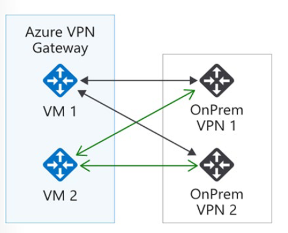

---

## 🛠️ Bölüm 2: Terraform Lab Ortamı (`lab_module5_vpngw_main.tf`)

Aşağıdaki Terraform kodu; **`GatewaySubnet`** içeren bir Sanal Ağ, Azure **VPN Gateway (VpnGw1)**, Şirket içi ağı temsil eden **Local Network Gateway** ve aralarındaki **S2S IPsec VPN Bağlantısını** tam parametreleriyle dağıtır.

```hcl
terraform {
  required_version = ">= 1.0.0"
  required_providers {
    azurerm = {
      source  = "hashicorp/azurerm"
      version = "~> 3.70.0"
    }
  }
}

provider "azurerm" {
  features {}
}

# 1. Kaynak Grubu
resource "azurerm_resource_group" "vpngw_rg" {
  name     = "rg-az104-module5-vpngw"
  location = "westeurope"

  tags = {
    Environment = "Production"
    Module      = "AZ104-Module05-VPNGateway"
    ManagedBy   = "Terraform"
  }
}

# 2. Virtual Network & Subnets
resource "azurerm_virtual_network" "vnet" {
  name                = "vnet-site-westeurope"
  location            = azurerm_resource_group.vpngw_rg.location
  resource_group_name = azurerm_resource_group.vpngw_rg.name
  address_space       = ["10.0.0.0/16"]
}

resource "azurerm_subnet" "workload_subnet" {
  name                 = "snet-workloads"
  resource_group_name  = azurerm_resource_group.vpngw_rg.name
  virtual_network_name = azurerm_virtual_network.vnet.name
  address_prefixes     = ["10.0.1.0/24"]
}

# Gateway Subnet ZORUNLU İSİMDİR (GatewaySubnet)
resource "azurerm_subnet" "gateway_subnet" {
  name                 = "GatewaySubnet"
  resource_group_name  = azurerm_resource_group.vpngw_rg.name
  virtual_network_name = azurerm_virtual_network.vnet.name
  address_prefixes     = ["10.0.255.0/27"] # /27 veya /28 önerilir
}

# 3. Public IP for Azure VPN Gateway
resource "azurerm_public_ip" "vpngw_pip" {
  name                = "pip-vpngw-westeurope"
  location            = azurerm_resource_group.vpngw_rg.location
  resource_group_name = azurerm_resource_group.vpngw_rg.name
  allocation_method   = "Dynamic" # VpnGw1 Generation1 için Dynamic/Static desteklenir
  sku                 = "Basic"
}

# 4. Azure Virtual Network Gateway (VPN Gateway)
resource "azurerm_virtual_network_gateway" "vpngw" {
  name                = "vpngw-westeurope-01"
  location            = azurerm_resource_group.vpngw_rg.location
  resource_group_name = azurerm_resource_group.vpngw_rg.name

  type     = "Vpn"
  vpn_type = "RouteBased" # S2S, P2S ve VNet-to-VNet için varsayılan

  active_active = false
  enable_bgp    = false
  sku           = "VpnGw1"
  generation    = "Generation1"

  ip_configuration {
    name                          = "vnetGatewayConfig"
    public_ip_address_id          = azurerm_public_ip.vpngw_pip.id
    private_ip_address_allocation = "Dynamic"
    subnet_id                     = azurerm_subnet.gateway_subnet.id
  }
}

# 5. Local Network Gateway (Şirket İçi Veri Merkezini Temsil Eder)
resource "azurerm_local_network_gateway" "onprem_local_gw" {
  name                = "lng-onprem-datacenter"
  location            = azurerm_resource_group.vpngw_rg.location
  resource_group_name = azurerm_resource_group.vpngw_rg.name
  gateway_address     = "203.0.113.10" # Şirket içi VPN Cihazının Dış IP Adresi

  address_space = [
    "192.168.1.0/24",
    "192.168.2.0/24"
  ] # Şirket içindeki subnet blokları
}

# 6. Site-to-Site VPN Connection
resource "azurerm_virtual_network_gateway_connection" "s2s_connection" {
  name                       = "conn-s2s-azure-to-onprem"
  location                   = azurerm_resource_group.vpngw_rg.location
  resource_group_name        = azurerm_resource_group.vpngw_rg.name
  type                       = "IPsec"
  virtual_network_gateway_id = azurerm_virtual_network_gateway.vpngw.id
  local_network_gateway_id   = azurerm_local_network_gateway.onprem_local_gw.id

  shared_key = "P@ssw0rdAzureS2SKey2026!" # Şirket içi cihazla eşleşmesi gereken PSK
}

# Outputs
output "vpn_gateway_public_ip" {
  value       = azurerm_public_ip.vpngw_pip.ip_address
  description = "Şirket içi VPN cihazına tanımlanacak Azure VPN Gateway Public IP adresi"
}

output "vpn_connection_id" {
  value = azurerm_virtual_network_gateway_connection.s2s_connection.id
}
```


# AZ-104: Module 05 - ExpressRoute and Virtual WAN (ExpressRoute ve Sanal WAN)

AZ-104 (Microsoft Azure Administrator) sertifikasyon sınavının beşinci modülünün bu dördüncü bölümü; şirket içi veri merkezlerini Microsoft omurga ağı üzerinden özel ve yüksek hızlı olarak Azure'a bağlayan **Azure ExpressRoute**, S2S VPN ile ExpressRoute'un birlikte çalışabilmesi (Coexistence), bağlantı seçeneklerinin karşılaştırılması ve tüm küresel bağlantıları tek bir hub-spoke mimarisinde toplayan **Azure Virtual WAN** konularını kapsar.


---

### ExpressRoute Kullanım Alanlarını Belirleme (Determine ExpressRoute Uses)

Azure ExpressRoute, şirket içi ağlarınızı bir bağlantı sağlayıcısı (connectivity provider) yardımıyla Microsoft bulutuna genişletmenizi sağlar. ExpressRoute ile Microsoft Azure, Microsoft 365 ve CRM Online gibi Microsoft bulut hizmetlerine özel bağlantılar kurabilirsiniz.

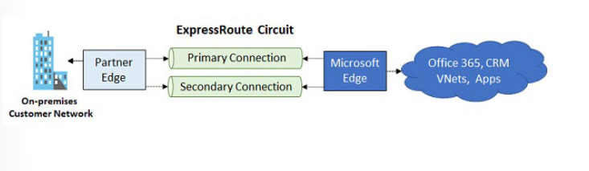

#### Hızlı, Güvenilir ve Özel Bağlantılar (Make your connections fast, reliable, and private)
ExpressRoute, Azure veri merkezleri ile tesislerinizdeki altyapı arasında veya bir veri merkezi barındırma (colocation) ortamında özel bağlantılar oluşturur. ExpressRoute bağlantıları **kamuya açık İnternet üzerinden geçmez**; tipik İnternet bağlantılarına göre daha fazla güvenilirlik, daha yüksek hızlar ve daha düşük gecikmeler sunar. Bazı durumlarda verileri ExpressRoute ile aktarmak önemli maliyet avantajları sağlar.

ExpressRoute ile bağlantılar, bir Exchange sağlayıcı tesisi gibi bir ExpressRoute konumunda kurulabilir veya bir ağ hizmet sağlayıcısı tarafından sunulan mevcut WAN ağınızdan (MPLS VPN gibi) doğrudan Azure'a bağlanabilir.

#### Depolama, Yedekleme ve Kurtarma İçin Sanal Özel Bulut (Virtual private cloud)
ExpressRoute, **100 Gbps'ye kadar** bant genişliği seçenekleriyle Azure'a hızlı ve güvenilir bir bağlantı sağlar. Yüksek bağlantı hızları; periyodik veri taşıma, iş sürekliliği için çoğaltma (replication) ve felaket kurtarma (disaster recovery) senaryoları için mükemmeldir. Yüksek performanslı bilgi işlem uygulamaları için büyük veri kümelerini aktarmak veya geliştirme-test ortamlarınız arasında büyük sanal makineleri taşımak için maliyet etkin bir seçenektir.

#### Veri Merkezlerinizi Genişletme ve Bağlama (Extend and connect your datacenters)
Mevcut veri merkezlerinize işlem ve depolama kapasitesi eklemek için ExpressRoute kullanın. Yüksek veri akış hızı (throughput) ve düşük gecikme süreleri ile Azure, veri merkezlerinizin doğal bir uzantısı gibi hissettirir.

#### Hibrit Uygulamalar İnşa Etme (Build hybrid applications)
Gizlilikten veya performanstan ödün vermeden şirket içi altyapı ile Azure'a yayılan uygulamalar oluşturun. Örneğin, Azure'da çalışan ve müşterilerinizi şirket içi bir Active Directory hizmetiyle doğrulayan kurumsal bir intranet uygulamasını, trafiği kamuya açık İnternet'ten geçirmeden çalıştırabilirsiniz.

---

### ExpressRoute Özelliklerini Belirleme (Determine ExpressRoute Capabilities)

ExpressRoute tüm Azure bölgelerinde ve konumlarında desteklenir. ExpressRoute konumları, Microsoft'un çeşitli servis sağlayıcılarla eşleştiği (peering) yerlerdir.

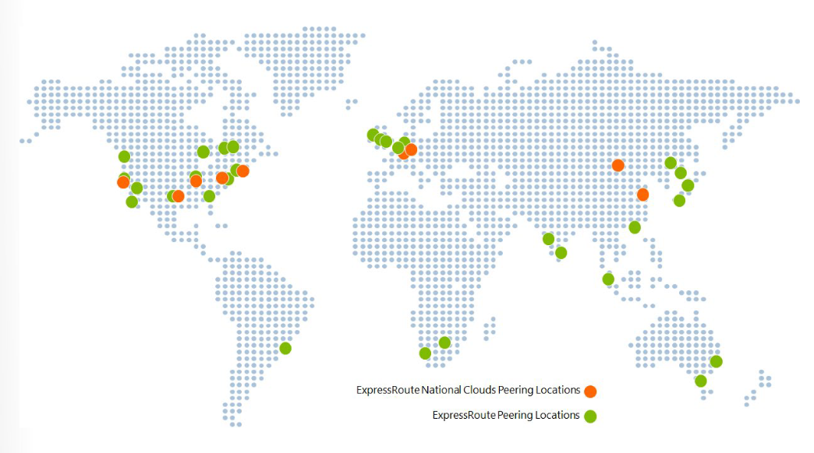

#### ExpressRoute Avantajları (ExpressRoute benefits)
* **Katman 3 Bağlantısı (Layer 3 connectivity):** Microsoft, şirket içi ağınız, Azure'daki örnekleriniz ve Microsoft kamu IP adresleri arasında rotaları değiştirmek için BGP (Border Gateway Protocol) kullanır.
* **Yedeklilik (Redundancy):** Her ExpressRoute devresi, bağlantı sağlayıcısından/ağ kenarınızdan iki Microsoft Kurumsal Kenar Yönlendiricisine (MSEE - Microsoft Enterprise Edge Routers) yapılan **iki bağlantıdan** oluşur. Microsoft, sağlayıcıdan her iki MSEE'ye çift BGP bağlantısı kurulmasını zorunlu kılar.
* **Jeopolitik Bölge İçindeki Tüm Bölgelere Bağlantı:** Bir eşleme konumunda Microsoft'a bağlanır ve o jeopolitik bölgedeki tüm Azure bölgelerine erişirsiniz (Örn: Amsterdam'dan bağlanarak Kuzey ve Batı Avrupa'daki tüm servisler erişilebilir hale gelir).
* **ExpressRoute Premium Add-On ile Küresel Bağlantı:** Premium eklentisini etkinleştirerek jeopolitik sınırların ötesine geçebilir, ulusal bulutlar hariç dünya genelindeki tüm Azure bölgelerine erişebilirsiniz.
* **ExpressRoute Global Reach:** Şirket içi sahalarınızı ExpressRoute devreleri üzerinden birbirine bağlayarak veri merkezleri arası trafiğinizi Microsoft omurga ağı üzerinden iletebilirsiniz.
* **Bant Genişliği Seçenekleri:** 50 Mbps'den 100 Gbps'ye kadar geniş bir bant genişliği aralığında satın alınabilir.
* **Esnek Faturalandırma Modelleri:**
  * **Unlimited Data (Sınırsız Veri):** Aylık sabit ücret; gelen ve giden tüm veri aktarımı ücretsizdir.
  * **Metered Data (Kotalı Veri):** Aylık ücret; gelen veri ücretsiz, giden veri aktarımı GB başına ücretlendirilir.
  * **ExpressRoute Premium Add-On:** Artırılmış kural tablosu limitleri, daha fazla VNet bağlantısı ve küresel erişim sağlar.

---

### Siteler Arası VPN ve ExpressRoute'un Birlikte Çalışması (Coexist Site-to-Site and ExpressRoute)

Site-to-Site (S2S) VPN trafiği kamuya açık İnternet üzerinden şifrelenmiş olarak iletilirken, ExpressRoute doğrudan özel bir WAN bağlantısıdır. Aynı sanal ağ için hem S2S VPN hem de ExpressRoute bağlantılarını yapılandırmak çeşitli avantajlar sağlar:

* **Yedek Yol (Failover Path):** S2S VPN, ExpressRoute için güvenli bir felaket yedekleme yolu olarak yapılandırılabilir.
* **Ek Saha Bağlantıları:** ExpressRoute ağına dahil olmayan uzak sahaları S2S VPN ile aynı VNet'e bağlamak için kullanılabilir.

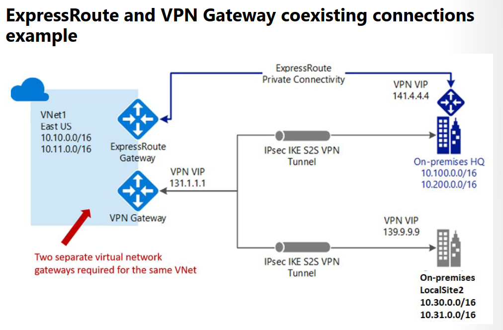

> 📌 **Önemli Not:** Birlikte çalışma (coexistence) mimarisi aynı sanal ağ içinde iki adet Sanal Ağ Geçidi (Virtual Network Gateway) gerektirir: Biri `VPN` türünde, diğeri `ExpressRoute` türünde. Güncel dağıtım seçenekleri PowerShell / CLI üzerinden yapılandırılır.

#### ExpressRoute Bağlantı Modelleri (ExpressRoute connection models)
1. **Cloud Exchange Yerleşimi (Colocated at a cloud exchange):** Veri merkezi sağlayıcısının Ethernet değişimi üzerinden Katman 2 veya yönetilen Katman 3 çapraz bağlantıları.
2. **Noktadan Noktaya Ethernet (Point-to-point Ethernet):** Şirket içi veri merkeziniz ile Azure arasında noktadan noktaya Katman 2 / Katman 3 bağlantılar.
3. **Çok Noktadan Çok Noktaya Ağlar (Any-to-any / IPVPN - MPLS):** WAN ağınızı MPLS VPN sağlayıcınız aracılığıyla Azure ile entegre ederek Azure'u ağınızın bir başka şubesi gibi bağlama.

---

### Siteler Arası Bağlantı Seçeneklerinin Karşılaştırılması (Compare Intersite Connection Options)

| Bağlantı Türü | Desteklenen Azure Servisleri | Bant Genişliği | Protokol/Mimari | Tipik Kullanım Senaryosu |
| :--- | :--- | :--- | :--- | :--- |
| **Point-to-Site (P2S)** | Azure IaaS servisleri, Sanal Makineler | Gateway SKU'suna bağlı | Active/Passive | Geliştirme, test ve lab ortamları, mobil çalışanlar. |
| **Site-to-Site (S2S)** | Azure IaaS servisleri, Sanal Makineler | Genellikle < 1 Gbps (toplam) | Active/Passive, Active/Active | Dev/test ortamları, küçük ölçekli üretim iş yükleri. |
| **ExpressRoute** | Azure IaaS, PaaS, Microsoft 365 | 50 Mbps - 100 Gbps | Active/Active (Çift BGP) | Kurumsal, kritik üretim iş yükleri, büyük veri (Big Data). |

---

### Sanal WAN Kullanım Alanlarını Belirleme (Determine Virtual WAN Uses)

Azure Virtual WAN; şubelerin (branches) Azure'a ve Azure üzerinden birbirine optimize edilmiş ve otomatikleştirilmiş bağlantısını sağlayan gelişmiş bir ağ hizmetidir. Azure bölgeleri, şubelerinizi bağlamayı seçebileceğiniz merkezler (hubs) olarak hizmet verir.

Virtual WAN; **Site-to-Site VPN, User VPN (P2S) ve ExpressRoute** gibi birçok bulut bağlantı hizmetini tek bir operasyonel arayüzde bir araya getirir. Küresel geçiş ağı mimarisi (global transit network) bir hub-and-spoke modeline dayanır.


#### Virtual WAN Avantajları (Virtual WAN advantages)
* **Hub-Spoke Entegre Bağlantı:** Şirket içi sahalar ile Azure Hub arasındaki S2S yapılandırmasını otomatiğe bağlar.
* **Otomatik Spoke Kurulumu:** Sanal ağlarınızı ve iş yüklerinizi Azure Hub'a kesintisiz olarak bağlar.
* **Sezgisel Sorun Giderme (Troubleshooting):** Azure içindeki uçtan uca akışı görmenizi ve gerekli aksiyonları almanızı sağlar.

#### Virtual WAN Türleri (Virtual WAN types)

| Virtual WAN Türü | Hub Türü | Kullanılabilir Yapılandırmalar |
| :--- | :--- | :--- |
| **Basic (Temel)** | Basic | Yalnızca Site-to-Site VPN. |
| **Standard (Standart)** | Standard | ExpressRoute, User VPN (P2S), Site-to-Site VPN, Hub'lar arası (Inter-hub) geçiş ve VNet-to-VNet geçişi. |

---

## 🛠️ Bölüm 2: Terraform Lab Ortamı (`lab_module5_expressroute_vwan_main.tf`)

Aşağıdaki Terraform kodu; bir **ExpressRoute Circuit (Devre)** şablonunu ve entegre bir **Azure Virtual WAN (Standard Hub ve ExpressRoute/VPN Gateway)** mimarisini dağıtır.

```hcl
terraform {
  required_version = ">= 1.0.0"
  required_providers {
    azurerm = {
      source  = "hashicorp/azurerm"
      version = "~> 3.70.0"
    }
  }
}

provider "azurerm" {
  features {}
}

# 1. Kaynak Grubu
resource "azurerm_resource_group" "er_vwan_rg" {
  name     = "rg-az104-module5-er-vwan"
  location = "westeurope"

  tags = {
    Environment = "Production"
    Module      = "AZ104-Module05-ER-vWAN"
    ManagedBy   = "Terraform"
  }
}

# 2. Azure ExpressRoute Circuit (Devre Yapılandırması)
resource "azurerm_express_route_circuit" "er_circuit" {
  name                  = "erc-enterprise-westeurope"
  resource_group_name   = azurerm_resource_group.er_vwan_rg.name
  location              = azurerm_resource_group.er_vwan_rg.location
  service_provider_name = "Equinix" # Servis sağlayıcı adı
  peering_location      = "Amsterdam" # ExpressRoute Peering Konumu
  bandwidth_in_mbps     = 50

  sku {
    tier = "Standard" # Premium seçeneği küresel erişim sağlar
    family = "MeteredData" # Sınırsız veri için UnlimitedData
  }

  tags = {
    CostCenter = "IT-Networking"
  }
}

# 3. Azure Virtual WAN
resource "azurerm_virtual_wan" "vwan" {
  name                = "vwan-global-core"
  resource_group_name = azurerm_resource_group.er_vwan_rg.name
  location            = azurerm_resource_group.er_vwan_rg.location
  type                = "Standard" # Standard: S2S, P2S, ExpressRoute ve Inter-hub geçişini destekler

  allow_branch_to_branch_traffic = true
}

# 4. Virtual WAN Hub (Merkez Sanal Hub)
resource "azurerm_virtual_hub" "vwan_hub" {
  name                = "hub-westeurope-01"
  resource_group_name = azurerm_resource_group.er_vwan_rg.name
  location            = azurerm_resource_group.er_vwan_rg.location
  virtual_wan_id      = azurerm_virtual_wan.vwan.id
  address_prefix      = "10.60.0.0/24"
}

# 5. Virtual WAN S2S VPN Gateway (Hub İçi VPN Ağ Geçidi)
resource "azurerm_vpn_gateway" "vwan_s2s_gateway" {
  name                = "vpngw-vwan-hub-01"
  location            = azurerm_resource_group.er_vwan_rg.location
  resource_group_name = azurerm_resource_group.er_vwan_rg.name
  virtual_hub_id      = azurerm_virtual_hub.vwan_hub.id
  scale_unit          = 1
}

# Outputs
output "expressroute_service_key" {
  value       = azurerm_express_route_circuit.er_circuit.service_key
  sensitive   = true
  description = "Ağ servis sağlayıcısına verilecek ExpressRoute Service Key koda duyarlıdır."
}

output "vwan_hub_id" {
  value = azurerm_virtual_hub.vwan_hub.id
}
```