# AZ-104: Module 06 - Configure Network Routing and Endpoints (Ağ Yönlendirmesini ve Uç Noktaları Yapılandırma)

AZ-104 (Microsoft Azure Administrator) sertifikasyon sınavının altıncı modülünün bu ilk bölümü; Azure üzerindeki varsayılan ağ trafiği akışını yöneten **Sistem Rotaları (System Routes)**, özel güvenlik ve denetim gereksinimleri için trafiği Ağ Sanal Cihazlarına (NVA / Firewall) yönlendiren **Kullanıcı Tanımlı Rotalar (User-Defined Routes - UDR)**, **Rota Tablosu (Route Table)** yapılandırması ve IP Forwarding ilkelerini kapsar.


---

### Ağ Yönlendirmesini ve Uç Noktaları Yapılandırma (Configure Network Routing and Endpoints)

#### Senaryo (Scenario)
Şirketiniz yakın zamanda müşteri kişisel bilgilerini açığa çıkaran bir güvenlik olayı yaşamıştır. Bu durum, müşterilerin gizli verilerinin ve güveninin kaybolmasına neden olmuştur. BT ekibi, ağ sanal cihazlarının (Network Virtual Appliances - NVA) uygulanmasını önermiştir.

Trafiğin ağ sanal cihazları üzerinden doğru şekilde yönlendirildiğinden emin olmalısınız. Ayrıca servis uç noktaları (Service Endpoints) ve özel bağlantılar (Private Links) gibi diğer güvenlik seçeneklerini de incelemeniz gerekmektedir.

#### Ölçülen Beceriler (Skills measured)
Yönlendirme yöntemlerini ve uç noktaları yapılandırmak, AZ-104 sınavının **%25–%30** ağırlığa sahip *"Configure and manage virtual networking"* bölümünün parçasıdır:
* **Kullanıcı tanımlı ağ rotalarını yapılandırma (Configure user-defined network routes).**
* **Alt ağlarda uç noktaları yapılandırma (Configure endpoints on subnets).**
* **Özel uç noktaları yapılandırma (Configure private endpoints).**

#### Öğrenme Hedefleri (Learning objectives)
Bu bölümde aşağıdaki becerileri edineceksiniz:
* Sistem rotalarını ve kullanıcı tanımlı rotaları uygulamak.
* Özel bir kural/rota (custom route) yapılandırmak.
* Servis uç noktalarını (Service Endpoints) uygulamak.
* Private Link ve uç nokta servislerinin özelliklerini ve kullanım senaryolarını belirlemek.

---

### Sistem Rotalarını İnceleme (Review System Routes)

Azure; sanal makineler, şirket içi ağlar ve İnternet arasındaki ağ trafiğini yönlendirmek için **sistem rotalarını (System Routes)** kullanır. Aşağıdaki durumlar bu sistem rotaları tarafından yönetilir:

* Aynı alt ağdaki (subnet) VM'ler arasındaki trafik.
* Aynı sanal ağdaki farklı alt ağlarda bulunan VM'ler arasındaki trafik.
* VM'lerden İnternet'e veri akışı.
* VPN Gateway üzerinden Siteler Arası (S2S) ve ExpressRoute iletişimi.

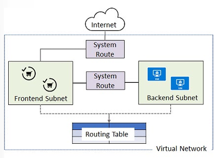

> 📌 **Not:** Sistem rotaları hakkındaki bilgiler bir **Rota Tablosunda (Route Table)** kaydedilir. Rota tablosu, paketlerin bir sanal ağda nasıl yönlendirilmesi gerektiğini belirten ve *route* (rota) adı verilen bir dizi kural içerir. Rota tabloları alt ağlarla ilişkilendirilir ve bir alt ağdan çıkan her paket, ilişkili rota tablosuna göre işlenir. Paketler hedef IP adresine, sanal ağ geçidine, ağ sanal cihazına veya internete göre eşleştirilir. Eşleşen bir rota bulunamazsa paket düşürülür (drop edilir).


---

### Kullanıcı Tanımlı Rotaları Belirleme (Identify User-Defined Routes)

Azure tüm ağ trafiği yönlendirmesini otomatik olarak halleder. Ancak ya farklı bir şey yapmak isterseniz? Örneğin, yönlendirme, güvenlik duvarı (firewall) veya WAN optimizasyonu gibi bir ağ işlevini gerçekleştiren bir VM'iniz (NVA) olabilir. Belirli bir alt ağ trafiğinin bu ağ sanal cihazına yönlendirilmesini isteyebilirsiniz (Örneğin, alt ağlar arasına veya bir alt ağ ile internet arasına bir güvenlik duvarı koymak).

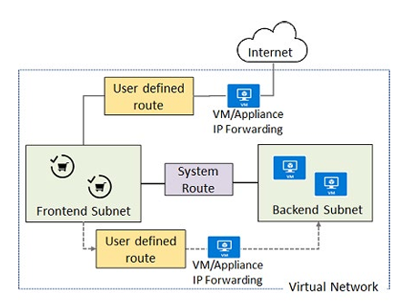

Bu durumlarda **Kullanıcı Tanımlı Rotalar (User-Defined Routes - UDR)** yapılandırabilirsiniz. UDR'ler, trafik akışının bir sonraki durağını (Next Hop) belirten rotalar tanımlayarak ağ trafiğini kontrol eder. 

#### UDR Kuralları ve Özellikleri
* **Next Hop Türleri:** *Virtual network gateway*, *Virtual network*, *Internet*, *Virtual appliance* (Ağ sanal cihazı) veya *None*.
* **İlişki Esası:** Her rota tablosu **birden fazla alt ağa** ilişkilendirilebilir, ancak bir alt ağ **yalnızca tek bir rota tablosuna** ilişkilendirilebilir.
* **Maliyet:** Microsoft Azure'da rota tabloları oluşturmak tamamen **ücretsizdir**.

---

### Yönlendirme Örneğinin İncelenmesi (Examine a Routing Example)

Üç alt ağ içeren bir sanal ağ senaryosu düşünelim:

1. **Public Subnet:** İnternet erişimi olan ön uç katmanı.
2. **DMZ Subnet:** İçinde bir Ağ Sanal Cihazı (NVA / Firewall VM) barındıran katman (`10.0.2.4` IP adresli).
3. **Private Subnet:** Hassas verilerin bulunduğu arka uç katmanı (`10.0.1.0/24`).

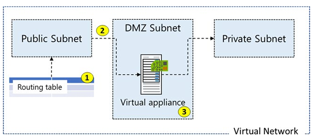

**Hedef:** Public alt ağdan Private alt ağa giden tüm trafiğin doğrudan gitmesini engelleyip, önce DMZ alt ağındaki NVA cihazı üzerinden zorunlu olarak geçmesini sağlamak (Forced Tunneling / Inspection).

---

### Rota Tablosu Oluşturma ve Özel Rota Ekleme (Create Route Table & Custom Route)

#### 1. Rota Tablosu Oluşturma (Create a Routing Table)
Bir rota tablosu oluştururken İsim, Abonelik, Kaynak Grubu ve Konum bilgileri girilir. Ayrıca **Virtual network gateway route propagation (Sanal ağ geçidi rotası yayılımı)** seçeneğine karar verilir. ExpressRoute kullanıldığında yayılımın etkinleştirilmesi, tüm alt ağların şirket içi ağ rotalarını otomatik olarak almasını sağlar.

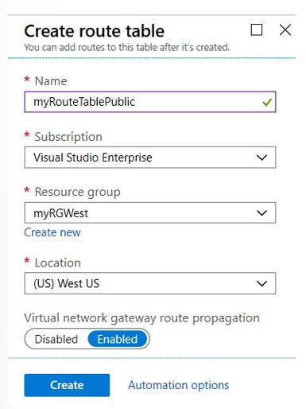

#### 2. Özel Rota Oluşturma (Create a Custom Route)
Örneğimiz için özel kural şöyle tanımlanır:
* **Route Name:** `ToPrivateSubnet`
* **Address Prefix:** `10.0.1.0/24` (Private Subnet adresi)
* **Next Hop Type:** `Virtual appliance`
* **Next Hop Address:** `10.0.2.4` (DMZ'deki NVA IP adresi)

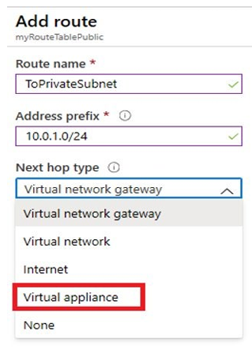

#### 3. Rota Tablosunu Alt Ağa Bağlama (Associate the Route Table)
Oluşturulan Rota Tablosu **Public Subnet** ile ilişkilendirilir. Varsayılan sistem rotaları trafiği doğrudan Private Subnet'e götürecekken, UDR sayesinde trafik önce `10.0.2.4` IP'li NVA'ya zorlanır.

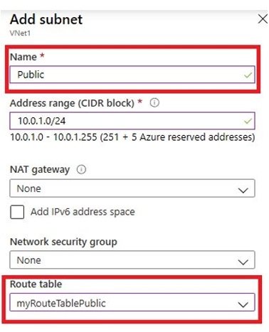

> ⚠️ **Önemli Sistem Yönetimi Notu:** Trafiği üzerinden yönlendireceğiniz NVA (Virtual Appliance) olarak çalışan Sanal Makinenin Azure üzerindeki Ağ Arabiriminde (NIC) **`IP Forwarding` (IP İletimi) seçeneği mutlaka etkinleştirilmelidir**. Ayrıca güvenlik amacıyla NVA üzerinde Public IP bulunmaması önerilir.

---

## 🛠️ Bölüm 2: Terraform Lab Ortamı (`lab_module6_udr_main.tf`)

Aşağıdaki Terraform kodu; **Public**, **Private** ve **DMZ** alt ağlarına sahip bir Sanal Ağ kurar, bir NVA (Firewall) NIC'i üzerinde `ip_forwarding = true` ayarını etkinleştirir ve Public Subnet trafiğini NVA'ya zorlayan bir **Route Table (UDR)** tanımlayarak alt ağa bağlar.

```hcl
terraform {
  required_version = ">= 1.0.0"
  required_providers {
    azurerm = {
      source  = "hashicorp/azurerm"
      version = "~> 3.70.0"
    }
  }
}

provider "azurerm" {
  features {}
}

# 1. Kaynak Grubu
resource "azurerm_resource_group" "udr_rg" {
  name     = "rg-az104-module6-udr"
  location = "westeurope"

  tags = {
    Environment = "Production"
    Module      = "AZ104-Module06-UDR"
    ManagedBy   = "Terraform"
  }
}

# 2. Virtual Network & Subnets (Public, DMZ, Private)
resource "azurerm_virtual_network" "vnet" {
  name                = "vnet-routing-westeurope"
  location            = azurerm_resource_group.udr_rg.location
  resource_group_name = azurerm_resource_group.udr_rg.name
  address_space       = ["10.0.0.0/16"]
}

resource "azurerm_subnet" "public_subnet" {
  name                 = "snet-public"
  resource_group_name  = azurerm_resource_group.udr_rg.name
  virtual_network_name = azurerm_virtual_network.vnet.name
  address_prefixes     = ["10.0.0.0/24"]
}

resource "azurerm_subnet" "private_subnet" {
  name                 = "snet-private"
  resource_group_name  = azurerm_resource_group.udr_rg.name
  virtual_network_name = azurerm_virtual_network.vnet.name
  address_prefixes     = ["10.0.1.0/24"]
}

resource "azurerm_subnet" "dmz_subnet" {
  name                 = "snet-dmz"
  resource_group_name  = azurerm_resource_group.udr_rg.name
  virtual_network_name = azurerm_virtual_network.vnet.name
  address_prefixes     = ["10.0.2.0/24"]
}

# 3. NVA (Ağ Sanal Cihazı) İçin Ağ Arabirimi - IP Forwarding Etkin!
resource "azurerm_network_interface" "nva_nic" {
  name                 = "nic-nva-firewall-01"
  location             = azurerm_resource_group.udr_rg.location
  resource_group_name  = azurerm_resource_group.udr_rg.name
  enable_ip_forwarding = true # NVA için KRİTİK AYAR! (Trafiği iletmesine izin verir)

  ip_configuration {
    name                          = "ipconfig-nva"
    subnet_id                     = azurerm_subnet.dmz_subnet.id
    private_ip_address_allocation = "Static"
    private_ip_address            = "10.0.2.4" # Sabit NVA IP Adresi
  }
}

# 4. Route Table (Kullanıcı Tanımlı Rota Tablosu - UDR)
resource "azurerm_route_table" "public_udr_table" {
  name                          = "rt-public-to-nva"
  location                      = azurerm_resource_group.udr_rg.location
  resource_group_name           = azurerm_resource_group.udr_rg.name
  disable_bgp_route_propagation = false

  # Özel Rota Tanımı: Private Subnet'e giden trafik NVA'ya (10.0.2.4) yönlendirilir
  route {
    name                   = "ToPrivateSubnetViaNVA"
    address_prefix         = "10.0.1.0/24" # Private Subnet Adres Bloğu
    next_hop_type          = "VirtualAppliance"
    next_hop_in_ip_address = "10.0.2.4" # NVA IP Adresi
  }

  tags = {
    RoutingPolicy = "ForcedThroughNVA"
  }
}

# 5. Route Table'ı Public Subnet ile İlişkilendirme (Association)
resource "azurerm_subnet_route_table_association" "public_subnet_assoc" {
  subnet_id      = azurerm_subnet.public_subnet.id
  route_table_id = azurerm_route_table.public_udr_table.id
}

# Outputs
output "nva_private_ip" {
  value       = azurerm_network_interface.nva_nic.private_ip_address
  description = "Ağ Sanal Cihazının (NVA) Statik Özel IP Adresi"
}

output "route_table_id" {
  value       = azurerm_route_table.public_udr_table.id
  description = "Public Subnet'e bağlanan Rota Tablosunun ID'si"
}
```


# AZ-104: Module 06 - Service Endpoints and Private Link (Servis Uç Noktaları ve Özel Bağlantılar)

AZ-104 (Microsoft Azure Administrator) sertifikasyon sınavının altıncı modülünün bu bölümü; Azure PaaS servislerine (Storage, SQL, Key Vault vb.) güvenli erişim sağlayan **Sanal Ağ Servis Uç Noktaları (Service Endpoints)** ve trafiği tamamen özel IP adresleri üzerinden Microsoft omurga ağına hapseden **Azure Private Link / Private Endpoint** mimarilerini kapsar.

---

### Servis Uç Noktası Kullanım Alanlarını Belirleme (Determine Service Endpoint Uses)

Bir sanal ağ servis uç noktası (Virtual Network Service Endpoint), sanal ağınızın kimliğini Azure PaaS servisine bildirir. Sanal ağınızda servis uç noktaları etkinleştirildikten sonra, PaaS kaynağına sanal ağ kuralları (VNet rules) ekleyerek kaynağı sanal ağınıza güvence altına alabilirsiniz.

Bugün, bir sanal ağdan gelen Azure servis trafiği kaynak IP adresi olarak genel (Public) IP adreslerini kullanır. Servis uç noktaları ile birlikte servis trafiği, Azure servisine erişirken kaynak IP adresi olarak **sanal ağ özel (Private) IP adreslerini** kullanmaya başlar. Bu geçiş, IP güvenlik duvarlarında kullanılan ayrılmış public IP adreslerine ihtiyaç duymadan servislere erişmenizi sağlar.

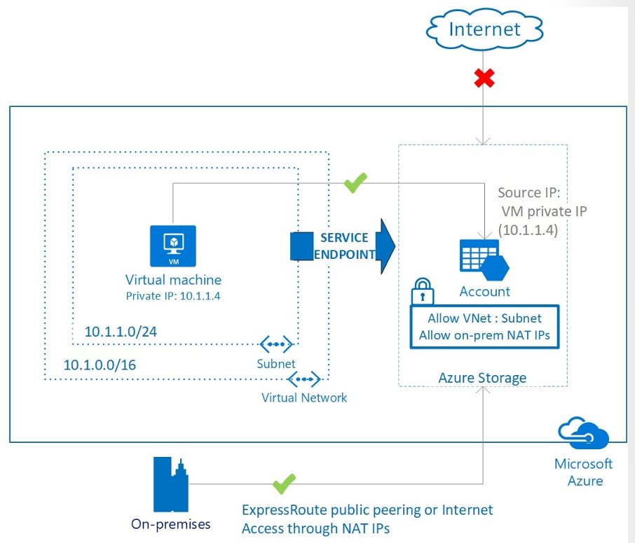

#### Neden Servis Uç Noktası Kullanılmalı? (Why use a service endpoint?)
* **Azure Servis Kaynakları İçin Gelişmiş Güvenlik:** VNet özel adres alanları çakışabilir, bu nedenle VNet'inizden kaynaklanan trafiği benzersiz bir şekilde tanımlamak için kullanılamazlar. Servis uç noktaları, VNet kimliğini servise genişleterek Azure kaynaklarını sanal ağınıza güvence altına alır. Trafiği kamuya açık internetten tamamen kaldırır ve yalnızca sanal ağınızdan gelen trafiğe izin verir.
* **Optimum Yönlendirme (Optimal Routing):** İnternet trafiğini şirket içi ağınıza veya NVA cihazlarına zorlayan **Forced-Tunneling** uyguladığınızda varsayılan olarak Azure PaaS trafiği de internet yolunu izler. Servis uç noktaları, Azure servis trafiğini her zaman sanal ağınızdan doğrudan **Microsoft Azure omurga ağı (backbone network)** üzerindeki servise iletir.
* **Daha Az Yönetim Yükü ve Basit Kurulum:** IP güvenlik duvarı aracılığıyla Azure kaynaklarını güvence altına almak için sanal ağlarınızda artık ayrılmış public IP adreslerine, NAT veya Gateway cihazlarına ihtiyaç duyulmaz. Servis uç noktaları doğrudan alt ağ (subnet) üzerinden yapılandırılır.

> ⚠️ **Önemli Uyarı:** Servis uç noktaları etkinleştirildiğinde sanal makinenin Azure PaaS servisine erişimdeki IP kimliği Public'ten Private IPv4 adresine geçer. Azure servis güvenlik duvarında Public IP adreslerini kullanan mevcut kurallar bu değişiklikten sonra çalışmayı durdurur. Servis uç noktasını kurmadan önce PaaS güvenlik duvarı kurallarının bu geçişe hazır olduğundan emin olun. Ayrıca yapılandırma sırasında geçici trafik kesintileri yaşanabilir.

---

### Servis Uç Noktası Destekleyen Servisleri Belirleme (Determine Service Endpoint Services)

Sanal ağa bir servis uç noktası eklemek oldukça kolaydır. Aşağıdaki ana Azure servisleri desteklenmektedir:

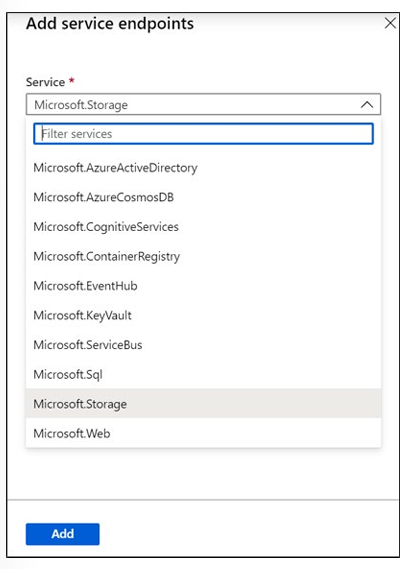

* **Azure Storage:** Tüm Azure bölgelerinde genel kullanıma sunulmuştur. Azure Storage servisine optimum bir rota sağlar. Her depolama hesabı (Storage Account) 100'e kadar VNet kuralını destekler.
* **Azure SQL Database & SQL Data Warehouse:** Tüm Azure bölgelerinde mevcuttur. Veritabanı sunucusunun yalnızca sanal ağlardaki belirli alt ağlardan gönderilen iletişimleri kabul etmesini sağlar.
* **Azure Database for PostgreSQL & MySQL:** Sanal Ağ özel adres alanını veritabanı sunucularınıza genişletir.
* **Azure Cosmos DB:** Cosmos DB hesabını yalnızca sanal ağın belirli bir alt ağından erişime izin verecek şekilde yapılandırabilirsiniz.
* **Azure Key Vault:** Key Vault erişimini belirli sanal ağlarla ve isteğe bağlı IPv4 adres aralıklarıyla sınırlandırır.
* **Azure Service Bus & Azure Event Hubs:** Sanal ağlara bağlı iş yüklerinden mesajlaşma servislerine güvenli erişim sağlar.

> 📌 **Not:** Servis uç noktalarının eklenmesi ve aktifleşmesi **15 dakikaya kadar** sürebilir.

---

### Private Link Kullanım Alanlarını Belirleme (Identify Private Link Uses)

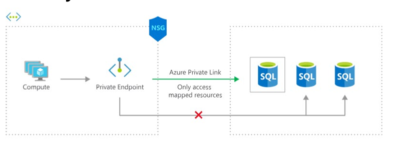

**Azure Private Link**, bir sanal ağdan Azure PaaS servislerine, müşteri tarafından işletilen servislere veya Microsoft ortak hizmetlerine **özel (private) bağlantı** sağlar. Verilerin kamuya açık internete maruz kalmasını ortadan kaldırarak ağ mimarisini basitleştirir ve uç noktalar arasındaki bağlantıyı güvence altına alır.

#### Private Link Avantajları (Private Link Benefits)
* **Servislere Özel Bağlantı:** Trafik Microsoft ağında kalır, kamuya açık internet erişimi yoktur. Diğer Azure bölgelerinde çalışan servislere özel olarak bağlanabilirsiniz. Private Link küreseldir (global) ve bölgesel kısıtlamaları yoktur.
* **Şirket İçi ve Eşlenmiş Ağlarla Entegrasyon:** Şirket içi ağlardan (VPN / ExpressRoute) veya eşlenmiş sanal ağlardan (VNet Peering) özel uç noktalara (Private Endpoints) erişin. Public Peering veya internet gerekmez.
* **Veri Sızıntısına (Data Exfiltration) Karşı Koruma:** Private Link, PaaS kaynağını ağınızdaki özel bir IP adresine eşler. Ağınızda bir güvenlik olayı meydana geldiğinde, yalnızca eşlenen spesifik kaynağa erişilebilir, bu da veri sızdırma tehdidini ortadan kaldırır.
* **Doğrudan Müşteri Sanal Ağlarına Sunulan Servisler:** Azure PaaS, Microsoft ortağı veya kendi servislerinizi müşteri VNet'lerinde özel olarak sunun. Azure AD kiracıları (tenants) arasında çalışır.

#### Nasıl Çalışır? (How it works)
Private Link kullanılarak Azure üzerinde sunulan servisler, sanal ağınızdaki bir **Private Endpoint (Özel Uç Nokta)** arabirimine eşlenir (VNet'inizden özel bir IP adresi alır). Servise giden tüm trafik bu özel uç nokta üzerinden yönlendirilebilir; gateway, NAT cihazı, ExpressRoute public peering veya public IP adresine gerek kalmaz.

---

### ⚖️ Service Endpoint ve Private Link Karşılaştırması

| Özellik | Service Endpoint (Servis Uç Noktası) | Private Link / Private Endpoint |
| :--- | :--- | :--- |
| **Erişim Adresi** | Servisin Public IP/FQDN adresi kullanılır, fakat VNet Private IP kimliğiyle iletilir. | Sanal ağın içinden **Özel IP adresi (Private IP)** alır. |
| **İnternet İzolasyonu** | PaaS servisine internetten erişim VNet kuralı ile kapatılır. | Trafik tamamen sanal ağ içindeki Private IP üzerinden akar. |
| **Veri Sızdırma Koruması** | Sadece VNet seviyesinde kısıtlama sağlar. | Yalnızca eşlenen spesifik kaynağa erişim vererek veri sızdırmayı engeller. |
| **On-Premises Bağlantısı** | Doğrudan şirket içi VPN/ExpressRoute üzerinden erişilemez (UDR/NVA gerekir). | Şirket içi ağlardan VPN veya ExpressRoute üzerinden **doğrudan erişilebilir**. |

---

## 🛠️ Bölüm 2: Terraform Lab Ortamı (`lab_module6_endpoints_main.tf`)

Aşağıdaki Terraform kodu; bir **Storage Account** oluşturur, **Service Endpoint** kullanarak bir alt ağdan erişimi sınırlar ve ayrıca **Private Endpoint** mimarisini aynı PaaS kaynağı için dağıtır.

```hcl
terraform {
  required_version = ">= 1.0.0"
  required_providers {
    azurerm = {
      source  = "hashicorp/azurerm"
      version = "~> 3.70.0"
    }
  }
}

provider "azurerm" {
  features {}
}

# 1. Kaynak Grubu
resource "azurerm_resource_group" "endpoints_rg" {
  name     = "rg-az104-module6-endpoints"
  location = "westeurope"

  tags = {
    Environment = "Production"
    Module      = "AZ104-Module06-Endpoints"
    ManagedBy   = "Terraform"
  }
}

# 2. Virtual Network ve Subnet'ler
resource "azurerm_virtual_network" "vnet" {
  name                = "vnet-secure-westeurope"
  location            = azurerm_resource_group.endpoints_rg.location
  resource_group_name = azurerm_resource_group.endpoints_rg.name
  address_space       = ["10.50.0.0/16"]
}

# Subnet 1: Service Endpoint Etkinleştirilmiş Alt Ağ
resource "azurerm_subnet" "service_endpoint_subnet" {
  name                 = "snet-service-endpoints"
  resource_group_name  = azurerm_resource_group.endpoints_rg.name
  virtual_network_name = azurerm_virtual_network.vnet.name
  address_prefixes     = ["10.50.1.0/24"]

  # Microsoft.Storage için Service Endpoint Etkinleştiriliyor
  service_endpoints = ["Microsoft.Storage"]
}

# Subnet 2: Private Endpoint İçin Özel Alt Ağ
resource "azurerm_subnet" "private_endpoint_subnet" {
  name                 = "snet-private-endpoints"
  resource_group_name  = azurerm_resource_group.endpoints_rg.name
  virtual_network_name = azurerm_virtual_network.vnet.name
  address_prefixes     = ["10.50.2.0/24"]
}

# 3. Azure Storage Account (PaaS Kaynağı)
resource "azurerm_storage_account" "secure_storage" {
  name                     = "staz104mod06sec2026"
  resource_group_name      = azurerm_resource_group.endpoints_rg.name
  location                 = azurerm_resource_group.endpoints_rg.location
  account_tier             = "Standard"
  account_replication_type = "LRS"

  # Güvenlik Duvarı Yapılandırması (Service Endpoint Kuralı)
  network_rules {
    default_action             = "Deny" # Varsayılan olarak tüm internete kapat
    virtual_network_subnet_ids = [azurerm_subnet.service_endpoint_subnet.id]
    bypass                     = ["Metrics", "Logging"]
  }
}

# 4. Azure Private Endpoint (Storage Blob İçin Özel Uç Nokta)
resource "azurerm_private_endpoint" "storage_private_endpoint" {
  name                = "pe-storage-blob"
  location            = azurerm_resource_group.endpoints_rg.location
  resource_group_name = azurerm_resource_group.endpoints_rg.name
  subnet_id           = azurerm_subnet.private_endpoint_subnet.id

  private_service_connection {
    name                           = "psc-storage-blob"
    private_connection_resource_id = azurerm_storage_account.secure_storage.id
    subresource_names              = ["blob"]
    is_manual_connection           = false
  }
}

# Outputs
output "storage_account_id" {
  value = azurerm_storage_account.secure_storage.id
}

output "private_endpoint_ip" {
  value       = azurerm_private_endpoint.storage_private_endpoint.private_service_connection[0].private_ip_address
  description = "Storage Account için atanan VNet İçi Özel IP Adresi (Private Link)"
}
```


# AZ-104: Module 06 - Configure Azure Load Balancer (Azure Yük Dengeleyiciyi Yapılandırma)

AZ-104 (Microsoft Azure Administrator) sertifikasyon sınavının altıncı modülünün bu bölümü; gelen ağ trafiğini arka uçtaki sanal makinelere dağıtan, yüksek erişilebilirlik ve ölçeklenebilirlik sağlayan **Azure Load Balancer**, **Public & Internal Load Balancer** türleri, **SKU Karşılaştırmaları (Basic vs Standard)**, **Backend Pools**, **Health Probes**, **Load Balancing Rules** ve **Session Persistence** mimarilerini kapsar.


---

### Azure Load Balancer Kullanım Alanlarını Belirleme (Determine Azure Load Balancer Uses)

Azure Load Balancer, uygulamalarınıza yüksek erişilebilirlik ve ağ performansı sunar. Yük dengeleyici, gelen trafiği **yük dengeleme kuralları (load-balancing rules)** ve **durum yoklamaları (health probes)** kullanarak arka uç kaynaklarına (backend resources) dağıtır:

* **Yük Dengeleme Kuralları (Load-balancing rules):** Trafiğin arka uca nasıl dağıtılacağını belirler.
* **Durum Yoklamaları (Health probes):** Arka uçtaki kaynakların sağlıklı olmasını sağlar.

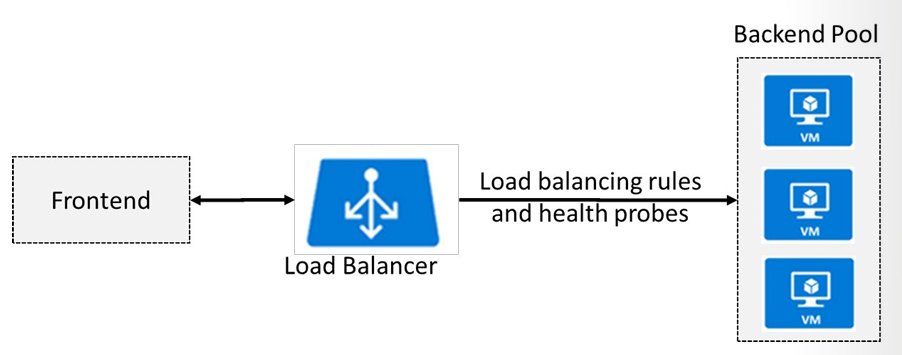

Load Balancer, hem gelen (inbound) hem de giden (outbound) senaryolar için kullanılabilir ve milyonlarca TCP ve UDP uygulama akışına kadar ölçeklenebilir.

> 📌 **Ana Bileşenler:** Bir Load Balancer yapılandırması 4 temel bileşenden oluşur:
> 1. **Frontend IP Configuration** (Giriş IP Adresi)
> 2. **Backend Pools** (Arka Uç Sunucu Havuzu)
> 3. **Health Probes** (Durum Yoklamaları)
> 4. **Load-Balancing Rules** (Yük Dengeleme Kuralları)

---

### Public ve Internal Load Balancer Uygulama

İki tür yük dengeleyici vardır: **Public (Genel)** ve **Internal (Dahili/Özel)**.

#### 1. Public Load Balancer (Genel Yük Dengeleyici)
Gelen trafiğin genel (Public) IP adresini ve port numarasını, sanal makinenin özel (Private) IP adresine ve port numarasına eşler. Sanal makineden dönen yanıt trafiği için de eşleme sağlanır. Yük dengeleme kuralları uygulayarak belirli trafik türlerini birden fazla VM veya servise dağıtabilirsiniz. Örneğin, web istemcilerinin 80 portundan gelen web isteklerini birden fazla web sunucusu (VM) arasında paylaştırabilirsiniz.

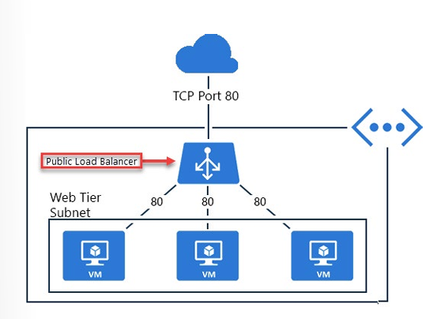

#### 2. Internal Load Balancer (Dahili Yük Dengeleyici)
Trafiği yalnızca bir sanal ağın içinde bulunan veya Azure altyapısına VPN ile bağlanan kaynaklara yönlendirir. Ön uç (Frontend) IP adresleri ve sanal ağlar asla doğrudan bir internet uç noktasına maruz kalmaz. Örneğin, bir veritabanı katmanında (Database Tier) gelen SQL isteklerini arka uçtaki veritabanı sunucularına dağıtmak için kullanılır.

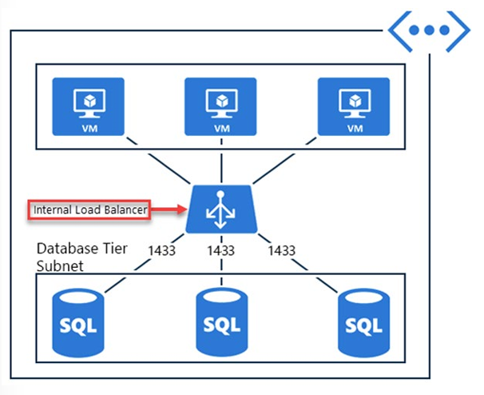

Dahili yük dengeleyici aşağıdaki kullanım senaryolarını destekler:
* **Sanal Ağ İçi:** Aynı sanal ağ içindeki VM'lerden yine aynı sanal ağdaki bir VM kümesine yük dengeleme.
* **Siteler Arası (Cross-Premises):** Şirket içi (on-premises) bilgisayarlardan Azure sanal ağındaki VM kümesine yük dengeleme.
* **Çok Katmanlı Uygulamalar (Multi-tier Apps):** İnternete açık ön yüzün arka plandaki dahili katmanlara (App/DB Tier) trafik yönlendirmesi.
* **Kurumsal İç Uygulamalar (LOB Apps):** Ek yük dengeleyici donanım veya yazılımına ihtiyaç duymadan Azure'da barındırılan iç uygulamalara erişim.


---

### Load Balancer SKU'larını Karşılaştırma (Determine Load Balancer SKUs)

Azure Load Balancer oluştururken **Basic** veya **Standard** SKU seçersiniz. Standard SKU, expanded ve daha ayrıntılı özellik kümesine sahip yenilenmiş üst sürümdür.

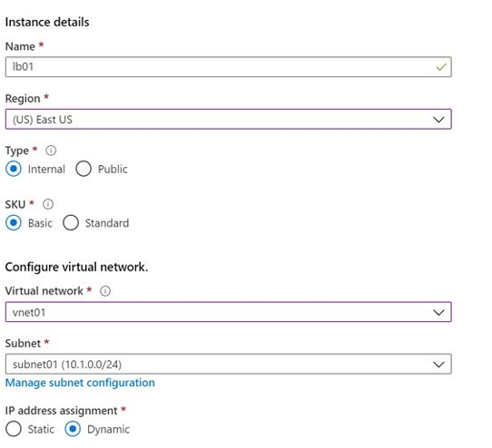

| Özellik | Basic SKU | Standard SKU |
| :--- | :--- | :--- |
| **Backend Pool Kapasitesi** | En fazla 300 örnek (instance) | En fazla 1000 örnek (instance) |
| **Health Probes** | HTTP, TCP | HTTPS, HTTP, TCP |
| **Availability Zones** | Desteklenmez (Not available) | Alan Yedekli (Zone-redundant) ve Zonal ön uçlar |
| **Çoklu Ön Uç (Multiple Frontends)** | Yalnızca Gelen (Inbound only) | Gelen ve Giden (Inbound and outbound) |
| **Varsayılan Güvenlik** | Varsayılan olarak açık (Open by default) | **Varsayılan olarak kapalı (Secure by default)**. NSG ile izin verilmedikçe gelen akışlara kapalıdır. |
| **SLA** | Hizmet Düzeyi Sözleşmesi yok | **%99.99 SLA** |

> 📌 **Not:** Basic SKU, Standard SKU'ya yükseltilebilir. Ancak tüm yeni tasarımlar ve mimariler **Standard Load Balancer** kullanmalıdır.

---

### Arka Uç Havuzları, Kurallar ve Oturum Kalıcılığı

#### Arka Uç Havuzları Oluşturma (Create Backend Pools)
Arka uç adres havuzu, yük dengeleyiciye bağlı sanal NIC'lerin IP adreslerini içerir.

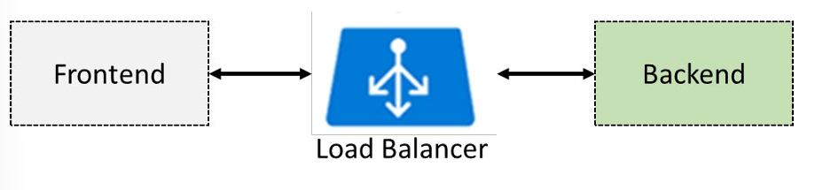


* **Standard SKU:** Tek bir sanal ağ içindeki herhangi bir VM, Kullanılabilirlik Kümesi (Availability Set) veya Sanal Makine Ölçek Kümesi (VMSS) eklenebilir (1000 örneğe kadar).
* **Basic SKU:** Yalnızca tek bir Kullanılabilirlik Kümesi veya VMSS içindeki VM'ler eklenebilir (300 örneğe kadar).

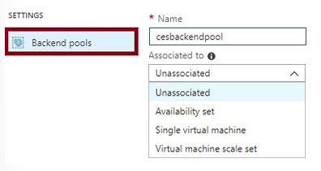

#### Yük Dengeleme Kuralları (Create Load Balancer Rules)
Bir yük dengeleme kuralı, trafiğin arka uç havuzuna nasıl dağıtılacağını tanımlar. Kural, verilen bir ön uç IP ve port kombinasyonunu, arka uç IP adresleri ve port kombinasyon kümesine eşler.

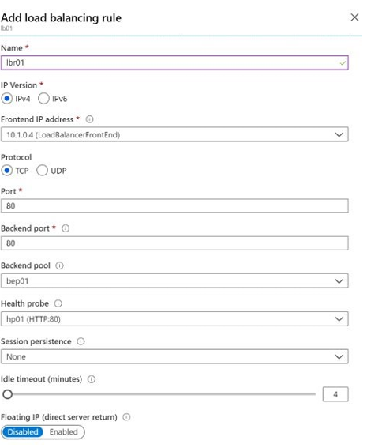


* Örneğin: Frontend Public IP (Port 80) -> Backend Pool (Port 80) + HTTP Health Probe.
* **Inbound NAT Rules:** Belirli bir VM'ye RDP (Port 3389) veya SSH erişimi sağlamak için dış portu doğrudan tek bir VM'ye yönlendirir.

#### Oturum Kalıcılığı Yapılandırma (Configure Session Persistence)
Varsayılan olarak Azure Load Balancer, trafiği **5-tuple hash** (Kaynak IP, Kaynak Port, Hedef IP, Hedef Port, Protokol) kullanarak eşit şekilde dağıtır. İstemciden gelen sonraki isteklerin nasıl ele alınacağını belirtmek için Oturum Kalıcılığı (Session Persistence) değiştirilebilir:

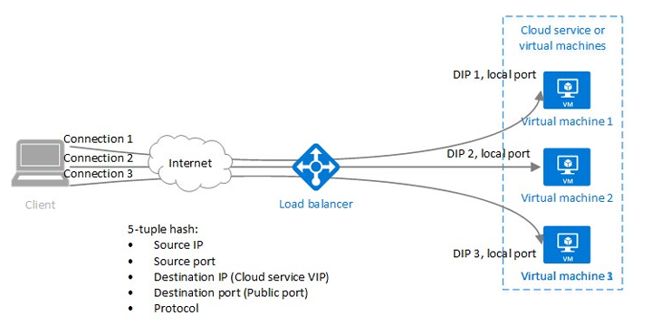

* **None (Varsayılan):** İstemciden gelen ardışık istekler herhangi bir sanal makine tarafından karşılanabilir.
* **Client IP:** Aynı istemci IP adresinden gelen ardışık istekler **aynı sanal makine** tarafından karşılanır.
* **Client IP and protocol:** Aynı istemci IP adresi ve protokol kombinasyonundan gelen istekler **aynı sanal makine** tarafından karşılanır.

> 💡 **Kullanım Senaryosu:** Alışveriş sepeti (shopping cart) verilerini sunucu belleğinde tutan web uygulamalarında `Client IP` sticky session ayarı kritik öneme sahiptir.

#### Durum Yoklamaları Oluşturma (Create Health Probes)
Durum yoklaması, uygulamanızın durumunu izler. Yanıt vermeyen veya başarısız olan VM'leri otomatik olarak rotasyondan çıkarır.

* **HTTP / HTTPS Custom Probe:** Yük dengeleyici uca düzenli aralıklarla sorgu atar (varsayılan 15 saniyede bir). Belirtilen zaman aşımı süresi içinde (varsayılan 31 saniye) **HTTP 200 OK** yanıtı alınırsa sunucu sağlıklı kabul edilir.
* **TCP Custom Probe:** Belirlenen porta başarılı bir TCP oturumu açılmasına (TCP handshake) dayanır. Bağlantı reddedilirse (refused) yoklama başarısız olur.

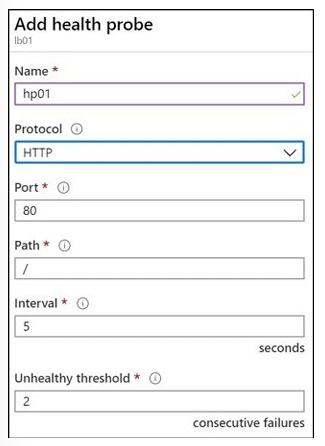

---

## 🛠️ Bölüm 2: Terraform Lab Ortamı (`lab_module6_lb_main.tf`)

Aşağıdaki Terraform kodu; bir **Standard Public Load Balancer**, **Frontend IP**, **Backend Address Pool**, **Health Probe (Port 80)** ve **Load Balancing Rule** bileşenlerini dağıtır.

```hcl
terraform {
  required_version = ">= 1.0.0"
  required_providers {
    azurerm = {
      source  = "hashicorp/azurerm"
      version = "~> 3.70.0"
    }
  }
}

provider "azurerm" {
  features {}
}

# 1. Kaynak Grubu
resource "azurerm_resource_group" "lb_rg" {
  name     = "rg-az104-module6-loadbalancer"
  location = "westeurope"

  tags = {
    Environment = "Production"
    Module      = "AZ104-Module06-LoadBalancer"
    ManagedBy   = "Terraform"
  }
}

# 2. Public IP Address (Standard SKU Load Balancer İçin Standard ZORUNLUDUR)
resource "azurerm_public_ip" "lb_pip" {
  name                = "pip-lb-prod-westeurope"
  location            = azurerm_resource_group.lb_rg.location
  resource_group_name = azurerm_resource_group.lb_rg.name
  allocation_method   = "Static"
  sku                 = "Standard" # Standard SKU Load Balancer için Standard olmalıdır
}

# 3. Azure Standard Public Load Balancer
resource "azurerm_lb" "public_lb" {
  name                = "lbi-web-prod-01"
  location            = azurerm_resource_group.lb_rg.location
  resource_group_name = azurerm_resource_group.lb_rg.name
  sku                 = "Standard" # Üretim ortamları için Standard SKU önerilir

  frontend_ip_configuration {
    name                 = "LoadBalancerFrontEnd"
    public_ip_address_id = azurerm_public_ip.lb_pip.id
  }
}

# 4. Backend Address Pool (Arka Uç Sunucu Havuzu)
resource "azurerm_lb_backend_address_pool" "backend_pool" {
  loadbalancer_id = azurerm_lb.public_lb.id
  name            = "snet-web-backend-pool"
}

# 5. Health Probe (HTTP 80 Portu Durum Yoklaması)
resource "azurerm_lb_probe" "hp_http_80" {
  loadbalancer_id     = azurerm_lb.public_lb.id
  name                = "hp-http-port80"
  protocol            = "Http"
  port                = 80
  request_path        = "/"
  interval_in_seconds = 15
  number_of_probes    = 2 # Unhealthy threshold (Üst üste 2 başarısız yoklama sunucuyu çıkarır)
}

# 6. Load Balancing Rule (Yük Dengeleme Kuralı - Port 80)
resource "azurerm_lb_rule" "lbr_http_80" {
  loadbalancer_id                = azurerm_lb.public_lb.id
  name                           = "lbr-http-80-to-80"
  protocol                       = "Tcp"
  frontend_port                  = 80
  backend_port                   = 80
  frontend_ip_configuration_name = "LoadBalancerFrontEnd"
  backend_address_pool_ids       = [azurerm_lb_backend_address_pool.backend_pool.id]
  probe_id                       = azurerm_lb_probe.hp_http_80.id
  
  # Session Persistence Ayarı: Default 'SourceIP' veya 'None' yapılabilir
  load_distribution              = "Default" # 'None', 'SourceIP', 'SourceIPProtocol'
  idle_timeout_in_minutes        = 4
}

# Outputs
output "load_balancer_public_ip" {
  value       = azurerm_public_ip.lb_pip.ip_address
  description = "Web uygulamasının dış dünyaya açılan Public IP Adresi"
}

output "load_balancer_id" {
  value = azurerm_lb.public_lb.id
}
```


# AZ-104: Module 06 - Configure Azure Application Gateway (Azure Uygulama Ağ Geçidini Yapılandırma)

AZ-104 (Microsoft Azure Administrator) sertifikasyon sınavının altıncı modülünün bu dördüncü ve son bölümü; OSI Katman 7 (Uygulama Katmanı) seviyesinde yük dengeleme, URL ve Path tabanlı yönlendirme (Path-Based Routing), çoklu site barındırma (Multi-Site Routing), Web Uygulama Güvenlik Duvarı (WAF), Durum Yoklamaları (Health Probes) ve **Azure Application Gateway** bileşenlerini kapsar.


---

### Azure Application Gateway Kullanım Alanlarını Belirleme (Determine Application Gateway Uses)

Azure Application Gateway, istemci uygulamalarının bir web uygulamasına gönderdiği istekleri yöneten **OSI Katman 7 (Uygulama Katmanı)** yük dengeleyicisidir. 

#### Temel Çalışma Mantığı ve Özellikler
* **Katman 7 Yönlendirme:** Ağ trafiğini bir isteğin URL'sine, host adına veya yoluna (path) göre web sunucu havuzlarına yönlendirir. (Azure Load Balancer OSI Katman 4'te IP ve Port seviyesinde çalışırken, Application Gateway Katman 7'de çalışır).
* **Yük Dengeleme Algoritması:** Arka uç havuzundaki sunuculara gelen istekleri **Round-Robin** kullanarak dağıtır.
* **Oturum Kalıcılığı (Session Stickiness):** Aynı oturumdaki istemci isteklerinin aynı arka uç sunucusuna yönlendirilmesini sağlamak için kitle çerezleri (cookie-based affinity) kullanır.
* **Arka Uç Destek Yapısı:** Arka uç havuzları (Backend Pools) Azure Sanal Makineleri, Sanal Makine Ölçek Kümeleri (VMSS), Azure App Service veya şirket içi (on-premises) sunucuları içerebilir.

#### Öne Çıkan Diğer Özellikler
* **Protokol Desteği:** HTTP, HTTPS, HTTP/2 ve WebSocket protokollerini destekler.
* **Otomatik Ölçeklendirme (Autoscaling):** Değişen web trafiği yüküne göre kapasiteyi dinamik olarak ayarlar.
* **Uçtan Uca Şifreleme (End-to-End Encryption):** İstemci ile gateway ve gateway ile arka uç sunucuları arasında tam şifreleme sağlar.
* **Web Uygulaması Güvenlik Duvarı (WAF):** Web uygulaması açıklarına karşı koruma sağlar.

---

### Application Gateway Yönlendirme Yöntemleri (Determine Application Gateway Routing)

Application Gateway, istekleri belirlediğiniz kurallara göre uygun arka uç havuzuna yönlendirir. İki temel yönlendirme yöntemi vardır:

#### 1. Yola Dayalı Yönlendirme (Path-Based Routing)
Farklı URL yollarına (path) sahip istekleri farklı arka uç sunucu havuzlarına gönderir. 
* Örneğin: `/video/*` yolundaki istekleri video akışı için optimize edilmiş sunucu havuzuna, `/images/*` yolundaki istekleri ise görsel işleme sunucu havuzuna yönlendirir.

#### 2. Çoklu Site Yönlendirmesi (Multiple Site Routing)
Tek bir Application Gateway örneği üzerinde birden fazla web uygulamasını yapılandırır. IP adresi için birden fazla DNS adı (CNAME) kaydedilir. Her site için ayrı dinleyiciler (listeners) kullanılır.
* Örneğin: `http://contoso.com` adresinden gelen tüm istekleri bir arka uç havuzuna, `http://fabrikam.com` adresinden gelen istekleri ise tamamen farklı bir arka uç havuzuna yönlendirir. Çok kiracılı (multi-tenant) uygulamalar için idealdir.

#### Ek Özellikler
* **Yönlendirme (Redirection):** Başka bir siteye veya HTTP'den HTTPS'e otomatik yönlendirme.
* **HTTP Başlıklarını Yeniden Yazma (Rewrite HTTP Headers):** İstek veya yanıt parametrelerini dinamik olarak değiştirme.
* **Özel Hata Sayfaları (Custom Error Pages):** Varsayılan hata sayfaları yerine kendi kurumsal markanıza uygun hata sayfaları gösterme.

---

### Application Gateway Bileşenleri (Setup Application Gateway Components)

#### Front-End IP Adresi (Ön Uç IP Adresi)
İstemci istekleri bir ön uç IP adresi üzerinden alınır. Bir Public IP, bir Private IP veya her ikisi birden yapılandırılabilir. En fazla bir Public ve bir Private IP adresine sahip olabilir.

#### Dinleyiciler (Listeners)
Belirli bir protokol, port, host adı ve IP adresi kombinasyonuna gelen trafiği kabul eden mantıksal yapılardır.
* **Basic Listener:** İstekleri yalnızca URL yoluna (path) göre yönlendirir.
* **Multi-Site Listener:** İstekleri URL'nin host adı (hostname) öğesini kullanarak da yönlendirir. Dinleyiciler ayrıca TLS/SSL sertifikalarını yönetir.

#### Yönlendirme Kuralları (Routing Rules)
Bir dinleyiciyi (listener) arka uç havuzlarına bağlar. URL'deki host adı ve yol öğelerinin nasıl yorumlanacağını ve isteğin hangi havuza gönderileceğini belirler. Ayrıca bağlantı zaman aşımları (request timeout), oturum kalıcılığı ve durum yoklamalarını tanımlayan HTTP ayarlarını (HTTP Settings) içerir.

#### Arka Uç Havuzları (Back-End Pools)
Web sunucularının bir koleksiyonudur. Havuz; VM'ler, VMSS, App Service veya şirket içi sunucuların IP adreslerini ve portlarını içerir.

#### Web Uygulaması Güvenlik Duvarı (WAF)
İstekler dinleyiciye ulaşmadan önce yaygın web tehditlerine karşı (OWASP - Open Web Application Security Project standartları) inceleme yapar.
* **Korunan Tehditler:** SQL Injection, Cross-Site Scripting (XSS), Command Injection, HTTP Request Smuggling vb.
* **Kural Kümeleri:** CRS 2.2.9 ve CRS 3.0 (Varsayılan ve güncel olan CRS 3.0'dır) desteklenir.
* WAF, gateway oluşturulurken WAF SKU'su seçilerek etkinleştirilir.

#### Durum Yoklamaları (Health Probes)
Hangi sunucuların yük dengeleme için kullanılabilir olduğunu belirler. Sunucu **200 ile 399 arasında bir HTTP durum kodu** dönerse sağlıklı (healthy) kabul edilir. Özel bir probe yapılandırılmazsa, varsayılan yoklama sunucunun yanıt vermemesi durumunda 30 saniye bekler.

---

## 🛠️ Bölüm 2: Terraform Lab Ortamı (`lab_module6_appgw_main.tf`)

Aşağıdaki Terraform kodu; özel bir alt ağa (**ApplicationGatewaySubnet**) sahip Sanal Ağ, **Application Gateway (WAF_v2 SKU)**, **Frontend IP**, **HTTP Listener**, **HTTP Settings**, **Path-Based Routing Rule** ve **WAF Policy** bileşenlerini dağıtır.

```hcl
terraform {
  required_version = ">= 1.0.0"
  required_providers {
    azurerm = {
      source  = "hashicorp/azurerm"
      version = "~> 3.70.0"
    }
  }
}

provider "azurerm" {
  features {}
}

# 1. Kaynak Grubu
resource "azurerm_resource_group" "appgw_rg" {
  name     = "rg-az104-module6-appgateway"
  location = "westeurope"

  tags = {
    Environment = "Production"
    Module      = "AZ104-Module06-AppGateway"
    ManagedBy   = "Terraform"
  }
}

# 2. Virtual Network ve Subnets
resource "azurerm_virtual_network" "vnet" {
  name                = "vnet-appgw-westeurope"
  location            = azurerm_resource_group.appgw_rg.location
  resource_group_name = azurerm_resource_group.appgw_rg.name
  address_space       = ["10.10.0.0/16"]
}

# Application Gateway İçin Ayrılmış Özel Subnet
resource "azurerm_subnet" "appgw_subnet" {
  name                 = "snet-appgateway"
  resource_group_name  = azurerm_resource_group.appgw_rg.name
  virtual_network_name = azurerm_virtual_network.vnet.name
  address_prefixes     = ["10.10.1.0/24"]
}

resource "azurerm_subnet" "backend_subnet" {
  name                 = "snet-web-backend"
  resource_group_name  = azurerm_resource_group.appgw_rg.name
  virtual_network_name = azurerm_virtual_network.vnet.name
  address_prefixes     = ["10.10.2.0/24"]
}

# 3. Public IP Address (v2 SKU İçin Static & Standard ZORUNLUDUR)
resource "azurerm_public_ip" "appgw_pip" {
  name                = "pip-appgw-prod-westeurope"
  location            = azurerm_resource_group.appgw_rg.location
  resource_group_name = azurerm_resource_group.appgw_rg.name
  allocation_method   = "Static"
  sku                 = "Standard"
}

# 4. Azure Application Gateway (WAF_v2 SKU)
resource "azurerm_application_gateway" "network" {
  name                = "appgw-gov-portal-01"
  resource_group_name = azurerm_resource_group.appgw_rg.name
  location            = azurerm_resource_group.appgw_rg.location

  sku {
    name     = "WAF_v2"
    tier     = "WAF_v2"
    capacity = 2 # Autoscaling yapılandırılmazsa sabit kapasite
  }

  gateway_ip_configuration {
    name      = "my-gateway-ip-configuration"
    subnet_id = azurerm_subnet.appgw_subnet.id
  }

  frontend_port {
    name = "frontend-port-http"
    port = 80
  }

  frontend_ip_configuration {
    name                 = "frontend-ip-config"
    public_ip_address_id = azurerm_public_ip.appgw_pip.id
  }

  # Backend Pool
  backend_address_pool {
    name = "backend-pool-web"
  }

  # Backend HTTP Settings
  backend_http_settings {
    name                  = "http-setting-backend"
    cookie_based_affinity = "Enabled" # Oturum Kalıcılığı (Session Stickiness)
    path                  = ""
    port                  = 80
    protocol              = "Http"
    request_timeout       = 60
  }

  # Listener (Basic)
  http_listener {
    name                           = "http-listener-basic"
    frontend_ip_configuration_name = "frontend-ip-config"
    frontend_port_name             = "frontend-port-http"
    protocol                       = "Http"
  }

  # Request Routing Rule
  request_routing_rule {
    name                       = "rule-basic-routing"
    rule_type                  = "Basic"
    http_listener_name         = "http-listener-basic"
    backend_address_pool_name  = "backend-pool-web"
    backend_http_settings_name = "http-setting-backend"
    priority                   = 100
  }

  # Web Application Firewall (WAF) Yapılandırması
  waf_configuration {
    enabled                  = true
    firewall_mode            = "Prevention" # 'Detection' veya 'Prevention'
    rule_set_type            = "OWASP"
    rule_set_version         = "3.0" # OWASP Core Rule Set 3.0
    request_body_check       = true
    max_request_body_size_kb = 128
  }
}

# Outputs
output "application_gateway_public_ip" {
  value       = azurerm_public_ip.appgw_pip.ip_address
  description = "Application Gateway'in dış dünyaya açılan Public IP adresi"
}

output "application_gateway_id" {
  value = azurerm_application_gateway.network.id
}
```


