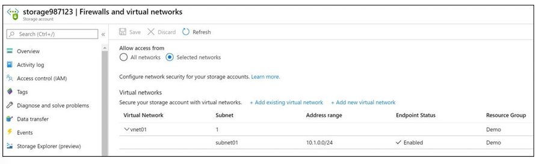
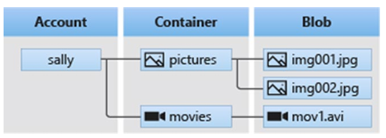
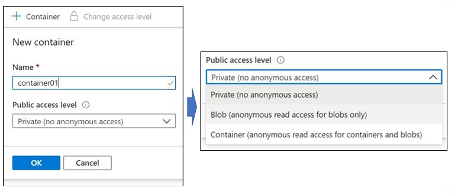
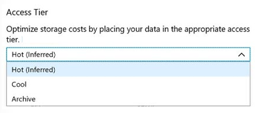
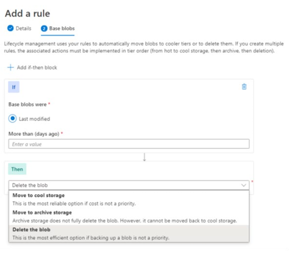
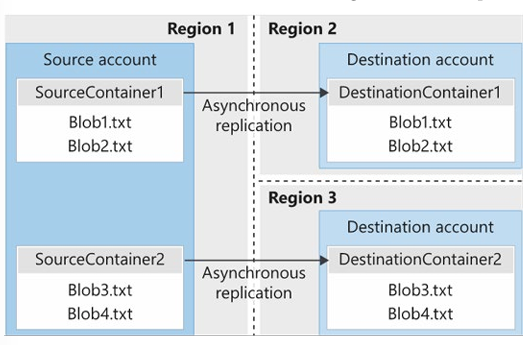
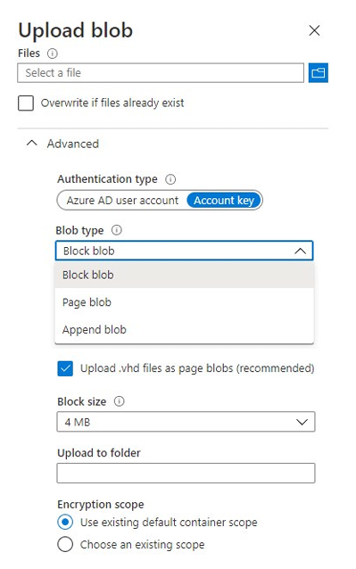

# AZ-104: Module 07 - Configure Storage Accounts (Depolama Hesaplarını Yapılandırma)

AZ-104 (Microsoft Azure Administrator) sertifikasyon sınavının yedinci modülünün bu bölümü; Azure Storage servisleri (Blob, File, Queue, Table), depolama hesabı türleri ve katmanları (Standard vs Premium), veri yedeklilik stratejileri (LRS, ZRS, GRS, GZRS), özel alan adı (Custom Domain) yapılandırması ve depolama uç noktalarının ağ düzeyinde güvenceye alınması konularını kapsar.

---

## 📚 Bölüm 1: Detaylı Ders Notları

---

### Azure Storage Temellerini Anlama (Implement Azure Storage)

Azure Storage, Microsoft'un bulut depolama çözümüdür. Ölçeklenebilir nesne depolama, bulut dosya sistemi, mesajlaşma ve NoSQL depolama alanları sunar.

#### Temel Avantajları
* **Dayanıklı ve Yüksek Erişilebilir (Durable & Highly Available):** Veriler geçici donanım arızalarına, yerel felaketlere veya doğal afetlere karşı veri merkezleri ve coğrafi bölgeler arasında kopyalanır.
* **Güvenli (Secure):** Depolama hesabına yazılan tüm veriler varsayılan olarak **Storage Service Encryption (SSE)** ile şifrelenir.
* **Yönetilen ve Erişilebilir (Managed & Accessible):** Donanım bakımı Microsoft tarafından yapılır. Verilere dünyanın her yerinden HTTP/HTTPS üzerinden, SDK'lar, REST API, PowerShell, CLI veya Azure Storage Explorer ile erişilebilir.

#### Depolama Kategorileri ve Katmanlar (Standard vs Premium)
1. **VM Depolaması:** Disks (IaaS VM'leri için blok depolama) ve Files (buluttaki yönetilen dosya paylaşımları).
2. **Yapılandırılmamış Veri (Unstructured Data):** Blobs (nesne depolama) ve Data Lake Store (HDFS tabanlı analiz).
3. **Yapılandırılmış Veri (Structured Data):** Tables (NoSQL), Cosmos DB ve Azure SQL DB.

| Katman | Desteklenen Medya | Kullanım Senaryosu |
| :--- | :--- | :--- |
| **Standard Tier** | Manyetik Diskler (HDD) | Düşük maliyetli toplu depolama, seyrek erişilen veriler. |
| **Premium Tier** | Katı Hal Sürücüleri (SSD) | Yüksek I/O gerektiren, tutarlı düşük gecikme isteyen uygulamalar (Veritabanı diskleri vb.). |

> ⚠️ **Önemli Not:** Var olan bir Standard depolama hesabını doğrudan Premium'a (veya tersine) dönüştüremezsiniz. Yeni bir depolama hesabı oluşturup verileri kopyalamanız gerekir.

---

### Azure Depolama Servislerini İnceleme (Explore Azure Storage Services)

* **Azure Blobs (Containers):** Metin ve ikili (binary) veriler için ölçeklenebilir nesne deposu. Doğrudan tarayıcıya görsel/doküman sunma, video/ses akışı, yedekleme ve arşivleme için idealdir.
* **Azure Files:** Standart **SMB (Server Message Block)** protokolü üzerinden erişilebilen tam yönetilen dosya paylaşımları. Şirket içi uygulamaların buluta taşınmasını kolaylaştırır. SAS (Shared Access Signature) token'ları ile URL üzerinden de erişilebilir.
* **Azure Queues:** Uygulama bileşenleri arasında asenkron mesajlaşma sağlayan veri deposu. Mesaj boyutu **64 KB'a kadar** olabilir.
* **Azure Tables:** Şemasız, yapılandırılmış NoSQL verileri için key/value depolama alanı. (Ayrıca Cosmos DB Table API ile de sunulmaktadır).

---

### Depolama Hesabı Türlerini Belirleme (Determine Storage Account Kinds)

| Depolama Hesabı Türü | Önerilen Kullanım Senaryosu |
| :--- | :--- |
| **Standard general-purpose v2 (GPv2)** | Çoğu senaryo için önerilen temel türdür. Blob, File, Queue, Table ve Data Lake Storage destekler. |
| **Premium block blobs** | Yüksek işlem oranına sahip, küçük nesneler kullanan veya düşük gecikme gerektiren blok blob senaryoları. |
| **Premium file shares** | Kurumsal düzeyde yüksek performanslı dosya paylaşımı uygulamaları. |
| **Premium page blobs** | Yüksek performanslı sayfa blob (VM diskleri) senaryoları. |

---

### Veri Yedeklilik ve Çoğaltma Stratejileri (Determine Replication Strategies)

Verilerin kaybolmaması için seçilebilecek 4 temel çoğaltma stratejisi vardır:

| Strateji | Veri Merkezi İçi Düğüm Kaybı | Tüm Veri Merkezi Kaybı | Bölgesel Kesinti (Region Outage) | İkincil Bölgeden Okuma Erişimi | Desteklenen Hesap Türleri |
| :--- | :---: | :---: | :---: | :---: | :--- |
| **LRS** (Locally-Redundant) | Evet | **Hayır** | **Hayır** | **Hayır** | GPv1, GPv2, Blob |
| **ZRS** (Zone-Redundant) | Evet | Evet (3 Alan) | **Hayır** | **Hayır** | GPv2 |
| **GRS** (Geo-Redundant) | Evet | Evet | Evet | Evet (**RA-GRS** ile) | GPv1, GPv2, Blob |
| **GZRS** (Geo-Zone-Redundant)| Evet | Evet | Evet | Evet (**RA-GZRS** ile) | GPv2 |

#### Çoğaltma Detayları
* **LRS (Yerel Yedekli):** Veriyi tek bir veri merkezinde 3 kez kopyalar. En ucuz ancak en düşük dayanıklılığa sahip seçenektir.
* **ZRS (Alan Yedekli):** Veriyi aynı bölgedeki **3 farklı Kullanılabilirlik Alanına (Availability Zone)** eşzamanlı (synchronous) olarak kopyalar.
* **GRS (Coğrafi Yedekli):** Veriyi önce birincil bölgede LRS ile saklar, ardından ikincil (yüzlerce mil uzaktaki) bölgeye asenkron olarak kopyalar. **16 adet 9 (%99.99999999999999%)** dayanıklılık sunar. **RA-GRS** seçeneği ikincil bölgedeki veriyi okunabilir kılar.
* **GZRS (Coğrafi Alan Yedekli):** ZRS ve GRS'in birleşimidir. Birincil bölgede 3 alana dağıtır, ikincil bölgeye de coğrafi olarak aktarır. **RA-GZRS** ile ikincil bölgeden okuma yapılabilir.

---

### Depolama Hesabına Erişim ve Özel Alan Adları (Access Storage & Custom Domains)

Depolama hesabının adı URL adresinin alt alan adını (subdomain) oluşturur:
* Container (Blob): `https://mystorageaccount.blob.core.windows.net`
* Table: `https://mystorageaccount.table.core.windows.net`
* Queue: `https://mystorageaccount.queue.core.windows.net`
* File: `https://mystorageaccount.file.core.windows.net`

#### Özel Alan Adı (Custom Domain) Yönlendirmesi
Blob verilerine kendi alan adınız üzerinden (`www.contoso.com` gibi) erişmek için iki yöntem bulunur:
1. **Doğrudan CNAME Eşlemesi:** `blobs.contoso.com` -> `contosoblobs.blob.core.windows.net`.
2. **`asverify` İle Geçici Eşleme (Kesintisiz Geçiş):** DNS değişikliği sırasında kesinti yaşamamak için önce `asverify.blobs.contoso.com` -> `asverify.contosoblobs.blob.core.windows.net` kaydı girilir. Azure doğrulamayı yaptıktan sonra ana CNAME yönlendirilir.

> 📌 **Not:** Azure Storage özel alan adlarında doğrudan HTTPS desteklemez. HTTPS üzerinden erişim sağlamak için **Azure CDN** kullanılması gerekir.

---

### Depolama Uç Noktalarını Güvenceye Alma (Secure Storage Endpoints)

Depolama hesaplarına erişimi kısıtlamak için **Firewalls and virtual networks** sekmesi kullanılır:
* Belirli Sanal Ağ Alt Ağlarına (Subnets) veya Public IP aralıklarına erişim izni verilebilir.
* Depolama Hesabı ile erişim izni verilecek Sanal Ağ **aynı Azure bölgesinde veya Bölge Çiftinde (Region Pair)** olmalıdır.



---

## 🛠️ Bölüm 2: Terraform Lab Ortamı (`lab_module7_storage_main.tf`)

Aşağıdaki Terraform kodu; **Standard GPv2** türünde, **Geo-Redundant Storage (GRS)** yedeklilik stratejisine sahip, güvenlik duvarı kuralları tanımlanmış ve içinde bir **Blob Container** barındıran tam teşekküllü bir Azure Storage Account dağıtır.

```hcl
terraform {
  required_version = ">= 1.0.0"
  required_providers {
    azurerm = {
      source  = "hashicorp/azurerm"
      version = "~> 3.70.0"
    }
  }
}

provider "azurerm" {
  features {}
}

# 1. Kaynak Grubu
resource "azurerm_resource_group" "storage_rg" {
  name     = "rg-az104-module7-storage"
  location = "westeurope"

  tags = {
    Environment = "Production"
    Module      = "AZ104-Module07-StorageAccounts"
    ManagedBy   = "Terraform"
  }
}

# 2. Virtual Network ve Subnet (Güvenlik Duvarı Kısıtlaması İçin)
resource "azurerm_virtual_network" "vnet" {
  name                = "vnet-storage-sec-westeurope"
  location            = azurerm_resource_group.storage_rg.location
  resource_group_name = azurerm_resource_group.storage_rg.name
  address_space       = ["10.70.0.0/16"]
}

resource "azurerm_subnet" "app_subnet" {
  name                 = "snet-app-services"
  resource_group_name  = azurerm_resource_group.storage_rg.name
  virtual_network_name = azurerm_virtual_network.vnet.name
  address_prefixes     = ["10.70.1.0/24"]

  # Service Endpoints Etkinleştiriliyor
  service_endpoints = ["Microsoft.Storage"]
}

# 3. Azure Storage Account (GPv2 / GRS / Secure)
resource "azurerm_storage_account" "main_storage" {
  name                     = "staz104mod07prod2026" # Benzersiz olmalıdır
  resource_group_name      = azurerm_resource_group.storage_rg.name
  location                 = azurerm_resource_group.storage_rg.location
  account_tier             = "Standard"
  account_kind             = "StorageV2" # General Purpose v2
  account_replication_type = "GRS"       # Geo-Redundant Storage

  enable_https_traffic_only = true
  min_tls_version           = "TLS1_2"

  # Ağ Güvenlik Duvarı Kuralları
  network_rules {
    default_action             = "Deny"
    ip_rules                   = ["203.0.113.5"] # İzin verilen harici Public IP
    virtual_network_subnet_ids = [azurerm_subnet.app_subnet.id]
    bypass                     = ["AzureServices", "Logging", "Metrics"]
  }

  tags = {
    DataClassification = "Confidential"
  }
}

# 4. Blob Container Oluşturma
resource "azurerm_storage_container" "documents_container" {
  name                  = "corporate-documents"
  storage_account_name  = azurerm_storage_account.main_storage.name
  container_access_type = "private" # Yetkisiz kamu erişimine kapalı
}

# Outputs
output "storage_account_name" {
  value = azurerm_storage_account.main_storage.name
}

output "primary_blob_endpoint" {
  value = azurerm_storage_account.main_storage.primary_blob_endpoint
}

output "secondary_blob_endpoint" {
  value = azurerm_storage_account.main_storage.secondary_blob_endpoint
}
```


# AZ-104: Module 07 - Configure Blob Storage (Blob Depolamayı Yapılandırma)

AZ-104 (Microsoft Azure Administrator) sertifikasyon sınavının yedinci modülünün bu ikinci bölümü; Azure Blob Storage mimarisini, kapsayıcı (container) ve erişim katmanlarını (**Hot, Cool, Archive**), maliyetleri optimize eden **Lifecycle Management (Yaşam Döngüsü Yönetimi)** kurallarını, bölgeler arası asenkron **Object Replication (Nesne Çoğaltma)** mekanizmasını ve veri yükleme araçlarını kapsar.


---

### Azure Blob Storage Temelleri ve Kullanım Alanları (Implement Blob Storage)

Azure Blob Storage, bulutta büyük miktarlarda yapılandırılmamış nesne verisini (metin veya ikili/binary dosyalar) saklamak için tasarlanmış bir nesne depolama (object storage) çözümüdür. 


#### Yaygın Kullanım Senaryoları
* Görsel veya belgelerin doğrudan tarayıcılara sunulması.
* Dağıtık erişim için dosyaların (yazılım yükleyicileri vb.) depolanması.
* Video ve ses akışı (streaming) yapılması.
* Yedekleme, kurtarma, felaket kurtarma (DR) ve arşivleme verilerinin saklanması.
* Şirket içi veya Azure tabanlı servisler tarafından analiz edilecek verilerin tutulması.

#### Blob Kaynak Hiyerarşisi
Blob depolama üç temel kaynaktan oluşur:
1. **Storage Account** (Depolama Hesabı)
2. **Containers** (Kapsayıcılar - Depolama hesabı içinde sınırsız sayıda yer alabilir)
3. **Blobs** (Kapsayıcı içindeki dosyalar/nesneler)



---

### Blob Kapsayıcıları Oluşturma (Create Blob Containers)

Tüm blob'lar bir kapsayıcı (container) içerisinde yer almak zorundadır. Kapsayıcı ismi kuralları:
* Yalnızca küçük harfler, rakamlar ve kısa çizgi (`-`) içerebilir, harf veya rakam ile başlamalıdır.
* Uzunluğu **3 ile 63 karakter** arasında olmalıdır.



#### Genel Erişim Düzeyleri (Public Access Levels)
* **Private:** Anonim (kimliksiz) erişim tamamen kapalıdır, veriler sadece hesap sahibine özeldir.
* **Blob:** Yalnızca blob dosyaları için anonim okuma (read) erişimine izin verir.
* **Container:** Kapsayıcının tamamı ve içindeki blob'lar için anonim okuma ve listeleme erişimine izin verir.

---

### Blob Erişim Katmanları (Create Blob Access Tiers)

Azure Storage, kullanım desenlerine göre optimize edilmiş üç farklı blok blob erişim katmanı sunar:



* **Hot (Sıcak) Katmanı:** Sık erişilen nesneler için optimize edilmiştir. Depolama maliyeti yüksek, veri erişim (okuma/yazma) maliyeti en düşük seviyededir. Yeni oluşturulan depolama hesapları varsayılan olarak Hot katmanında başlar.
* **Cool (Soğuk) Katmanı:** Seyrek erişilen ve **en az 30 gün** boyunca saklanacak büyük veri miktarları için optimize edilmiştir. Depolama maliyeti ucuz, ancak veri erişim ücreti Hot katmanına göre daha yüksektir.
* **Archive (Arşiv) Katmanı:** Birkaç saatlik erişim gecikmesine (retrieval latency) tolerans gösterebilen ve **en az 180 gün** boyunca arşivde kalacak veriler için en maliyet etkin seçenektir. Veri okuma maliyetleri en yüksek seviyededir.

> 📌 **Not:** Veri kullanım alışkanlıklarınız değiştiğinde erişim katmanlarını dilediğiniz zaman değiştirebilirsiniz.

---

### Blob Yaşam Döngüsü Yönetimi (Add Blob Lifecycle Management Rules)

GPv2 ve Blob depolama hesapları için kural tabanlı politika sunan **Lifecycle Management**, verilerin yaşlandıkça uygun maliyetli katmanlara taşınmasını veya silinmesini otomatikleştirir.



#### Yaşam Döngüsü Kuralları Neler Yapabilir?
* Blob'ları daha soğuk katmanlara geçirme (Hot -> Cool, Hot -> Archive, Cool -> Archive).
* Yaşam döngüsü sonunda blob'ları otomatik olarak silme (Delete).
* Kuralları günde bir kez depolama hesabı seviyesinde çalıştırma.
* Kuralları belirli kapsayıcılara veya alt kümelere uygulama.

---

### Blob Nesne Çoğaltma (Determine Blob Object Replication)

Nesne çoğaltma (Object Replication), yapılandırdığınız kurallara göre bir kapsayıcıdaki blok blob'ları asenkron olarak başka bir kapsayıcıya kopyalar. Blob içeriği, sürümleri, meta verileri ve özellikleri hedef hesaba aktarılır.



#### Kullanım Senaryoları
* **Gecikmeyi Azaltma:** İstemcilerin coğrafi olarak daha yakın bir bölgeden veri okumasını sağlayarak gecikmeyi düşürme.
* **İş Yükü Verimliliği:** Farklı bölgelerdeki hesaplama (compute) iş yüklerinin aynı blok blob'ları işlemesini sağlama.
* **Veri Dağıtımı ve Maliyet Optimizasyonu:** Verileri tek yerde işleyip sonuçları çoğaltma ve arşivleme politikalarıyla maliyeti düşürme.

#### Önemli Hususlar
* Kaynak ve hedef hesapların her ikisinde de **Blob Versioning (Sürüm Oluşturma)** etkinleştirilmiş olmalıdır.
* Nesne çoğaltma blob anlık görüntülerini (snapshots) desteklemez.
* Kaynak ve hedef hesaplar Hot veya Cool katmanlarında olmalıdır (farklı katmanlarda bulunabilirler).

---

### Blob Yükleme Türleri ve Araçları (Upload Blobs)

Azure Storage üç tür blob sunar:
1. **Block Blobs (Blok Blob'lar - Varsayılan):** Dosyalar, görseller ve videolar gibi metin ve ikili verileri depolamak için idealdir.
2. **Append Blobs (Ekleme Blob'lar):** Bloklardan oluşur ancak ekleme (append) işlemlerine göre optimize edilmiştir; günlükleme (logging) senaryolarında kullanışlıdır.
3. **Page Blobs (Sayfa Blob'lar):** 8 TB'a kadar boyut destekler; sık okuma/yazma operasyonları için etkilidir. Azure Sanal Makineleri bunları OS ve veri diski olarak kullanır.



#### Veri Yükleme Araçları
* **AzCopy:** Windows ve Linux için komut satırı veri kopyalama aracı.
* **Azure Storage Data Movement Library:** .NET tabanlı veri taşıma kütüphanesi (AzCopy bunun üzerine kuruludur).
* **Azure Data Factory:** Hesap anahtarı, SAS veya yönetilen kimliklerle veri taşıma desteği.
* **Blobfuse:** Linux dosya sistemi üzerinden blok blob'lara sanal dosya sistemi sürücüsüyle erişim.
* **Azure Data Box Disk & Import/Export:** Büyük veri setleri veya ağ kısıtlamaları olduğunda fiziksel SSD diskler ile veri aktarım hizmeti.

---

### Depolama Fiyatlandırma Modeli (Determine Storage Pricing)

Depolama hesaplarında faturalandırma şu kalemlere dayanır:
* **Performans/Katman Maliyeti:** Katman soğudukça GB başına depolama maliyeti düşer.
* **Veri Erişim Maliyeti:** Cool ve Archive katmanlarındaki veriler okunduğunda GB başına veri erişim ücreti yansıtılır.
* **İşlem Maliyeti (Transaction Costs):** Tüm katmanlardaki işlemler için işlem başı ücret alınır (soğuk katmanlarda artar).
* **Coğrafi Çoğaltma (Geo-Replication) Aktarım Maliyeti:** GRS ve RA-GRS gibi coğrafi yedeklemelerde GB başına ek veri aktarım ücreti oluşur.
* **Dışarıya Veri Aktarımı (Outbound Data Transfer):** Azure bölgesinden dışarıya çıkarılan veriler bant genişliği kullanımına göre ücretlendirilir.

---

## 🛠️ Bölüm 2: Terraform Lab Ortamı (`lab_module7_blob_main.tf`)

Aşağıdaki Terraform kodu; bir **Storage Account**, içinde **Hot** katmanlı bir **Blob Container** ve veri yaşam döngüsünü (Lifecycle Management - Hot'tan Cool'a ve Archive'a geçiş, ardından silme) otomatik yöneten bir politika kuralı dağıtır.

```hcl
terraform {
  required_version = ">= 1.0.0"
  required_providers {
    azurerm = {
      source  = "hashicorp/azurerm"
      version = "~> 3.70.0"
    }
  }
}

provider "azurerm" {
  features {}
}

# 1. Kaynak Grubu
resource "azurerm_resource_group" "blob_rg" {
  name     = "rg-az104-module7-blob"
  location = "westeurope"

  tags = {
    Environment = "Production"
    Module      = "AZ104-Module07-BlobStorage"
    ManagedBy   = "Terraform"
  }
}

# 2. Storage Account (GPv2 / LRS)
resource "azurerm_storage_account" "media_storage" {
  name                     = "staz104mod07media2026"
  resource_group_name      = azurerm_resource_group.blob_rg.name
  location                 = azurerm_resource_group.blob_rg.location
  account_tier             = "Standard"
  account_kind             = "StorageV2"
  account_replication_type = "LRS"
  access_tier              = "Hot" # Varsayılan Hot katmanı

  enable_https_traffic_only = true
  min_tls_version           = "TLS1_2"
}

# 3. Blob Container Oluşturma
resource "azurerm_storage_container" "media_container" {
  name                  = "video-library"
  storage_account_name  = azurerm_storage_account.media_storage.name
  container_access_type = "private"
}

# 4. Storage Management Policy (Yaşam Döngüsü Yönetimi / Lifecycle Management)
resource "azurerm_storage_management_policy" "lifecycle_policy" {
  storage_account_id = azurerm_storage_account.media_storage.id

  rule {
    name    = "media-lifecycle-rule"
    enabled = true

    filters {
      prefix_match = ["video-library/"]
      blob_types   = ["blockBlob"]
    }

    actions {
      base_blob {
        # 30 gün boyunca erişilmeyen veriyi Cool katmanına taşı
        tier_to_cool_after_days_since_modification_greater_than = 30

        # 90 gün boyunca erişilmeyen veriyi Archive katmanına taşı
        tier_to_archive_after_days_since_modification_greater_than = 90

        # 365 gün sonra veriyi tamamen sil
        delete_after_days_since_modification_greater_than = 365
      }
      snapshot {
        delete_after_days_since_modification_greater_than = 30
      }
    }
  }
}

# Outputs
output "storage_account_name" {
  value = azurerm_storage_account.media_storage.name
}

output "blob_container_name" {
  value = azurerm_storage_container.media_container.name
}

```


# Azure Storage Güvenliğini Yapılandırma (Configure Storage Security)

## Giriş

### Senaryo
Şirketiniz, Kişisel Verileri (PII) de içeren hassas verilere sahiptir[cite: 3]. Bu veriler hem şirket içinde hem de harici uygulama geliştiricileri tarafından kullanılmaktadır[cite: 3]. Verilerin güvenliğini sağlamanız ve bu bilgilere güvenli erişim sağlama yöntemleri sunmanız gerekmektedir[cite: 3].

### Ölçülen Yetenekler (Skills Measured)
Azure depolama alanına güvenli erişim sağlamak, **Exam AZ-104: Microsoft Azure Administrator** sınavının bir parçasıdır[cite: 3].
* **Depolamayı Uygulama ve Yönetme (%15–20)**[cite: 3]
* **Depolama Güvenliğini Sağlama:**[cite: 3]
  * Paylaşımlı Erişim İmzası (SAS) belirteçleri oluşturma[cite: 3]
  * Erişim anahtarlarını (Access Keys) yönetme[cite: 3]
  * Bir depolama hesabı için Azure AD kimlik doğrulamasını yapılandırma[cite: 3]

### Öğrenme Hedefleri
Bu modülde şunları öğreneceksiniz:
* URI ve SAS parametreleri dahil olmak üzere Paylaşımlı Erişim İmzalarını (SAS) yapılandırma[cite: 3].
* Depolama hizmeti şifrelemesini (Storage Service Encryption) yapılandırma[cite: 3].
* Müşteri tarafından yönetilen anahtarları (Customer-Managed Keys) uygulama[cite: 3].
* Depolama güvenliğini artırmaya yönelik fırsatları ve önerileri değerlendirme[cite: 3].

### Önkoşullar
Bulunmamaktadır[cite: 3].

---

## Depolama Güvenlik Stratejilerini İnceleme

Azure Storage, geliştiricilerin güvenli uygulamalar oluşturmasına olanak tanıyan kapsamlı bir güvenlik özellikleri kümesi sunar[cite: 3].

* **Şifreleme (Encryption):** Azure Storage'a yazılan tüm veriler, Depolama Hizmeti Şifrelemesi (SSE - Storage Service Encryption) kullanılarak otomatik olarak şifrelenir[cite: 3].
* **Kimlik Doğrulama (Authentication):** Azure Active Directory (Azure AD) ve Rol Tabanlı Erişim Kontrolü (RBAC), Azure Storage için hem kaynak yönetimi hem de veri işlemleri düzeyinde desteklenir[cite: 3]:
  * Güvenlik ilkelerine (principals) depolama hesabı kapsamında RBAC rolleri atayabilir ve anahtar yönetimi gibi kaynak yönetimi işlemlerini yetkilendirmek için Azure AD'yi kullanabilirsiniz[cite: 3].
  * Azure AD entegrasyonu, Blob ve Queue (Kuyruk) hizmetlerindeki veri işlemleri için desteklenmektedir[cite: 3].
* **Aktarım Sırasındaki Veri Güvenliği (Data in Transit):** İstemci Tarafı Şifreleme (Client-Side Encryption), HTTPS veya SMB 3.0 protokolleri kullanılarak bir uygulama ile Azure arasındaki veri iletimi güvenli hale getirilebilir[cite: 3].
* **Disk Şifreleme (Disk Encryption):** Azure sanal makineleri tarafından kullanılan işletim sistemi ve veri diskleri, Azure Disk Encryption kullanılarak şifrelenebilir[cite: 3].
* **Paylaşımlı Erişim İmzaları (Shared Access Signatures - SAS):** Azure Storage'daki veri nesnelerine devredilmiş (sınırlı) erişim yetkisi vermek için kullanılır[cite: 3].

---

## Yetkilendirme Seçenekleri (Authorization Options)

Blob, File, Queue veya Table hizmetlerindeki güvenli bir kaynağa yapılan her istek yetkilendirilmelidir[cite: 3]. Yetkilendirme, depolama hesabınızdaki kaynaklara yalnızca erişim vermek istediğiniz kullanıcılara veya uygulamalara erişim imkanı tanır[cite: 3]. Azure Storage isteklerini yetkilendirmek için kullanılan yöntemler şunlardır:

* **Azure Active Directory (Azure AD):** Bulut tabanlı kimlik ve erişim yönetimi hizmetidir[cite: 3]. Rol tabanlı erişim kontrolü (RBAC) aracılığıyla kullanıcılara, gruplara veya uygulamalara hassas seviyede yetkiler atanabilir[cite: 3].
* **Paylaşımlı Anahtar (Shared Key):** Hesap erişim anahtarlarınıza (Access Keys) dayanır[cite: 3]. İstekteki `Authorization` üstbilgisinde (header) iletilen şifrelenmiş bir imza dizesi üretmek için diğer parametrelerle birlikte kullanılır[cite: 3].
* **Paylaşımlı Erişim İmzaları (SAS):** Hesabınızdaki belirli bir kaynağa, tanımlanan izinlerle ve belirlenen bir zaman aralığı için erişim yetkisi devreder[cite: 3].
* **Kapsayıcı ve Blob'lara Anonim Erişim (Anonymous Access):** Blob kaynakları isteğe bağlı olarak kapsayıcı (container) veya blob düzeyinde kamuya açık (public) hale getirilebilir[cite: 3]. Genel kapsayıcılara veya blob'lara yapılan okuma istekleri yetkilendirme gerektirmez[cite: 3].

---

## Paylaşımlı Erişim İmzası (SAS) Oluşturma

Paylaşımlı Erişim İmzası (SAS), Azure Storage kaynaklarına sınırlandırılmış erişim hakları sağlayan bir URI adresidir[cite: 3]. Depolama hesabı anahtarınıza (account key) erişimi olmaması gereken istemcilere SAS verebilirsiniz[cite: 3]. İstemcilere bir SAS URI adresi dağıtarak, onların belirli bir süre boyunca kaynağa erişmelerini sağlarsınız[cite: 3].

SAS, erişim üzerinde detaylı kontrol imkanı sunar[cite: 3]:
* **Hesap Düzeyinde SAS (Account-level SAS):** Birden fazla depolama hizmetindeki (blob, file, queue, table) kaynaklara erişim yetkisi verir[cite: 3].
* **Geçerlilik Aralığı (Validity Interval):** Başlangıç ve bitiş zamanlarını belirler[cite: 3].
* **İzinler (Permissions):** Belirli izinler tanımlar (örneğin okuma ve yazma izni verip silme iznini engellemek)[cite: 3].

> **Not:** İki tür SAS bulunmaktadır: **Hesap Düzeyinde (Account SAS)** (bir veya daha fazla depolama hizmetindeki kaynaklara erişim sağlar) ve **Hizmet Düzeyinde (Service SAS)** (yalnızca tek bir depolama hizmetindeki kaynağa erişim sağlar)[cite: 3].

İsteğe bağlı olarak şu kısıtlamalar da eklenebilir:
* Azure Storage'ın SAS'ı kabul edeceği belirli bir IP adresi veya IP adresi aralığı tanımlanabilir[cite: 3].
* Erişim, yalnızca belirli protokolleri (örneğin yalnızca HTTPS) kullanan istemcilerle sınırlandırılabilir[cite: 3].

> **Not:** Saklanan bir erişim ilkesi (Stored Access Policy), sunucu tarafında hizmet düzeyindeki SAS üzerinde ek bir kontrol katmanı sağlar[cite: 3]. Paylaşımlı erişim imzalarını gruplandırabilir ve ilkeler kullanarak kısıtlamalar uygulayabilirsiniz[cite: 3].

---

## URI ve SAS Parametrelerini İnceleme

Bir SAS oluşturulduğunda, Depolama Kaynak URI'si ve SAS belirtecinden (token) oluşan bir URI adresi üretilir[cite: 3].

### Örnek URI
`https://myaccount.blob.core.windows.net/?restype=service&comp=properties&sv=2015-04-05&ss=bf&srt=s&st=2015-04-29T22%3A18%3A26Z&se=2015-04-30T02%3A23%3A26Z&sr=b&sp=rw&sip=168.1.5.60-168.1.5.70&spr=https&sig=F%6GRVAZ5Cdj2Pw4txxxxx`[cite: 3]

| Parametre Adı | SAS Bölümü | Açıklama |
| :--- | :--- | :--- |
| **Resource URI (Kaynak Adresi)** | `https://myaccount.blob.core.windows.net/?restype=service&comp=properties` | Hizmet özelliklerini almak/ayarlamak için kullanılan Blob hizmeti uç noktası ve parametreleri[cite: 3]. |
| **Storage Services Version (Depolama Sürümü)** | `sv=2015-04-05` | Kullanılacak depolama hizmetleri sürümünü belirtir[cite: 3]. |
| **Services (Hizmetler)** | `ss=bf` | SAS'ın Blob (`b`) ve File (`f`) hizmetlerine uygulanacağını gösterir[cite: 3]. |
| **Resource Types (Kaynak Türleri)** | `srt=s` | SAS'ın hizmet düzeyindeki (service-level) işlemlere uygulanacağını belirtir[cite: 3]. |
| **Start Time (Başlangıç Zamanı)** | `st=2015-04-29T22%3A18%3A26Z` | UTC cinsinden başlangıç zamanı. Belirtilmezse hemen geçerli olur[cite: 3]. |
| **Expiry Time (Bitiş Zamanı)** | `se=2015-04-30T02%3A23%3A26Z` | UTC cinsinden son kullanma tarihi[cite: 3]. |
| **Resource (Kaynak Türü)** | `sr=b` | Kaynağın bir blob olduğunu belirtir[cite: 3]. |
| **Permissions (İzinler)** | `sp=rw` | Okuma (`r`) ve yazma (`w`) izinlerini tanımlar[cite: 3]. |
| **IP Range (IP Aralığı)** | `sip=168.1.5.60-168.1.5.70` | İstekte bulunmasına izin verilen IP adresi aralığı[cite: 3]. |
| **Protocol (Protokol)** | `spr=https` | Erişimi yalnızca HTTPS istekleriyle sınırlar[cite: 3]. |
| **Signature (İmza)** | `sig=F%6GRVAZ...` | SHA256 kullanılarak imzalanacak dize üzerinden hesaplanan ve Base64 ile kodlanan HMAC imzası[cite: 3]. |


# Azure Dosyalarını ve Dosya Eşitlemesini Yapılandırma (Configure Azure Files and File Sync)

## Giriş

### Senaryo
Şirketinizin tüm birimler tarafından kullanılan büyük bir belge deposu bulunmaktadır[cite: 3]. Ofisleriniz farklı coğrafi bölgelerde yer almakta, ancak belgelere ait en güncel sürümlere erişim sağlaması gerekmektedir[cite: 3].
Belgeler için merkezi bir konum sağlamak amacıyla Azure Dosya Paylaşımlarını (Azure File shares) yapılandırıyorsunuz[cite: 3]. Bilgilerin birden fazla ofis arasında güncel tutulmasını sağlamak üzere Azure File Sync hizmetini kuruyorsunuz[cite: 3].

### Ölçülen Yetenekler (Skills Measured)
Azure Dosyalarını ve Azure File Sync'i yapılandırmak, **Exam AZ-104: Microsoft Azure Administrator** sınavının bir parçasıdır[cite: 3].
* **Depolamayı Uygulama ve Yönetme (%15–20)**[cite: 3]
* **Azure Dosyalarını ve Azure Blob Depolamasını Yapılandırma:**[cite: 3]
  * Bir Azure dosya paylaşımı oluşturma[cite: 3].
  * Azure File Sync oluşturma ve yapılandırma[cite: 3].

### Öğrenme Hedefleri
Bu modülde şunları öğreneceksiniz:
* Azure Files ile Azure Blobs kullanım senaryolarını ayırt etme[cite: 3].
* Azure dosya paylaşımlarını ve dosya paylaşım anlık görüntülerini (snapshots) yapılandırma[cite: 3].
* Azure File Sync özelliklerini ve kullanım alanlarını belirleme[cite: 3].
* File Sync bileşenlerini ve yapılandırma adımlarını tanımlama[cite: 3].

### Önkoşullar
Bulunmamaktadır[cite: 3].

---

## Dosyaları ve Blob'ları Karşılaştırma (Compare Files to Blobs)

Dosya depolama (File storage), endüstri standardı **SMB protokolünü** kullanarak uygulamalar için paylaşımlı depolama imkanı sunar[cite: 3]. Microsoft Azure sanal makineleri ve bulut hizmetleri, bağlı paylaşımlar (mounted shares) aracılığıyla uygulama bileşenleri arasında dosya verilerini paylaşabilir; aynı zamanda şirket içi (on-premises) uygulamalar da paylaşımdaki verilere erişebilir[cite: 3].

Azure sanal makinelerinde veya bulut hizmetlerinde çalışan uygulamalar, dosya verilerine erişmek için bir dosya depolama paylaşımını bağlayabilir (mount)[cite: 3]. Bu işlem, bir masaüstü uygulamasının tipik bir SMB paylaşımını bağlamasına oldukça benzer[cite: 3]. İstediğiniz sayıda Azure sanal makinesi veya rolü, Dosya depolama paylaşımını eşzamanlı olarak bağlayabilir ve erişim sağlayabilir[cite: 3].

### Dosya Depolamanın Yaygın Kullanım Alanları
* **Değiştirme ve Tamamlama (Replace and Supplement):** Azure Files, geleneksel şirket içi dosya sunucularını (File Server) veya NAS cihazlarını tamamen değiştirmek ya da desteklemek için kullanılabilir[cite: 3].
* **Her Yerden Erişim (Access Anywhere):** Windows, macOS ve Linux gibi popüler işletim sistemleri, dünyanın neresinde olurlarsa olsunlar Azure Dosya paylaşımlarını doğrudan bağlayabilir[cite: 3].
* **Buluta Taşıma (Lift and Shift):** Azure Files, dosya veya kullanıcı verilerini depolamak için bir dosya paylaşımı bekleyen uygulamaların buluta taşınmasını ("lift and shift") kolaylaştırır[cite: 3].
* **Azure File Sync:** Azure Dosya paylaşımları; verilerin kullanıldığı yerel ortamlarda yüksek performans ve dağıtık önbellekleme (distributed caching) sağlamak amacıyla, şirket içindeki veya buluttaki Windows Server'lara Azure File Sync ile çoğaltılabilir (replicate)[cite: 3].
* **Paylaşılan Uygulamalar (Shared Applications):** Örneğin konfigürasyon dosyalarında bulunan paylaşılan uygulama ayarlarını depolama[cite: 3].
* **Teşhis Verileri (Diagnostic Data):** Günlükler (logs), metrikler ve çökme dökümleri (crash dumps) gibi teşhis verilerini ortak bir konumda saklama[cite: 3].
* **Araçlar ve Yardımcı Programlar (Tools and Utilities):** Azure sanal makinelerini veya bulut hizmetlerini geliştirmek ya da yönetmek için gereken araçları saklama[cite: 3].

---

### Dosyalar ve Blob'ların Karşılaştırılması

Bazen blob'lar veya disk paylaşımları yerine dosya paylaşımlarını ne zaman kullanacağınıza karar vermek zor olabilir[cite: 3]. Farklı özellikleri karşılaştıran aşağıdaki tabloyu inceleyebilirsiniz[cite: 3]:

| Özellik | Açıklama | Ne Zaman Kullanılır? |
| :--- | :--- | :--- |
| **Azure Files** | Saklanan dosyalara her yerden erişilmesine izin veren bir **SMB arabirimi**, istemci kitaplıkları ve bir **REST arabirimi** sağlar[cite: 3]. | Diğer uygulamalarla veri paylaşmak için yerel dosya sistemi API'lerini kullanan bir uygulamayı buluta taşımak ("lift and shift") istediğinizde[cite: 3]. Birçok sanal makineden erişilmesi gereken geliştirme ve hata ayıklama araçlarını depolamak istediğinizde[cite: 3]. |
| **Azure Blobs** | Yapılandırılmamış (unstructured) verilerin blok blob'larda devasa ölçekte depolanmasını ve erişilmesini sağlayan istemci kitaplıkları ve bir **REST arabirimi** sağlar[cite: 3]. | Uygulamanızın akış (streaming) ve rastgele erişim senaryolarını desteklemesini istediğinizde[cite: 3]. Uygulama verilerine her yerden erişebilmeyi hedeflediğinizde[cite: 3]. |

**Azure Files'ı seçerken öne çıkan diğer ayırıcı özellikler:**
* Azure dosya nesneleri **gerçek dizin (directory) nesneleridir**; Azure blob'ları ise düz bir ad alanıdır (flat namespace)[cite: 3].
* Azure dosyalarına **dosya paylaşımları** üzerinden erişilir; Azure blob'larına ise bir **kapsayıcı (container)** üzerinden erişilir[cite: 3].
* Azure dosyaları birden fazla sanal makine arasında **paylaşımlı erişim** sağlar; Azure diskleri ise yalnızca tek bir sanal makineye özeldir (exclusive)[cite: 3].

> **Not:** Azure Files, endüstri standardı Server Message Block (SMB) protokolü aracılığıyla erişilebilen, bulutta tamamen yönetilen dosya paylaşımları sunar[cite: 3]. Azure Dosya paylaşımları, Windows, Linux ve macOS'un bulut veya şirket içi dağıtımları tarafından eşzamanlı olarak bağlanabilir[cite: 3].

---

## Dosya Paylaşımlarını Yönetme (Manage File Shares)

Dosyalarınıza erişebilmek için bir depolama hesabına (Storage Account) ihtiyacınız vardır[cite: 3]. Depolama hesabı oluşturulduktan sonra dosya paylaşımı Adı (Name) ve **Kota (Quota)** değerini belirtmeniz gerekir[cite: 3]. Kota, paylaşımdaki dosyaların toplam boyut sınırını ifade eder[cite: 3].

### Dosya Paylaşımlarını Eşleme - Windows (Mapping File Shares)
Windows veya Windows Server ile Azure dosya paylaşımınıza bağlanabilirsiniz[cite: 3]. Dosya paylaşımı sayfanızdan **Bağlan (Connect)** seçeneğini belirlemeniz yeterlidir[cite: 3].

> **Not:** **Port 445**'in açık olduğundan emin olun[cite: 3]. Azure Files SMB protokolünü kullanır ve SMB, TCP 445 bağlantı noktası üzerinden iletişim kurar[cite: 3]. Ayrıca güvenlik duvarınızın istemci makineden çıkan TCP 445 trafiğini engellemediğini doğrulayın[cite: 3].

### Dosya Paylaşımlarını Bağlama - Linux (Mounting File Shares)
Azure dosya paylaşımları, **CIFS çekirdek istemcisi (CIFS kernel client)** kullanılarak Linux dağıtımlarına bağlanabilir[cite: 3]. Dosya bağlama işlemi `mount` komutu ile isteğe bağlı (on-demand) olarak yapılabileceği gibi, `/etc/fstab` dosyasına bir girdi eklenerek sistem açılışında kalıcı (persistent) hale de getirilebilir[cite: 3].

### Güvenli Aktarım Gerekliliği (Secure Transfer Required)
Güvenli aktarım seçeneği, depolama hesabınıza yapılan isteklerin yalnızca güvenli bağlantılar üzerinden kabul edilmesini sağlayarak güvenliği artırır[cite: 3]. Örneğin, depolama hesaplarınıza erişmek için REST API'lerini çağırırken **HTTPS** kullanmanız gerekir[cite: 3]. `Secure transfer required` (Güvenli aktarım gerekli) etkinleştirildiğinde HTTP kullanan tüm istekler reddedilir[cite: 3].

---

## Dosya Paylaşımı Anlık Görüntüleri Oluşturma (Create File Share Snapshots)

Azure Files, dosya paylaşımlarının **anlık görüntülerini (share snapshots)** alma olanağı sağlar[cite: 3]. Paylaşım anlık görüntüleri, verilerinizin belirli bir andaki salt okunur (read-only) kopyasını yakalar[cite: 3].

Anlık görüntü özelliği dosya paylaşımı düzeyinde sağlanır; ancak bireysel dosyaları geri yükleyebilmek için veri kurtarma işlemi dosya bazında gerçekleştirilebilir[cite: 3]. Önce tüm anlık görüntüleri silmediğiniz sürece, üzerinde anlık görüntü bulunan bir paylaşımı silemezsiniz[cite: 3].

Anlık görüntüler **artımlı (incremental)** yapıdadır[cite: 3]. Yalnızca en son anlık görüntünüzden sonra değişen veriler kaydedilir[cite: 3]. Artımlı anlık görüntüler, snapshot oluşturma süresini en aza indirir ve depolama maliyetlerinden tasarruf sağlar[cite: 3]. Anlık görüntüler artımlı olarak saklansa bile, paylaşımı tamamen geri yüklemek için yalnızca en son anlık görüntüyü tutmanız yeterlidir[cite: 3].

### Anlık Görüntüler Ne Zaman Kullanılır?
* **Uygulama Hatalarına ve Veri Bozulmalarına Karşı Koruma:** Dosya paylaşımlarını kullanan uygulamalar yazma, okuma, depolama ve işleme gibi işlemler yürütür[cite: 3]. Bir uygulama yanlış yapılandırıldığında veya bir kod hatası (bug) oluştuğunda kazara veri üzerine yazma veya veri bozulması yaşanabilir[cite: 3]. Yeni uygulama kodunu dağıtmadan önce bir anlık görüntü alarak bu senaryolara karşı koruma sağlayabilirsiniz[cite: 3]. Dağıtımla birlikte bir hata oluşursa verilerinizin önceki sürümüne geri dönebilirsiniz[cite: 3].
* **Yanlışlıkla Silmelere veya İstenmeyen Değişikliklere Karşı Koruma:** Bir dosya paylaşımındaki metin dosyası üzerinde çalıştığınızı ve dosyayı kapattıktan sonra değişiklikleri geri alma yeteneğinizi kaybettiğinizi düşünün[cite: 3]. Dosya kazara yeniden adlandırılırsa veya silinirse, önceki sürümünü kurtarmak için paylaşım anlık görüntülerini kullanabilirsiniz[cite: 3].
* **Genel Yedekleme Amaçları:** Bir dosya paylaşımı oluşturduktan sonra, bunu veri yedeklemesi olarak kullanmak için periyodik olarak anlık görüntüler oluşturabilirsiniz[cite: 3]. Düzenli alınan anlık görüntüler, gelecekteki denetim gereksinimleri veya felaket kurtarma (disaster recovery) için kullanılabilecek geçmiş veri sürümlerinin korunmasına yardımcı olur[cite: 3].