# Modül 8: Azure Sanal Makinelerini Yönetme (Administer Azure Virtual Machines)

## Giriş

### Senaryo
Tüketici araştırmaları yapan ve şirket içi (on-premises) sunucuları yönetmekten sorumlu olduğunuz bir şirkette çalıştığınızı varsayın[cite: 1]. Yönettiğiniz sunucular, web sunucularından veritabanlarına kadar tüm şirket altyapısını çalıştırmaktadır[cite: 1]. Ancak mevcut donanım eskimekte ve dağıtılan yeni veri analizi uygulamalarının taleplerini karşılamakta zorlanmaktadır[cite: 1]. Donanımı yükseltmek yerine şirket, Azure Sanal Makinelerini (Azure Virtual Machines) dağıtmaya karar vermiştir[cite: 1].

Yeni sanal makinelerin dağıtılmasından siz sorumlusunuz[cite: 1]. Dağıtım görevleriniz; makineleri doğru boyutlandırmayı, depolama alanını seçmeyi ve ağı yapılandırmayı içerecektir[cite: 1].

### Ölçülen Yetenekler (Skills Measured)
Sanal makine dağıtımı **Exam AZ-104: Microsoft Azure Administrator** sınavının bir parçasıdır[cite: 1].
* **Azure Hesaplama Kaynaklarını Dağıtma ve Yönetme (%20–25)**[cite: 1]
* **Sanal Makineleri (VM) Yapılandırma:**[cite: 1]
  * Sanal makineleri bir kaynak grubundan diğerine taşıma[cite: 1].
  * VM boyutlarını yönetme[cite: 1].
  * Veri diskleri (Data Disks) ekleme[cite: 1].
  * Ağ iletişimini (Networking) yapılandırma[cite: 1].
  * Sanal makineleri yeniden dağıtma (Redeploy)[cite: 1].

### Öğrenme Hedefleri
Bu modülde şunları öğreneceksiniz:
* Sanal makine planlama kontrol listesi oluşturma[cite: 1].
* Sanal makine konumlarını ve fiyatlandırma modellerini belirleme[cite: 1].
* Doğru sanal makine boyutunu belirleme[cite: 1].
* Sanal makine depolamasını yapılandırma[cite: 1].

### Önkoşullar
Bulunmamaktadır[cite: 1].

---

## Bulut Hizmetleri Sorumluluklarını İnceleme (Review Cloud Services Responsibilities)

Azure Virtual Machines, Azure'un sunduğu isteğe bağlı, ölçeklenebilir hesaplama kaynaklarından biridir[cite: 1]. Genellikle App Service veya Cloud Services seçeneklerinin sunduğundan daha fazla hesaplama ortamı kontrolüne ihtiyacınız varsa bir sanal makine seçersiniz[cite: 1]. Azure Sanal Makineleri size bir işletim sistemi, depolama ve ağ yetenekleri sağlar; çok çeşitli uygulamaları çalıştırabilir[cite: 1].

Sanal makineler **Altyapı Hizmeti (IaaS - Infrastructure as a Service)** teklifinin bir parçasıdır[cite: 1]. IaaS, İnternet üzerinden sağlanan ve yönetilen anlık bir hesaplama altyapısıdır[cite: 1]. Talebe göre hızla büyütüp küçültebilir ve yalnızca kullandığınız kadar ödersiniz[cite: 1].

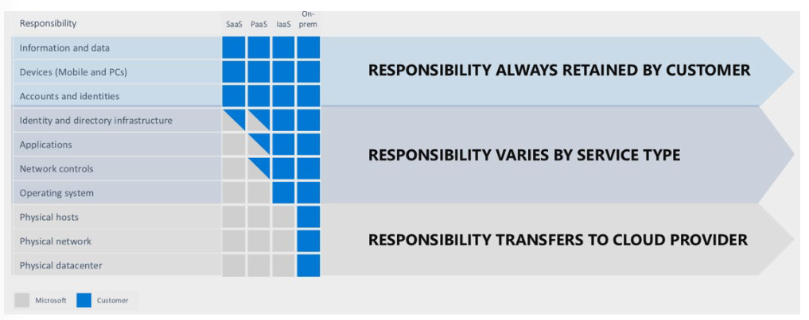

### IaaS İş Senaryoları
* **Test ve Geliştirme (Test and Development):** Ekipler test ve geliştirme ortamlarını hızlıca kurup kaldırabilir, yeni uygulamaları pazara daha hızlı sunabilir[cite: 1]. Dev-test ortamlarını ölçeklendirmek IaaS ile hızlı ve ekonomiktir[cite: 1].
* **Web Sitesi Barındırma (Website Hosting):** Web sitelerini IaaS kullanarak çalıştırmak geleneksel web barındırmadan daha ucuz olabilir[cite: 1].
* **Depolama, Yedekleme ve Kurtarma (Storage, Backup, and Recovery):** Kuruluşlar depolama için sermaye harcamalarından ve genellikle veri yönetimi ile yasal uyumluluk gereksinimlerini karşılamak için uzman bir kadro gerektiren depolama yönetiminin karmaşıklığından kaçınırlar[cite: 1]. Tahmin edilemeyen talepleri ve sürekli büyüyen depolama ihtiyaçlarını karşılamak için kullanışlıdır[cite: 1].
* **Yüksek Performanslı Hesaplama (High-Performance Computing - HPC):** Süper bilgisayarlar veya bilgisayar kümeleri üzerindeki HPC; deprem simülasyonları, iklim tahminleri, finansal modellemeler gibi milyonlarca değişken içeren karmaşık sorunları çözmeye yardımcı olur.
* **Büyük Veri Analizi (Big Data Analysis):** Değerli kalıplar ve eğilimler içeren devasa veri kümelerini işlemek muazzam bir işlem gücü gerektirir; IaaS bunu ekonomik olarak sağlar.
* **Genişletilmiş Veri Merkezi (Extended Datacenter):** Fiziksel konumunuza donanım veya alan ekleme maliyetine katlanmak yerine Azure'da sanal makineler ekleyerek veri merkezinize kapasite kazandırabilirsiniz. Fiziksel ağınızı Azure bulut ağına sorunsuz bir şekilde bağlayabilirsiniz.

---

## Sanal Makineleri Planlama (Plan Virtual Machines)

Azure'a VM sağlamak (provisioning) planlama gerektirir:
* **Ağ ile başlayın**
* **VM'yi adlandırın**
* **VM için konuma karar verin**
* **VM boyutunu belirleyin**
* **Fiyatlandırma modelini anlayın**
* **VM için depolama alanını seçin**
* **Bir işletim sistemi seçin**

### Ağ ile Başlayın (Start with the Network)
Sanal ağlar (VNets), Azure Sanal Makineleri ve diğer Azure hizmetleri arasında özel bağlantı sağlamak için kullanılır. Aynı sanal ağın parçası olan VM'ler ve hizmetler birbirine erişebilir. Varsayılan olarak sanal ağın dışındaki hizmetler içerideki hizmetlere bağlanamaz. Ancak ağ, şirket içi sunucularınız da dahil olmak üzere harici hizmetlere erişim sağlayacak şekilde yapılandırılabilir.

Ağ adresleri ve alt ağlar (subnets) bir kez kurulduktan sonra değiştirilmesi kolay değildir. Şirket özel ağınızı Azure hizmetlerine bağlamayı planlıyorsanız herhangi bir VM dağıtmadan önce topolojiyi dikkatlice değerlendirmelisiniz.

### VM'yi Adlandırın (Name the VM)
VM adı, işletim sisteminin bir parçası olarak yapılandırılan bilgisayar adı (computer name) olarak kullanılır. **Windows VM'de 15 karaktere**, **Linux VM'de 64 karaktere** kadar ad belirtebilirsiniz. Bu ad yönetilebilir bir Azure kaynağını tanımlar ve sonradan değiştirmek kolay değildir.

Tavsiye edilen adlandırma standardı bileşenleri:

| Eleman | Örnek | Notlar |
| :--- | :--- | :--- |
| **Ortam (Environment)** | dev, prod, QA | Kaynağın ortamını tanımlar (Geliştirme, Üretim vb.). |
| **Konum (Location)** | uw (US West), ue (US East) | Kaynağın dağıtıldığı bölgeyi tanımlar. |
| **Mimar/Örnek (Instance)** | 01, 02 | Birden fazla adlandırılmış örneğe sahip kaynaklar için (web sunucuları vb.). |
| **Ürün veya Hizmet** | service | Kaynağın desteklediği ürünü, uygulamayı veya hizmeti tanımlar. |
| **Rol (Role)** | sql, web, messaging | İlişkili kaynağın rolünü tanımlar. |

*Örnek:* `devusc-webvm01` adı, Güney Orta ABD konumunda barındırılan ilk geliştirme web sunucusunu temsil eder.

### VM Konumuna Karar Verin (Decide Location)
Azure, dünya çapında coğrafi bölgelere (`West US`, `North Europe`, `Southeast Asia` vb.) ayrılmış veri merkezlerine sahiptir. Bir VM dağıtırken kaynakların tahsis edileceği bölgeyi seçmelisiniz. Bölge, performansı artırmak ve yasal/uyumluluk gereksinimlerini karşılamak için VM'lerinizi kullanıcılarınıza mümkün olduğunca yakın yerleştirmenize olanak tanır.

* Her bölgede farklı donanımlar mevcuttur; bazı yapılandırmalar her bölgede bulunmayabilir.
* Bölgeler arasında fiyat farklılıkları vardır. İş yükünüz belirli bir konuma bağlı değilse, en düşük fiyatı bulmak için gerekli yapılandırmayı birden fazla bölgede kontrol etmek maliyet etkinliği sağlar.

### Fiyatlandırma Modellerini Anlayın (Pricing Options)
Her VM için aboneliğe yansıtılan iki ayrı maliyet vardır: **Hesaplama (Compute)** ve **Depolama (Storage)**.

* **Hesaplama Maliyetleri (Compute Costs):** Saatlik olarak fiyatlandırılır ancak dakika bazında faturalandırılır. VM durdurulduğunda ve serbest bırakıldığında (stopped/deallocated) donanım serbest kaldığı için hesaplama ücreti alınmaz. Linux örnekleri işletim sistemi lisans ücreti olmadığı için Windows'a göre daha ucuzdur.
* **Depolama Maliyetleri (Storage Costs):** VM'nin kullandığı diskler için ayrıca ücret alınır. VM durdurulsa/serbest bırakılsa bile disklerin kapladığı depolama alanı için ücret ödenmeye devam eder.

#### Hesaplama için Ödeme Seçenekleri:
1. **Tüketim Tabanlı (Consumption-based / Pay-As-You-Go):** İsteğe bağlı hesaplama kapasitesini saniye bazında ödersiniz. Kısa süreli, test/geliştirme veya kesintiye uğrayabilecek öngörülemeyen iş yükleri için uygundur.
2. **Rezerve Sanal Makine Örnekleri (Reserved Instances - RI):** Belirli bir bölgede 1 veya 3 yıllık önceden satın alma taahhüdüdür. Kullandıkça öde fiyatlandırmasına kıyasla %72'ye varan fiyat tasarrufu sağlar. VM'nin sürekli çalışması gerektiği veya bütçe öngörülebilirliğine ihtiyaç duyulduğu durumlar için idealdir.

---

## Sanal Makine Boyutunu Belirleme (Determine VM Sizing)

Azure, hesaplama, bellek ve depolama bileşenlerini farklı kombinasyonlarda sunan sanal makine serileri sunar:

| Seri | Amaç | Örnek Kullanım Alanı |
| :--- | :--- | :--- |
| **A** | Geliştirme/test için giriş seviyesi ekonomik VM'ler | Dev/test sunucuları, düşük trafikli web sunucuları, küçük veritabanları. |
| **B** | Ekonomik, patlamalı (burstable) VM'ler | Düşük trafikli web sunucuları, mikro hizmetler, derleme (build) sunucuları. |
| **D** | Genel amaçlı hesaplama (General purpose) | Kurumsal uygulamalar, ilişkisel veritabanları, bellek içi önbellekleme ve analitik. |
| **Dc** | Kullanımdaki verileri koruma (Confidential) | Veritabanlarında gizli sorgulama, güvenli çok taraflı makine öğrenimi algoritmaları. |
| **E** | Bellek içi (in-memory) optimize edilmiş uygulamalar | SAP HANA, SQL Hekaton ve diğer büyük bellek içi iş kritik iş yükleri. |
| **F** | Hesaplama odaklı (Compute optimized) | Toplu işlem (batch processing), web sunucuları, analitik ve oyun. |
| **G** | Bellek ve depolama odaklı | Büyük SQL ve NoSQL veritabanları, ERP, SAP ve veri ambarı çözümleri. |
| **H** | Yüksek Performanslı Hesaplama (HPC) | Akışkanlar dinamiği, sismik işleme, hava durumu modelleme, kuantum simülasyonu. |
| **L** | Depolama odaklı (Storage optimized) | Cassandra, MongoDB, Redis gibi NoSQL veritabanları; büyük tranzaksiyonel veritabanları. |
| **M / Mv2** | Devasa bellek odaklı | Muazzam paralellikte hesaplama gücü gerektiren SAP HANA ve devasa bellek içi sistemler. |
| **N** | GPU etkinleştirilmiş VM'ler | Simülasyon, derin öğrenme, grafik işleme, video düzenleme ve oyun. |

> **Yeniden Boyutlandırma (Resizing):** Mevcut boyut ihtiyaçları karşılamadığında VM durdurulup serbest bırakılarak (`deallocated`) aynı bölgede desteklenen herhangi bir yeni boyuta dönüştürülebilir. Üretim ortamlarında yeniden boyutlandırma yapılırken yeniden başlatma gerekeceği ve IP adresi gibi ayarların değişebileceği unutulmamalıdır.

---

## Sanal Makine Depolamasını Belirleme (Determine VM Storage)

Tüm Azure sanal makinelerinde en az iki disk bulunur: **İşletim Sistemi diski (OS Disk)** ve **Geçici disk (Temporary Disk)**. İsteğe bağlı olarak bir veya daha fazla **Veri diski (Data Disk)** eklenebilir. Tüm diskler VHD dosyaları olarak saklanır.

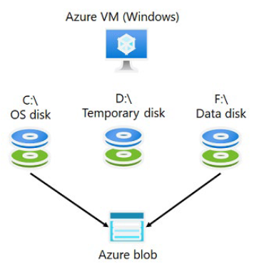

* **İşletim Sistemi Diski (OS Disk):** Önceden yüklü işletim sistemini barındırır. Varsayılan olarak SATA sürücüsü olarak kaydedilir ve Windows'ta `C:` sürücüsü olarak etiketlenir.
* **Geçici Disk (Temporary Disk):** Yönetilmeyen bir disktir. Uygulamalar için kısa süreli depolama sağlar (takas/pagefile dosyaları gibi). Bakım veya yeniden dağıtım (redeploy) sırasında bu diskteki veriler kaybolabilir.
  * Windows VM'lerde varsayılan olarak `D:` sürücüsüdür ve `pagefile.sys` için kullanılır.
  * Linux VM'lerde genellikle `/dev/sdb` cihazıdır ve `/mnt` konumuna bağlanır.
  * **Kritik verileri geçici diskte kesinlikle saklamayın!**
* **Veri Diskleri (Data Disks):** Uygulama verilerini saklamak için bağlanan yönetilen disklerdir. SCSI sürücüsü olarak kaydedilir. Her veri diski maksimum **4.095 GiB** kapasiteye sahip olabilir. Bağlanabilecek maksimum veri diski sayısı VM boyutuna bağlıdır.

### Depolama Türleri ve Yönetilen Diskler (Managed Disks)

1. **Yönetilmeyen Diskler (Unmanaged Disks):** VHD dosyalarının depolama hesaplarındaki (Storage Account) sayfa blob'larında (page blobs) manuel olarak yönetildiği eski yöntemdir.
2. **Yönetilen Diskler (Managed Disks):** Azure'un arka plandaki depolama hesabını, sayfa blob'larını ve kapsayıcıları soyutlayarak yönettiği sanal sabit disklerdir.
   * Kullanılabilir türler: **Ultra SSD**, **Premium SSD**, **Standard SSD** ve **Standard HDD**.
   * Tekil VM örneği (Single instance VM) için sunulan %99.95 SLA garantisi için **Yönetilen Diskler şarttır**.

---

## Portal Üzerinde Sanal Makine Oluşturma Adımları

Portal üzerinden VM oluştururken sırasıyla şu sekmeler yapılandırılır:

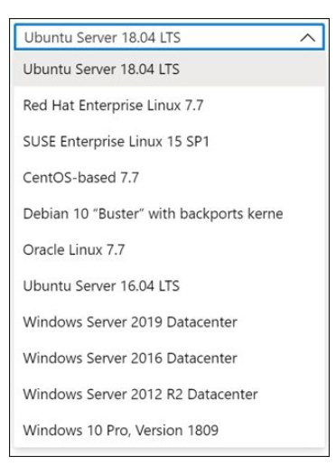

1. **Temel Bilgiler (Basic):** Proje detayları (Abonelik, Kaynak Grubu), VM Adı, Bölge, Görüntü (Image - Windows/Linux), Yönetici Hesabı ve Gelen Bağlantı Noktası Kuralları (Inbound port rules).
2. **Diskler (Disks):** İşletim sistemi disk türü (Standard/Premium SSD vb.), veri diskleri ekleme ve şifreleme ayarları.
3. **Ağ Oluşturma (Networking):** Sanal Ağ (VNet), Alt Ağ (Subnet), Genel IP (Public IP) ve Yük Dengeleme (Load Balancing) seçenekleri.
4. **Yönetim (Management):** İzleme (Monitoring), Otomatik Kapatma (Auto-shutdown) ve Yedekleme (Backup) politikaları.
5. **Gelişmiş (Advanced):** Sanal makine uzantıları (VM Extensions), özel veriler (custom data) veya `cloud-init` komut dosyaları ekleme.

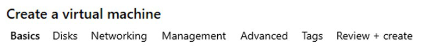

---

## Terraform İle Sanal Makine Dağıtımı Örneği

Aşağıdaki HCL kodu, bir Sanal Ağ, Alt Ağ, Ağ Arabirimi (NIC) ve Linux Sanal Makinesi (Ubuntu) ile ona bağlı bir Veri Diski (Data Disk) dağıtımını gerçekleştirir:

```hcl
# Kaynak Grubu
resource "azurerm_resource_group" "rg" {
  name     = "rg-compute-prod"
  location = "westeurope"
}

# Sanal Ağ ve Alt Ağ
resource "azurerm_virtual_network" "vnet" {
  name                = "vnet-prod-westeurope"
  address_space       = ["10.0.0.0/16"]
  location            = azurerm_resource_group.rg.location
  resource_group_name = azurerm_resource_group.rg.name
}

resource "azurerm_subnet" "subnet" {
  name                 = "snet-web-prod"
  resource_group_name  = azurerm_resource_group.rg.name
  virtual_network_name = azurerm_virtual_network.vnet.name
  address_prefixes     = ["10.0.1.0/24"]
}

# Ağ Arabirimi (NIC)
resource "azurerm_network_interface" "nic" {
  name                = "nic-prodwe-webvm01"
  location            = azurerm_resource_group.rg.location
  resource_group_name = azurerm_resource_group.rg.name

  ip_configuration {
    name                          = "internal"
    subnet_id                     = azurerm_subnet.subnet.id
    private_ip_address_allocation = "Dynamic"
  }
}

# Linux Sanal Makine (D2s_v5 Genel Amaçlı)
resource "azurerm_linux_virtual_machine" "vm" {
  name                = "prodwe-webvm01"
  resource_group_name = azurerm_resource_group.rg.name
  location            = azurerm_resource_group.rg.location
  size                = "Standard_D2s_v5"
  admin_username      = "azureuser"

  network_interface_ids = [
    azurerm_network_interface.nic.id,
  ]

  admin_ssh_key {
    username   = "azureuser"
    public_key = file("~/.ssh/id_rsa.pub")
  }

  os_disk {
    caching              = "ReadWrite"
    storage_account_type = "Premium_LRS"
  }

  source_image_reference {
    publisher = "Canonical"
    offer     = "0001-com-ubuntu-server-jammy"
    sku       = "22_04-lts"
    version   = "latest"
  }
}

# Yönetilen Veri Diski (Managed Data Disk)
resource "azurerm_managed_disk" "data_disk" {
  name                 = "disk-prodwe-webvm01-data01"
  location             = azurerm_resource_group.rg.location
  resource_group_name  = azurerm_resource_group.rg.name
  storage_account_type = "Premium_LRS"
  create_option        = "Empty"
  disk_size_gb         = 1024 # 1 TB Veri Diski
}

# Veri Diskini Sanal Makineye Bağlama (Attach)
resource "azurerm_virtual_machine_data_disk_attachment" "disk_attach" {
  managed_disk_id    = azurerm_managed_disk.data_disk.id
  virtual_machine_id = azurerm_linux_virtual_machine.vm.id
  lun                = "0"
  caching            = "ReadWrite"
}
```


# Sanal Makinelere Bağlanma (Connect to Virtual Machines)

## Giriş

Azure üzerindeki sanal makinelerinize (VM) erişmek ve onları yönetmek için kullanılan temel yöntemler aşağıda açıklanmıştır:

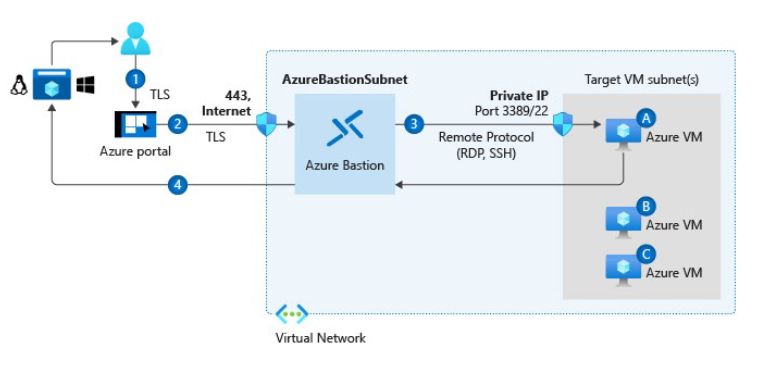

* **Windows Tabanlı Sanal Makineler:** Azure'da barındırılan Windows tabanlı VM'lere bağlanmak için Uzak Masaüstü Protokolü (**RDP - Remote Desktop Protocol**) istemcisi kullanılır[cite: 1]. Windows'un çoğu sürümü RDP desteğini yerel olarak içerir[cite: 1].
* **Linux Tabanlı Sanal Makineler:** Linux tabanlı bir VM'ye bağlanmak için **SSH (Secure Shell)** istemcisi gereklidir[cite: 1]. Örneğin PuTTY; SCP, SSH, Telnet gibi protokolleri destekleyen ücretsiz ve açık kaynaklı bir terminal emülatörüdür[cite: 1].
* **Bastion Bağlantıları (Azure Bastion):** Sanal ağınız (VNet) içinde dağıtılan, tamamen platform tarafından yönetilen bir PaaS hizmetidir[cite: 1]. Doğrudan Azure portalı üzerinden SSL kullanarak RDP/SSH bağlantısı sağlar[cite: 1]. 
  * **Önemli Avantajı:** Sanal makinelerinizin **genel IP adresine (Public IP) ihtiyacı yoktur**[cite: 1].
  * RDP/SSH bağlantı noktalarını (ports) dış dünyaya açmadan güvenli erişim imkanı sunar[cite: 1].
  * Ek bir istemci, ajan veya yazılıma ihtiyaç duyulmaz[cite: 1].

---

## Windows Sanal Makinelere Bağlanma

Windows VM'lerini işletim sistemi düzeyinde yönetmek için iki temel yöntem kullanılır:

### 1. Remote Desktop Protocol (RDP)
* Windows VM'lerde grafik kullanıcı arayüzü (GUI) oturumu başlatmayı sağlar[cite: 1].
* VM çalışır durumda olduğunda, genel/özel bir IP adresine sahipse ve **TCP 3389** portundan gelen trafiği kabul ediyorsa portal üzerindeki **Bağlan (Connect)** butonu etkinleşir[cite: 1].
* Butona tıklandığında otomatik olarak bir `.rdp` dosyası indirilir[cite: 1]. Dosya açıldığında bağlantı başlar[cite: 1].
* İsteğe bağlı olarak Azure PowerShell üzerindeki `Get-AzRemoteDesktopFile` cmdlet'i de kullanılabilir[cite: 1].

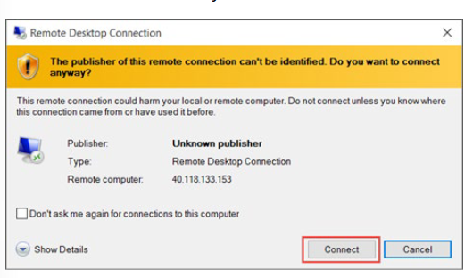

### 2. Windows Remote Management (WinRM)
* Komut satırı (CLI) oturumu kurmayı ve etkileşimli olmayan PowerShell komut dosyalarını çalıştırmayı sağlar[cite: 1].
* Sertifika kullanarak ek oturum güvenliği sağlar[cite: 1]. Sertifikalar Azure Key Vault üzerinde saklanabilir[cite: 1].
* **Varsayılan Port:** WinRM varsayılan olarak **TCP 5986** portunu kullanır[cite: 1]. Ağ Güvenlik Grubu (NSG) kurallarında bu portun engellenmediğinden emin olunmalıdır[cite: 1].

WinRM yapılandırmasının yüksek düzey adımları[cite: 1]:
1. Key Vault oluşturma[cite: 1].
2. Öz-imzalı (self-signed) sertifika üretme[cite: 1].
3. Sertifikayı Key Vault'a yükleme[cite: 1].
4. Yüklenen sertifikanın URL'sini belirleme[cite: 1].
5. Bu URL'yi Azure VM yapılandırmasında referans gösterme[cite: 1].

---

## Linux Sanal Makinelere Bağlanma

Linux VM oluştururken kimlik doğrulama yöntemi olarak **SSH Genel Anahtarı (Public Key)** veya **Parola (Password)** seçilebilir[cite: 1].

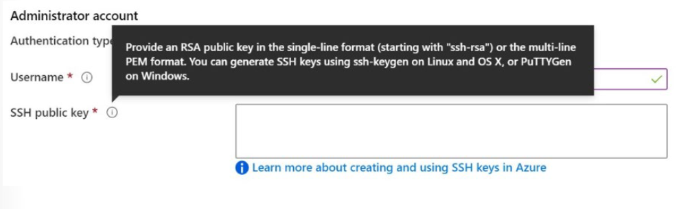

### SSH Bağlantıları
SSH, şifrelenmiş bir bağlantı protokolüdür ve varsayılan erişim yöntemidir[cite: 1]. Parola kullanımı kaba kuvvet (brute-force) saldırılarına açık olabileceği için **Açık-Özel Anahtar Çifti (Public-Private Key Pair)** kullanımı önerilir[cite: 1].

* **Açık Anahtar (Public Key):** Linux VM'ye yerleştirilir ve herkesle paylaşılabilir[cite: 1].
* **Özel Anahtar (Private Key):** Yerel sisteminizde kalır, kesinlikle paylaşılmamalı ve korunmalıdır[cite: 1].
* İstemci bağlandığında uzak VM, istemcinin özel anahtara sahip olup olmadığını doğrular ve erişim izni verir[cite: 1].
* Kurum güvenlik politikalarına bağlı olarak tek bir anahtar çifti birden fazla Azure VM'sinde yeniden kullanılabilir[cite: 1].

> **Gereksinim:** Azure, genel ve özel anahtarlar için en az **2048-bit** anahtar uzunluğu ve **SSH-RSA** biçimini şart koşar[cite: 1].

---

## Terraform Örneği: Azure Bastion Kurulumu

Sanal makinelerinizi dış dünyaya (Public IP) açmadan güvenli erişim sağlamak için Azure Bastion altyapısını kod olarak aşağıdaki şekilde dağıtabilirsiniz:

```hcl
# Bastion için Özel Alt Ağ (Adı mutlaka AzureBastionSubnet olmalıdır)
resource "azurerm_subnet" "bastion_subnet" {
  name                 = "AzureBastionSubnet"
  resource_group_name  = "rg-compute-prod"
  virtual_network_name = "vnet-prod-westeurope"
  address_prefixes     = ["10.0.2.0/26"] # Minimum /26 blok gereklidir
}

# Bastion için Public IP (Standard SKU şarttır)
resource "azurerm_public_ip" "bastion_pip" {
  name                = "pip-bastion-prod"
  location            = "westeurope"
  resource_group_name = "rg-compute-prod"
  allocation_method   = "Static"
  sku                 = "Standard"
}

# Azure Bastion Host Kaynağı
resource "azurerm_bastion_host" "bastion" {
  name                = "bastion-prod-westeurope"
  location            = "westeurope"
  resource_group_name = "rg-compute-prod"

  ip_configuration {
    name                 = "configuration"
    subnet_id            = azurerm_subnet.bastion_subnet.id
    public_ip_address_id = azurerm_public_ip.bastion_pip.id
  }
}
```


# Sanal Makine Yüksek Kullanılabilirliğini Yapılandırma (Configure Virtual Machine Availability)

## Giriş

### Senaryo
Ölçeklenebilir sanal makineleri (VM) yönetmek, özellikle kullanım kalıpları değiştiğinde ve uygulamalar üzerindeki talepler dalgalandığında zorlayıcı olabilir[cite: 1]. Sanal makine kaynaklarınızı değişen taleplere uyarlarken, uygulama kararlılığını sağlamak için VM yapılandırmalarını tutarlı tutmanız gerekir[cite: 1]. Bu durum, büyük bir VM koleksiyonunu sürekli çalıştırma maliyetlerini en aza indirirken bant genişliğini ve yanıt verme hızını korumanızı sağlar[cite: 1].

Şirket web siteniz sanal makineler kullanmakta ve büyük iş yüklerini yönetmektedir[cite: 1]. BT departmanı, VM'lerin iş yükündeki artış ve azalışlara dinamik olarak uyum sağlamasını ve yüksek kullanılabilirlik sağlayan bir iş sürekliliği planının bulunmasını istemektedir[cite: 1]. Bu doğrultuda **Sanal Makine Ölçeklendirme Kümeleri (Virtual Machine Scale Sets)** ve **Otomatik Ölçeklendirme (Autoscale)** kullanılacaktır[cite: 1].

### Ölçülen Yetenekler (Skills Measured)
Sanal makinelerin yüksek kullanılabilirliği ve ölçeklenmesi **Exam AZ-104: Microsoft Azure Administrator** sınavının bir parçasıdır[cite: 1].
* **Azure Hesaplama Kaynaklarını Dağıtma ve Yönetme (%20–25)**[cite: 1]
* **VM'leri Yapılandırma:**[cite: 1]
  * Yüksek kullanılabilirliği (High Availability) yapılandırma[cite: 1].
  * Ölçeklendirme kümelerini (Scale Sets) dağıtma ve yapılandırma[cite: 1].

### Öğrenme Hedefleri
Bu modülde şunları öğreneceksiniz:
* Kullanılabilirlik Kümeleri (Availability Sets) ve Kullanılabilirlik Alanlarını (Availability Zones) uygulama[cite: 1].
* Güncelleme (Update) ve Hata (Fault) etki alanlarını uygulama[cite: 1].
* Sanal Makine Ölçeklendirme Kümelerini (VMSS) uygulama[cite: 1].
* Sanal makineleri otomatik ölçeklendirme (Autoscale)[cite: 1].

---

## Bakım ve Kesinti Sürelerini Planlama (Plan for Maintenance and Downtime)

Azure üzerinde sanal makinelerinizi etkileyebilecek üç temel senaryo bulunmaktadır:

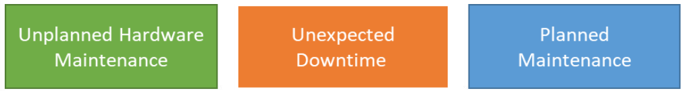

1. **Planlanmamış Donanım Bakımı (Unplanned Hardware Maintenance):** Azure platformu, bir fiziksel makineye bağlı donanımın arızalanacağını öngördüğünde gerçekleşir[cite: 1]. Azure, VM'leri arızalı donanımdan sağlıklı bir makineye taşımak için **Live Migration (Canlı İletim)** teknolojisini kullanır[cite: 1]. Bu işlem VM'yi durdurmaz, yalnızca kısa süreliğine duraklatır[cite: 1].
2. **Beklenmeyen Kesinti Süresi (Unexpected Downtime):** Donanım veya fiziksel altyapı aniden arızalandığında yaşanır (yerel disk, ağ veya raf düzeyindeki arızalar)[cite: 1]. Azure, VM'yi otomatik olarak aynı veri merkezindeki sağlıklı bir sunucuya taşır (healing)[cite: 1]. Bu süreçte VM yeniden başlatılır (reboot) ve **geçici diskteki (temporary drive) veriler kaybolabilir**[cite: 1].
3. **Planlanmış Bakım (Planned Maintenance):** Microsoft'un altyapı güvenilirliğini, performansını ve güvenliğini artırmak için yaptığı periyodik güncellemelerdir[cite: 1]. Güncellemelerin çoğu VM'leri etkilemeden arka planda tamamlanır[cite: 1].

> **Not:** Microsoft, VM içerisindeki işletim sistemini veya yazılımları otomatik olarak güncellemez; bu sorumluluk tamamen kullanıcıya aittir[cite: 1]. Ancak alttaki fiziksel konakçı (host) ve donanım periyodik olarak yamalanır[cite: 1].

---

## Kullanılabilirlik Kümelerini Kurma (Setup Availability Sets)

Kullanılabilirlik Kümesi (Availability Set), ilişkili VM'lerin aynı anda tek bir arıza noktasına (single point of failure) maruz kalmamasını ve konakçı işletim sistemi güncellenirken hepsinin aynı anda yeniden başlatılmamasını sağlayan mantıksal bir özelliktir[cite: 1].

Azure, aynı Kullanılabilirlik Kümesine yerleştirilen VM'lerin farklı fiziksel sunuculara, işlem raflarına, depolama birimlerine ve ağ anahtarlarına dağıtılmasını sağlar[cite: 1]. Bir donanım veya yazılım arızası durumunda VM'lerinizin yalnızca bir kısmı etkilenir, uygulamanız çalışmaya devam eder[cite: 1].

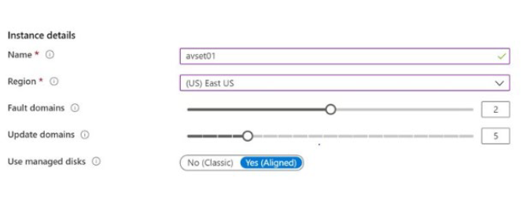

### Genel İlkeler:
* Yedeklilik için bir Kullanılabilirlik Kümesinde birden fazla VM yapılandırın[cite: 1].
* Her uygulama katmanını (ör. Web, Veritabanı) ayrı Kullanılabilirlik Kümelerine yerleştirin[cite: 1].
* Kullanılabilirlik Kümelerini bir Yük Dengeleyici (Load Balancer) ile birleştirin[cite: 1].
* Sanal makinelerde **Yönetilen Diskler (Managed Disks)** kullanın[cite: 1].

> **SLA Garantileri:**
> * **Availability Zones (Kullanılabilirlik Alanları):** Aynı bölgede 2 veya daha fazla alana dağıtılmış 2+ VM için en az **%99.99** erişilebilirlik[cite: 1].
> * **Availability Sets (Kullanılabilirlik Kümeleri):** Aynı kümedeki 2+ VM için en az **%99.95** erişilebilirlik[cite: 1].
> * **Tekil VM (Single Instance):** Tüm disklerinde Premium SSD kullanılan tekil VM'ler için en az **%99.9** erişilebilirlik[cite: 1].

---

## Güncelleme ve Hata Etki Alanları (Update and Fault Domains)

Kullanılabilirlik kümesindeki her VM, bir Güncelleme Etki Alanı (Update Domain) ve Hata Etki Alanına (Fault Domain) atanır[cite: 1].

* **Güncelleme Etki Alanı (Update Domain - UD):** Hizmet güncellemesi (rollout) sırasında **birlikte güncellenen ve yeniden başlatılan** düğüm grubudur[cite: 1]. Planlı bakımlarda aynı anda yalnızca bir UD yeniden başlatılır[cite: 1]. Varsayılan olarak 5 adet bulunur, en fazla **20'ye kadar** yapılandırılabilir[cite: 1].
* **Hata Etki Alanı (Fault Domain - FD):** Tek bir arıza noktasını paylaşan **fiziksel donanım birimidir** (örneğin aynı güç ve ağ anahtarını paylaşan bir sunucu rafı)[cite: 1]. Bir kümedeki VM'ler en az iki hata etki alanına dağıtılır[cite: 1]. Bu yapı donanım ve güç kesintilerine karşı koruma sağlar[cite: 1].

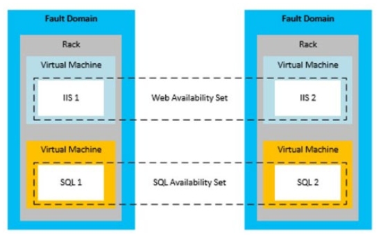

---

## Kullanılabilirlik Alanları (Availability Zones)

Kullanılabilirlik Alanları, uygulamalarınızı ve verilerinizi veri merkezi arızalarından koruyan yüksek kullanılabilirlik seçeneğidir[cite: 1].

* Bir Azure bölgesindeki benzersiz, bağımsız fiziksel konumlardır[cite: 1].
* Her alan; bağımsız güç, soğutma ve ağ altyapısına sahip bir veya daha fazla veri merkezinden oluşur[cite: 1].
* Desteklenen bölgelerde en az **3 ayrı alan** bulunur[cite: 1].
* Bir bölgedeki Availability Zones kombinasyonu, doğası gereği hem Hata hem de Güncelleme Etki Alanı işlevi görür[cite: 1].

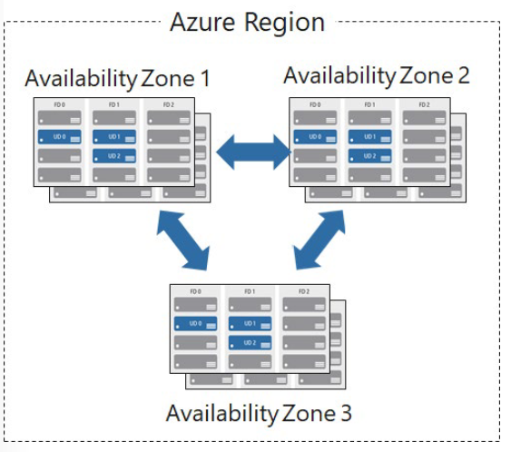

### Hizmet Türleri:
* **Zonal Services (Alana Özgü Hizmetler):** Kaynağı belirli bir alana sabitler (ör. VM'ler, Yönetilen Diskler, Standart IP'ler)[cite: 1].
* **Zone-Redundant Services (Alan Derecesinde Yedekli Hizmetler):** Platform, veriyi alanlar arasında otomatik olarak çoğaltır (ör. Zone-redundant storage, SQL Database)[cite: 1].

---

## Dikey ve Yatay Ölçeklendirmeyi Karşılaştırma

| Özellik | Dikey Ölçeklendirme (Vertical Scaling - Scale Up / Down) | Yatay Ölçeklendirme (Horizontal Scaling - Scale Out / In) |
| :--- | :--- | :--- |
| **Tanım** | Mevcut VM'nin boyutunu (CPU, RAM) artırma veya azaltma[cite: 1]. | Çalışan VM örneklerinin (instance) sayısını artırma veya azaltma[cite: 1]. |
| **Esneklik** | Donanım üst sınırlarına tabidir, bölgesel sınırlar içerir[cite: 1]. | Bulut ortamında binlerce VM'ye kadar çok daha esnektir[cite: 1]. |
| **Kesinti Durumu** | Genellikle VM'nin durdurulmasını ve yeniden başlatılmasını gerektirir[cite: 1]. | VM eklendiğinde/çıkarıldığında mevcut sistemde kesinti yaşanmaz[cite: 1]. |
| **Kullanım Alanı** | Dönemsel yük değişimlerinde tekil sunucu kapasitesini değiştirme[cite: 1]. | Büyük ölçekli, otomatik ölçeklendirme gerektiren dinamik iş yükleri[cite: 1]. |

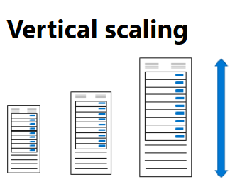

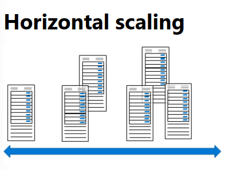

---

## Sanal Makine Ölçeklendirme Kümeleri (Virtual Machine Scale Sets - VMSS)

VMSS, özdeş VM'lerden oluşan bir grubu dağıtmak ve yönetmek için kullanılan bir Azure hesaplama kaynağıdır[cite: 1]. Gerçek otomatik ölçeklendirmeyi (autoscale) destekler[cite: 1]. Özel bir imaj kullanılıyorsa **600**, standart Azure imajları kullanılıyorsa **1.000 VM örneğine** kadar ölçeklenebilir[cite: 1].

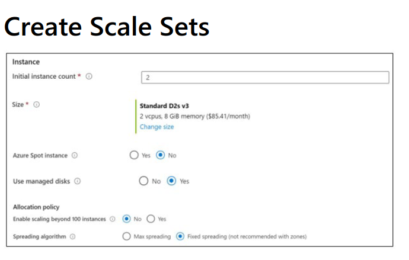

### Öne Çıkan Özellikler:
* **Spot Instances:** Azure'un boşta kalan hesaplama kapasitesini düşük maliyetle kullanma imkanı sunar[cite: 1].
* **Yük Dengeleme:** Katman-4 trafiği için Azure Load Balancer, Katman-7 trafiği ve SSL sonlandırma için Azure Application Gateway entegrasyonu sunar[cite: 1].
* **Placement Groups:** 100 sınırının üzerine çıkmak için birden fazla yerleşim grubu (placement groups) etkinleştirilebilir[cite: 1].

---

## Otomatik Ölçeklendirmeyi Yapılandırma (Autoscale)

VMSS, belirlenen kurallara ve eşik değerlerine göre kapasiteyi dinamik olarak ayarlar[cite: 1].

* **Minimum VM Sayısı:** Ölçek kümesinin düşebileceği alt sınır[cite: 1].
* **Maksimum VM Sayısı:** Ölçek kümesinin çıkabileceği üst sınır[cite: 1].
* **Scale Out (Dışa Ölçekleme):** CPU kullanımı belirlenen eşik değerini (ör. %70) aştığında yeni VM örnekleri eklenir[cite: 1].
* **Scale In (İçe Ölçekleme):** Yük azaldığında ve CPU kullanımı alt eşik değerinin (ör. %30) altına düştüğünde fazla VM örnekleri kaldırılır[cite: 1].
* **Zamanlanmış Etkinlikler (Schedule Events):** Belirli gün veya saatlerde kapasiteyi otomatik artırma/azaltma kuralları tanımlanabilir[cite: 1].

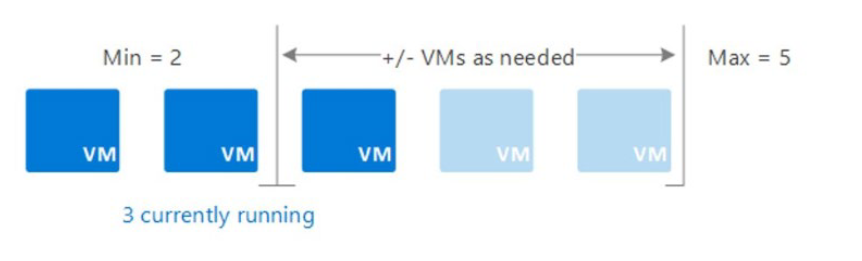

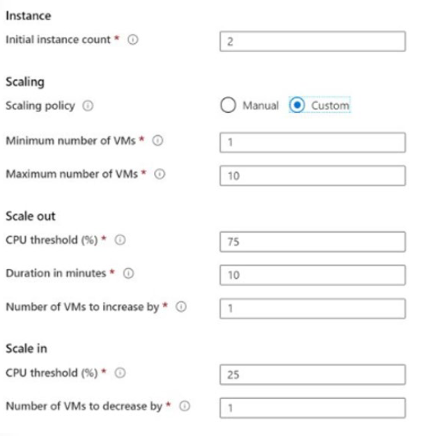

---

## Terraform İle VMSS Ve Autoscale Yapılandırma Örneği

Aşağıdaki HCL kodu, bir Sanal Makine Ölçeklendirme Kümesi (VMSS) ve buna bağlı CPU kullanımına dayalı Otomatik Ölçeklendirme (Autoscale) kuralını tanımlamaktadır:

```hcl
# Kaynak Grubu
resource "azurerm_resource_group" "rg" {
  name     = "rg-scale-prod"
  location = "westeurope"
}

# Sanal Ağ ve Alt Ağ
resource "azurerm_virtual_network" "vnet" {
  name                = "vnet-scale-prod"
  address_space       = ["10.0.0.0/16"]
  location            = azurerm_resource_group.rg.location
  resource_group_name = azurerm_resource_group.rg.name
}

resource "azurerm_subnet" "subnet" {
  name                 = "snet-vmss"
  resource_group_name  = azurerm_resource_group.rg.name
  virtual_network_name = azurerm_virtual_network.vnet.name
  address_prefixes     = ["10.0.1.0/24"]
}

# Linux Virtual Machine Scale Set
resource "azurerm_linux_virtual_machine_scale_set" "vmss" {
  name                = "vmss-web-prod"
  resource_group_name = azurerm_resource_group.rg.name
  location            = azurerm_resource_group.rg.location
  sku                 = "Standard_D2s_v5"
  instances           = 2 # Başlangıç örnek sayısı

  admin_username      = "azureuser"
  admin_ssh_key {
    username   = "azureuser"
    public_key = file("~/.ssh/id_rsa.pub")
  }

  source_image_reference {
    publisher = "Canonical"
    offer     = "0001-com-ubuntu-server-jammy"
    sku       = "22_04-lts"
    version   = "latest"
  }

  os_disk {
    storage_account_type = "Premium_LRS"
    caching              = "ReadWrite"
  }

  network_interface {
    name    = "nic-vmss"
    primary = true

    ip_configuration {
      name      = "ipconfig"
      primary   = true
      subnet_id = azurerm_subnet.subnet.id
    }
  }
}

# Otomatik Ölçeklendirme (Autoscale) Ayarları
resource "azurerm_monitor_autoscale_setting" "autoscale" {
  name                = "autoscale-cpu-rule"
  resource_group_name = azurerm_resource_group.rg.name
  location            = azurerm_resource_group.rg.location
  target_resource_id  = azurerm_linux_virtual_machine_scale_set.vmss.id

  profile {
    name = "defaultProfile"

    capacity {
      default = 2
      minimum = 2
      maximum = 10
    }

    # Scale Out Kuralı (CPU > %70 ise 1 VM Ekle)
    rule {
      metric_trigger {
        metric_name        = "Percentage CPU"
        metric_resource_id = azurerm_linux_virtual_machine_scale_set.vmss.id
        time_grain         = "PT1M"
        statistic          = "Average"
        time_window        = "PT5M"
        time_aggregation   = "Average"
        operator           = "GreaterThan"
        threshold          = 70
      }

      scale_action {
        direction = "Increase"
        type      = "ChangeCount"
        value     = "1"
        cooldown  = "PT5M"
      }
    }

    # Scale In Kuralı (CPU < %30 ise 1 VM Çıkar)
    rule {
      metric_trigger {
        metric_name        = "Percentage CPU"
        metric_resource_id = azurerm_linux_virtual_machine_scale_set.vmss.id
        time_grain         = "PT1M"
        statistic          = "Average"
        time_window        = "PT5M"
        time_aggregation   = "Average"
        operator           = "LessThan"
        threshold          = 30
      }

      scale_action {
        direction = "Decrease"
        type      = "ChangeCount"
        value     = "1"
        cooldown  = "PT5M"
      }
    }
  }
}
```


# Sanal Makine Uzantılarını Yapılandırma (Configure Virtual Machine Extensions)

## Giriş

### Senaryo
Şirketiniz, sanal makinelerin (VM) güncel tutulmasını sağlamak amacıyla çok sayıda komut dosyası (script) ve süreç oluşturmuştur. Bu komut dosyaları ayrıca çeşitli yapılandırma görevlerini de yürütmektedir. Yapılandırma sapmalarını (configuration drift) önlemek ve bu süreci otomatikleştirmek için sanal makine uzantılarını (VM extensions) kullanmanız gerekmektedir.

### Ölçülen Yetenekler (Skills Measured)
Sanal makine dağıtımlarının otomatikleştirilmesi **Exam AZ-104: Microsoft Azure Administrator** sınavının bir parçasıdır.
* **Azure Hesaplama Kaynaklarını Dağıtma ve Yönetme (%20–25)**
* **Azure Resource Manager (ARM) şablonları veya otomasyon araçları kullanarak sanal makine (VM) dağıtımlarını otomatikleştirme:**
  * Sanal makine uzantılarını dağıtma (Deploy virtual machine extensions).

### Öğrenme Hedefleri
Bu modülde şunları öğreneceksiniz:
* Sanal makine uzantılarının özelliklerini ve kullanım alanlarını belirleme.
* Özel komut dosyası uzantılarının (Custom Script Extension) özelliklerini ve kullanım alanlarını belirleme.
* İstenen Durum Yapılandırmasının (Desired State Configuration - DSC) özelliklerini ve kullanım alanlarını belirleme.

### Önkoşullar
Bulunmamaktadır.

---

## Sanal Makine Uzantılarını Uygulama (Implement Virtual Machine Extensions)

Azure VM uzantıları, dağıtım sonrasında Azure VM'lerinde yapılandırma ve otomasyon görevlerini yürüten küçük uygulamalardır. Örneğin, bir sanal makinede yazılım kurulumu, antivirüs koruması veya VM içinde bir yapılandırma komut dosyasının çalıştırılması gerektiğinde VM uzantıları kullanılır.

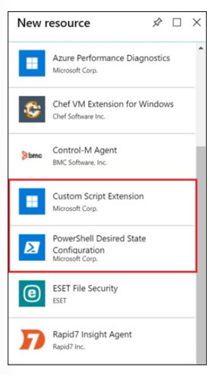

### Genel Özellikler:
* **Yönetim Yöntemleri:** Azure CLI, PowerShell, Azure Resource Manager (ARM) şablonları, Terraform ve Azure portal üzerinden yönetilebilir.
* **Dağıtım Zamanlaması:** Yeni bir VM dağıtımına dahil edilebileceği gibi, çalışan mevcut bir sistem üzerinde post-deployment (dağıtım sonrası) olarak da çalıştırılabilir.
* **İşletim Sistemi Desteği:** Windows ve Linux makineler için farklı uzantılar ile zengin birinci ve üçüncü taraf uzantı seçenekleri mevcuttur.

---

## Özel Komut Dosyası Uzantılarını Uygulama (Implement Custom Script Extensions)

Özel Komut Dosyası Uzantısı (CSE - Custom Script Extension), VM yapılandırması sonrasında özelleştirme görevlerini otomatik olarak başlatmak ve yürütmek için kullanılır. VM'yi durdurmak gibi basit görevlerden, yazılım bileşeni yükleme veya karmaşık görev dizilerini çalıştırmaya kadar geniş bir yelpazede kullanılabilir.

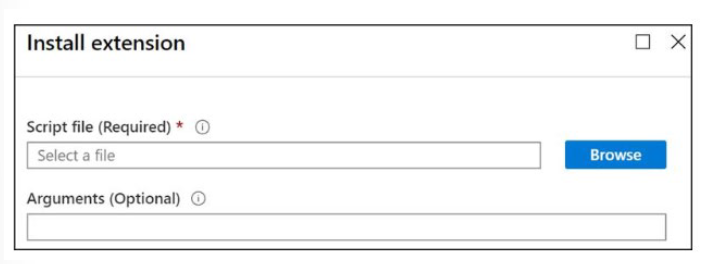

### Yükleme ve Çalıştırma Yöntemleri:
* **Azure Portal:** Sanal makinenin **Extensions** (Uzantılar) sekmesinden bir PowerShell/Bash komut dosyası yüklenerek çalıştırılır. İsteğe bağlı olarak parametreler verilebilir.
* **PowerShell:** `Set-AzVmCustomScriptExtension` komutu ile bir Blob konteynerindeki komut dosyası tetiklenebilir:

```powershell
Set-AzVmCustomScriptExtension -FileUri [https://scriptstore.blob.core.windows.net/scripts/Install_IIS.ps1](https://scriptstore.blob.core.windows.net/scripts/Install_IIS.ps1) `
  -Run "PowerShell.exe" `
  -VmName vmName `
  -ResourceGroupName resourceGroup `
  -Location "location"

```


Terraform İle Sanal Makine Uzantısı (CSE) Dağıtımı Örneği

Aşağıdaki HCL kodu, bir Windows Sanal Makinesine azurerm_virtual_machine_extension kaynağı kullanarak IIS web sunucusunu otomatik kuran bir PowerShell komut dosyasını uzantı olarak tanımlar:

```hcl
# Sanal Makine Özel Komut Dosyası Uzantısı (Custom Script Extension)
resource "azurerm_virtual_machine_extension" "iis_extension" {
  name                 = "InstallIIS"
  virtual_machine_id   = "/subscriptions/.../virtualMachines/prodwe-webvm01"
  publisher            = "Microsoft.Compute"
  type                 = "CustomScriptExtension"
  type_handler_version = "1.10"

  # Çalıştırılacak PowerShell Komutu
  settings = <<SETTINGS "commandToExecute": "powershell.exe -ExecutionPolicy -IncludeManagementTools" -Name Install-WindowsFeature SETTINGS Unrestricted Web-Server ``` environment="production" tags="{" { }>
```


