# Modül 9: Azure PaaS Hesaplama Seçeneklerini Yönetme (Administer PaaS Compute Options)

## Giriş

### Senaryo
Bir web uygulamasını ölçeklendirebilmek şu nedenlerle kritik önem taşır:
* **Yanıt Verebilirlik:** Yüksek talep dönemlerinde uygulamanın kesintisiz ve hızlı yanıt vermesini sağlar.
* **Maliyet Tasarrufu:** Talep düştüğünde kullanılan kaynakları azaltarak maliyet tasarrufu sağlar.

Büyük bir otel zincirinde çalıştığınızı varsayın. Müşterilerin rezervasyon yaptığı ve geçmiş rezervasyon detaylarını görüntülediği bir web siteniz var. Yaz tatili dönemlerinde otel aramaları arttığı için trafik büyürken, diğer dönemlerde trafik düşmektedir. Bu tahmin edilebilir kalıpları karşılamak için sistemi dikey (scale up/down) ve yatay (scale in/out) olarak ölçeklendirmeniz gerekir. Ölçeklendirme seçenekleriniz seçtiğiniz **App Service Planı**'na bağlıdır.

### Ölçülen Yetenekler (Skills Measured)
App Service planları ve ölçeklendirme, **Exam AZ-104: Microsoft Azure Administrator** sınavının bir parçasıdır.
* **Azure Hesaplama Kaynaklarını Dağıtma ve Yönetme (%20–25)**
* **Azure App Service Oluşturma ve Yapılandırma:**
  * App Service planı oluşturma.
  * Bir App Service planında ölçeklendirme ayarlarını yapılandırma.

### Öğrenme Hedefleri
Bu modülde şunları öğreneceksiniz:
* Azure App Service özelliklerini ve kullanım senaryolarını belirleme.
* Uygun bir Azure App Service planı fiyatlandırma katmanı seçme.
* App Service Planını dikey ölçeklendirme (Scale Up).
* App Service Planını yatay ölçeklendirme (Scale Out).

### Önkoşullar
Bulunmamaktadır.

---

## Azure App Service Planlarını Uygulama (Implement Azure App Service Plans)

App Service üzerinde çalışan her uygulama bir **App Service Planı** içinde çalışır. App Service planı, web uygulamasının çalışması için gereken sanal hesaplama kaynakları kümesini tanımlar (geleneksel web barındırmadaki sunucu çiftliklerine / server farm benzer). Birden fazla uygulama aynı plan içinde çalışabilir.

Belirli bir bölgede (örneğin *West Europe*) bir App Service planı oluşturulduğunda, ilgili bölgede hesaplama kaynakları tahsis edilir. Her App Service planı şunları tanımlar:
* **Bölge (Region):** *West US*, *East US*, *West Europe* vb.
* **VM Örnek Sayısı (Number of VM instances):** Çalışacak sunucu adedi.
* **VM Örnek Boyutu (Size of VM instances):** *Small*, *Medium*, *Large* vb.

### Uygulamanın Çalışma ve Ölçeklenme Mantığı
* **Free & Shared Katmanları:** Uygulama, paylaşımlı bir VM örneği üzerinde CPU dakikası alır ve yatay ölçekleme (Scale Out) yapamaz.
* **Diğer Katmanlar:** Uygulama, planda yapılandırılan tüm VM örnekleri üzerinde eşzamanlı olarak çalışır. Aynı plan içerisindeki tüm uygulamalar, tüm deployment slot'lar (dağıtım yuvaları), WebJob'lar ve teşhis günlükleri (diagnostic logs) aynı VM örneklerinin CPU ve bellek kaynaklarını paylaşır.
* **Ölçek Birimi (Scale Unit):** App Service planı ölçekleme birimidir. Plan 5 VM örneğine ölçeklendiğinde, plandaki tüm uygulamalar 5 örnek üzerinde çalışır.

> **Mimari İzolasyon Kararı:** Tek bir plana birden fazla uygulama koymak maliyet tasarrufu sağlar. Ancak bir planı aşırı yüklemek tüm uygulamalarda kesintiye yol açabilir. Şu durumlarda uygulama **yeni bir App Service planına izole edilmelidir**:
> * Uygulama yüksek kaynak tüketiyorsa (Resource-intensive).
> * Uygulamanın diğer uygulamalardan bağımsız ölçeklenmesi gerekiyorsa.
> * Uygulamanın farklı bir coğrafi bölgede çalışması gerekiyorsa.

---

## App Service Planı Fiyatlandırma Katmanları (Pricing Tiers)

| Fiyatlandırma Katmanı | Kullanım Amacı | Uygulama Sayısı | Disk Alanı | Otomatik Ölçekleme (Auto Scale) | Dağıtım Yuvaları (Slots) | Maksimum Örnek (Max Instances) |
| :--- | :--- | :--- | :--- | :--- | :--- | :--- |
| **Free** | Dev / Test | 10 | 1 GB | Desteklenmez | - | - |
| **Shared** | Dev / Test | 100 | 1 GB | Desteklenmez | - | - |
| **Basic** | Ayrılmış (Dedicated) Dev/Test | Sınırsız | 10 GB | Desteklenmez | - | 3 örneğe kadar |
| **Standard** | Üretim İş Yükleri (Production) | Sınırsız | 50 GB | Desteklenir | 5 | 10 örneğe kadar |
| **Premium** | Gelişmiş Ölçek & Performans | Sınırsız | 250 GB | Desteklenir | 20 | 30 örneğe kadar |
| **Isolated** | Yüksek Performans, Güvenlik & İzolasyon | Sınırsız | 1 TB | Desteklenir | 20 | 100 örneğe kadar |

### Katman Özellikleri:
* **Free & Shared:** Diğer müşterilerle paylaşımlı Azure VM'leri üzerinde çalışır. SLA garantisi yoktur.
* **Basic:** Düşük trafikli uygulamalar içindir. Otomatik ölçekleme içermez. Yerleşik ağ yük dengelemesini destekler.
* **Standard:** Canlı ortam (production) iş yükleri içindir. Trafiğe göre otomatik ölçekleme (Auto Scale) ve staging slot desteği içerir.
* **Premium (v2/v3):** Daha hızlı işlemciler (Dv2 serisi), SSD depolama ve yüksek RAM/Çekirdek oranı sunar.
* **Isolated:** Özel bir sanal ağ (VNet) içinde tamamen izole edilmiş bir ortamda (**App Service Environment - ASE**) çalışır. Kritik ve yüksek güvenlik gerektiren uygulamalar içindir.

---

## Dikey ve Yatay Ölçeklendirme (Scale Up & Scale Out)

* **Scale Up (Dikey Ölçekleme):** Fiyatlandırma katmanını değiştirerek daha fazla CPU, RAM, disk alanı, özel etki alanı (Custom Domain), SSL sertifikası veya staging slot elde etmektir. Örneğin, uygulamayı *Free* katmanında test edip *Shared* katmanında özel DNS ekleyebilir, SSL bağlamak için *Basic* katmanına, staging slot'lar için *Standard* katmanına geçirebilirsiniz.
* **Scale Out (Yatay Ölçekleme):** Uygulamayı çalıştıran VM örneklerinin sayısını artırmaktır (katmana bağlı olarak 10, 30 veya 100 örneğe kadar). Manuel veya belirlenen kurallara/zamanlamalara göre otomatik (**Autoscale**) yapılabilir.

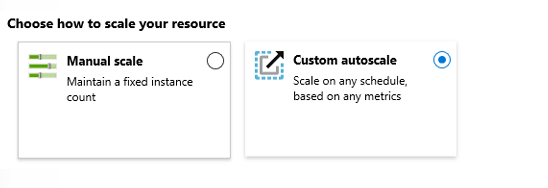

> **Önemli Notlar:**
> * Ölçeklendirme ayarları saniyeler içinde uygulanır ve plandaki tüm uygulamaları etkiler; kod değişikliği veya yeniden dağıtım gerektirmez.
> * Uygulamanın kullandığı Azure SQL veya Azure Storage gibi bağımlı kaynaklar App Service planından bağımsız olarak ayrıca ölçeklendirilmelidir.

---

## Otomatik Ölçeklendirmeyi Yapılandırma (Autoscale)

Autoscale ayarları profil ve kurallardan oluşur. Kurallar bir tetikleyici (trigger) ve bir ölçekleme eylemi (scale action) içerir:

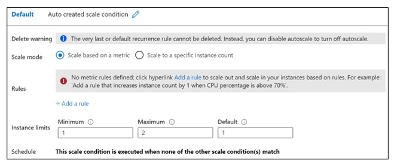

1. **Metrik Tabanlı (Metric-based):** Yükü ölçerek ölçekleme yapar. Örneğin: *"CPU kullanımı 5 dakik boyunca %50'nin üzerindeyse 1 örnek ekle"*. Metriğe örnek olarak CPU süresi, Ortalama Yanıt Süresi (Average Response Time) ve İstek Sayısı (Requests) verilebilir.
2. **Zaman Tabanlı (Time-based / Schedule-based):** Öngörülen trafik kalıplarına göre belirli zamanlarda ölçekleme yapar. Örneğin: *"Cumartesi günleri saat 08:00'de örnek sayısını artır"*.


### En İyi Uygulama (Best Practice) İlkeleri:
* Minimum örnek sayısı uygulamanın sıfır yük altında bile her zaman çalışır durumda olmasını sağlar.
* Maksimum örnek sayısı saatlik toplam maliyet sınırınızı belirler.
* Minimum ve maksimum değerlerin birbirinden farklı olduğundan ve aralarında yeterli marj bulunduğundan emin olun.
* Her zaman hem **Scale-out** (artırma) hem de **Scale-in** (azaltma) kurallarını birlikte tanımlayın.
* Metriklerin ulaşılamadığı durumlar için güvenli bir **Varsayılan Örnek Sayısı (Default Instance Count)** belirleyin.
* Autoscale olayları için e-posta veya Webhook bildirimlerini yapılandırın.

---

## Terraform Uygulama Örneği

Aşağıdaki HCL kodu, **Standard (S1)** katmanında bir Linux App Service Planı, buna bağlı bir Web App ve CPU kullanımına göre otomatik ölçeklendirme (Autoscale) kuralını tanımlar:

```hcl
# Kaynak Grubu
resource "azurerm_resource_group" "rg" {
  name     = "rg-paas-prod"
  location = "westeurope"
}

# App Service Plan (Standard S1 Katmanı - Production)
resource "azurerm_service_plan" "app_plan" {
  name                = "asp-web-prod-we"
  resource_group_name = azurerm_resource_group.rg.name
  location            = azurerm_resource_group.rg.location
  os_type             = "Linux"
  sku_name            = "S1"
}

# Linux Web App
resource "azurerm_linux_web_app" "web_app" {
  name                = "app-hotel-booking-prod-001"
  resource_group_name = azurerm_resource_group.rg.name
  location            = azurerm_resource_group.rg.location
  service_plan_id     = azurerm_service_plan.app_plan.id

  site_config {
    always_on = true
    application_stack {
      node_version = "18-lts"
    }
  }
}

# App Service Plan Otomatik Ölçeklendirme Kuralı
resource "azurerm_monitor_autoscale_setting" "app_autoscale" {
  name                = "autoscale-asp-hotel"
  resource_group_name = azurerm_resource_group.rg.name
  location            = azurerm_resource_group.rg.location
  target_resource_id  = azurerm_service_plan.app_plan.id

  profile {
    name = "DefaultProfile"

    capacity {
      default = 2
      minimum = 2
      maximum = 10
    }

    # Scale-Out Rule: CPU > %70 ise 1 örnek artır
    rule {
      metric_trigger {
        metric_name        = "CpuPercentage"
        metric_resource_id = azurerm_service_plan.app_plan.id
        time_grain         = "PT1M"
        statistic          = "Average"
        time_window        = "PT5M"
        time_aggregation   = "Average"
        operator           = "GreaterThan"
        threshold          = 70
      }

      scale_action {
        direction = "Increase"
        type      = "ChangeCount"
        value     = "1"
        cooldown  = "PT5M"
      }
    }

    # Scale-In Rule: CPU < %30 ise 1 örnek azalt
    rule {
      metric_trigger {
        metric_name        = "CpuPercentage"
        metric_resource_id = azurerm_service_plan.app_plan.id
        time_grain         = "PT1M"
        statistic          = "Average"
        time_window        = "PT5M"
        time_aggregation   = "Average"
        operator           = "LessThan"
        threshold          = 30
      }

      scale_action {
        direction = "Decrease"
        type      = "ChangeCount"
        value     = "1"
        cooldown  = "PT5M"
      }
    }
  }
}
```

# Azure App Services Hizmetini Yapılandırma (Configure Azure App Services)

## Giriş

### Senaryo
Yeni bir iş için web sitesi kurduğunuzu veya eskiyen bir şirket içi (on-premises) sunucuda mevcut bir web uygulamasını çalıştırdığınızı varsayın. Yeni bir sunucu kurmak zorlayıcı olabilir; uygun donanım, muhtemelen sunucu düzeyinde bir işletim sistemi ve bir web barındırma yazılım yığını gerektirir.

Sunucu çalışmaya başladığında bakımını yapmanız gerekir. Sitenizin trafiği arttığında ne olacak? Ek donanıma yatırım yapmanız gerekebilir.

Web uygulamanızı **Azure App Service** kullanarak barındırmak, fiziksel bir sunucuyu yönetmeye kıyasla dağıtım ve yönetimi son derece kolaylaştırır.

### Ölçülen Yetenekler (Skills Measured)
Azure App Service hizmetini yapılandırmak **Exam AZ-104: Microsoft Azure Administrator** sınavının bir parçasıdır.
* **Azure Hesaplama Kaynaklarını Dağıtma ve Yönetme (%20–25)**
  * **Azure App Service Oluşturma ve Yapılandırma:**
    * App Service oluşturma.
    * App Service güvenliğini sağlama.
    * Özel etki alanı adlarını (Custom Domain) yapılandırma.
    * App Service için yedekleme yapılandırma.
    * Ağ ayarlarını yapılandırma.
    * Dağıtım ayarlarını yapılandırma.
* **Azure Kaynaklarını İzleme ve Yedekleme (%10–15)**
  * **Azure Monitor Kullanarak Kaynakları İzleme:**
    * Application Insights'ı yapılandırma.

### Öğrenme Hedefleri
Bu modülde şunları öğreneceksiniz:
* Azure App Service özelliklerini ve kullanım alanlarını belirleme.
* Bir App Service oluşturma.
* Dağıtım ayarlarını, özellikle dağıtım yuvalarını (Deployment Slots) yapılandırma.
* App Service güvenliğini sağlama.
* Özel etki alanı adlarını (Custom Domain) yapılandırma.
* App Service yedeklemesini gerçekleştirme.
* Application Insights'ı yapılandırma.

### Önkoşullar
Bulunmamaktadır.

---

## Azure App Services Hizmetini Uygulama (Implement Azure App Services)

Azure App Service; herhangi bir platform veya cihaz için web siteleri, mobil arka uçlar (mobile backends) ve web API'leri oluşturmak üzere ihtiyacınız olan her şeyi bir araya getirir. Uygulamalar hem Windows hem de Linux tabanlı ortamlarda kolaylıkla çalışır ve ölçeklenir. Birçok dağıtım seçeneği mevcuttur.

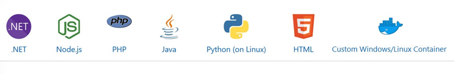

### App Service Kullanma Nedenleri
* **Çoklu Dil ve Çerçeve Desteği:** App Service; ASP.NET, Java, Ruby, Node.js, PHP ve Python için birinci sınıf destek sunar. Arka plan hizmetleri olarak PowerShell veya diğer betikleri ve çalıştırılabilir dosyaları da çalıştırabilirsiniz.
* **DevOps Optimizasyonu:** Azure DevOps, GitHub, BitBucket, Docker Hub veya Azure Container Registry ile sürekli entegrasyon ve dağıtım (CI/CD) kurun. Güncellemeleri test ve hazırlık (staging) ortamları üzerinden canlıya geçirin. Azure PowerShell veya çapraz platform komut satırı arabirimini (CLI) kullanarak uygulamalarınızı yönetin.
* **Yüksek Kullanılabilirlik ile Küresel Ölçek:** Manuel veya otomatik olarak dikey (up) veya yatay (out) ölçeklendirin. Uygulamalarınızı Microsoft'un küresel veri merkezi altyapısının herhangi bir yerinde barındırın; App Service SLA'sı yüksek kullanılabilirlik vaat eder.
* **SaaS Platformlarına ve Şirket İçi Verilere Bağlantı:** Kurumsal sistemler (SAP gibi), SaaS hizmetleri (Salesforce gibi) ve internet hizmetleri (Facebook gibi) için 50'den fazla konnektör arasından seçim yapın. Hybrid Connections ve Azure Virtual Networks kullanarak şirket içi verilere erişin.
* **Güvenlik ve Uyumluluk:** App Service; ISO, SOC ve PCI uyumludur. Kullanıcıların kimliğini Azure Active Directory veya sosyal oturum açma (Google, Facebook, Twitter ve Microsoft) ile doğrulayın. IP adresi kısıtlamaları oluşturun ve hizmet kimliklerini yönetin.
* **Uygulama Şablonları:** Azure Marketplace'teki WordPress, Joomla ve Drupal gibi geniş uygulama şablonları listesinden seçim yapın.
* **Visual Studio Entegrasyonu:** Visual Studio'daki özel araçlar oluşturma, dağıtma ve hata ayıklama süreçlerini kolaylaştırır.
* **API ve Mobil Özellikler:** App Service, RESTful API senaryoları için anahtar teslimi CORS desteği sağlar ve kimlik doğrulama, çevrimdışı veri eşitleme, anlık bildirimler gibi özelliklerle mobil uygulama senaryolarını basitleştirir.
* **Sunucusuz (Serverless) Kod:** Altyapıyı açıkça sağlamak veya yönetmek zorunda kalmadan, isteğe bağlı olarak bir kod parçacığını veya betiği çalıştırın ve yalnızca kodunuzun gerçekte kullandığı işlem süresi için ödeme yapın.

---

## Bir App Service Oluşturma (Create an App Service)

Bir App Service oluştururken bir kaynak grubu (resource group) ve bir hizmet planı (service plan) belirtmeniz gerekir. Ardından birkaç yapılandırma seçeneği daha vardır:

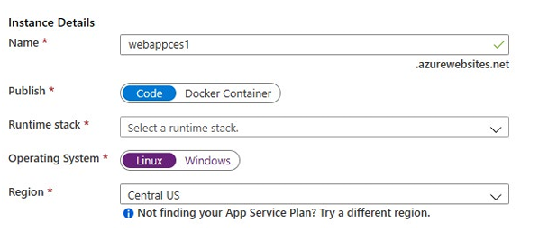

* **Name (Ad):** Ad benzersiz olmalı ve uygulamanızı konumlandırmak için kullanılacaktır. Örneğin: `webappces1.azurewebsites.net`. İsterseniz özel bir etki alanı adını (custom domain) eşleyebilirsiniz.
* **Publish (Yayınlama):** App Service, Kod (Code) veya Docker Konteyneri barındırabilir.
* **Runtime Stack (Çalışma Zamanı Yığını):** Dil ve SDK sürümleri dahil olmak üzere uygulamayı çalıştıracak yazılım yığınıdır. Linux uygulamaları ve özel konteyner uygulamaları için isteğe bağlı bir başlangıç komutu veya dosyası da ayarlayabilirsiniz. Seçenekler arasında .NET Core, .NET Framework, Node.js, PHP, Python ve Ruby bulunur.
* **Operating System (İşletim Sistemi):** Seçenekler Linux ve Windows'tur.
* **Region (Bölge):** Seçiminiz app service planının kullanılabilirliğini etkiler.

### Uygulama Ayarları (Application Settings)
App Service oluşturulduktan sonra ek yapılandırma bilgileri kullanılabilir hale gelir. Belirli yapılandırma ayarları geliştiricinin koduna dahil edilebilir veya app service içinde yapılandırılabilir:

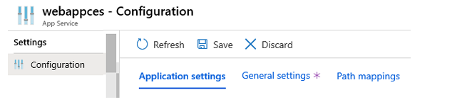

* **Always On (Sürekli Açık):** Trafik olmadığında bile uygulamanın yüklü kalmasını sağlar. Sürekli çalışan WebJob'lar veya CRON ifadesi kullanılarak tetiklenen WebJob'lar için gereklidir.
* **ARR Affinity:** Çok örnekli bir dağıtımda, oturum süresince istemcinin aynı örneğe yönlendirilmesini sağlar. Durumsuz (stateless) uygulamalar için bu seçeneği `Off` konumuna getirebilirsiniz.
* **Connection Strings (Bağlantı Dizeleri):** Bağlantı dizeleri durağan halde şifrelenir (encrypted at rest) ve şifreli bir kanal üzerinden iletilir.

---

## Azure Konteyner Örnekleri Avantajları / Dağıtım Yöntemleri

Azure Portal; Azure DevOps, GitHub, Bitbucket, FTP veya geliştirme makinenizdeki yerel bir Git deposu ile kutudan çıktığı haliyle sürekli entegrasyon ve dağıtım sağlar. Web uygulamanızı bu kaynaklardan herhangi birine bağladığınızda, App Service koddaki değişiklikleri web uygulamasına otomatik olarak eşitleyerek geri kalanını sizin için halleder. Ayrıca Azure DevOps ile, koda her commit attığınızda kaynak kodunuzu derleyen, testleri çalıştıran, bir sürüm oluşturan ve son olarak sürümü web uygulamanıza dağıtan kendi derleme ve yayınlama sürecinizi tanımlayabilirsiniz.

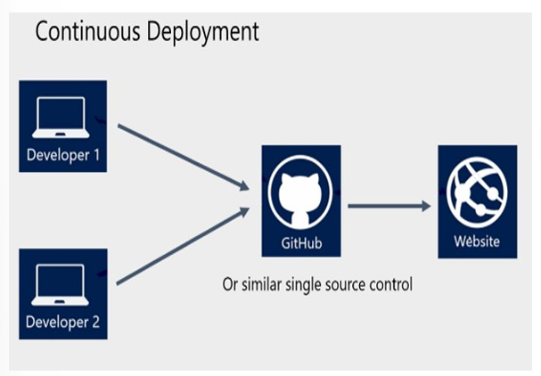

### Otomatik Dağıtım (Automated Deployment)
Otomatik dağıtım (veya continuous integration), yeni özellikleri ve hata düzeltmelerini son kullanıcılar üzerinde minimum etkiyle hızlı ve tekrarlanabilir bir düzende sunmak için kullanılan bir süreçtir. Azure, birkaç kaynaktan doğrudan otomatik dağıtımı destekler:

* **Azure DevOps:** Kodunuzu Azure DevOps'a gönderebilir, kodunuzu bulutta derleyebilir, testleri çalıştırabilir, koddan bir yayın oluşturabilir ve son olarak kodunuzu bir Azure Web Uygulamasına aktarabilirsiniz.
* **GitHub:** Azure, doğrudan GitHub'dan otomatik dağıtımı destekler. Otomatik dağıtım için GitHub deponuzu Azure'a bağladığınızda, GitHub'daki üretim branşınıza gönderdiğiniz tüm değişiklikler sizin için otomatik olarak dağıtılır.
* **Bitbucket:** GitHub ile olan benzerlikleriyle, Bitbucket ile otomatik bir dağıtım yapılandırabilirsiniz.

### Manuel Dağıtım (Manual Deployment)
Kodunuzu Azure'a manuel olarak aktarmak için kullanabileceğiniz birkaç seçenek vardır:

* **Git:** App Service web uygulamaları, uzak bir depo olarak ekleyebileceğiniz bir Git URL'sine sahiptir. Uzak depoya `push` yapmak uygulamanızı dağıtır.
* **CLI:** `az webapp up`, uygulamanızı paketleyen ve dağıtan `az` komut satırı arabiriminin bir özelliğidir. Diğer dağıtım yöntemlerinin aksine, henüz bir App Service oluşturmadıysanız `az webapp up` sizin için yeni bir tane oluşturabilir.
* **Zipdeploy:** Uygulama dosyalarınızın bir ZIP arşivini App Service'e göndermek için `curl` veya benzeri bir HTTP aracı kullanın.
* **Visual Studio:** Visual Studio, dağıtım sürecinde size yol gösterebilecek bir App Service dağıtım sihirbazına sahiptir.
* **FTP/S:** FTP veya FTPS, kodunuzu App Service de dahil olmak üzere birçok barındırma ortamına aktarmanın geleneksel bir yoludur.

---

## Dağıtım Yuvaları Oluşturma (Create Deployment Slots)

Web uygulamanızı, Linux üzerinde web uygulamanızı, mobil arka ucunuzu veya API uygulamanızı Azure App Service'e dağıttığınızda; Standard, Premium veya Isolated App Service plan katmanında çalışırken varsayılan üretim (production) yuvası yerine ayrı bir **dağıtım yuvası (deployment slot)** kullanabilirsiniz. Dağıtım yuvaları, kendi ana bilgisayar adlarına (hostname) sahip canlı uygulamalardır. Uygulama içeriği ve yapılandırma öğeleri, üretim yuvası da dahil olmak üzere iki dağıtım yuvası arasında takas edilebilir (swap).

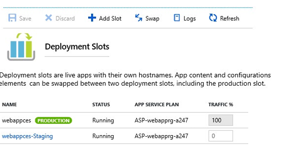

### Dağıtım Yuvası Avantajları
Ayrı hazırlık (staging) ve üretim yuvaları kullanmanın birkaç avantajı vardır:

* Uygulama değişikliklerini üretim yuvasıyla takas etmeden önce bir hazırlık dağıtım yuvasında doğrulayabilirsiniz.
* Bir uygulamayı önce bir yuvaya dağıtmak ve üretime takas etmek, yuvanın tüm örneklerinin üretime alınmadan önce ısınmasını (warm-up) sağlar. Bu, uygulamanızı dağıttığınızda kesinti süresini (downtime) ortadan kaldırır. Trafik yönlendirmesi sorunsuzdur ve takas işlemleri nedeniyle hiçbir istek düşürülmez. Ön takas doğrulamasına ihtiyaç duyulmadığında **Auto Swap** yapılandırılarak tüm bu iş akışı otomatikleştirilebilir.
* Bir takas işleminden sonra, önceden hazırlanmış uygulamaya sahip yuva artık önceki üretim uygulamasına sahiptir. Üretim yuvasına takas edilen değişiklikler beklediğiniz gibi değilse, "en son bilinen iyi sitenizi" (last known good site) geri almak için aynı takası hemen gerçekleştirebilirsiniz.

Auto Swap, uygulamanızı sıfır soğuk başlatma (cold start) ve müşteriler için sıfır kesinti süresiyle sürekli olarak dağıtmak istediğiniz Azure DevOps senaryolarını basitleştirir. Bir yuvadan üretime Auto Swap etkinleştirildiğinde, kod değişikliklerinizi o yuvaya her gönderdiğinizde, kaynak yuvada ısındıktan sonra App Service uygulamayı otomatik olarak üretime takas eder. Auto Swap şu anda Linux üzerindeki web uygulamalarında desteklenmemektedir.

> **Not:** Her App Service plan modu farklı sayıda dağıtım yuvasını destekler.

---

## Dağıtım Yuvaları Ekleme (Add Deployment Slots)

Yeni dağıtım yuvaları boş olabilir veya kopyalanabilir (cloned). Yapılandırmayı başka bir dağıtım yuvasından kopyaladığınızda, kopyalanan yapılandırma düzenlenebilir. Bazı yapılandırma öğeleri bir takas boyunca içeriği takip eder (yuvaya özel değildir), diğer yapılandırma öğeleri ise bir takastan sonra aynı yuvada kalır (yuvaya özeldir).

Dağıtım yuvası ayarları üç kategoriye ayrılır:
* Uygulanabilirse, yuvaya özel uygulama ayarları ve bağlantı dizeleri.
* Etkinleştirilmişse, sürekli dağıtım (continuous deployment) ayarları.
* Etkinleştirilmişse, App Service kimlik doğrulama ayarları.

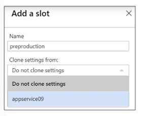

| Takas Edilen Ayarlar (Swapped) | Takas Edilmeyen Ayarlar (Slot-Specific) |
| :--- | :--- |
| Framework sürümü, 32/64-bit, web sockets gibi genel ayarlar | Yayınlama uç noktaları (Publishing endpoints) |
| Uygulama ayarları (bir yuvaya sabitlenecek şekilde yapılandırılabilir) | Özel etki alanı adları (Custom domain names) |
| Bağlantı dizeleri (bir yuvaya sabitlenecek şekilde yapılandırılabilir) | Genel olmayan sertifikalar ve TLS/SSL ayarları |
| Handler haritalamaları | Ölçeklendirme ayarları (Scale settings) |
| Genel sertifikalar (Public certificates) | WebJobs zamanlayıcıları |
| WebJobs içeriği | IP kısıtlamaları |
| Hybrid connections * | Always On |
| Service endpoints * | Teşhis ayarları (Diagnostic settings) |
| Azure Content Delivery Network * | Çapraz kaynak köken paylaşımı (CORS) |
| | Sanal ağ entegrasyonu (VNet integration) |

*\* Yıldız işaretiyle işaretlenen özelliklerin takas edilmeyecek şekilde değiştirilmesi planlanmaktadır.*

---

## App Service Güvenliğini Sağlama (Secure an App Service)

Azure App Service; web uygulamanızda, API'nizde, mobil arka ucunuzda ve ayrıca Azure Functions'ta minimum kod yazarak veya hiç kod yazmadan kullanıcıların oturum açabilmesi ve verilere erişebilmesi için yerleşik kimlik doğrulama (authentication) ve yetkilendirme (authorization) desteği sağlar.

Güvenli kimlik doğrulama ve yetkilendirme; federasyon, şifreleme, JSON web belirteçleri (JWT) yönetimi, izin türleri vb. dahil olmak üzere derin bir güvenlik anlayışı gerektirir. App Service bu araçları sağlar, böylece müşterinize iş değeri sunmaya daha fazla zaman ve enerji harcayabilirsiniz.

> **Not:** Kimlik doğrulama ve yetkilendirme için App Service'i kullanmak zorunda değilsiniz. Birçok web çerçevesi güvenlik özellikleriyle birlikte gelir ve isterseniz bunları kullanabilirsiniz.

### Nasıl Çalışır?
Kimlik doğrulama ve yetkilendirme modülü, uygulama kodunuzla aynı korumalı alanda (sandbox) çalışır. Etkinleştirildiğinde, gelen her HTTP isteği uygulama kodunuz tarafından işlenmeden önce bu modülden geçer. Bu modül uygulamanız için birkaç şeyi halleder:

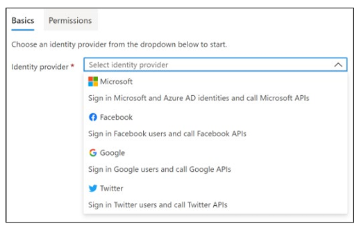

* Kullanıcıların kimliğini belirtilen sağlayıcı ile doğrular.
* Belirteçleri (tokens) doğrular, saklar ve yeniler.
* Doğrulanmış oturumu yönetir.
* Kimlik bilgilerini istek başlıklarına (request headers) enjekte eder.

Modül uygulama kodunuzdan ayrı çalışır ve uygulama ayarları kullanılarak yapılandırılır. Hiçbir SDK, belirli dil veya uygulama kodunuzda değişiklik yapılması gerekmez.

### Yetkilendirme Davranışı (Authorization Behavior)
Azure portalında, App Service yetkilendirmesini bir dizi davranışla yapılandırabilirsiniz:

1. **Allow Anonymous requests (no action):** Bu seçenek, doğrulanmamış trafiğin yetkilendirilmesini uygulama kodunuza bırakır. Doğrulanmış istekler için App Service, kimlik doğrulama bilgilerini HTTP başlıklarında da iletir. Bu seçenek, anonim isteklerin işlenmesinde daha fazla esneklik sağlar ve kullanıcılarınıza birden fazla oturum açma sağlayıcısı sunmanıza olanak tanır.
2. **Allow only authenticated requests:** Seçenek *Log in with <provider>* şeklindedir. App Service, tüm anonim istekleri seçtiğiniz sağlayıcı için `/.auth/login/<provider>` adresine yönlendirir. Anonim istek yerel bir mobil uygulamadan geliyorsa, döndürülen yanıt HTTP 401 Unauthorized olur. Bu seçenekle uygulamanızda herhangi bir kimlik doğrulama kodu yazmanıza gerek kalmaz.

> **Not:** Erişimi bu şekilde kısıtlamak uygulamanıza yapılan tüm çağrılar için geçerlidir; bu da birçok tek sayfalı uygulamada (SPA) olduğu gibi halka açık bir ana sayfa isteyen uygulamalar için arzu edilmeyebilir.

### Günlük Kaydı ve İzleme (Logging and Tracing)
Uygulama günlük kaydını (application logging) etkinleştirirseniz, kimlik doğrulama ve yetkilendirme izlerini doğrudan günlük dosyalarınızda görürsünüz. Beklemediğiniz bir kimlik doğrulama hatası görürseniz, mevcut uygulama günlüklerinize bakarak tüm ayrıntıları rahatça bulabilirsiniz. Başarısız istek izlemeyi (failed request tracing) etkinleştirirseniz, kimlik doğrulama ve yetkilendirme modülünün başarısız bir istekte tam olarak nasıl bir rol oynamış olabileceğini görebilirsiniz. İzleme günlüklerinde `EasyAuthModule_32/64` adlı bir modüle yapılan başvuruları arayın.

---

## Özel Etki Alanı Adları Oluşturma (Create Custom Domain Names)

Bir web uygulaması oluşturduğunuzda Azure, onu `azurewebsites.net` adresinin bir alt etki alanına atar. Örneğin, web uygulamanızın adı `contoso` ise, URL `contoso.azurewebsites.net` olur. Azure ayrıca sanal bir IP adresi atar. Canlı bir web uygulaması için kullanıcıların özel bir etki alanı adı (custom domain) görmesini isteyebilirsiniz.

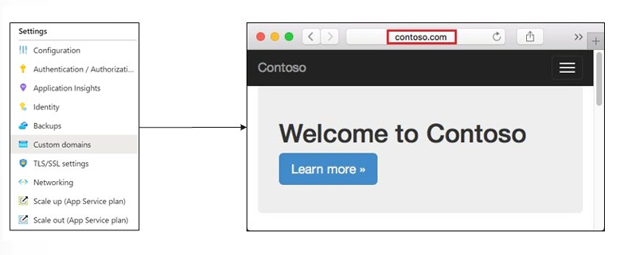

### Yapılandırma Adımları
1. **Etki alanı adınızı rezerve edin:** Harici bir etki alanı adına (yani `*.azurewebsites.net` olmayan) henüz kaydolmadıysanız, özel bir etki alanı kurmanın en kolay yolu doğrudan Azure portalından bir tane satın almaktır. Bu süreç, web uygulamanızın etki alanı adını yönetmek için üçüncü taraf bir siteye gitmek yerine doğrudan Portal'da yönetmenizi sağlar. Aynı şekilde, web uygulamanızda etki alanı adını yapılandırmak son derece basitleşir. Portalı kullanmıyorsanız herhangi bir etki alanı kayıt kuruluşunu (registrar) kullanabilirsiniz. Kaydolduğunuzda kayıt sitesi süreç boyunca size yardımcı olacaktır.
2. **Etki alanını Azure web uygulamanıza eşleyen DNS kayıtları oluşturun:** Etki Alanı Adı Sistemi (DNS), etki alanı adlarını IP adreslerine eşlemek için veri kayıtlarını kullanır. Birkaç tür DNS kaydı vardır. Web uygulamaları için bir **A kaydı** veya bir **CNAME kaydı** oluşturacaksınız. IP adresi değişirse bir CNAME girdisi hala geçerlidir, Oysa bir A kaydı güncellenmelidir. Ancak bazı etki alanı kayıt kuruluşları kök etki alanı (root domain) veya joker karakterli (wildcard) etki alanları için CNAME kayıtlarına izin vermez. Bu durumda bir A kaydı kullanmalısınız.
   * Bir **A (Address) kaydı**, bir etki alanı adını bir IP adresine eşler.
   * Bir **CNAME (Canonical Name) kaydı**, bir etki alanı adını başka bir etki alanı adına eşler. DNS, adresi aramak için ikinci adı kullanır. Kullanıcılar tarayıcılarında hala ilk etki alanı adını görürler. Örneğin, `contoso.com` adresini `yourwebapp.azurewebsites.net` adresine eşleyebilirsiniz.
3. **Özel etki alanını etkinleştirin:** Etki alanınızı alıp DNS kaydınızı oluşturduktan sonra, özel etki alanını doğrulamak ve web uygulamanıza eklemek için portalı kullanabilirsiniz. Test ettiğinizden emin olun.

> **Not:** Özel bir DNS adını bir web uygulamasına eşlemek için, web uygulamasının App Service planının **ücretli bir katmanda** olması gerekir.

---

## App Service Yedekleme (Backup an App Service)

Azure App Service'teki Yedekleme ve Geri Yükleme (Backup and Restore) özelliği, manuel olarak veya bir programa göre kolayca uygulama yedekleri oluşturmanıza olanak tanır. Yedeklemeleri süresiz bir zamana kadar saklanacak şekilde yapılandırabilirsiniz. Mevcut uygulamanın üzerine yazarak veya başka bir uygulamaya geri yükleyerek uygulamayı önceki bir durumun anlık görüntüsüne (snapshot) döndürebilirsiniz.

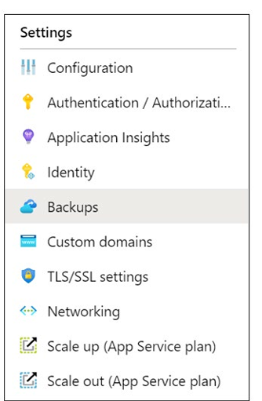

### Neler Yedeklenir?
App Service aşağıdaki bilgileri, uygulamanızı kullanmak üzere yapılandırdığınız bir Azure depolama hesabına ve kapsayıcısına (container) yedekleyebilir:
* Uygulama yapılandırması.
* Dosya içeriği.
* Uygulamanıza bağlı veritabanı (SQL Database, Azure Database for MySQL, Azure Database for PostgreSQL, MySQL in-app).

### Dikkat Edilmesi Gerekenler
* Yedekleme ve Geri Yükleme özelliği, App Service planının **Standard** veya **Premium** katmanda olmasını gerektirir.
* Yedeklemeleri manuel olarak veya bir programa göre yapılandırabilirsiniz.
* Yedeklemek istediğiniz uygulamayla aynı abonelikte bir Azure depolama hesabına ve kapsayıcısına ihtiyacınız vardır. Uygulamanız için bir veya daha fazla yedekleme yaptıktan sonra, yedeklemeler depolama hesabınızın ve uygulamanızın Kapsayıcılar sayfasında görünür. Depolama hesabında her yedekleme, yedekleme verilerini içeren bir `.zip` dosyasından ve `.zip` dosyası içeriğinin bildirimini (manifest) içeren bir `.xml` dosyasından oluşur. Gerçek bir uygulama geri yüklemesi yapmadan yedeklerinize erişmek istiyorsanız bu dosyaların zıplamasını açabilir ve göz atabilirsiniz.
* **Tam yedeklemeler (Full backups)** varsayılardır. Tam bir yedekleme geri yüklendiğinde, sitedeki tüm içerik yedeklemede ne varsa onunla değiştirilir. Sitede olan ancak yedekte olmayan bir dosya silinir.
* **Kısmi yedeklemeler (Partial backups)** desteklenir. Kısmi yedeklemeler, tam olarak hangi dosyaları yedeklemek istediğinizi seçmenize olanak tanır. Kısmi bir yedekleme geri yüklendiğinde, hariç tutulan dizinlerden birinde bulunan herhangi bir içerik veya hariç tutulan herhangi bir dosya olduğu gibi bırakılır. Sitenizin kısmi yedeklerini, normal bir yedeklemeyi geri yüklediğiniz şekilde geri yüklersiniz.
* Yedeklemede istemediğiniz dosya ve klasörleri hariç tutabilirsiniz.
* Yedeklemeler **10 GB'a kadar** uygulama ve veritabanı içeriği olabilir.
* Güvenlik duvarı etkinleştirilmiş bir depolama hesabının yedekleriniz için hedef olarak kullanılması desteklenmez.

---

## Application Insights Kullanımı (Use Application Insights)

Azure Monitor'ün bir özelliği olan **Application Insights**, canlı uygulamalarınızı izler. Performans anormalliklerini otomatik olarak tespit eder ve sorunları teşhis etmenize, kullanıcıların uygulamanızla gerçekte ne yaptığını anlamanıza yardımcı olacak güçlü analitik araçlar içerir. Performansı ve kullanılabilirliği sürekli olarak geliştirmenize yardımcı olmak için tasarlanmıştır. Insights; şirket içinde, hibrit veya herhangi bir genel bulutta barındırılan .NET, Node.js ve Java EE dahil olmak üzere çeşitli platformlarda çalışır. DevOps sürecinizle entegre olur ve çeşitli geliştirme araçlarına bağlantı noktalarına sahiptir. Visual Studio App Center ile entegre olarak mobil uygulamalardan gelen verileri izleyebilir ve analiz edebilir.

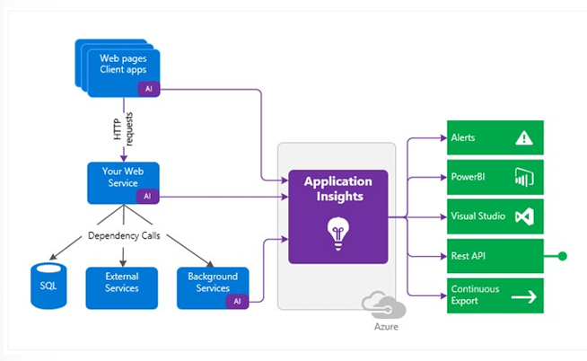

### Application Insights Özellikleri
Application Insights, uygulamanızın nasıl performans gösterdiğini ve nasıl kullanıldığını anlamanıza yardımcı olmak için geliştirme ekibine yöneliktir. Şunları izler:

* **İstek oranları, yanıt süreleri ve başarısızlık oranları:** Hangi sayfaların en popüler olduğunu, günün hangi saatlerinde ve kullanıcılarınızın nerede olduğunu öğrenin. Hangi sayfaların en iyi performansı gösterdiğini görün. Daha fazla istek olduğunda yanıt süreleriniz ve başarısızlık oranlarınız yükseliyorsa, belki de bir kaynak sorununuz vardır.
* **Bağımlılık oranları, yanıt süreleri ve başarısızlık oranları:** Harici hizmetlerin sizi yavaşlatıp yavaşlatmadığını öğrenin.
* **İstisnalar (Exceptions):** Toplu istatistikleri analiz edin veya belirli örnekleri seçip yığın izlemesine (stack trace) ve ilgili isteklerle ayrıntılara inin. Hem sunucu hem de tarayıcı istisnaları raporlanır.
* **Sayfa görüntülemeleri ve yükleme performansı:** Kullanıcılarınızın tarayıcıları tarafından raporlanır.
* **Kullanıcı ve oturum sayıları.**
* **Performans sayaçları:** Windows veya Linux sunucu makinelerinizden CPU, bellek ve ağ kullanımı gibi veriler.
* **Ana bilgisayar teşhisleri:** Docker veya Azure'dan gelen veriler.
* **Teşhis izleme günlükleri:** İzleme olaylarını isteklerle ilişkilendirebilmeniz için uygulamanızdan gelen veriler.
* **Özel olaylar ve metrikler:** Satılan ürünler veya kazanılan oyunlar gibi iş olaylarını izlemek için istemci veya sunucu kodunda kendinizin yazdığı veriler.

## Terraform Uygulama Örneği

Aşağıdaki HCL kodu, Staging yuvasına (Deployment Slot) sahip bir Linux Web App, HTTPS zorunluluğu, Özel Tanılama Ayarları ve Application Insights entegrasyonunu dağıtmaktadır:

```hcl
# Kaynak Grubu
resource "azurerm_resource_group" "rg" {
  name     = "rg-app-prod"
  location = "westeurope"
}

# App Service Plan (Standard S1)
resource "azurerm_service_plan" "asp" {
  name                = "asp-prod-westeurope"
  resource_group_name = azurerm_resource_group.rg.name
  location            = azurerm_resource_group.rg.location
  os_type             = "Linux"
  sku_name            = "S1"
}

# Application Insights
resource "azurerm_application_insights" "appinsights" {
  name                = "appinsights-prod"
  location            = azurerm_resource_group.rg.location
  resource_group_name = azurerm_resource_group.rg.name
  application_type    = "web"
}

# Main Web App (Production Slot)
resource "azurerm_linux_web_app" "webapp" {
  name                = "app-mycompany-prod-001"
  resource_group_name = azurerm_resource_group.rg.name
  location            = azurerm_resource_group.rg.location
  service_plan_id     = azurerm_service_plan.asp.id
  https_only          = true

  site_config {
    always_on = true
    application_stack {
      dotnet_version = "7.0"
    }
  }

  app_settings = {
    "APPINSIGHTS_INSTRUMENTATIONKEY"                  = azurerm_application_insights.appinsights.instrumentation_key
    "APPLICATIONINSIGHTS_CONNECTION_STRING"         = azurerm_application_insights.appinsights.connection_string
    "ApplicationInsightsAgent_EXTENSION_VERSION" = "~3"
  }
}

# Staging Deployment Slot
resource "azurerm_linux_web_app_slot" "staging_slot" {
  name           = "staging"
  app_service_id = azurerm_linux_web_app.webapp.id

  site_config {
    always_on = true
    application_stack {
      dotnet_version = "7.0"
    }
  }

  app_settings = {
    "APPINSIGHTS_INSTRUMENTATIONKEY"          = azurerm_application_insights.appinsights.instrumentation_key
    "APPLICATIONINSIGHTS_CONNECTION_STRING" = azurerm_application_insights.appinsights.connection_string
  }
}
```


# Azure Konteyner Örneklerini Yapılandırma (Configure Azure Container Instances)

## Giriş

### Senaryo
Konteynerler, bulut uygulamalarını paketlemek, dağıtmak ve yönetmek için standartlaştırılmış ve tekrarlanabilir bir yol sunar. **Azure Container Instances (ACI)**, sanal makineleri (VM) yönetmek zorunda kalmadan ve daha üst düzey bir hizmete ihtiyaç duymadan Azure üzerinde bir konteyner çalıştırmanızı sağlar.

İç uygulamalar için konteynerler kullanan çevrimiçi bir giyim perakendecisi için çalışıyorsunuz. Bu uygulamalar şirket içinde (on-premises), Azure'da ve diğer bulut sağlayıcılarında barındırılmaktadır. Uygulamalar donanım kaynaklarını paylaşabilir, ancak diğer uygulamalar tarafından kullanılan kaynaklara erişmemelidir. Şirket, bu konteynerleri dağıtmanız, yönetmeniz, boyutlandırmanız ve ölçeklendirmeniz konusunda size güvenmektedir.

### Ölçülen Yetenekler (Skills Measured)
Azure Container Instances, **Exam AZ-104: Microsoft Azure Administrator** sınavının bir parçasıdır.
* **Azure Hesaplama Kaynaklarını Dağıtma ve Yönetme (%20–25)**
* **Konteyner Oluşturma ve Yapılandırma:**
  * Azure Container Instances için boyutlandırma ve ölçeklendirmeyi yapılandırma.
  * Azure Container Instances için konteyner gruplarını (container groups) yapılandırma.

### Öğrenme Hedefleri
Bu modülde şunları öğreneceksiniz:
* Sanal makineler (VM) ile konteynerlerin ne zaman kullanılacağını belirleme.
* Azure Container Instances özelliklerini ve kullanım durumlarını belirleme.
* Azure Konteyner Gruplarını (Container Groups) uygulama.

### Önkoşullar
Bulunmamaktadır.

---

## Konteynerleri ve Sanal Makineleri Karşılaştırma (Compare Containers to Virtual Machines)

Donanım sanallaştırması, aynı fiziksel donanım üzerinde birden fazla izole işletim sistemi örneğinin eşzamanlı olarak çalıştırılmasını mümkün kılmıştır. Konteynerler, hesaplama kaynaklarının sanallaştırılmasında bir sonraki aşamayı temsil eder. Konteyner tabanlı sanallaştırma, işletim sistemini sanallaştırmanıza olanak tanır. Bu sayede, uygulamalar arasındaki izolasyonu korurken bir işletim sisteminin aynı örneği içinde birden fazla uygulama çalıştırabilirsiniz.

| Özellik | Konteynerler (Containers) | Sanal Makineler (Virtual Machines) |
| :--- | :--- | :--- |
| **İzolasyon (Isolation)** | Genellikle konakçıdan (host) ve diğer konteynerlerden hafif (lightweight) izolasyon sağlar; ancak bir VM kadar güçlü bir güvenlik sınırı sunmaz. | Konakçı işletim sisteminden ve diğer VM'lerden tam izolasyon sağlar. Rakip şirketlerin uygulamalarını aynı sunucuda barındırmak gibi güçlü güvenlik sınırının kritik olduğu durumlar için kullanışlıdır. |
| **İşletim Sistemi (Operating System)** | İşletim sisteminin yalnızca kullanıcı modu (user mode) kısmını çalıştırır ve daha az sistem kaynağı kullanarak yalnızca uygulamanız için gerekli hizmetleri içerecek şekilde özelleştirilebilir. | Çekirdek (kernel) dahil tam bir işletim sistemi çalıştırır; bu nedenle daha fazla sistem kaynağı (CPU, bellek ve depolama) gerektirir. |
| **Dağıtım (Deployment)** | Komut satırı üzerinden Docker kullanarak tekil konteynerler; Azure Kubernetes Service (AKS) gibi bir orkestratör kullanarak birden fazla konteyner dağıtılır. | Windows Admin Center veya Hyper-V Manager kullanarak tekil VM'ler; PowerShell veya System Center VMM kullanarak birden fazla VM dağıtılır. |
| **Kalıcı Depolama (Persistent Storage)** | Tek bir düğüm için yerel depolama olarak Azure Disks; birden fazla düğüm veya sunucu tarafından paylaşılan depolama için Azure Files (SMB paylaşımları) kullanılır. | Tek bir VM için yerel depolama olarak sanal sabit disk (VHD); birden fazla sunucu tarafından paylaşılan depolama için bir SMB dosya paylaşımı kullanılır. |
| **Hata Toleransı (Fault Tolerance)** | Bir küme düğümü arızalanırsa, üzerinde çalışan tüm konteynerler orkestratör tarafından başka bir küme düğümünde hızla yeniden oluşturulur[cite: 1]. | VM'ler bir kümedeki başka bir sunucuya devredilebilir (failover) ve VM'nin işletim sistemi yeni sunucuda yeniden başlatılır[cite: 1]. |

### Konteynerlerin Avantajları
* Uygulama kodunu geliştirirken ve paylaşırken **artan esneklik ve hız**.
* Basitleştirilmiş uygulama test süreçleri.
* Hızlandırılmış ve düzene sokulmuş uygulama dağıtımı.
* İyileştirilmiş kaynak kullanımına yol açan **daha yüksek iş yükü yoğunluğu**.

---

## Azure Container Instances Hizmetini İnceleme (Review Azure Container Instances)

Azure Container Instances (ACI), herhangi bir sanal makineyi yönetmek ve daha üst düzey bir hizmeti benimsemek zorunda kalmadan Azure'da bir konteyner çalıştırmanın en hızlı ve en basit yolunu sunar. Basit uygulamalar, görev otomasyonu ve derleme (build) işleri dahil olmak üzere izole konteynerlerde çalışabilen tüm senaryolar için harika bir çözümdür.

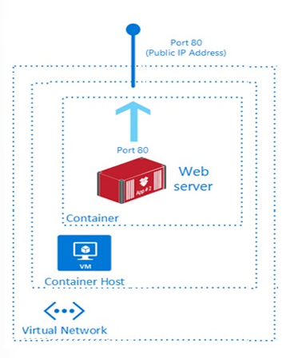

| Özellik | Açıklama |
| :--- | :--- |
| **Hızlı Başlatma Süreleri (Fast Startup Times)** | Sanal makineleri sağlamaya (provision) ve yönetmeye gerek kalmadan konteynerler saniyeler içinde başlatılabilir. |
| **Genel IP Bağlantısı ve DNS İsimleri** | Konteynerler bir IP adresi ve FQDN ile doğrudan İnternet'e açılabilir. |
| **Hipervizör Seviyesinde Güvenlik** | Konteyner uygulamaları, bir sanal makinede olduğu kadar izole bir güvenlik sınırına sahiptir. |
| **Özel Boyutlar (Custom Sizes)** | Konteyner düğümleri, bir uygulamanın gerçek kaynak talepleriyle eşleşecek şekilde dinamik olarak ölçeklenebilir. |
| **Kalıcı Depolama (Persistent Storage)** | Konteynerler doğrudan Azure Dosya Paylaşımlarının (Azure File Shares) bağlanmasını (mount) destekler. |
| **Linux ve Windows Konteynerleri** | Hem Linux hem de Windows konteyner görünümlerini (images) çalıştırma desteği sunar. |
| **Birlikte Zamanlanan Gruplar (Coscheduled Groups)** | Konakçı makine kaynaklarını paylaşan çoklu konteyner gruplarının zamanlanmasını destekler. |
| **Sanal Ağ Dağıtımı (Virtual Network Deployment)** | Konteyner örnekleri bir Azure sanal ağına (VNet) dağıtılabilir. |

---

## Konteyner Gruplarını Uygulama (Implement Container Groups)

Azure Container Instances'taki en üst düzey kaynak **Konteyner Grubu (Container Group)** kaynağıdır. Konteyner grubu, **aynı konakçı makinede zamanlanan** konteynerlerin bir koleksiyonudur. Bir konteyner grubundaki konteynerler yaşam döngüsünü, kaynakları, yerel ağı ve depolama birimlerini (volumes) paylaşır. Bu kavram Kubernetes'teki bir **Pod** mantığına benzer.

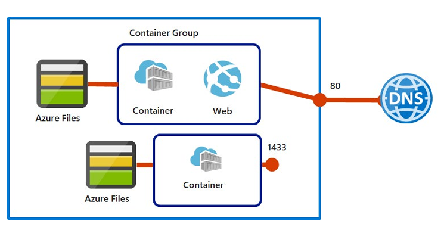

### Örnek Bir Konteyner Grubu Yapısı:
* Tek bir konakçı makinede zamanlanır.
* Bir DNS etiket adı atanır.
* Dışarıya açık tek bir IP adresi ve tek bir port sunar.
* İki konteynerden oluşur: Bir konteyner 80 portunu dinlerken, diğeri 1433 portunu dinler.
* Birim bağlama (volume mount) olarak iki Azure dosya paylaşımı içerir ve her konteyner paylaşımlardan birini yerel olarak bağlar.

### Dağıtım Seçenekleri
Çoklu konteyner grubunu dağıtmanın iki yaygın yolu vardır: **ARM Şablonu (Resource Manager template)** veya **YAML Dosyası**. Konteyner örneklerini dağıtırken ek Azure hizmet kaynaklarını (örneğin bir Azure Files paylaşımı) dağıtmanız gerekiyorsa bir ARM şablonu önerilir. YAML biçiminin daha kısa doğası nedeniyle, dağıtımınız yalnızca konteyner örneklerini içerdiğinde bir YAML dosyası önerilir.

### Kaynak Tahsisi ve Ağ Oluşturma
* **Kaynak Tahsisi:** ACI, gruptaki örneklerin kaynak isteklerini toplayarak çoklu konteyner grubuna CPU, bellek ve isteğe bağlı GPU tahsis eder. Örn: Her biri 1 CPU isteyen iki konteynerli bir grupta toplam 2 CPU tahsis edilir.
* **Ağ Oluşturma:** Konteyner grupları dışa dönük bir IP adresini, bir veya daha fazla portu ve FQDN içeren bir DNS etiketini paylaşır. Dış istemcilerin grup içindeki bir konteynere ulaşması için portun hem IP adresinde hem de konteynerden dışarıya açılması gerekir. Grup içindeki konteynerler aynı port ad alanını (port namespace) paylaştığından, port eşleme (port mapping) desteklenmez. Konteyner grubu silindiğinde IP adresi ve FQDN serbest bırakılır.

### Yaygın Senaryolar
* **Uygulama ve İçerik Çekici:** Bir web uygulamasını sunan konteyner ile kaynak denetiminden (source control) en son içeriği çeken bir yan konteyner (sidecar).
* **Uygulama ve Günlük Kaydı (Logging):** Uygulama konteyneri ve ana uygulama tarafından üretilen günlükleri/metrikleri toplayıp uzun vadeli depolamaya yazan günlük kaydı konteyneri.
* **Uygulama ve İzleme (Monitoring):** Uygulamanın düzgün çalıştığını periyodik olarak kontrol eden ve çalışmadığında uyarı veren izleme konteyneri.
* **Ön Uç ve Arka Uç:** Web uygulamasını sunan ön uç konteyner ile veri çekme hizmetini çalıştıran arka uç konteyner.

---

## Docker Platformunu İnceleme (Review the Docker Platform)

Docker, geliştiricilerin uygulamaları bir konteyner içinde barındırmasını sağlayan bir platformdur. Konteyner; yürütülebilir uygulama kodunu, çalışma zamanı ortamını (.NET Core vb.), sistem araçlarını ve ayarları içeren bağımsız bir pakettir.

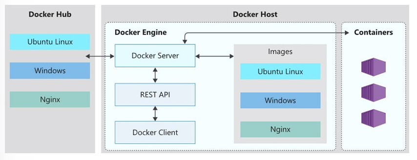

### Docker Terimleri:
* **Container (Konteyner):** Bir Docker imajının (image) çalışan örneğidir (instance). Tek bir uygulamanın veya sürecin yürütülmesini temsil eder.
* **Container Image (Konteyner İmajı):** Bir konteyner oluşturmak için gereken tüm bağımlılıkları ve bilgileri içeren pakettir. İmaj oluşturulduktan sonra değiştirilemez (immutable).
* **Build:** Bir `Dockerfile` tarafından sağlanan bilgilere dayanarak bir konteyner imajı oluşturma eylemidir (`docker build`).
* **Pull:** Bir konteyner imajını bir kayıt defterinden (container registry) indirme işlemidir.
* **Push:** Bir konteyner imajını bir kayıt defterine yükleme işlemidir.
* **Dockerfile:** Bir Docker imajının nasıl oluşturulacağına ilişkin talimatları içeren metin dosyasıdır. İlk satır temel imajı (base image) tanımlar; geri kalan satırlar derleme eylemlerini içerir.

---

## Terraform Uygulama Örneği

Aşağıdaki HCL kodu, Azure Container Instances (ACI) üzerinde 80 portunu dışarıya açan, Azure Files birim bağlamasına (volume mount) sahip bir Linux Konteyner Grubu tanımlamaktadır:

```hcl
# Kaynak Grubu
resource "azurerm_resource_group" "rg" {
  name     = "rg-aci-prod"
  location = "westeurope"
}

# Kalıcı Depolama için Storage Account ve File Share
resource "azurerm_storage_account" "sa" {
  name                     = "stacidata2026we"
  resource_group_name      = azurerm_resource_group.rg.name
  location                 = azurerm_resource_group.rg.location
  account_tier             = "Standard"
  account_replication_type = "LRS"
}

resource "azurerm_storage_share" "share" {
  name                 = "aci-share"
  storage_account_name = azurerm_storage_account.sa.name
  quota                = 10
}

# Azure Container Group (ACI) Dağıtımı
resource "azurerm_container_group" "aci_group" {
  name                = "aci-web-app-group"
  location            = azurerm_resource_group.rg.location
  resource_group_name = azurerm_resource_group.rg.name
  ip_address_type     = "Public"
  dns_name_label      = "mycompany-app-2026"
  os_type             = "Linux"

  # Konteyner 1: Web Sunucusu (Nginx)
  container {
    name   = "web-server"
    image  = "[mcr.microsoft.com/azuredocs/aci-helloworld:latest](https://mcr.microsoft.com/azuredocs/aci-helloworld:latest)"
    cpu    = "1.0"
    memory = "1.5"

    ports {
      port     = 80
      protocol = "TCP"
    }

    # Azure File Share Bağlama (Volume Mount)
    volume {
      name                 = "data-volume"
      mount_path           = "/aci/data"
      storage_account_name = azurerm_storage_account.sa.name
      storage_account_key  = azurerm_storage_account.sa.primary_access_key
      share_name           = azurerm_storage_share.share.name
    }
  }

  tags = {
    environment = "production"
  }
}
```


# Azure Kubernetes Service (AKS) Hizmetini Yapılandırma

## Giriş

### Senaryo
Standart konteyner yönetim araçları tekil konteynerleri yönetmeye odaklanır. Birden fazla konteynerin birlikte çalıştığı karmaşık sistemleri ölçeklendirmek zorlayıcı olabilir. Bu süreci kolaylaştırmak için **Kubernetes** gibi bir konteyner yönetim platformu (orchestrator) kullanılır.

Dünya genelinde araç takip çözümü sunan bir filo yönetim şirketinde çalıştığınızı varsayın. Takip çözümünüz mikro hizmetler (microservices) mimarisiyle inşa edilmiştir. Müşteri taleplerini karşılamak ve yeni coğrafi bölgelere hızla yayılmak için konteyner yapılarını kullanıyorsunuz. Şirket, konteynerli uygulamaları dağıtmak ve yönetmek için **Azure Kubernetes Service (AKS)** kullanmayı planlamaktadır.

### Ölçülen Yetenekler (Skills Measured)
Azure Kubernetes Service, **Exam AZ-104: Microsoft Azure Administrator** sınavının bir parçasıdır.
* **Azure Hesaplama Kaynaklarını Dağıtma ve Yönetme (%20–25)**
* **Konteyner Oluşturma ve Yapılandırma:**
  * Azure Kubernetes Service (AKS) için depolamayı yapılandırma.
  * AKS için ölçeklendirmeyi yapılandırma.
  * AKS için ağ bağlantılarını yapılandırma.
  * Bir AKS kümesini yükseltme (upgrade).

### Öğrenme Hedefleri
Bu modülde şunları öğreneceksiniz:
* Pod'lar, kümeler (clusters) ve düğümler (nodes) dahil olmak üzere AKS bileşenlerini tanımlama.
* AKS için ağ bağlantılarını yapılandırma.
* AKS için depolama seçeneklerini yapılandırma.
* AKS için güvenlik seçeneklerini uygulama.
* Azure Container Instances (ACI) entegrasyonu dahil olmak üzere AKS'yi ölçeklendirme.

### Önkoşullar
Bulunmamaktadır.

---

## AKS Terimlerini İnceleme (Explore AKS Terminology)

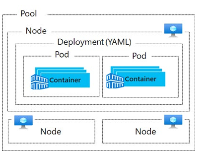

* **Pools (Düğüm Havuzları):** Özdeş yapılandırmalara sahip düğüm gruplarıdır.
* **Nodes (Düğümler):** Konteynerli uygulamaları çalıştıran bireysel sanal makinelerdir.
* **Pods (Pod'lar):** Bir uygulamanın tek bir örneğidir (instance). Bir pod tek bir konteyner içerebileceği gibi birden fazla konteyner de içerebilir.
* **Container (Konteyner):** Yazılımı ve tüm bağımlılıklarını içeren hafif, taşınabilir yürütülebilir bir imajdır.
* **Deployment:** Kubernetes tarafından yönetilen bir veya daha fazla özdeş pod kümesidir.
* **Manifest:** Dağıtımı (deployment) tanımlayan YAML dosyasıdır.

---

## AKS Kümelerini ve Düğümlerini İnceleme (Explore AKS Clusters and Nodes)

Bir Kubernetes kümesi iki temel bileşene ayrılır:
1. **Azure-Managed Nodes (Control Plane):** Temel Kubernetes hizmetlerini ve uygulama iş yüklerinin orkestrasyonunu sağlayan, Azure tarafından yönetilen düğümlerdir. Kullanıcıdan soyutlanmıştır ve ücretsizdir (yalnızca agent düğümleri için ödeme yapılır).
2. **Customer-Managed Nodes (Agent Nodes):** Uygulama iş yüklerinizi çalıştıran kullanıcı yönetimindeki düğümlerdir.

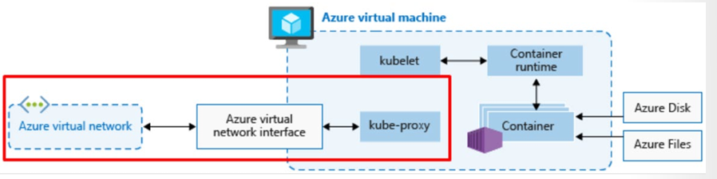

### Düğümler ve Düğüm Havuzları (Nodes and Node Pools)
İş yüklerini çalıştırmak için kullanılan düğümler (Azure Virtual Machines) şu bileşenleri barındırır:
* **kubelet:** Control plane'den gelen orkestrasyon isteklerini işleyen ve konteynerlerin çalışmasını zamanlayan Kubernetes ajanıdır.
* **kube-proxy:** Her düğümde çalışan, ağ trafiğini yönlendiren, servisler ve pod'lar için IP adreslemesini yöneten bileşendir.
* **Container Runtime:** Konteynerli uygulamaların çalışmasını sağlayan bileşendir. Kubernetes v1.19 ve üzeri sürüm kullanan AKS kümelerinde çalışma zamanı olarak **containerd**, daha eski sürümlerde ise **Moby (upstream docker)** kullanılır.

> **Node Pools:** Aynı yapılandırmaya sahip düğümler **Node Pool** olarak gruplandırılır. AKS kümesi oluşturulduğunda varsayılan bir düğüm havuzu (default node pool) otomatik olarak yaratılır.

---

## AKS Ağ İletişimini Yapılandırma (Configure AKS Networking)

Kubernetes, sanal ağ altyapısına mantıksal bir soyutlama katmanı sağlar.

### Servisler (Services)
Servisler, bir pod kümesini mantıksal olarak gruplayarak ağ bağlantısı sağlar. Dört farklı servis türü mevcuttur:

* **ClusterIP:** Küme içinde kullanılmak üzere dahili bir IP adresi oluşturur. Yalnızca küme içi iletişimde kullanılan uygulamalar için uygundur.
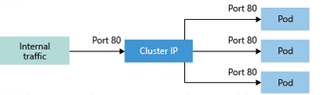
* **NodePort:** Ana bilgisayar (node) IP adresi ve belirli bir port üzerinden uygulamaya doğrudan erişim sağlayan bir port haritalaması oluşturur.
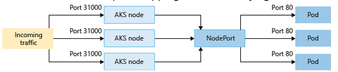
* **LoadBalancer:** Bir Azure Load Balancer kaynağı oluşturur, harici bir IP adresi yapılandırır ve pod'ları yük dengeleyicinin arka uç havuzuna bağlar.
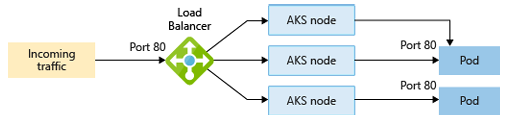
* **ExternalName:** Uygulama erişimini kolaylaştırmak için özel bir DNS girdisi oluşturur.

### Pod'lar
Pod'lar uygulamanızın mantıksal örneğidir. Genellikle geçici (ephemeral) kaynaklardır. Pod oluşturulurken minimum ve maksimum **CPU/RAM kaynak sınırları (resource limits)** tanımlanabilir. Bu sınırlar Kubernetes Scheduler'ın pod'ları en uygun düğüme atamasına yardımcı olur.

---

## AKS Depolamasını Yapılandırma (Configure AKS Storage)

Uygulama verilerini saklamak ve erişmek için kullanılan temel depolama bileşenleri:

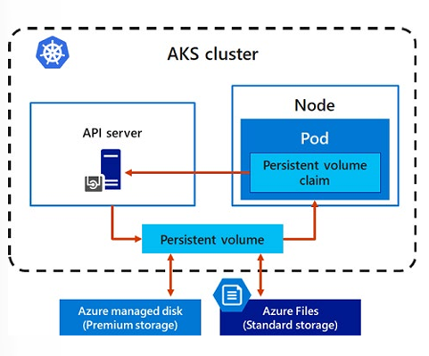

* **Volumes:** Pod yaşam döngüsü boyunca veri saklamayı sağlayan temel depolama birimidir. **Azure Disks** (yalnızca tek bir düğüme `ReadWriteOnce` olarak bağlanabilir) veya **Azure Files** (SMB 3.0 ile birden fazla düğüm/pod arasında eşzamanlı `ReadWriteMany` paylaşılabilir) altyapısını kullanır.
* **Persistent Volume (PV):** Kubernetes API'si tarafından yönetilen ve pod'un yaşam döngüsünden bağımsız olarak veriyi koruyan depolama kaynağıdır.
* **Storage Classes:** Depolama katmanlarını (Standard SSD, Premium SSD vb.) ve geri kazanım politikasını (`reclaimPolicy`: pod silindiğinde diskin silinmesi veya saklanması) tanımlar. AKS'te varsayılan olarak `default`, `managed-premium`, `azurefile` ve `azurefile-premium` sınıfları gelir.
* **Persistent Volume Claims (PVC):** Belirli bir StorageClass, erişim modu ve boyutta depolama talebinde bulunan yapıdır. PV ile PVC arasında 1:1 eşleşme vardır.

---

## AKS Ölçeklendirmesini Yapılandırma (Configure AKS Scaling)

İş yükü taleplerine göre AKS kümesi ve pod sayıları ölçeklendirilebilir:

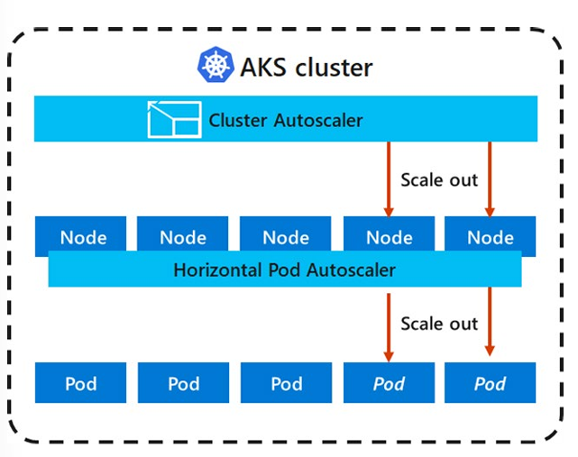

### 1. Manuel Ölçeklendirme
Pod (replica) veya düğüm (node) sayısı `kubectl` komutları veya portal üzerinden elle değiştirilebilir.

### 2. Horizontal Pod Autoscaler (HPA)
Metrics Server'ı kullanarak pod'ların CPU/RAM kullanımını her 30 saniyede bir denetler ve belirlenen eşik değerlere göre pod sayısını (replica) otomatik artırır veya azaltır.
* **Cooldown (Yarış Koşullarını Önleme):** Ölçekleme olaylarının hemen ardından sistemin stabil hale gelmesi için bekleme süreleri tanımlanır. Varsayılan olarak **Scale Up bekleme süresi 3 dakika**, **Scale Down bekleme süresi 5 dakikadır**.

### 3. Cluster Autoscaler
Pod'ların kaynak taleplerini karşılayacak yeterli düğüm bulunmadığında devreye girer. API sunucusunu her 10 saniyede bir denetler. Düğüm kaynakları yetersiz kaldığında yeni VM düğümleri ekler (Scale Up); 10 dakika boyunca boşta kalan düğümleri ise kümeden çıkarır (Scale Down).

---

## Azure Container Instances (ACI) ile Sanal Düğümlere (Virtual Nodes) Ölçeklendirme

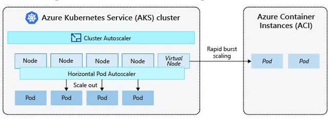

Büyük yük patlamalarında (burst demand), yeni VM düğümlerinin açılması birkaç dakika sürebilir. Bu bekleme süresini ortadan kaldırmak için AKS, **Azure Container Instances (ACI)** ile entegre edilerek **Virtual Kubelet** teknolojisi kullanılır.

* ACI, AKS kümeniz için sanal bir Kubernetes düğümü (Virtual Node) gibi görünür.
* Pod'lar saniyeler içinde ACI üzerinde çalışmaya başlar.
* Altyapı yönetimi gerektirmez, yalnızca kullanılan saniye kadar ücretlendirilir.
* Sanal düğümler AKS ile aynı sanal ağın (VNet) farklı bir alt ağına (subnet) yerleştirilerek güvenli iletişim sağlanır.

---

## Terraform Uygulama Örneği

Aşağıdaki HCL kodu, Otomatik Ölçeklendirme (Cluster Autoscaler) etkinleştirilmiş bir AKS kümesini ve ona bağlı bir Düğüm Havuzunu (Node Pool) dağıtmaktadır:

```hcl
# Kaynak Grubu
resource "azurerm_resource_group" "rg" {
  name     = "rg-aks-prod"
  location = "westeurope"
}

# AKS Kümesi (Managed Kubernetes)
resource "azurerm_kubernetes_cluster" "aks" {
  name                = "aks-fleet-prod-001"
  location            = azurerm_resource_group.rg.location
  resource_group_name = azurerm_resource_group.rg.name
  dns_prefix          = "aksfleetprod"

  # System Node Pool (Cluster Autoscaler Etkin)
  default_node_pool {
    name                = "systempool"
    vm_size             = "Standard_D2s_v5"
    enable_auto_scaling = true
    min_count           = 2
    max_count           = 5
    os_disk_size_gb     = 50
  }

  identity {
    type = "SystemAssigned"
  }

  network_profile {
    network_plugin    = "kubenet"
    load_balancer_sku = "standard"
  }

  tags = {
    environment = "production"
  }
}

# Ek User Node Pool (Uygulama İş Yükleri İçin)
resource "azurerm_kubernetes_cluster_node_pool" "user_pool" {
  name                  = "userpool"
  kubernetes_cluster_id = azurerm_kubernetes_cluster.aks.id
  vm_size               = "Standard_D4s_v5"
  enable_auto_scaling   = true
  min_count             = 1
  max_count             = 10

  tags = {
    environment = "production"
  }
}
```

