# Modül 1: Yönetişim ve Hesaplama (Compute) Çözümlerinin Tasarlanması

---

## 1. BÖLÜM: Yönetişim Çözümü Tasarlama (Design a Governance Solution)

### Giriş (Introduction)
Yönetişim (Governance), kural ve politikaların belirlenmesi ve bu kuralların uygulanmasını sağlayan genel süreçtir. İyi bir yönetişim stratejisi, bulutta yönettiğiniz uygulama ve kaynaklar üzerinde kontrol sahibi olmanızı sağlar.

Gelişmiş bir yönetişim stratejisi şunlarla uyumlu kalmanızı sağlar:
* **Endüstri Standartları:** Bilgi güvenliği yönetimi vb.
* **Kurumsal/Örgütsel Standartlar:** Ağ verilerinin şifrelenmesini sağlamak vb.

**Yönetişim şu durumlarda en yüksek faydayı sağlar:**
* Azure üzerinde çalışan birden fazla mühendislik/geliştirme takımı olduğunda.
* Yönetilmesi gereken birden fazla Azure aboneliği (Subscription) olduğunda.
* Zorunlu kılınması gereken mevzuat/uyumluluk (Regulatory) gereksinimleri olduğunda.
* Tüm bulut kaynakları için takip edilmesi gereken standartlar bulunduğunda.

---

### Müşteri Senaryosu: Tailwind Traders ile Tanışın (Meet Tailwind Traders)

Tailwind Traders, dünya genelinde fiziki mağazalara ve çevrim içi satış kanalına sahip kurgusal bir yapı market perakendecisidir. Şirketin CTO'su Azure'un sunduğu fırsatların farkındadır ancak güçlü bir yönetişim mekanizması olmaksızın ortamın yönetilmesinin zorlaşacağını, maliyetlerin izlenip kontrol edilmesinin imkansız hale geleceğini bilmektedir. CTO, Azure'un yönetişim standartlarını nasıl yönettiğini ve uyguladığını anlamak istemektedir.

---

### Öğrenme Hedefleri ve Ölçülen Beceriler (Learning Objectives & Skills Measured)
Bu bölümde şunların tasarım ilkelerini öğreneceksiniz:
* Yönetişim (Governance)
* Yönetim Grupları (Management Groups)
* Azure Abonelikleri (Subscriptions)
* Kaynak Grupları (Resource Groups)
* Azure Politikaları (Azure Policies)
* Kaynak Etiketleri (Resource Tags)
* Azure Blueprints (Şablonlar)

**Sınav Boyutu (AZ-305):** Kimlik, Yönetişim ve İzleme Tasarımı başlığı altındaki Yönetişim Tasarımı yetkinliklerini kapsar.

---

### Yönetişim İçin Tasarım (Design for Governance)
Azure hiyerarşisi tipik olarak 4 seviyeden oluşur:
1. **Management Groups (Yönetim Grupları):** Birden fazla abonelik için erişim, politika ve uyumluluğu yönetmeye yardımcı olur.
2. **Subscriptions (Abonelikler):** Yönetim, ölçekleme ve **fatura/maliyet sınırları (billing boundaries)** sunan mantıksal kapsayıcılardır.
3. **Resource Groups (Kaynak Grupları):** Azure kaynaklarının dağıtıldığı ve yönetildiği mantıksal kapsayıcılardır.
4. **Resources (Kaynaklar):** Oluşturduğunuz servis örnekleridir (Sanal makineler, depolama hesapları, SQL veritabanları vb.).

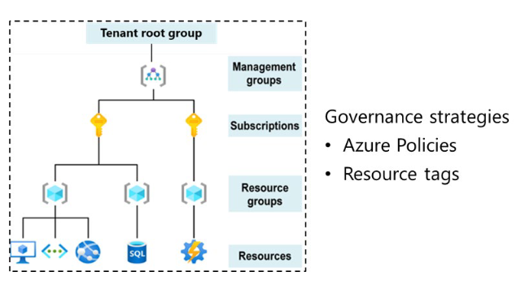

> **Not:** **Tenant Root Group (Kiracı Kök Grubu)**, tüm yönetim gruplarını ve abonelikleri içerir. Dizin (Directory) seviyesinde küresel politikaların ve Azure rol atamalarının yapılmasını sağlar.

---

### Yönetim Grupları İçin Tasarım (Design for Management Groups)
Yönetim grupları, politikaları ve rol atamalarını alt seviyedeki tüm aboneliklere miras (inheritance) yoluyla aktarır.

**Bilinmesi Gereken Önemli Kurallar:**
* Yönetim grupları, Azure Policy aracılığıyla politika ve girişim (initiative) atamalarını birleştirmek için kullanılabilir.
* Bir Yönetim Grubu ağacı (tree) **en fazla 6 seviye derinliği** destekler (Tenant Root seviyesi ve Subscription seviyesi bu sınıra dahil değildir).
* Yönetim grubu işlemleri için Azure RBAC yetkilendirmesi varsayılan olarak etkin değildir.
* Varsayılan olarak tüm yeni abonelikler **Root Management Group** altına yerleştirilir.

**Tasarım Yaklaşımları ve İpuçları:**
* **Yönetişimi Ön Planda Tutun:** Aynı güvenlik, uyumluluk, ağ bağlantısı ve özellik ayarlarına ihtiyaç duyan tüm iş yükleri için politikaları yönetim grubu seviyesinde uygulayın.
* **Düz Bir Hiyerarşi Koruyun:** İdeal olarak **3 veya 4 seviyeyi** geçmeyin. Çok karmaşık hiyerarşilerin yönetimi zorlaşır.
* **Top-Level (En Üst Seviye) Yönetim Grubu:** Tüm organizasyon çapında geçerli ortak platform politikalarını ve RBAC atamalarını desteklemek için kullanılır.
* **Organizasyonel / Departman Yapısı:** Satış (Sales), İK (HR), BT (IT) gibi iş birimlerine göre ayırma.
* **Coğrafi Yapı:** Farklı bölgelerdeki yasal uyumlulukları sağlamak için Doğu/Batı gibi bölge bazlı ayırma.
* **Üretim (Production) Yönetim Grubu:** Tüm kurumsal ürünler için geçerli politikaları ayrıştırır.
* **Sandbox Yönetim Grubu:** Kullanıcıların üretim ortamlarını riske atmadan Azure üzerinde deney yapabilmelerini (isolation) sağlar.
* **Hassas Bilgilerin İzolasyonu:** Yüksek güvenlik/uyumluluk gerektiren departmanları (Örn. Hukuk, İK) ayrı yönetim gruplarında tutun.

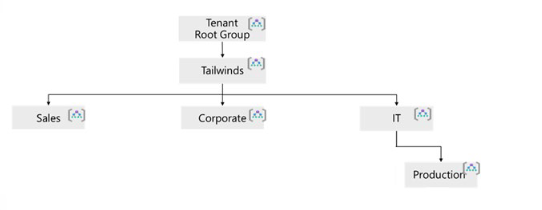

---

### Abonelikler İçin Tasarım (Design for Subscriptions)
Azure Abonelikleri, yönetim, ölçeklendirme ve faturalandırma sınırları olarak işlev gören mantıksal kapsayıcılardır.

**Bilinmesi Gerekenler:**
* Azure servislerini kullanmak ve ödemesini yapmak için bir abonelik şarttır. Enterprise Agreement (EA) veya Pay-as-You-Go gibi farklı tipleri vardır.
* Özel iş yüklerini ölçeklendirmek, geliştirme/test/üretim gibi farklı faturalandırma ortamları oluşturmak ve maliyetleri takip etmek için kullanılır.

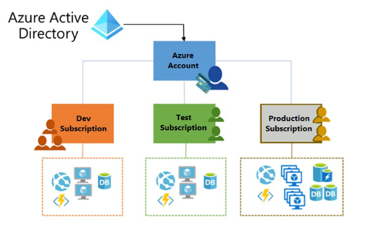

**Tasarım Mimarisi ve Dikkate Alınacak Hususlar:**
* **Demokratikleştirilmiş Yönetim Birimi:** Aboneliklerinizi iş ihtiyaçlarına ve önceliklerine göre hizalayın.
* **Miras Alma (Inheritance):** Benzer politikalara sahip abonelikleri aynı yönetim grubu altında toplayarak izinlerin yukardan miras alınmasını sağlayın.
* **Paylaşılan Servisler Aboneliği (Shared Services Subscription):** ExpressRoute, Virtual WAN gibi ortak ağ kaynaklarının tek bir yerde faturalandırılması ve izole edilmesi için ayrı bir abonelik düşünülmelidir.
* **Ölçek Sınırları (Scale Limits):** Abonelikler bir ölçekleme birimidir. Büyük ve özelleştirilmiş iş yükleri (HPC, IoT, SAP vb.) abonelik limitlerine (örn. Azure Data Factory entegrasyon sınırları) takılmamak için ayrı aboneliklerde tutulmalıdır.
* **Yönetim Sınırları:** İK ve Hukuk gibi departmanlar için tek bir ortak abonelik mi kullanılacak, yoksa tamamen ayrılacak mı karar verilmelidir.
* **Ağ Topolojileri:** Sanal ağlar (VNet) abonelikler arasında doğrudan paylaşılamaz. Abonelikler arası iletişim için **VNet Peering** veya **VPN** gerekir.
* **Erişim İncelemeleri (Access Reviews):** Abonelik sahiplerinin yetkilerinin zamanla şişmesini (privilege creep) önlemek için Microsoft Entra PIM (Privileged Identity Management) ile periyodik erişim incelemeleri yapılmalıdır.

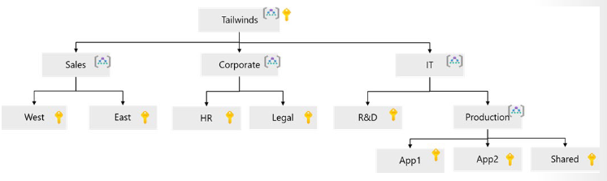

---

### Kaynak Grupları İçin Tasarım (Design for Resource Groups)
Kaynak grupları, Azure kaynaklarının (Web App, SQL DB, Storage vb.) dağıtıldığı ve yönetildiği mantıksal kapsayıcılardır.

**Kaynak Grupları Hakkında Bilinmesi Gerekenler:**
* Kaynak gruplarının kendi **bölgesi (region)** vardır ve bu bölge **metaverinin (metadata)** saklandığı yerdir.
* Kaynak grubunun bölgesi kesintiye uğrarsa, içindeki kaynakların metaverisi güncellenemez (ancak farklı bölgelerdeki kaynaklar çalışmaya devam eder).
* Kaynak grubundaki kaynaklar **farklı bölgelerde** bulunabilir.
* Kaynaklar, farklı kaynak gruplarındaki kaynaklara bağlanabilir (Örn. Web App'in ayrı RG'deki SQL'e bağlanması).
* Kaynaklar gruplar arasında taşınabilir.
* Kaynak grupları **iç içe geçemez (cannot be nested)**.
* Bir kaynak yalnızca **bir ve sadece bir** kaynak grubunda bulunabilir.
* Kaynak grupları **yeniden adlandırılamaz (cannot be renamed)**.

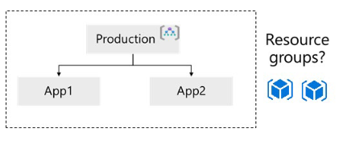

**Gruplama Stratejileri:**
* **Tipe Göre (Group by Type):** Bağımsız servisler için (örn. Tüm SQL veritabanları tek bir RG'de, tüm Web servisleri ayrı RG'de).
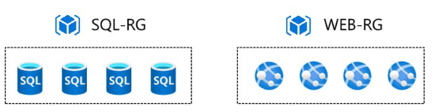
* **Uygulamaya Göre (Group by App):** Tüm kaynakların aynı yaşam döngüsüne ve politikalara sahip olduğu durumlarda (App1 RG, App2 RG).
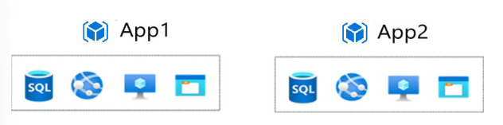
* **Yaşam Döngüsüne Göre (Lifecycle):** Aynı anda dağıtılacak, güncellenecek ve silinecek tüm kaynakları aynı kaynak grubuna koyun.
* **Erişim Kontrolü ve Kilitler (Resource Locks):** Yanlışlıkla silinmeyi önlemek için kaynak grubu seviyesinde kilitler (`CanNotDelete`, `ReadOnly`) kullanın.

---

### Kaynak Etiketleme İçin Tasarım (Design for Resource Tagging)
Etiketler (Tags), kaynaklarınıza ek bilgi (metaveri) sağlayan **Ad-Değer (Name-Value)** çiftleridir (Örn. `env: production`).

> **İpucu:** Etiketleme projesine başlamadan önce amacınızı belirleyin: Raporlama, faturalandırma, arama kolaylığı veya otomatik betikler (scripts) için mi kullanacaksınız?

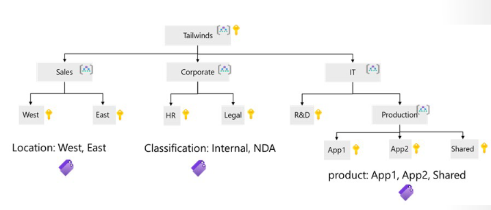

**Etiket Kuralları ve Yaklaşımlar:**
* Etiketler abonelik, kaynak grubu veya kaynak seviyesinde eklenebilir.
* Bir kaynak grubuna etiket eklediğinizde, altındaki kaynaklar bu etiketleri **otomatik olarak miras almaz**.
* **IT-Aligned vs Business-Aligned:** IT odaklı etiketleme iş yükü/ortam bilgisine odaklanırken (`env=prod`), İş odaklı etiketleme finansal sorumluluk ve iş değerine odaklanır (`costCenter=101`).

**Etiket Kategorileri (Tag Categories):**

| Etiket Türü | Örnekler | Açıklama |
| :--- | :--- | :--- |
| **Functional (İşlevsel)** | `app=catalog`, `tier=web`, `env=prod` | İş yükü içindeki amacı, dağıtıldığı ortamı ve operasyonel detayları gösterir. |
| **Classification (Sınıflandırma)** | `confidentiality=private`, `SLA=24hours` | Kaynağın nasıl kullanıldığını ve hangi politikaların uygulandığını sınıflandırır. |
| **Accounting (Muhasebe)** | `department=finance`, `costCenter=101` | Faturalandırma amacıyla kaynağı organizasyonel gruplarla ilişkilendirir. |
| **Partnership (Sahiplik/Ortaklık)** | `owner=jsmith`, `stakeholders=user1` | IT dışındaki ilgili kişi ve sahipleri gösterir. |
| **Purpose (Amaç/İş Kritikliği)** | `businessimpact=high` | Yatırım kararlarını desteklemek için kaynağı iş işlevleriyle hizalar. |

---

### Azure Policy İçin Tasarım (Design for Azure Policy)
Azure Policy, kaynaklarınızın kurumsal standartlara ve iş kurallarına uyumlu kalmasını sağlayan, denetleyen (audit) ve zorunlu kılan (enforce) bir servistir.

* **Tekil Politikalar ve Girişimler (Initiatives):** Birbirleriyle ilişkili politikalar bir araya getirilerek "Initiative" (Girişim) oluşturulabilir.
* **Miras Alma:** Politikalar hiyerarşide aşağıya doğru miras alınır.
* **Azure Policy vs. Azure RBAC:**
  * **Azure RBAC:** **Kullanıcı eylemlerine ve kimliğe** odaklanır (Kim neye erişebilir, hangi yetkiyle yapabilir?).
  * **Azure Policy:** **Kaynak özelliklerine (properties)** odaklanır (Kullanıcının yetkisi olsa dahi oluşturulmak istenen kaynağın konumu, boyutu, konfigürasyonu kurallara uygun mu?).

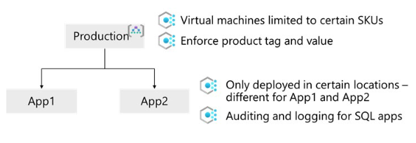

---

### Azure RBAC İçin Tasarım (Design for Azure Role-Based Access Control)
Azure RBAC, kaynaklar üzerinde fine-grained (ince taneli) erişim yönetimi sağlar.

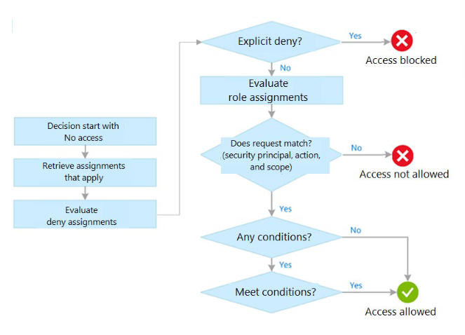

**Temel Tasarım Prensipleri:**
* **İzin Verme Modeli (Allow Model):** RBAC eklemeli (additive) bir izin modelidir. Bir rol atandığında eylemlere izin verilir, açıkça tanımlanmamışsa reddedilir.
* **En Az Yetki Prensibi (Least Privilege):** Kullanıcılara sadece işlerini yapacakları minimum yetki verilmelidir.
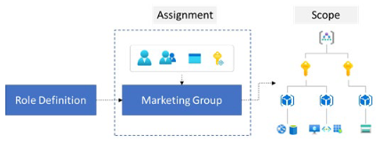
* **Atamaları Kullanıcılara Değil Gruplara Yapın:** Doğrudan kullanıcılara rol atamak yerine Microsoft Entra (Azure AD) gruplarına atama yapın.
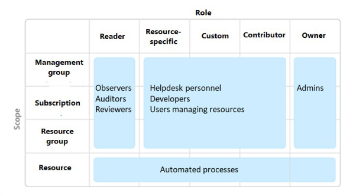
* **Özel Rol (Custom Role):** Yerleşik (built-in) roller yetersiz kaldığında özel roller oluşturulabilir.
* **Çakışan Rol Atamaları:** İzinler toplanır. Abonelik seviyesinde *Contributor* (Katkıda Bulunan), Kaynak Grubu seviyesinde *Reader* (Okuyucu) olan bir kişinin nihai yetkisi *Contributor*'dur.

| Alan | Azure Policy | Azure RBAC |
| :--- | :--- | :--- |
| **Açıklama** | Kaynakların kurallara uygunluğunu sağlar. | İnce taneli erişim kontrolü sağlayan yetkilendirme sistemidir. |
| **Odak Noktası** | Kaynakların özellikleri (Properties). | Kullanıcıların hangi kaynaklara erişebildiği. |
| **Uygulama** | Kurallar kümesi tanımlanır. | Rol ve kapsama alanı (Scope) atanır. |
| **Varsayılan Erişim** | Varsayılan olarak izin verilir (Allow). | Varsayılan olarak tüm erişimler reddedilir (Deny). |

---

### Azure Blueprints İçin Tasarım (Design for Azure Blueprints)
Azure Blueprints; Kaynak Grupları, ARM Şablonları, Politikalar ve Rol Atamalarını tek bir pakette toplayarak tekrarlanabilir ve standart dağıtımlar yapmanızı sağlar.

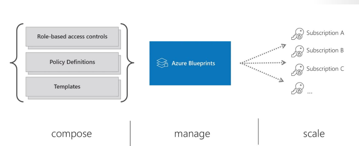

> 💡 **GÜNCEL MİMARİ VE SINAV NOTU (2026 GÜNCELLEMESİ):**
> Sınav dokümanında Azure Blueprints yer alsa da Microsoft, Blueprints servisini kademeli olarak silmeye (**deprecate**) karar vermiştir. Güncel Azure mimarisinde ve yeni sınav revizyonlarında Blueprints yerine **Azure Deployment Stacks** ve **Azure Policy / Bicep** entegrasyonu önerilmektedir.

---

## 2. BÖLÜM: Hesaplama Çözümü Tasarlama (Design a Compute Solution)

### Giriş (Introduction)
Tailwind Traders şirketinde Mimar (Architect) olarak çalıştığınızı varsayalım. Tailwind Traders, çevrim içi satış yapan ve donanım üretimi alanında uzmanlaşmış bir şirkettir. Yönetim ekibi, birkaç geliştirme projesinin buluta taşınması gerektiğini bildirdi. Ayrıca bulut için optimize edilmesi gereken birkaç yeni proje bulunmaktadır.

Departmanın bütçesinin kısıtlı olduğunu biliyorsunuz. Her proje için doğru hesaplama (compute) teknolojisini seçmek büyük önem taşımaktadır. İdeal olarak, hesaplama kaynaklarını oluşturmak, konfigüre etmek ve yalnızca kullandığınız kadar ödeme yapmak istiyorsunuz.

---

### Öğrenme Hedefleri (Learning Objectives)
Bu bölümde şunları öğreneceksiniz:
* Hesaplama servisi seçimi (Choose a compute service).
* Azure Virtual Machines (Sanal Makine) çözümleri tasarımı.
* Azure Batch çözümleri tasarımı.
* Azure Functions çözümleri tasarımı.
* Azure Logic Apps çözümleri tasarımı.
* Azure Container Instances (ACI) çözümleri tasarımı.
* Azure App Services çözümleri tasarımı.
* Azure Kubernetes Service (AKS) çözümleri tasarımı.

---

### Ölçülen Beceriler (Skills Measured)
Bu bölümdeki içerik sizi **Exam AZ-305: Designing Microsoft Azure Infrastructure Solutions** sınavına hazırlar:
* İş yükü gereksinimlerine göre uygun boyutta bir hesaplama çözümü önerme.
* Konteyner tabanlı bir hesaplama çözümü önerme.
* Sunucusuz (Serverless) tabanlı bir hesaplama çözümü önerme.
* Sanal Makine (VM) tabanlı bir hesaplama çözümü önerme.

---

### Ön Koşullar (Prerequisites)
* Azure hesaplama çözümleri hakkında kavramsal bilgi.
* Sanal makineler, konteynerler ve App Service ile çalışma deneyimi.

---

### Hesaplama Servisi Seçimi (Choose a Compute Service)
**Hesaplama (Compute)**, uygulamalarınızın üzerinde çalıştığı kaynakların barındırma modelini ifade eder. Azure farklı ihtiyaçlara yönelik çeşitli hesaplama servisleri sunar:

* **Virtual Machines (IaaS):** Bir Azure sanal ağı (VNet) içinde sanal makineler dağıtın ve yönetin.
* **Azure Batch (PaaS):** Büyük ölçekli, paralel ve yüksek performanslı hesaplama (HPC) uygulamalarını çalıştırmak için yönetilen servis.
* **Azure Functions (FaaS):** Altyapı endişesi duymadan bulutta kod çalıştırmak için yönetilen servis.
* **Azure Logic Apps (PaaS):** Otomatik iş akışları oluşturmak ve çalıştırmak için bulut tabanlı platform.
* **Container Instances (PaaS):** Azure'da konteyner çalıştırmanın en hızlı ve basit yolu. Sanal makine tedarik etmeniz veya üst seviye bir servise ihtiyacınız yoktur.
* **App Service (PaaS):** Web uygulamaları, mobil arka uçlar, RESTful API'ler veya otomatik iş süreçlerini barındırmak için yönetilen servis.
* **Azure Kubernetes Service - AKS (PaaS):** Konteynerleştirilmiş uygulamaları çalıştırmak için yönetilen Kubernetes servisi.
* **Azure Service Fabric:** Ölçeklenebilir ve güvenilir mikroservisleri ve konteynerleri paketlemeyi, dağıtmayı ve yönetmeyi kolaylaştıran dağıtık sistemler platformu.

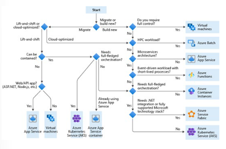

#### Bulut Göçü Stratejileri (Migration Strategies)
* **Lift-and-shift (Rehosting):** Uygulamayı yeniden tasarlamadan veya kod değişikliği yapmadan iş yüklerini buluta taşıma stratejisidir. En az kesinti ve değişimle geçiş sağlar.
* **Cloud-optimized (Bulut Optimize):** Uygulamanın bulut-yerel (cloud-native) özelliklerden ve yeteneklerden yararlanacak şekilde yeniden mimari edilmesi (refactoring) sürecidir.

---

### Barındırma Seçeneklerinin İncelemesi (Review the Compute Hosting Options)
Hesaplama çözümlerinde 3 ana barındırma modeli bulunur. Seçtiğiniz model, geliştirici (Developer) ile bulut sağlayıcısının (Microsoft) sorumluluk paylaşımını (Shared Responsibility) belirler:

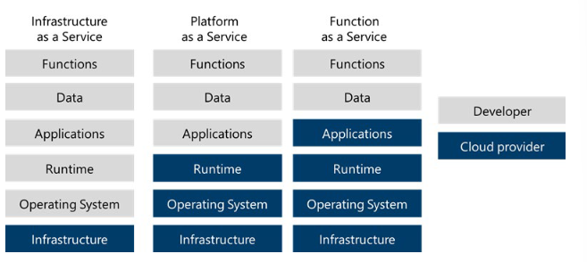

1. **Infrastructure-as-a-Service (IaaS):** İlgili ağ ve depolama bileşenleriyle birlikte bağımsız VM'ler oluşturmanızı sağlar. Yazılım ve uygulamaları siz yönetirsiniz. Geleneksel ortamlarımıza en yakın modeldir.
2. **Platform-as-a-Service (PaaS):** VM'leri veya ağ kaynaklarını yönetmek zorunda kalmadan uygulamanızı dağıtabileceğiniz yönetilen bir barındırma ortamı sağlar (Örn: Azure App Service).
3. **Functions-as-a-Service (FaaS):** Barındırma ortamı kaygısını tamamen ortadan kaldırır. Sadece kodu dağıtırsınız ve servis bunu otomatik çalıştırır (Örn: Azure Functions).

---

### Azure Sanal Makine (VM) Çözümleri Tasarlama (Design for Azure Virtual Machine Solutions)
Sanal makineler, IaaS modelinin temelini oluşturur. Esnek ve ölçeklenebilir altyapı ihtiyaçları veya geleneksel uygulamaların doğrudan buluta taşınması (Lift-and-shift) için idealdir.

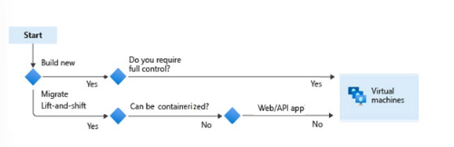

#### VM Tasarım Kontrol Listesi (Design Checklist):
1. **Ağ ile Başlayın (Start with the network):** Sanal makineden önce ağ konfigürasyonu (IP adresleri, alt ağlar/subnets) planlanmalıdır. Kurulum sonrası IP bloklarını değiştirmek zordur.
2. **VM'yi Adlandırın (Name the VM):** Anlaşılır ve tutarlı bir adlandırma standardı seçin (Örn: `devusc-webvm01` -> US South Central bölgesindeki ilk geliştirme web sunucusu).
3. **Konumu Belirleyin (Decide the location):** Kullanıcılara en yakın bölgeyi (Region) seçmek performansı artırır, yasal/uyumluluk gereksinimlerini karşılar. Bölge seçiminde donanım kullanılabilirliği ve fiyat farkları dikkate alınmalıdır.
4. **VM Boyutunu Belirleyin (Determine the size):** İş yükü tipine göre uygun seriyi seçin:
   * **General Purpose (Genel Amaçlı):** Dengeli CPU/Bellek oranı. Test/Dev, küçük-orta veritabanları, düşük-orta trafikli web sunucuları.
   * **Compute Optimized (İşlemci Odaklı):** Yüksek CPU/Bellek oranı. Orta trafikli web sunucuları, ağ cihazları, toplu (batch) işlemler.
   * **Memory Optimized (Bellek Odaklı):** Yüksek Bellek/CPU oranı. İlişkisel veritabanı sunucuları, önbellekleme (in-memory analytics).
   * **Storage Optimized (Depolama Odaklı):** Yüksek disk verimliği ve IOPS. NoSQL ve büyük SQL veritabanları.
   * **GPU:** Ağır grafik işleme, video düzenleme, derin öğrenme (Deep Learning) model eğitimi.
   * **High Performance Compute (HPC):** Yüksek hızlı ağ arayüzlerine sahip en güçlü CPU makineleri.
5. **Fiyatlandırma Modelini İnceleyin (Review the pricing model):**
   * **Hesaplama Maliyeti (Compute):** Dakika bazlı faturalandırılır. VM durdurulup serbest bırakılırsa (deallocated) hesaplama ücreti ödenmez.
   * **Depolama Maliyeti (Storage):** Diskin kapladığı alan için ayrı faturalandırılır. VM kapalı olsa dahi disk ücreti ödenmeye devam eder.
6. **Depolama Seçeneklerini İnceleyin (Review storage options):** Yönetilen Diskler (Managed Disks) kullanılması önerilir.
7. **İşletim Sistemini Seçin (Select an OS):** Windows veya Linux sürümleri seçilebilir. Komple uygulama yığınları için Azure Marketplace görselleri (Marketplace Images) kullanılabilir.

---

### Azure Batch Çözümleri Tasarlama (Design for Azure Batch Solutions)
Azure Batch, bulutta büyük ölçekli paralel ve yüksek performanslı hesaplama (HPC) işlerini yürütür. Altyapı yönetimine gerek kalmadan işlemci yoğunluklu görevleri zamanlar ve kaynakları dinamik olarak ayarlar.

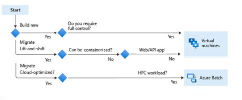

#### Ne Zaman Kullanılır?
* Paralel iş yükleri (birbirinden bağımsız çalışan uygulamalar).
* Sıkı bağlı (tightly coupled) iş yükleri (birbiriyle haberleşen uygulamalar - Örn: Monte Carlo simülasyonları, resim/video işleme).

#### Nasıl Çalışır?
1. Girdi dosyaları ve uygulama paketleri Azure Storage hesabına yüklenir.
2. Gereksinim bazlı hesaplama düğümleri (compute nodes - VM havuzları) oluşturulur.
3. İşler (jobs) ve görevler (tasks) çalıştırılır.
4. Tamamlanan işlerin ardından havuz otomatik olarak küçültülür (scale-down) ve sonuçlar depolama hesabına yazılır.

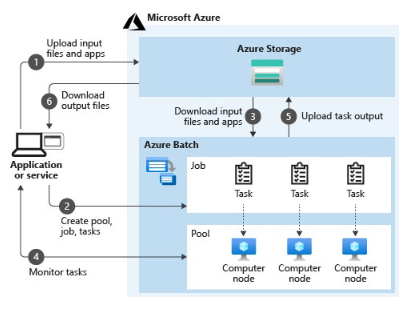

#### En İyi Uygulamalar (Best Practices):
* **Havuzlar (Pools):** Kısa süreli işler için sürekli yeni havuz oluşturmayın, dinamik havuz yönetimi kullanın.
* **Düğümler (Nodes):** Kesintisiz ilerleme gerektiren kritik iş yüklerinde birden fazla düğüm içeren havuzlar ayırın.
* **İşler (Jobs):** Görevleri verimli boyutlandırılmış işler halinde gruplayın (Örn: 10 görev içeren 100 iş yerine 1000 görev içeren 1 iş kullanmak daha verimlidir).

---

### Azure App Services Çözümleri Tasarlama (Design for Azure App Services Solutions)
Azure App Service; web uygulamaları, arka plan işleri, mobil arka uçlar ve RESTful API'leri barındırmak için kullanılan HTTP tabanlı bir **PaaS** servisidir.

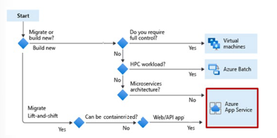

#### Öne Çıkan Özellikler ve Tipler:
* **Çoklu Dil Desteği:** ASP.NET, Java, Node.js, Python, PHP, Ruby vb.
* **Deployment Slots (Dağıtım Yuvaları):** Kodunuzu canlıya alırken kesintisiz (zero-downtime) geçiş yapmanızı sağlar. Staging ortamına dağıtım yapıp test ettikten sonra tek bir işlemle Production ve Staging slotları yer değiştirilir (Swap).
* **Dahili Kimlik Doğrulama (Easy Auth):** Kod yazmadan Microsoft Entra ID (eski adıyla Azure AD), Google, Facebook gibi sağlayıcılarla kimlik doğrulaması yapabilirsiniz.
* **App Service Tipleri:** Web Apps, API Apps, WebJobs (arka plan görevleri için), Mobile Apps.

---

### Azure Container Instances (ACI) Çözümleri Tasarlama
Sanal makine veya Kubernetes gibi karmaşık orkestratör altyapısı kurmadan doğrudan konteyner çalıştırmanın en hızlı ve basit yoludur.

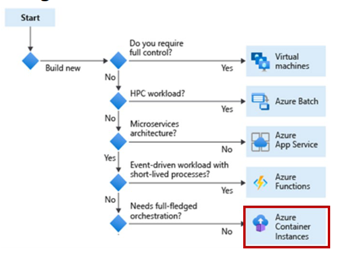

#### Avantajları:
* **Hızlı Başlatma:** Konteynerler saniyeler içinde başlar.
* **Saniye Bazlı Fatura:** Yalnızca konteyner çalıştığı sürece maliyet oluşur.
* **Hypervisor Seviyesinde Güvenlik:** VM seviyesinde tam izolasyon sağlar.
* **Container Groups (Konteyner Grupları):** Aynı konakta (host) zamanlanan konteyner koleksiyonudur. Yerel ağı, depolama birimlerini ve yaşam döngüsünü paylaşırlar (Örn: Web uygulaması konteyneri + Log toplama konteyneri).

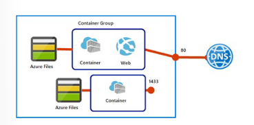

#### Konteyner vs Sanal Makine Karşılaştırması:

| Özellik | Konteynerler (Containers) | Sanal Makineler (VMs) |
| :--- | :--- | :--- |
| **İzolasyon** | Hafif izolasyon sağlar, çekirdeği (kernel) paylaşır. | İşletim sistemi seviyesinde tam izolasyon sağlar. |
| **İşletim Sistemi** | Sadece uygulamanın ihtiyaç duyduğu kullanıcı modunu çalıştırır. | Tam bir işletim sistemi çalıştırır (Daha çok kaynak tüketir). |
| **Dağıtım** | Docker veya AKS gibi orkestratörlerle hızlı dağıtım. | Hyper-V, PowerShell veya ARM şablonlarıyla dağıtım. |
| **Kalıcı Depolama** | Azure Disks veya Azure Files (SMB) kullanılır. | Sanal Sabit Disk (VHD) kullanılır. |

---

### Azure Kubernetes Service (AKS) Çözümleri Tasarlama
AKS, karmaşık, ölçeklenebilir ve mikroservis mimarisine sahip konteyner ortamlarını otomatikleştiren ve yöneten PaaS tabanlı Kubernetes servisidir.

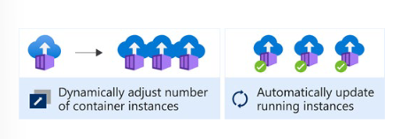

#### Neden AKS Seçilmeli?
* **Yönetilen Küme (Managed Cluster):** Kontrol düzlemi (Control Plane / Master Node) Azure tarafından ücretsiz yönetilir; yalnızca worker node'lar (VM'ler) için ödeme yapılır.
* **Otomatik Ölçekleme (Autoscaling):**
  * *Horizontal Pod Autoscaler (HPA):* Pod yüküne göre pod sayısını artırır.
  * *Cluster Autoscaler:* Düğüm kaynakları yetersiz kaldığında otomatik yeni VM ekler.
* **Entegrasyonlar:** Microsoft Entra ID kimlik doğrulaması, Azure Monitor ile izleme ve Azure Container Registry (ACR) ile özel imaj kullanımı.

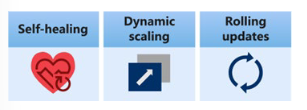

---

### Sunucusuz (Serverless) Hesaplama: Azure Functions
Azure Functions, olay odaklı (event-driven) çalışan, altyapı yönetimi gerektirmeyen "kod olarak hesaplama" (FaaS) çözümüdür.

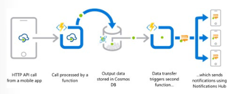

#### Kullanım Senaryoları ve İpuçları:
* **Olay Odaklı Yapı:** API çağrıları, veritabanı değişiklikleri veya kuyruk mesajlarına yanıt olarak çalışır.
* **Uzun Süren İşlerden Kaçının:** Varsayılan zaman aşımı (timeout) süreleri bulunur (Consumption plan için 5 dk / 300 sn).
* **Durable Functions:** Durum bilgisi saklayan (stateful) ve uzun süren iş akışlarını (örneğin *Function Chaining* - fonksiyonları sırayla çalıştırma) yönetmek için kullanılır.
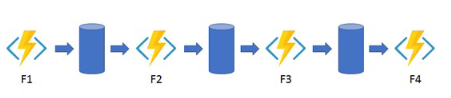
* **Ayrı Depolama Hesapları:** Yüksek işlem hacmine sahip Function App'ler için performans amacıyla ayrı Azure Storage hesapları kullanın.

---

### Sunucusuz İş Akışları: Azure Logic Apps
Logic Apps, uygulamaları, verileri, servisleri ve sistemleri entegre eden görsel (design-first) iş akışları platformudur.

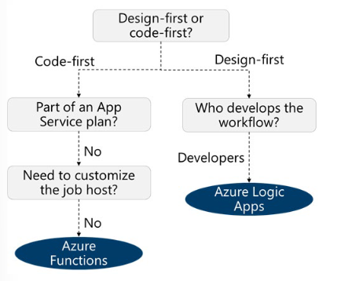

#### Azure Functions ve Logic Apps Karşılaştırması:

| Karşılaştırma Alanı | Durable Functions | Logic Apps |
| :--- | :--- | :--- |
| **Geliştirme** | Kod Odaklı (Code-first) | Görsel Tasarım Odaklı (Designer-first) |
| **Yöntem** | Kod yazma ve Durable extension kullanımı | GUI arayüzü veya JSON/Bicep konfigürasyonu |
| **Bağlantı (Connectivity)** | Özel binding'ler ve kodlama | 400+'den fazla hazır konnektör (Connectors) |
| **İzleme** | Azure Application Insights | Azure Portal, Azure Monitor Logları |
| **Çalışma Ortamı** | Yerel (Local) veya Bulut | Sadece Bulut |

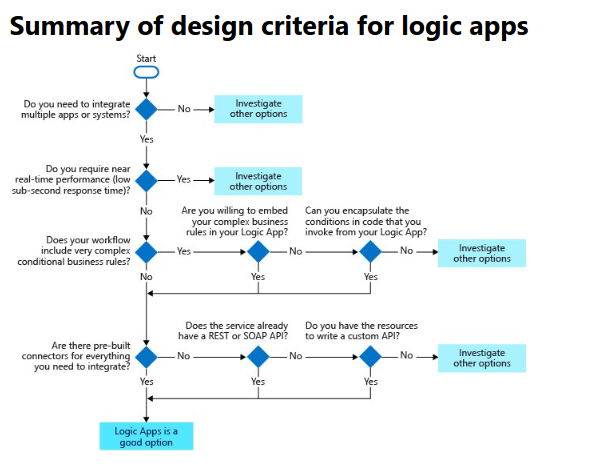

---
