# Modül 2: Depolama ve Veri Entegrasyonu Çözümlerinin Tasarlanması (Design Storage and Data Integration Solutions)

---

## 1. BÖLÜM: İlişkisel Olmayan Veri Depolama Çözümü Tasarlama (Design a Nonrelational Data Storage Solution)

### Giriş (Introduction)

Tailwind Traders’ın CTO'su şu soruyu soruyor: *"İlişkisel olmayan verilerimiz (non-relational data) için depolama çözümümüz nedir?"* CTO'nun bu sorusu oldukça makuldür ve Azure Mimarlarının (Azure Architects) yardımcı olabileceği bir alandır. Bu modülde farklı depolama stratejilerini keşfedeceğiz. Depolama stratejileri; veri türlerini, depolama hesaplarını (storage accounts), blob depolamayı (blob storage), dosya depolamayı (file storage), disk depolamayı (disk storage), depolama güvenliğini (storage security) ve veri korumasını (data protection) kapsayacaktır.

---

### Öğrenme Hedefleri (Learning Objectives)
Bu modülde şunları öğreneceksiniz:
* Veri depolama için tasarım yapma.
* Azure depolama hesapları (storage accounts) için tasarım yapma.
* Azure blob depolama (blob storage) için tasarım yapma.
* Azure dosyaları (Azure Files) için tasarım yapma.
* Bir Azure disk çözümü tasarlama.
* Depolama güvenliği için tasarım yapma.

---

### Ölçülen Beceriler (Skills Measured)
Bu modüldeki içerik, **AZ-305: Designing Microsoft Azure Infrastructure Solutions** sınavına hazırlanmanıza yardımcı olur. Modül kavramları şu başlığı kapsar:

**İlişkisel olmayan veriler için bir veri depolama çözümü tasarlama:**
* Özellikleri, performansı ve maliyeti dengelemek için bir veri depolama çözümü önerme.
* Koruma ve dayanıklılık (durability) için bir veri çözümü tasarlama.
* Veri depolamasına erişim kontrol çözümleri önerme.

---

### Ön Koşullar (Prerequisites)
* Depolama hesapları, blob'lar, dosyalar, diskler ve veri koruma hakkında kavramsal bilgi.
* Depolama sistemleri oluşturma ve güvenliğini sağlama konusunda çalışma deneyimi.

---

### Veri Depolama İçin Tasarım (Design for Data Storage)
Azure depolamayı tasarlamak için öncelikle ne tür bir veriye sahip olduğunuzu belirlemeniz gerekir:

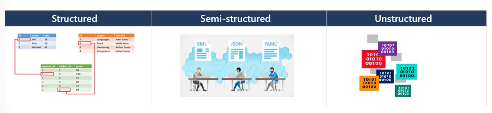

* **Yapılandırılmış Veri (Structured Data):** İlişkisel verileri içerir ve ortak bir şemaya (schema) sahiptir. Yapılandırılmış veri genellikle satırları, sütunları ve anahtarları (keys) olan veritabanı tablolarında saklanır. Genellikle e-ticaret web siteleri gibi uygulama depolamalarında kullanılır.
* **Yarı Yapılandırılmış Veri (Semi-structured Data):** Yapılandırılmış veriye göre daha az organize olmuştur ve ilişkisel bir formatta saklanmaz. Yarı yapılandırılmış veri alanları tablolara, satırlara ve sütunlara tam olarak uymaz. Verinin nasıl organize edildiğini açıklayan etiketler (tags) içerir. Bu stildeki verinin ifadesi ve yapısı bir serileştirme dili (serialization language) ile tanımlanır. Örnekler: Hypertext Markup Language (HTML) dosyaları, JavaScript Object Notation (JSON) dosyaları ve Extensible Markup Language (XML) dosyaları.
* **Yapılandırılmamış Veri (Unstructured Data):** En az organize olmuş veri türüdür. Yapılandırılmamış verinin organizasyonu muğlaktır (ambiguous). Örnekler:
  * Fotoğraflar, videolar ve ses dosyaları gibi medya dosyaları
  * Word belgeleri gibi Office dosyaları
  * Metin (text) dosyaları

> **Önemli:** Bu modül yalnızca yapılandırılmamış verileri kapsayacaktır. Bu veri türleri sıklıkla **ilişkisel olmayan veri (non-relational data)** olarak adlandırılır.

#### Azure İlişkisel Olmayan Depolama Nesneleri (Azure Non-relational Storage Objects)
Azure'da ilişkisel olmayan veriler birkaç farklı depolama veri nesnesinde tutulur. Odaklanacağımız 4 ana veri depolama nesnesi bulunmaktadır:

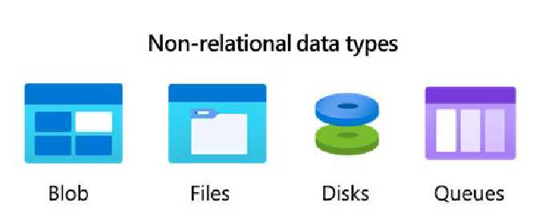

1. **Azure Blob Storage:** Muazzam miktardaki yapılandırılmamış veriyi depolamak için kullanılan bir nesne deposudur (object store). Blob, *Binary Large Object* anlamına gelir ve görüntüler ile multimedya dosyaları gibi nesneleri içerir.
2. **Azure Files:** Paylaşımlı bir depolama servisidir. Dosyalara Windows üzerinde Server Message Block (SMB) veya Linux üzerinde Network File Share (NFS) ile erişebilirsiniz.
3. **Azure Managed Disks (Yönetilen Diskler):** Azure tarafından yönetilen ve Azure sanal makineleriyle kullanılan blok seviyesinde depolama birimleridir (block-level storage volumes). Fiziksel bir sunucudaki diske benzer ancak sanallaştırılmıştır.
4. **Azure Queue Storage:** Büyük miktarda mesajı depolamak için kullanılan bir servistir. Kuyruklar (queues) genellikle eşzamansız (asynchronously) işlenecek iş birikimleri oluşturmak için kullanılır.

---

### Azure Depolama Hesapları İçin Tasarım (Design for Azure Storage Accounts)
Veri depolama gereksinimlerinizi belirledikten sonra depolama hesapları (storage accounts) oluşturmanız gerekir. Bir Azure depolama hesabı, ihtiyacınız olan tüm Azure Depolama servislerini bir arada gruplar. Depolama hesabı, HTTPS üzerinden dünyanın her yerinden erişilebilen (doğru izinlere sahip olunduğu varsayımıyla) benzersiz bir ad alanı (namespace) sağlar. Depolama hesabınızdaki veriler dayanıklı (durable), yüksek erişilebilir (highly available), güvenli ve devasa ölçeklenebilirdir.

#### Uygun Depolama Hesabı Türünü Seçme (Select the Appropriate Storage Account Kind)
Azure Storage birkaç tür depolama hesabı sunar. Her tür farklı özellikleri destekler ve kendi fiyatlandırma modeline sahiptir:

| Depolama Hesabı Türü | Desteklenen Servisler | Önerilen Kullanım |
| :--- | :--- | :--- |
| **Standard general-purpose v2** | Blob (Data Lake Storage dahil), Queue, Table storage, Azure Files | Tüm depolama servislerini destekler: Blob, Azure Files, Queue, Disk (Page Blob) ve Table. |
| **Premium block blobs** | Blob storage (Data Lake Storage dahil) | Yüksek işlem oranları (high transaction rates) gerektiren uygulamalar için idealdir. Küçük nesneler kullanan veya tutarlı bir şekilde düşük depolama gecikmesi gerektiren durumlar için de uygundur. Uygulamalarınızla birlikte ölçeklenecek şekilde tasarlanmıştır. |
| **Premium file shares** | Azure Files | Kurumsal veya yüksek performanslı ölçekteki uygulamalar için önerilir. Hem SMB hem de NFS dosya paylaşımlarını destekleyen bir depolama hesabına ihtiyacınız varsa Premium file shares kullanın. |
| **Premium page blobs** | Yalnızca Page blobs | Premium yüksek performanslı page blob senaryoları. Page blob'lar, sanal makineler ve veritabanları için OS ve veri diskleri gibi dizin tabanlı ve seyrek (sparse) veri yapılarını depolamak için idealdir. |

#### Kaç Tane Depolama Hesabı Oluşturulacağını Belirleme
Bir depolama hesabı; konum, çoğaltma (replication) stratejisi ve abonelik sahibi gibi ayarların bir koleksiyonunu temsil eder. Organizasyonlar farklı gereksinim kümelerini uygulamak için sıklıkla birden fazla depolama hesabına sahip olurlar.

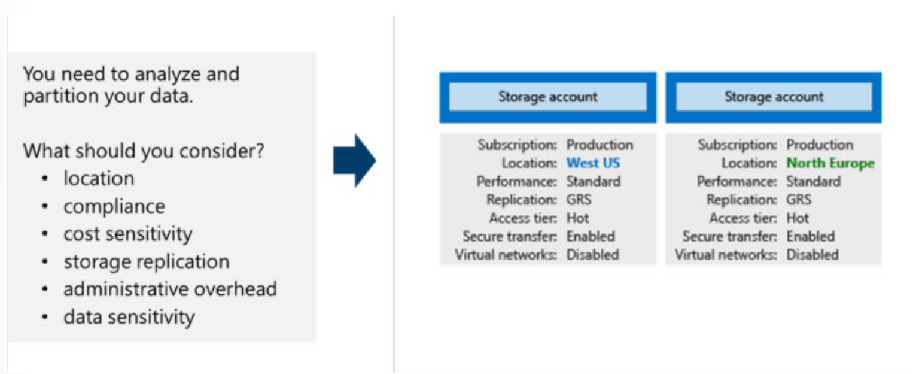

**Kaç tane depolama hesabı oluşturulacağına karar verirken dikkate alınacak hususlar:**
* **Konum (Location):** Belirli bir ülkeye veya bölgeye özgü verileriniz var mı? Performans nedenleriyle verileri kullanıcılarınıza yakın bir konuma yerleştirmek isteyebilirsiniz. Her konum için ayrı bir depolama hesabına ihtiyacınız olabilir.
* **Uyumluluk (Compliance):** Şirketinizin verileri belirli bir konumda tutmak için yasal düzenleme kuralları var mı? Şirketinizin verileri denetlemek veya depolamak için iç gereksinimleri var mı?
* **Maliyet (Cost):** Bir depolama hesabının tek başına finansal bir maliyeti yoktur; ancak hesap için seçtiğiniz ayarlar servislerin maliyetini etkiler. Geo-redundant (coğrafi yedekli) depolama, locally redundant (yerel yedekli) depolamadan daha maliyetlidir. Premium performans ve Hot (sıcak) erişim katmanı blob maliyetini artırır. Departman veya proje bazında harcamaları takip etmeniz gerekiyor mu?
* **Çoğaltma (Replication):** Veri depolamanızın farklı çoğaltma stratejileri var mı? Örneğin verilerinizi kritik ve kritik olmayan kategorilere ayırabilirsiniz. Kritik verilerinizi geo-redundant depolama hesabına, kritik olmayan verilerinizi locally redundant depolama hesabına koyabilirsiniz.
* **Yönetimsel Yük (Administrative Overhead):** Her depolama hesabı bir yöneticinin oluşturması ve bakımını yapması için zaman gerektirir. Ayrıca bulut depolamanıza veri ekleyen herkes için karmaşıklığı artırır.
* **Veri Hassasiyeti (Data Sensitivity):** Bazı verileriniz özel (proprietary), bazıları ise halka açık tüketim için mi? Özel veriler için sanal ağları (virtual networks) etkinleştirip kamuya açık olanlar için etkinleştirmeyebilirsiniz. Bu durum ayrı depolama hesapları gerektirebilir.
* **Veri İzolasyonu (Data Isolation):** Yasal veya iç politikalar verilerin ayrılmasını gerektirebilir. Bir uygulamadaki verilerin başka bir uygulamadaki verilerden ayrılması gerekebilir.

---

### Veri Yedekliliği İçin Tasarım (Design for Data Redundancy)
Azure Storage verilerinizin her zaman birden fazla kopyasını saklar. Bu yedeklilik; planlı ve plansız olaylara (donanım arızaları, ağ/güç kesintileri, doğal afetler) karşı veriyi korur.

#### Birincil Bölgede Yedeklilik (Redundancy in the Primary Region)

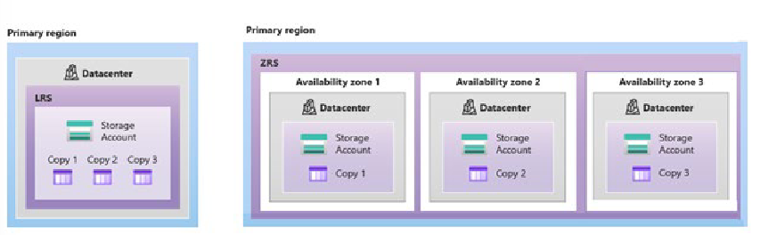

* **Locally Redundant Storage (LRS):** En düşük maliyetli ve en az dayanıklılığa sahip seçenektir. Verinizi tek bir veri merkezindeki sunucu rafı ve sürücü arızalarına karşı korur. Veri merkezi çökerse veriler kaybolabilir. Verilerin kaybolması durumunda kolayca yeniden oluşturulabildiği senaryolar için uygundur.
* **Zone-Redundant Storage (ZRS):** Birincil bölgedeki üç Azure Kullanılabilirlik Alanı (Availability Zone) arasında eşzamanlı (synchronously) olarak çoğaltılır. Bir alan kullanılmaz hale gelse bile verilerinize okuma/yazma erişimi devam eder.

#### İkincil Bölgede Yedeklilik (Redundancy in a Secondary Region)
Yüksek dayanıklılık gerektiren uygulamalar için verileri ikincil bir bölgeye kopyalamayı seçebilirsiniz:

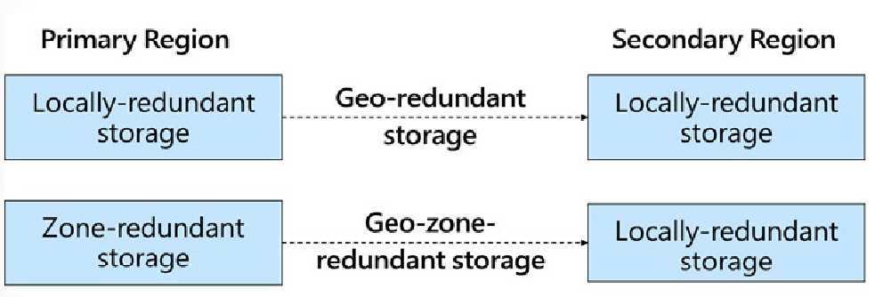

* **Geo-Redundant Storage (GRS):** Birincil bölgede LRS kullanır, ikincil bölgeye ise eşzamansız (asynchronously) olarak veriyi LRS ile kopyalar.
* **Geo-Zone-Redundant Storage (GZRS):** Birincil bölgede ZRS kullanır, ikincil bölgeye ise eşzamansız olarak veriyi LRS ile kopyalar.
* **RA-GRS / RA-GZRS (Read-Access):** İkincil bölgeye kopyalanan verilerin, birincil bölgede bir kesinti yaşanmasa dahi **okuma amaçlı** erişilebilir olmasını sağlar.

---

### Azure Blob Storage İçin Tasarım (Design for Azure Blob Storage)

#### Blob Erişim Katmanını Belirleme (Determine the Azure Blob Access Tier)
Verilerinizi uygun erişim katmanına yerleştirerek depolama maliyetlerini optimize edin:

| Özellik | Premium | Hot (Sıcak) Tier | Cool (Soğuk) Tier | Archive (Arşiv) Tier |
| :--- | :--- | :--- | :--- | :--- |
| **Kullanılabilirlik (Availability)** | %99.9 | %99.9 | %99 | Çevrimdışı (Offline) |
| **Kullanım Ücretleri** | Yüksek depolama, en düşük erişim maliyeti | Yüksek depolama, düşük erişim maliyeti | Düşük depolama, yüksek erişim maliyeti | En düşük depolama, en yüksek erişim maliyeti |
| **Minimum Depolama Süresi** | Yok | Yok | 30 gün | 180 gün |
| **Gecikme (Latency)** | Tek haneli milisaniyeler | Milisaniyeler | Milisaniyeler | Saatler |

* **Premium Blob Storage:** Düşük ve tutarlı depolama gecikmesi gerektiren I/O yoğun iş yükleri için en iyisidir. SSD kullanır.
* **Hot Access Tier:** Sık okunan ve yazılan veriler için optimize edilmiştir. Varsayılan katmandır.
* **Cool Access Tier:** Seyrek erişilen ve en az 30 gün kalacak büyük miktardaki veriler için optimize edilmiştir (Kısa süreli yedekler vb.).
* **Archive Access Tier:** Esnek okuma süresine (saatler süren rehydration) toleransı olan ve en az 180 gün kalacak veriler için optimize edilmiştir. En ucuz depolama seçeneğidir.

#### Azure Blob Immutable (Değiştirilemez) Depolama Gereksinimleri
Immutable Storage, verileri **WORM (Write Once, Read Many)** durumunda saklamanızı sağlar. WORM durumundaki veriler silinemez ve değiştirilemez.
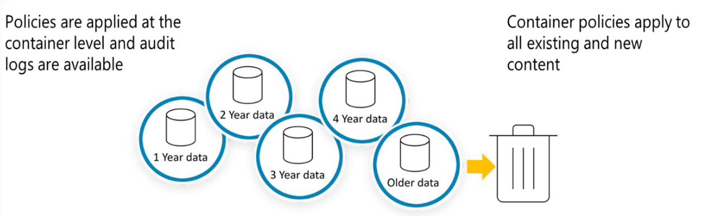
* **Zaman Tabanlı Tutma Politikaları (Time-based retention policies):** Belirtilen süre boyunca verinin silinmesini ve değiştirilmesini engeller. Süre dolduktan sonra silinebilir ancak üzerine yazılamaz.
* **Yasal Tutma Politikaları (Legal hold policies):** Yasal inceleme kaldırılana kadar verileri değiştirmeye ve silmeye karşı korur.

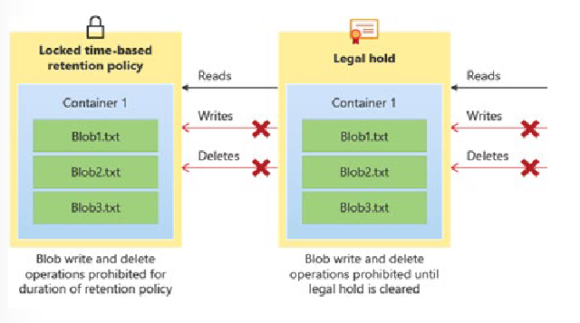

---

### Azure Files İçin Tasarım (Design for Azure Files)
Azure Files, endüstri standardı SMB/CIFS ve NFS protokolleri ile erişilebilen sunucusuz (serverless) dosya paylaşımları sağlar.

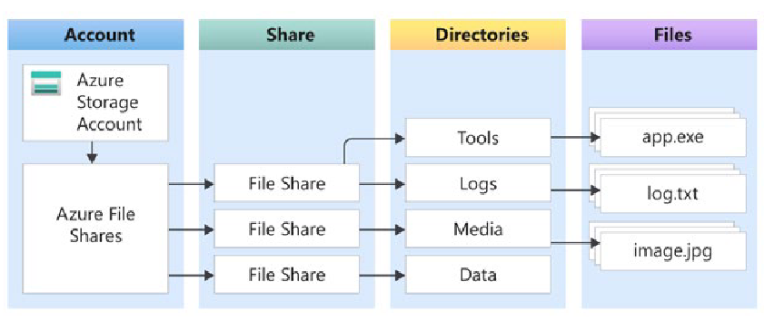

#### Veri Erişim Yöntemini Seçin
* **Azure Dosya Paylaşımının Doğrudan Bağlanması (Direct Mount):** Windows, macOS ve Linux üzerindeki standart SMB istemcisi ile doğrudan buluttaki paylaşıma bağlanılır.
* **Azure File Sync ile Önbellekleme:** Şirket içi (on-premises) Windows Server sunucularınızı Azure File Sync kullanarak Azure dosya paylaşımınızın hızlı bir yerel önbelleğine (local cache) dönüştürebilirsiniz.

#### Performans Seviyesi ve Depolama Katmanları
* **Premium:** SSD tabanlıdır. Yüksek IOPS (100,000) ve düşük gecikme gerektiren veritabanları veya yoğun iş yükleri içindir.
* **Transaction Optimized:** Standart HDD tabanlıdır. Yüksek işlem hacimli ancak Premium gecikmesine ihtiyaç duymayan iş yükleri içindir.
* **Hot (Sıcak):** Ekip paylaşımları gibi genel amaçlı dosya paylaşım senaryoları içindir.
* **Cool (Soğuk):** Çevrim içi arşiv depolama senaryoları için maliyet etkin çözümdür.

#### Azure Blobs, Azure Files ve Azure NetApp Files Karşılaştırması

| Kategori | Azure Blob Storage | Azure Files | Azure NetApp Files |
| :--- | :--- | :--- | :--- |
| **Kullanım Senaryoları** | Büyük ölçekli, okuma ağırlıklı ardışık erişim iş yükleri. Analitik, yedekleme, medya işleme. | Rastgele erişim iş yükleri, ortak dosya paylaşımları, home directory'ler, ACI/AKS konteyner depolamaları. | Kurumsal NAS taşımaları, SAP HANA gibi ultra düşük gecikme ve yüksek IOPS gerektiren kritik iş yükleri. |
| **Kullanılabilir Protokoller** | NFS 3.0, REST, Data Lake Storage Gen2 | SMB, NFS 4.1 | NFS 3.0 ve 4.1, SMB |
| **Performans (Birim Başına)** | 20,000 IOPS'a kadar, 100 GiB/s verimlilik | 100,000 IOPS'a kadar, 80 GiB/s verimlilik | 460,000 IOPS'a kadar, 36 GiB/s verimlilik |

---

### Azure Disk Çözümleri Tasarlama (Design for Azure Disk Solutions)
Sanal makineler tarafından kullanılan veri diskleridir (data disks). Disk başına maksimum kapasite 32,767 GB'tır. Microsoft her zaman **Managed Disks (Yönetilen Diskler)** kullanımını önerir.

#### Veri Diski Türünü Belirleme

| Detay | Ultra-disk | Premium SSD | Standard SSD | Standard HDD |
| :--- | :--- | :--- | :--- | :--- |
| **Senaryo** | SAP HANA, üst seviye veritabanları (SQL, Oracle) gibi IO-yoğun iş yükleri. | Üretim ve performansa duyarlı iş yükleri. | Web sunucuları, az kullanılan kurumsal uygulamalar, Dev/Test. | Yedekleme, kritik olmayan, seyrek erişilen veriler. |
| **Maksimum Verimlilik**| 2,000 MB/s | 900 MB/s | 750 MB/s | 500 MB/s |
| **Maksimum IOPS** | 160,000 | 20,000 | 6,000 | 2,000 |
| **Disk Tipi** | SSD | SSD | SSD | HDD |

#### Disk Önbellekleme (Disk Caching) ile Performansı Artırma
* **Read-only (Salt Okunur):** Düşük okuma gecikmesi ve yüksek okuma IOPS'u sağlar.
* **Read-write (Okuma-Yazma):** Yalnızca uygulamanız önbellekteki verileri kalıcı disklere doğru şekilde yazmayı yönetebiliyorsa kullanılmalıdır.
* **None (Yok):** Yalnızca yazma yapılan (write-only) veya yazma yoğun diskler için önerilir.

> ⚠️ **Uyarı:** 4 TiB ve daha büyük diskler için önbellekleme desteklenmez.

#### Veri Disklerini Şifreleme İle Güvenli Hale Getirme
* **Azure Disk Encryption (ADE):** Sanal makinenin sanal sabit disklerini (VHD) şifreler.
* **Server-Side Encryption (SSE / Encryption-at-rest):** Depolama merkezindeki fiziksel disk seviyesinde yapılan şifrelemedir.
* **Encryption at Host:** Verilerin VM host sunucusu üzerinde şifrelenmesini ve depolama servisine şifreli akmasını sağlar.

---

### Depolama Güvenliği İçin Tasarım (Design for Storage Security)

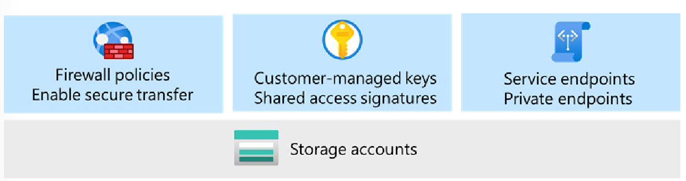

#### Shared Access Signatures (SAS) Kullanımı
SAS, depolama hesabınızdaki kaynaklara sınırlı ve devredilmiş (delegated) erişim sağlar. Müşterinin hangi kaynaklara erişebileceğini, hangi izinlere (okuma, yazma vb.) sahip olacağını ve SAS'ın ne kadar süre geçerli kalacağını belirleyebilirsiniz.

#### Güvenlik Duvarı Politikaları ve Kurallarını Etkinleştirme
Depolama hesabına erişimi belirli IP adresleri, IP aralıkları veya Azure Sanal Ağındaki (VNet) alt ağlar (subnets) ile sınırlandırmak için güvenlik duvarı kuralları tanımlayın.

#### Hizmet Uç Noktaları (Service Endpoints) ve Özel Uç Noktalar (Private Endpoints)
* **Service Endpoints:** Sanal ağınızdan Azure depolamaya doğrudan bağlantı sağlar. Trafik her zaman Microsoft Azure omurgasında kalır.

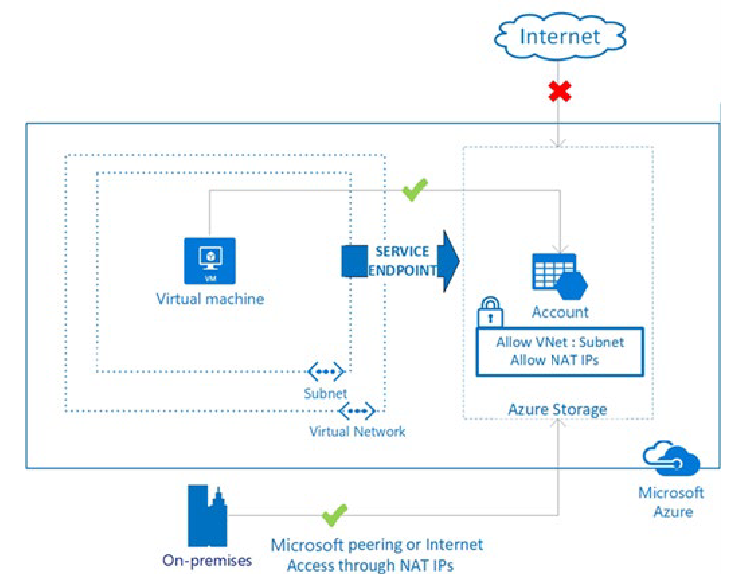

* **Private Endpoints:** Depolama hesabınız için sanal ağınız (VNet) içerisinden özel bir IP adresi tahsis eden özel bir ağ arayüzüdür (NIC). Dış dünyaya tamamen kapalı güvenli bağlantı sunar.

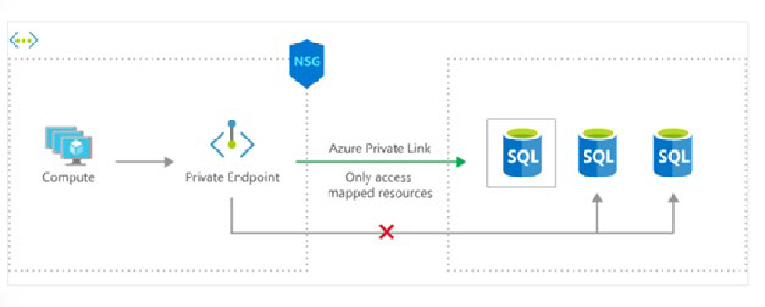

#### Müşteri Tarafından Yönetilen Şifreleme Anahtarları (Customer-Managed Keys)
Varsayılan olarak şifreleme anahtarları Microsoft tarafından yönetilir. İsteğe bağlı olarak **Customer-Managed Keys (BYOK)** seçeneğiyle anahtarlarınızı **Azure Key Vault** içerisinde saklayarak şifreleme sürecinin tam kontrolünü elinize alabilirsiniz.

---

### Güncel Mimari ve Sınav İpuçları (2026 Notları)
1. **Kimlik Yönetimi (Identity):** Tüm Azure servislerinde kimlik doğrulama işlemlerinde legacy anahtarlar yerine **Microsoft Entra ID** ve **Managed Identity (Yönetilen Kimlikler)** mimaride öncelikli olarak tercih edilmelidir.
2. **Erişim Güvenliği:** Sınav senaryolarında depolama hesabının kamuya açık internete kapatılması istendiğinde yanıt her zaman **Private Endpoint** kullanımıdır.
3. **Maliyet Optimizasyonu:** Otomatik katman geçişleri için **Azure Storage Lifecycle Management** politikalarının kullanımı mimari sorularda sıkça karşınıza çıkar.

# Modül 2: Depolama ve Veri Entegrasyonu Çözümlerinin Tasarlanması (Design Storage and Data Integration Solutions)

---

## 2. BÖLÜM: İlişkisel Veri Depolama Çözümü Tasarlama (Design a Relational Data Storage Solution)

### Giriş (Introduction)
Birçok kuruluşun eskimiş veya yetersiz tasarlanmış bir veri platformu stratejisi vardır. Mevcut sistemleri buluta taşıma, bulut ile hızlı bir şekilde yeni uygulamalar inşa etme ve şirket içi (on-premises) maliyetleri hafifletme yönünde önemli bir eğilim bulunmaktadır. Veri iş yüklerinizi buluta nasıl taşıyacağınıza dair bir plana ve kuruluşunuzu başarıya nasıl hazırlayacağınızı anlamaya ihtiyacınız vardır.

#### Tailwind Traders ile Tanışın
Tailwind Traders, çevrim içi satış yapan ve dünya genelinde fiziki perakende mağazaları işleten kurgusal bir yapı market şirketidir. Şu anda şirketin perakende web sitesini barındıran şirket içi bir veri merkezini (datacenter) yönetmektedir. Veri merkezi ayrıca uygulamaları için tüm verileri ve yayınlanan (streaming) videoları depolar. Şirket içindeki SQL Server; yalnızca şirket içi kullanım için tasarlanmış eğitim portalı web sitesinin verilerinin yanı sıra müşteri verileri, sipariş geçmişi ve ürün katalogları için de depolama sağlar.

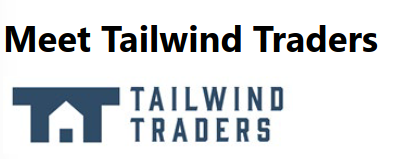

Tailwind Traders, veritabanını buluta taşıyarak veritabanı ihtiyaçlarını etkili bir şekilde yönetmek istemektedir. Düşük gecikme süresi (low latency) ve yüksek erişilebilirlik (high availability) sağlayan maliyet etkin bir veritabanı çözümü bulmakla görevlendirildiniz.

Tailwind Traders'ın CTO'su şu soruyu soruyor: *"İlişkisel verilerimiz (relational data) için depolama çözümümüz nedir?"* CTO'nun sorusu son derece makuldür ve Azure Mimarlarının yardımcı olabileceği bir alandır. Bu modülde farklı türdeki sorunları çözen çeşitli depolama çözümlerini keşfedeceğiz. Depolama çözümleri Azure SQL Database, Azure SQL Managed Instance, Azure Sanal Makinesinde SQL Server, Azure SQL Edge, Azure Tables ve Cosmos DB'yi kapsayacaktır. Ayrıca çözümünüzü veri şifrelemesi (data encryption) ile nasıl tasarlayacağınızı da öğreneceksiniz.

---

### Öğrenme Hedefleri (Learning Objectives)
Bu modülde şunları yapabileceksiniz:
* Azure SQL Database için tasarım yapma
* Azure SQL Managed Instance için tasarım yapma
* Azure VM üzerinde SQL Server için tasarım yapma
* Veritabanı Ölçeklenebilirliği (Database Scalability) için bir çözüm önerme
* Durağan veri (data at rest), aktarılan veri (data in transmission) ve kullanımda olan veri (data in use) için şifreleme tasarlama
* Azure SQL Edge için tasarım yapma
* Azure Tabloları (Azure Tables) için tasarım yapma
* Azure Cosmos DB için tasarım yapma

---

### Ölçülen Beceriler (Skills Measured)
Bu modüldeki içerik, **Exam AZ-305: Designing Microsoft Azure Infrastructure Solutions** sınavına hazırlanmanıza yardımcı olur:

**İlişkisel Veriler İçin Veri Depolama Çözümü Tasarlama:**
* Veritabanı servis katmanı boyutlandırması önerme
* Veritabanı ölçeklenebilirliği için bir çözüm önerme
* Durağan veriyi, aktarılan veriyi ve kullanımda olan veriyi şifrelemek için çözüm önerme

**Veri Depolama Çözümü Önerme:**
* İlişkisel verileri depolamak için çözüm önerme

---

### Ön Koşullar (Prerequisites)
* Veritabanı çözümleriyle çalışma deneyimi
* SQL Server hakkında kavramsal bilgi

---

### Azure SQL Veritabanları İçin Tasarım (Design for Azure SQL Databases)
CTO, Tailwind Traders'ın şirket içi mevcut yapılandırılmış veri ihtiyaçlarını karşılamak ve ihtiyaç duyabileceği yeni ilişkisel veri iş yükleri için çözümler önermek amacıyla Azure veritabanları tasarlamanızı istedi.

Yapılandırılmış veri, ilişkisel verileri içerir ve ortak bir şemaya sahiptir. Yapılandırılmış veri genellikle satırları, sütunları ve anahtarları olan veritabanı tablolarında saklanır. E-ticaret web sitesi gibi uygulama depolamalarında sıklıkla kullanılır.

Azure SQL platformu çatısı altında, ihtiyaçlarınızı karşılamak için seçmeniz gereken birçok dağıtım seçeneği bulunur. Bu seçenekler tam olarak ihtiyacınız olanı almanıza ve yalnızca ihtiyacınız kadar ödeme yapmanıza esneklik sağlar. Dağıtım seçenekleri şunlardır: Sanal Makinelerde SQL Server, Azure SQL Managed Instance, Azure SQL Database, Azure SQL Managed Instance havuzları ve Azure SQL Database elastik veritabanı havuzları (elastic pools).

#### Azure SQL Dağıtım Seçeneklerini Analiz Etme
Azure, SQL Server'ı şu yöntemlerle sunar:
* **Azure VM'lerde SQL Server**
* **Managed Instances (Yönetilen Örnekler):**
  * Single instances (Tekil örnekler)
  * Instance pool (Örnek havuzu)
* **Databases (Veritabanları):**
  * Single database (Tekil veritabanı)
  * Elastic pool (Elastik havuz)

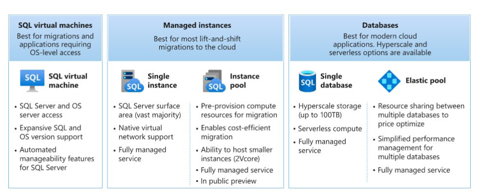

#### Azure SQL Database
Azure SQL Database, hem işletim sistemini hem de SQL Server örneğini soyutlayan Azure SQL PaaS dağıtım seçeneğidir. Sektörün en yüksek erişilebilirlik SLA'sı ile bulut için oluşturulmuş, yüksek oranda ölçeklenebilir, akıllı bir ilişkisel veritabanı hizmetidir.

Azure SQL Database, şu senaryoları destekleyen **tek** dağıtım seçeneğidir:
* Çok büyük veritabanları (şu anda 100 TB'a kadar)
* Öngörülemeyen iş yükleri için otomatik ölçeklendirme (Serverless/Sunucusuz)

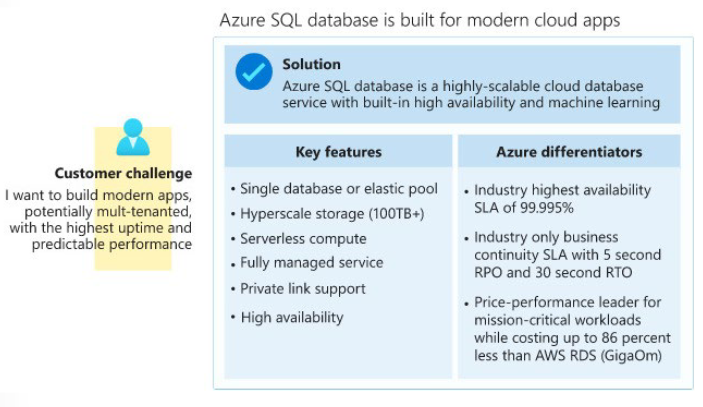

> **Örnek Senaryo (AccuWeather):** AccuWeather, büyük veri, makine öğrenimi ve yapay zeka yetenekleri için Azure'a erişmek istedi. Veritabanlarını yönetmeye değil, yeni modeller ve uygulamalar oluşturmaya odaklanmak istiyordu. Satış ve müşteri tahminleri yapmak amacıyla yeni dahili uygulamaları hızlı ve kolay bir şekilde dağıtmak için Azure Data Factory ve Azure Machine Learning gibi diğer hizmetlerle birlikte kullanmak üzere SQL Database'i seçti.

#### SQL Elastik Havuzları (SQL Elastic Pools) Nedir?
Bir Azure SQL veritabanı oluşturduğunuzda, bir SQL elastik havuzu oluşturabilirsiniz. Elastik havuzlar, havuzdaki tüm veritabanları arasında paylaşılan bir dizi işlem (compute) ve depolama (storage) kaynağı satın almanızı sağlar. Her veritabanı, mevcut yüke bağlı olarak belirlediğiniz sınırlar dahilinde ihtiyaç duyduğu kaynakları kullanabilir.

---

### Azure Satın Alma Modellerini Analiz Etme (Analyze Azure Purchasing Models)
Dağıtım seçeneğine karar verdikten sonra verilecek bir sonraki karar satın alma modelidir. Azure SQL Database iki satın alma modeline sahiptir:

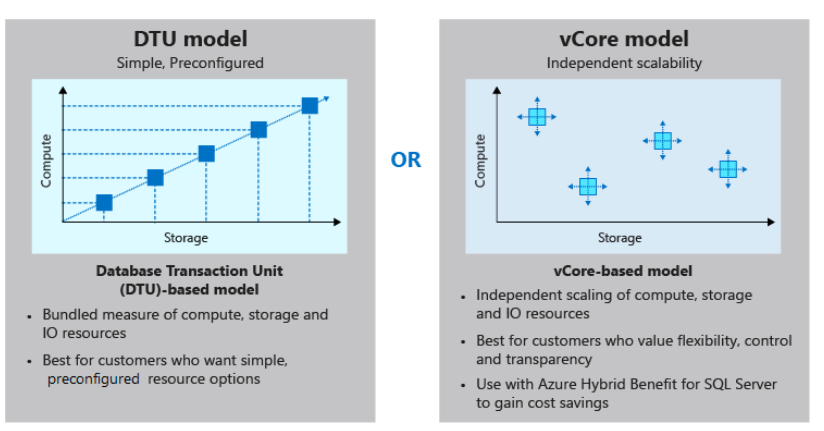

1. **vCore (Sanal Çekirdek) Modeli:** Oluşturduğunuz ve ödediğiniz işlem ve depolama kaynakları üzerinde daha fazla kontrol sağlayan vCore sayısını seçmenize olanak tanır. Bağımsız olarak işlem ve depolama kaynaklarını seçme esnekliği sunar. Azure Hybrid Benefit ve ayrılmış kapasite (reserved capacity - önceden ödeme) kullanarak tasarruf yapmanızı sağlar.
2. **DTU (Database Transaction Unit) Modeli:** İşlem, depolama ve I/O kaynaklarının birleşik bir ölçüsüdür. Önceden yapılandırılmış basit bir satın alma seçeneğidir. SQL Managed Instance üzerinde **kullanılamaz**.
3. **Serverless (Sunucusuz) Model:** Azure SQL Database'deki tekil veritabanları için bir işlem katmanıdır. İş yükü talebine göre işlemi otomatik olarak ölçeklendirir ve yalnızca kullanılan işlem miktarı için faturalandırır.

| Gereksinim | Önerilen Satın Alma Modeli |
| :--- | :--- |
| İşlem, depolama ve I/O kaynaklarının birleşik ölçüsüne ihtiyaç duyulduğunda | **DTU Modeli** |
| İşlem ve depolama kaynaklarını bağımsız olarak seçme esnekliğine ihtiyaç duyulduğunda | **vCore Modeli** |

---

### Azure Veritabanı Servis Katmanlarını Analiz Etme (Analyze Azure Database Service Tiers)
Performans, erişilebilirlik ve depolama ihtiyaçlarına bağlı olarak Azure, vCore modülü içinde üç veritabanı servis katmanı sunar. Azure SQL Database ve Azure SQL Managed Instance, altyapı arızalarında bile %99.99 erişilebilirlik sağlar.

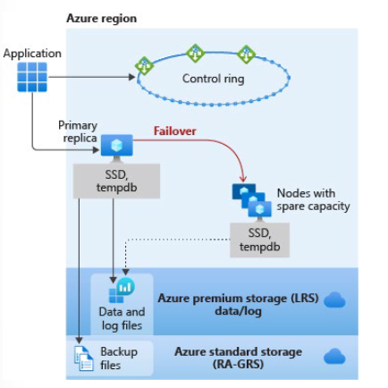

1. **General Purpose (Genel Amaçlı):** İş iş yükleri için dengeli işlem ve depolama seçenekleri sunar. Birincil kopya tempdb için yerel SSD kullanır; veri ve log dosyaları Azure Premium Storage'da saklanır. Yedekleme dosyaları Azure Standard Storage'da tutulur.
2. **Business Critical (İş Açısından Kritik):** Düşük gecikme süresine ve minimum kesinti süresine ihtiyaç duyan kritik iş uygulamaları içindir. Arka planda bir Always On Kullanılabilirlik Grubu (Availability Group - AG) dağıtmaya benzer. Veri ve log dosyalarının tümü doğrudan bağlı (direct-attached) SSD üzerinde çalışır, bu da ağ gecikmesini önemli ölçüde azaltır. Üç ikincil kopya bulunur.
3. **Hyperscale:** Depolamayı hızlı bir şekilde 100 TB'a kadar ölçeklendirerek değişen gereksinimlere uyum sağlayan tam yönetilen bir hizmettir. Esnek, bulut-yerel mimari, depolamanın gerektiği gibi büyümesini sağlar ve veri işleminin boyutundan bağımsız olarak verileri anında yedeklemenize ve veritabanınızı dakikalar içinde geri yüklemenize olanak tanır. (Azure SQL Managed Instance için **mevcut değildir**).

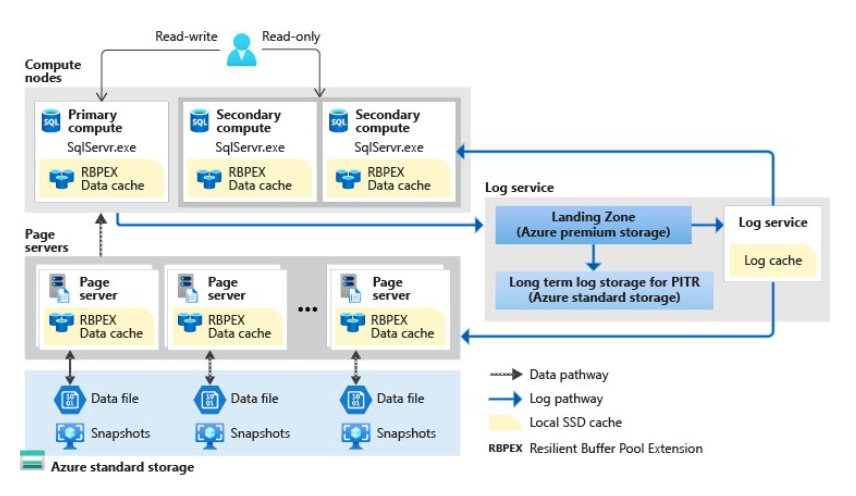

| Gereksinim | Öneri |
| :--- | :--- |
| Düşük gecikme süresi gereksinimleri ve iş uygulamaları için arızalara karşı en yüksek esneklik gerektiğinde | **Business Critical** |
| Yüksek oranda ölçeklenebilir depolama ve okuma ölçeklendirme (read-scale) gereksinimleri olduğunda | **Hyperscale** |
| İş iş yükleri için dengeli işlem ve depolama seçenekleri gerektiğinde | **General Purpose** |

---

### Azure SQL Managed Instances İçin Tasarım (Design for Azure SQL Managed Instances)
Azure SQL Managed Instance, Azure SQL'in PaaS dağıtım seçeneğidir. Bir SQL Server örneği sağlar ancak bir sanal makineyi yönetme yükünün çoğunu ortadan kaldırır. SQL Server'da bulunan özelliklerin çoğu SQL Managed Instance'ta mevcuttur.

SQL Managed Instance, örneğe özgü (instance-scoped) özellikleri kullanmak isteyen ve uygulamalarını yeniden mimari etmeden Azure'a taşımak isteyen müşteriler için idealdir.

#### Örneğe Özgü (Instance-Scoped) Özellikler:
* SQL Server Agent
* Service Broker
* Common Language Runtime (CLR)
* Database Mail
* Linked Servers (Bağlı Sunucular)
* Distributed Transactions (Dağıtık İşlemler)
* Machine Learning Services

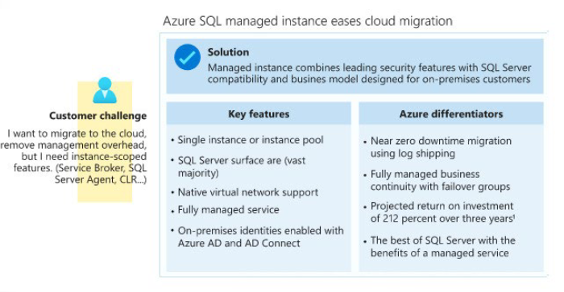

> **Örnek Senaryo (Komatsu):** Ağır ekipman üreten Komatsu, farklı veri türleri için birden fazla ana bilgisayar (mainframe) uygulamasına sahipti. Genel bir görünüm elde etmek ve yönetim yükünü azaltmak istedi. Geniş bir SQL Server özelliği yelpazesi kullandığından, BT departmanı Azure SQL Managed Instance'a geçmeyi seçti. Yaklaşık 1.5 terabayt veriyi sorunsuz bir şekilde taşıyarak otomatik yamalama, otomatik yedekleme, yüksek erişilebilirlik ve azaltılmış yönetim yükü avantajlarını elde etti.

#### Azure SQL Managed Instance İçin Ölçeklenebilirlik:
vCore modunu kullanır; örneğinize ayrılan maksimum CPU çekirdeğini ve maksimum depolama alanını tanımlamanıza olanak tanır. Yönetilen örnek içindeki tüm veritabanları, örneğe atanan kaynakları paylaşır.

| Gereksinim | Öneri |
| :--- | :--- |
| Buluta doğrudan taşıma (Lift-and-Shift) geçişleri düşünüldüğünde | **Managed Instances** |
| Modern bulut uygulamaları çözümü düşünüldüğünde | **Databases (Azure SQL DB)** |
| İşletim sistemi seviyesinde erişim gerektiren geçişler ve uygulamalar düşünüldüğünde | **SQL Virtual Machines** |

---

### Azure Sanal Makinelerinde SQL Server İçin Tasarım (Design for SQL Server on Azure VMs)
Azure Virtual Machines üzerinde SQL Server, bir Azure VM içinde çalışan SQL Server sürümüdür.
* Tüm SQL Server becerileriniz doğrudan aktarılır; Azure yedeklemeleri ve güvenlik yamalarını otomatikleştirmeye yardımcı olabilir.
* SQL Server'ın tüm yeteneklerine erişiminiz vardır.
* İşletim sistemini ve SQL Server'ı güncellemekten ve yamalamaktan siz sorumlusunuzdur.
* Mevcut şirket içi Windows Server ve SQL Server lisanslarınız varsa **Azure Hybrid Benefit** avantajından yararlanabilirsiniz.

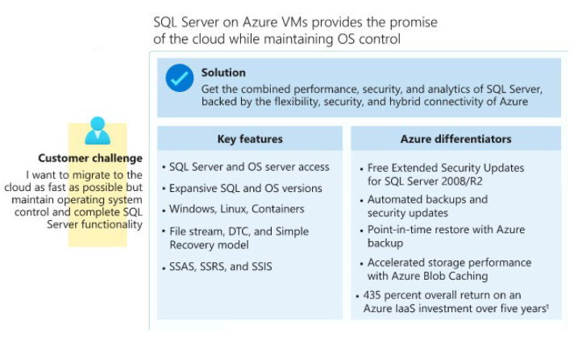

---

### Veritabanı Ölçeklenebilirliği İçin Çözüm Tasarlama (Design a Solution for Database Scalability)
Tailwind Traders, gelen iş yükünü işlemek için dinamik olarak ölçeklenebilir bir çözüme ihtiyaç duymaktadır. Azure SQL Database; CPU gücü, bellek, IO verimliliği ve depolama dahil olmak üzere veritabanlarınıza ayrılan kaynakları en az kesinti süresiyle kolayca değiştirmenize olanak tanır.

#### Dinamik Ölçeklenebilirlik Seçenekleri:
* **Tekil Veritabanı (Single Database):** DTU veya vCore modellerini kullanarak her veritabanına atanacak maksimum kaynak miktarını tanımlama.
* **Elastik Havuzlar (Elastic Pools):** Grup için kaynak satın almanızı ve havuz içindeki veritabanları için minimum ve maksimum kaynak sınırları belirlemenizi sağlar.

#### Azure SQL Database'de Ölçeklendirme Türleri:
1. **Dikey Ölçeklendirme (Vertical Scaling - Scale Up/Down):** Bireysel bir veritabanının işlem boyutunu artırma veya azaltma.
2. **Yatay Ölçeklendirme (Horizontal Scaling - Scale Out/In):** Kapasiteyi veya genel performansı ayarlamak için veritabanları ekleme veya çıkarma. Elastic Database istemci kitaplığı ile yönetilir.

#### Dikey Ölçeklendirme Çözümü Tasarlama (Design Vertical Scaling Solution)
Küçük bir işletmenin küresel olarak hızla büyüdüğü ve her konum için ayrı veritabanlarını koruması gerektiği durumlarda büyüme oranları öngörülemez olabilir. Bu durumda, bir dizi Azure SQL veritabanı için maliyetleri ve performansı yönetmek üzere **SQL Elastik Havuzları (SQL Elastic Pools)** seçmek idealdir. Düşük ortalama kullanımın ancak seyrek, yüksek kullanım artışlarının olduğu durumlarda elastik havuzlar maliyeti düşürür.

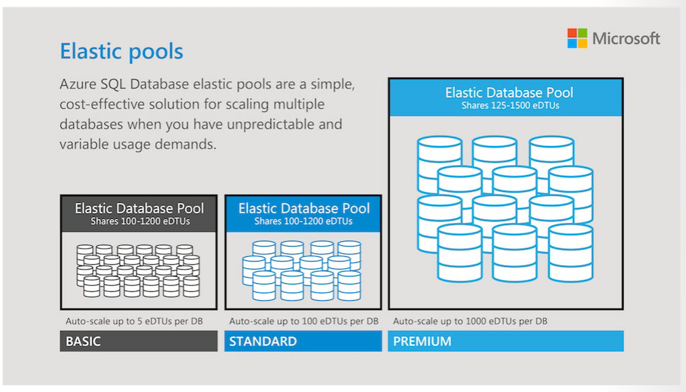

#### Yatay Ölçeklendirme Çözümü Tasarlama (Design Horizontal Scaling Solution)

##### 1. Read Scale-Out (Okuma Ölçeklendirmesi)
Bir uygulamanın veritabanına hem OLTP güncellemeleri hem de salt okunur (read-only) analitik raporlama sorguları yapıldığında, salt okunur iş yüklerini **Read Scale-Out** özelliğiyle okuma kopyalarına (read-only replicas) yönlendirebilirsiniz.

* **Business Critical / Premium Katmanı:** Read Scale-Out otomatik olarak sağlanır (auto-provisioned).
* **Hyperscale Katmanı:** En az bir ikincil kopya oluşturulursa Read Scale-Out özelliği kullanılabilir.
* **Basic / Standard / General Purpose Katmanı:** Read Scale-Out özelliği **mevcut değildir**.

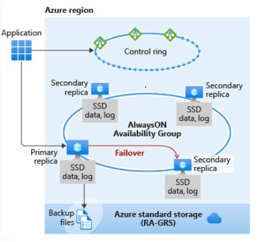

> **Not:** Birincil kopyada yapılan veri değişiklikleri, salt okunur kopyalara eşzamansız (asynchronously) olarak aktarılır.

##### 2. Sharding (Parçalama)
İşlem hacmi tek bir veritabanının kapasitesini aştığında, verileri birden fazla bağımsız veritabanına dağıtma tekniğidir (yatay bölümleme).

**Sharding Kullanım Nedenleri:**
* Toplam veri miktarı tek bir veritabanının sınırlarına sığmayacak kadar büyükse.
* Genel iş yükünün işlem hacmi bağımsız bir veritabanının kapasitelerini aşıyorsa.
* Farklı müşterilerin/kiracıların (tenants) verilerinin birbirinden fiziksel olarak izole edilmesi gerekiyorsa.
* Yasal uyumluluk nedeniyle verilerin coğrafi olarak ayrılması gerekiyorsa.

| Gereksinim | Uygun Ölçeklendirme Stratejisi |
| :--- | :--- |
| Yasal uyumluluk nedeniyle veritabanının farklı bölümlerinin dünyanın farklı yerlerinde bulunması gerektiğinde | **Sharding ile Yatay Ölçeklendirme** (Shard Map Manager kullanılır). |
| Değişken ve öngörülemeyen kaynak gereksinimlerine sahip birden fazla veritabanını yönetmek ve ölçeklendirmek gerektiğinde | **SQL Elastik Havuzları ile Dikey Ölçeklendirme**. |
| Birden fazla veritabanındaki verileri T-SQL ile sorgulamak ve Power BI/Excel gibi araçlara aktarmak gerektiğinde | **Elastic Query (Elastik Sorgu)** özelliği. |

---

### Veritabanı Yüksek Erişilebilirliği İçin Tasarım (Design for Database Availability)

* **General Purpose Katmanı:** Azure Service Fabric tabanlıdır. Arıza durumunda yeni bir SQL Server örneği başlatılır, veri ve log dosyaları (Azure Premium Storage) yeni örneğe bağlanır ve gateway'ler güncellenir. (Failover Cluster Instance benzeri).

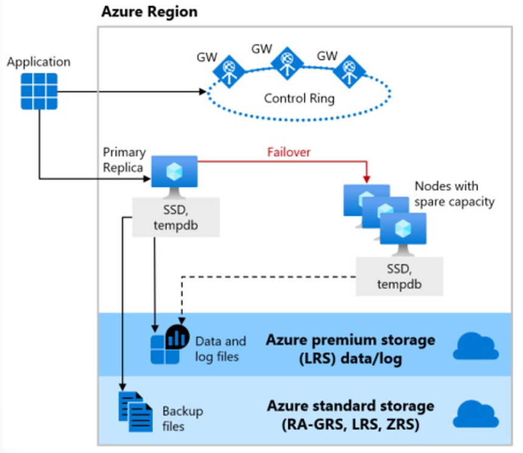

* **Business Critical Katmanı:** Arka planda Always On Availability Group çalışır. Veriler doğrudan bağlı SSD'lerde durur. Üç ikincil kopya bulunur. Arıza anında ikincil kopyaya geçiş (failover) son derece hızlıdır.

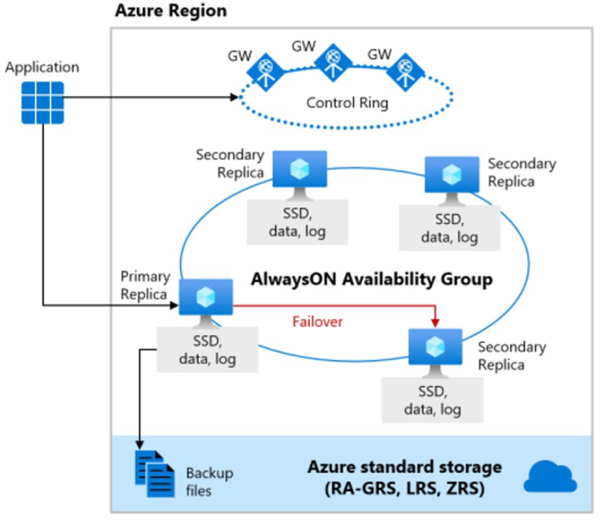

* **Hyperscale Katmanı:** Katmanlı önbellekler (caches) ve sayfa sunucuları (page servers) kullanır. Log servisi kopyaları ve sayfa sunucularını besler. 0-4 arasında ikincil kopya yapılandırılabilir.

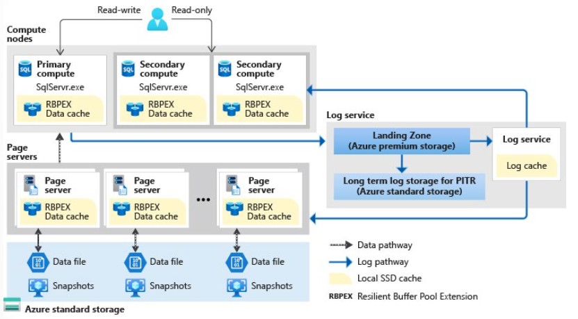

* **Geo-Replication ve Auto-Failover Groups:** Veritabanlarını ikincil coğrafi bölgelere kopyalamak ve felaket kurtarma (DR) anında otomatik geçiş sağlamak için kullanılır.

---

### Veri Güvenliği İçin Tasarım (Design Security for Data)

Bilgi korumanın üç temel ilkesi: **Veri Keşfi (Data Discovery)**, **Sınıflandırma (Classification)** ve **Koruma (Protection)**'dır.

#### Veri Durumları ve Şifreleme Yöntemleri:

| Veri Durumu (Data State) | Şifreleme Yöntemi (Encryption Method) |
| :--- | :--- |
| **Data-in-motion (Aktarılan Veri)** | SSL/TLS, Always Encrypted |
| **Data-in-process (Kullanımdaki Veri)** | Dynamic Data Masking, Always Encrypted |
| **Data-at-rest (Durağan Veri)** | TDE (Transparent Data Encryption), Always Encrypted |

#### 1. Durağan Veriyi Koruma (Protect Data-at-Rest)
* **Transparent Data Encryption (TDE):** Azure SQL Database, SQL Managed Instance ve Azure Synapse Analytics üzerinde verileri, yedekleri ve log dosyalarını sayfa (page) seviyesinde gerçek zamanlı şifreler.
  * *Service-managed TDE:* Şifreleme anahtarı (DEK) dahili sunucu sertifikasıyla korunur (Varsayılan).
  * *Customer-managed TDE (BYOK):* Şifreleme anahtarı Müşteri Tarafından Yönetilen Anahtar ile korunur ve **Azure Key Vault** içerisinde saklanır.

#### 2. Aktarılan Veriyi Koruma (Protect Data-in-Transit)
Tüm bağlantılar için TLS/SSL şifrelemesi zorunludur.

| Senaryo | Çözüm |
| :--- | :--- |
| Şirket içi bireysel istemciden Azure VNet'e güvenli erişim | **Point-to-Site VPN** |
| Şirket içi ağdan Azure VNet'e güvenli erişim | **Site-to-Site VPN** |
| Özel, yüksek hızlı WAN bağlantısı üzerinden büyük veri taşıma | **Azure ExpressRoute** |
| Azure Portal veya REST API ile depolamaya erişim | **HTTPS** |

#### 3. Kullanımdaki Veriyi Koruma (Protect Data-in-Use)
* **Dynamic Data Masking (Dinamik Veri Maskeleme):** Veritabanındaki gerçek veriyi değiştirmeden, sorgu sonuç ekranında hassas verileri (kredi kartı, e-posta, telefon) maskeler (Örn: `XXXX-XXXX-XXXX-1234` veya `aXX@XXXX.com`). Sunum katmanı özelliğidir; yöneticiler maskesiz veriyi görmeye devam eder.
* **Always Encrypted:** Hassas verilerin (kredi kartı, kimlik no) veritabanı yöneticileri (DBA) veya üçüncü taraf bulut sağlayıcıları dahil yetkisiz kişilerden korunmasını sağlar. Veri istemci sürücüsünde (client driver) şifrelenir ve şifresi çözülür. Şifreleme anahtarları **Azure Key Vault** veya **Windows Certificate Store** içerisinde tutulur; veritabanı sunucusuna asla yalın metin (plaintext) gitmez.

> ⚠️ **Önemli Not:** *Always Encrypted* ile *Dynamic Data Masking* aynı sütun üzerinde **birlikte kullanılamaz**.

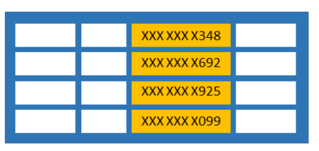

---

### Azure SQL Edge İçin Tasarım (Design for Azure SQL Edge)
Azure SQL Edge, IoT ve IoT Edge dağıtımları için optimize edilmiş ilişkisel veritabanı altyapısıdır. SQL Server ile aynı motoru kullanır. JSON, grafik ve zaman serisi (time-series) verilerini işleyebilir, akış (streaming) analitiği yapabilir.

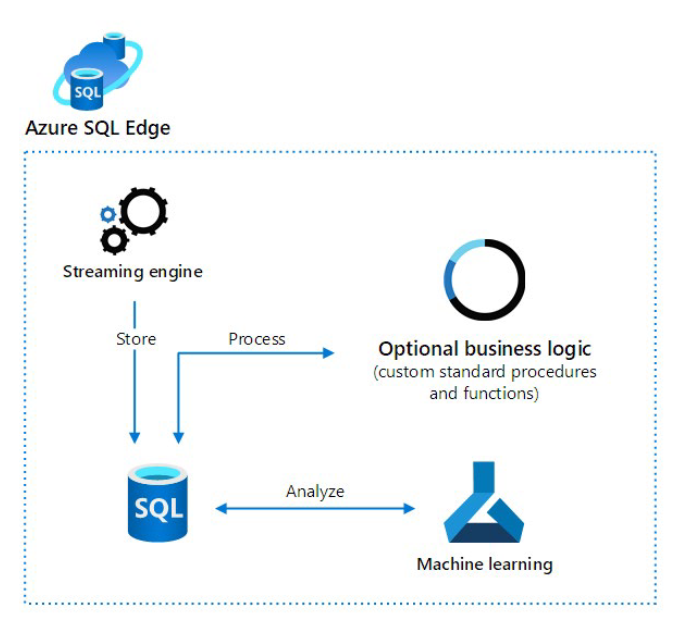

#### Sürümler:
* **Developer Edition:** Geliştirme amaçlıdır (Maks 4 çekirdek, 32 GB RAM).
* **Azure SQL Edge:** Üretim (Production) amaçlıdır (Maks 8 çekirdek, 64 GB RAM).

#### Dağıtım Modelleri:
* **Bağlantılı Dağıtım (Connected):** Azure IoT Edge modülü olarak dağıtılır.
* **Bağlantısız Dağıtım (Disconnected):** Docker konseptiyle standalone veya Kubernetes kümesinde çalıştırılır.

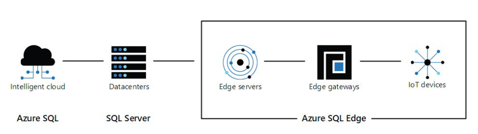

#### Kullanım Nedenleri:
Ağ bağlantısı kısıtlı olan, bant genişliği yavaş/kesintili olan, yerel veritabanı ihtiyacı bulunan ve IoT cihazlarında düşük bellek ayak izi (<500 MB) gerektiren senaryolar için idealdir.

---

## Azure Cosmos DB ve Tablolar İçin Tasarım (Design for Azure Cosmos DB and Tables)

### Giriş (Introduction)
**Azure Cosmos DB**, modern uygulama geliştirme süreçleri için tasarlanmış tam yönetilen (fully managed) bir NoSQL veritabanı hizmetidir. Her ölçekte garantili performans ve tek haneli milisaniye (single-digit millisecond) seviyesinde yanıt süreleri sunar.

Tam yönetilen bir hizmet olarak Azure Cosmos DB; otomatik yönetim, güncelleme ve yamalama (patching) işlemlerini üstlenerek veritabanı yönetimi yükünü üzerinizden alır. Ayrıca, uygulama ihtiyaçlarına yanıt veren ve kapasiteyi taleple eşleştiren maliyet etkin sunucusuz (serverless) ve otomatik ölçeklendirme (autoscale) seçenekleriyle kapasite yönetimini de gerçekleştirir.

#### Azure Cosmos DB’nin Temel Özellikleri:
* Otomatik ve anlık ölçeklenebilirlik (instant scalability).
* Kurumsal düzeyde güvenlik (enterprise-grade security).
* %99.999 SLA destekli kullanılabilirlik ile iş sürekliliği garantisi.
* Dünyanın her yerine tek tıkla (turnkey) çoklu bölge veri dağıtımı (multi-region distribution).
* En popüler diller için açık kaynaklı API'ler ve SDK'lar.
* Otomatik yönetim, güncelleme ve yamalama ile sıfır veritabanı yönetim yükü.
* Operasyonel veriler üzerinde ETL süreçlerine gerek kalmadan (no-ETL) hızlı analitik imkanı.

> Azure Cosmos DB esnektir ve verileri **Atom-Record-Sequence (ARS)** formatında saklar. Veri daha sonra soyutlaştırılır ve seçilen bir API olarak sunulur.

---

### Azure Storage Tables ve Azure Cosmos DB Tables Arasındaki Farklar

**Azure Table Storage**, bulutta ilişkisel olmayan yapılandırılmış verileri (yapılandırılmış NoSQL verisi) depolayan, şemasız (schemaless) tasarımıyla anahtar/özellik (key/attribute) deposu sunan bir hizmettir. Şemasız yapısı sayesinde uygulamanızın ihtiyaçları değiştikçe verilerinizi adapte etmek kolaydır.

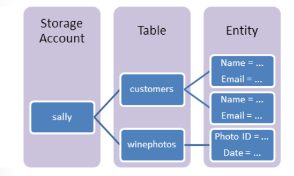

#### Table Storage'ın Yaygın Kullanım Alanları:
* Web ölçeğinde uygulamalara hizmet verebilecek terabaytlarca yapılandırılmış veri depolama.
* Karmaşık birleştirmeler (joins), dış anahtarlar (foreign keys) veya saklı yordamlar (stored procedures) gerektirmeyen veri kümelerini depolama (örn. web uygulamaları, adres defterleri, cihaz bilgileri).
* Kümelenmiş indeks (clustered index) kullanarak verileri hızlıca sorgulama.

Azure Cosmos DB, yüksek erişilebilirlik, ölçeklenebilirlik ve adanmış verimlilik (dedicated throughput) gibi premium yeteneklere ihtiyaç duyan Azure Table Storage uygulamaları için **Table API** seçeneğini sunar.

#### Geçiş (Migration) Öncesi Bilinmesi Gereken Davranış Farkları:

* **Maliyet/Kapasite Modeli:** Azure Cosmos DB tablosunda kapasite kullanılmasa bile oluşturulduğu andan itibaren ücretlendirilirsiniz. Çünkü Cosmos DB, istemcilerin verileri 10 ms içinde okuyabilmesini sağlamak için tahsis edilmiş kapasite (reserved-capacity) modelini kullanır. Azure Storage Tables'da ise yalnızca kullanılan kapasite için ödeme yaparsınız ancak okuma erişimi 10 saniye içinde garanti edilir.
* **Sorgu Sıralaması:** Azure Cosmos DB'den gelen sorgu sonuçları, Storage Tables'da olduğu gibi PartitionKey ve RowKey sırasına göre **sıralanmaz**.
* **Boyut Limitleri:** Azure Cosmos DB'de RowKey sınırı **255 bayt** ile sınırlıdır.
* **Toplu İşlemler:** Batch işlemleri **2 MB** ile sınırlıdır.
* **CORS:** Cross-Origin Resource Sharing (CORS), Azure Cosmos DB tarafından desteklenir.
* **Büyük/Küçük Harf Duyarlılığı:** Tablo isimleri Azure Cosmos DB'de **büyük/küçük harfe duyarlıdır** (case-sensitive), Storage Tables'da ise duyarlı değildir.

---

### Azure Cosmos DB Table API’ye Geçişin Avantajları

Azure Table Storage için yazılmış uygulamalar, çok az kod değişikliği ile Cosmos DB Table API'ye taşınabilir. İki hizmet de aynı tablo veri modelini paylaşır ve SDK'ları aracılığıyla aynı oluşturma, silme, güncelleme ve sorgulama işlemlerini sunar.

| Özellik | Azure Table Storage | Azure Cosmos DB Table API |
| :--- | :--- | :--- |
| **Gecikme Süresi (Latency)** | Hızlıdır ancak üst sınır garantisi yoktur. | Okuma ve yazma işlemleri için **tek haneli milisaniye** gecikme. |
| **Verimlilik (Throughput)** | Değişken verimlilik modeli. | Tahsis edilmiş rezerv kapasite ile **yüksek ölçeklenebilirlik**. |
| **Küresel Dağıtım (Global Distribution)** | Yüksek erişilebilirlik için isteğe bağlı 1 okuma kopyalı ikincil bölge ile tek bölge. | 1 bölgeden **30+ bölgeye** tek tıkla küresel dağıtım. |
| **İndeksleme (Indexing)** | Yalnızca PartitionKey ve RowKey üzerinde birincil indeks. İkincil indeks yoktur. | Tüm özellikler üzerinde **otomatik ve eksiksiz indeksleme** (indeks yönetimi gerektirmez). |
| **Sorgulama (Query)** | Sorgu yürütme birincil anahtar için indeksi kullanır, aksi takdirde tarama (scan) yapar. | Sorgular, hızlı sorgu süreleri için özelliklerdeki otomatik indekslemeden yararlanır. |
| **Tutarlılık (Consistency)** | Birincil bölgede güçlü (strong) tutarlılık. | Erişilebilirlik, gecikme ve verimlilik dengesini sağlayan **5 tanımlı tutarlılık seviyesi**. |
| **Fiyatlandırma (Pricing)** | Tüketim tabanlı (Consumption-based). | Hem tüketim tabanlı hem de tahsis edilmiş kapasite (provisioned capacity) modlarında mevcuttur. |
| **SLA Seviyeleri** | %99.99 erişilebilirlik. | Tek bölgeli hesaplar ve esnek tutarlılığa sahip tüm çok bölgeli hesaplar için **%99.99**; tüm çok bölgeli veritabanı hesaplarında **%99.999** okuma erişilebilirliği SLA'sı. |

---

### Cosmos DB Hangi Veritabanı API'lerini Sunar?

Azure Cosmos DB, çeşitli NoSQL veritabanları için yerel arayüz sağlamak amacıyla birden fazla veritabanı API'si sunar. Veri modelinize uygun API eşleşmesi şu şekildedir:

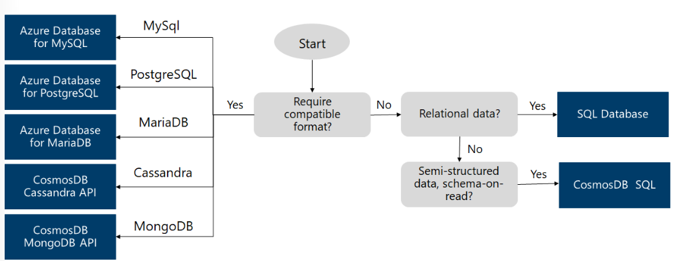

* **Doküman (Document) Veri Modeli:** Core (SQL) API ve MongoDB API
* **Anahtar-Değer (Key-Value) Veri Modeli:** Table API
* **Sütun Odaklı (Column-Oriented) Veri Modeli:** Cassandra API
* **Grafik (Graph) Veri Modeli:** Gremlin API

---

#### 1. Core (SQL) API Ne Zaman Kullanılır?

JSON formatındaki yarı yapılandırılmış doküman verilerini depolamak için varsayılan ve en çok önerilen API seçeneğidir.

* **Kullanım Senaryoları:** Örnek olarak bir otomotiv yedek parça e-ticaret sitesinin ürün kataloğunu saklamak verilebilir. 
* **Gereksinimler:** Ekibin JSON nesnelerini sorgulamak için mevcut SQL becerilerini kullanması, verilerin garantili verimlilikle küresel olarak erişilebilir olması ve yeni ürün kategorilerinin hızla eklenmesi gereken durumlar.
* **Neden Core (SQL) API Seçilmeli?**
  * Okuma ve yazma işlemleri için tek haneli milisaniye gecikme.
  * Otomatik felaket kurtarma ile küresel olarak dağıtılmış veritabanı.
  * %99.999 SLA ile okuma ve yazma erişilebilirliği.
  * Tahsis edilmiş verimlilik (provisioned throughput) veya otomatik ölçeklendirme (autoscale) kullanımı.
  * Önbellek verileri, oturum yönetimi deposu, kullanıcı ve profil yönetimi ile ürün öneri sistemleri için önerilir.

---

#### 2. MongoDB API Ne Zaman Kullanılır?

Mevcut sistemlerinde verileri depolamak için MongoDB kullanan ve uygulamalarını Azure Cosmos DB'ye en az kod değişikliğiyle taşımak isteyen yapılar için uygundur.

* **Kullanım Senaryoları:** Tailwind Traders'ın yapılandırılmamış ürün satın alma siparişlerini saklamak için MongoDB kullanması ve buluta geçmek istemesi.
* **Gereksinimler:** Mevcut veritabanının MongoDB kullanması, operasyon ekibinin en az kod değişikliği ve kesinti süresiyle geçiş yapmak istemesi, geliştirme ekibinin özel SDK'lar yazmış olması, sipariş hacmi arttığı için ölçeklenebilirliğin kritik olması ve canlı veriler üzerinde analitik çalıştırma ihtiyacı.
* **MongoDB API Avantajları:**

| Avantaj | Açıklama |
| :--- | :--- |
| **Anlık Ölçeklenebilirlik** | Autoscale özelliği veritabanınızı ısınma süresi (warmup) olmadan yukarı/aşağı ölçeklendirir. |
| **Otomatik ve Saydam Parçalama (Sharding)** | API for MongoDB tüm altyapıyı sizin için yönetir. Buna parçalama (sharding) ve parça sayısı dahildir. |
| **Yüksek Erişim** | %99.999 erişilebilirlik yapılandırılabilir. |
| **Sunucusuz (Serverless) Dağıtım** | Sadece işlem başına ödeme yapılan sunucusuz mod sunar. |
| **Hızlı Güncellemeler** | Tüm API sürümleri tek bir kod tabanında yer aldığından sürüm değişiklikleri sıfır kesintiyle saniyeler sürer. |
| **Ölçekte Gerçek Zamanlı Analitik** | ETL hatlarına ihtiyaç duymadan BI uygulamaları için sütun tabanlı depolama ile canlı veriler üzerinde analitik sorgular çalıştırır. |

---

#### 3. Cassandra API Ne Zaman Kullanılır?

Ağır telemetri, sensör ve sağlık takip verilerini depolamak için Apache Cassandra kullanan ve veritabanı ihtiyaçlarını ölçeklendirmek isteyen mimariler için uygundur.

* **Gereksinimler:** Geliştiricilerin halihazırda Cassandra Query Language (CQL), cqlsh gibi Cassandra araçları ve istemci sürücülerini kullanıyor olması, yatay ölçeklendirme, çevrim içi yük dengeleme ve esnek bir şema ihtiyacı.
* **Özellikleri:** Apache Cassandra ile kablo protokolü (wire protocol) seviyesinde uyumludur. Verileri sütun odaklı (column-oriented) şemada saklar. Şimdilik yalnızca OLTP senaryolarını destekler. CQL sürüm 3.x'i ve Serverless modunu destekler.
* **Cassandra API Avantajları:**

| Özellik | Açıklama |
| :--- | :--- |
| **Yerleşik Araçlar** | API ile yerel Apache Cassandra özelliklerini, araçlarını ve ekosistemini kullanır. |
| **Tam Yönetilen** | İşletim sistemi, Java VM, garbage collection ve düğüm/küme yönetimini otomatik yapar; `repair` veya `decommission` gibi komutlara ihtiyaç duyulmaz. |
| **Bölgesel Yazmalar** | Tek veya çok bölgeli yazma konfigürasyonları seçilebilir. Çoklu bölge yazmaları güçlü tutarlılık sağlar ve çakışmaları önler. |
| **Entegrasyon** | Cassandra API'sinde verimlilik (RU) tahsis ederek gecikmeyi en aza indirebilirsiniz. Azure Cosmos kapsayıcılarını otomatik ölçeklendirilen verimlilikte yapılandırabilirsiniz. |

---

#### 4. Gremlin API Ne Zaman Kullanılır?

Sosyal medya varlık ilişkilerini saklamak, organizasyonel hiyerarşileri yönetmek, çevrim içi dolandırıcılık tespit (fraud detection) sistemleri ve IoT düğüm ilişkilerini hızlıca sorgulamak için kullanılır.

* **Gereksinimler:** Grafik verilerini saklama, alma, işleme ve Data Explorer ile görselleştirme; yüksek işlem hacimlerini performansı etkilemeden işleme; geleneksel veritabanlarının grafik ilişkilerindeki kısıtlamalarını aşma; verileri sorgulamak için bir Graph sorgu dili kullanma.
* **Özellikleri:** Apache TinkerPop ve Gremlin sorgulama dilini temel alır. Grafik yapısı **düğümler (vertices - nesneler)** ve **kenarlar (edges - ilişkiler)** bileşiminden oluşur. Yalnızca OLTP senaryolarını destekler.
* **Gremlin API Avantajları:**
  * Açık kaynaklı Gremlin SDK'ları ile doğrudan entegre çalışır.
  * Milyarlarca düğüm ve kenar içeren devasa grafikleri saklayabilir; veriler grafik bölümleme (graph partitioning) ile otomatik dağıtılır.
  * Milisaniye düzeyinde gecikmeyle grafik sorguları çalıştırır.
  * Karmaşık analitik grafik senaryoları için Apache Spark ve GraphFrames ile birlikte çalışabilir.
  * Çok bölgeli çoğaltma (multi-region replication) ile otomatik bölgesel felaket kurtarma sağlar.

---

### Güncel Mimari ve Sınav İpuçları (2026 Notları)
1. **Veri Modeli Seçimi:** İlişkisel olmayan geçişlerde, uygulamanızın mevcut veri formatına göre API seçilmelidir (JSON -> Core SQL, MongoDB -> MongoDB API, Cassandra -> Cassandra API, Graph -> Gremlin API).
2. **Maliyet vs Performans:** Sıradan Key-Value ihtiyaçlarında en düşük maliyet için **Azure Table Storage**; garantili düşük gecikme (10 ms altı) ve küresel dağıtım gerekiyorsa **Azure Cosmos DB Table API** seçilmelidir.
3. **Analitik Gücü:** Canlı operasyonel veriler üzerinde ETL yapmadan analitik çalıştırmak için **Azure Synapse Link for Azure Cosmos DB** mimaride dikkate alınmalıdır.

# AZ-305 Modül 2: Veri Entegrasyonu Çözümü Tasarlama (Design a Data Integration Solution)

## Giriş (Introduction)
Çevrim içi satış yapan ve donanım üretimi alanında uzmanlaşmış Tailwind Traders şirketinde Mimar (Architect) olarak çalıştığınızı varsayalım. Geçmiş verilerin yanı sıra gerçek zamanlı kritik üretim süreçlerinden akan veriler, ürün kalite kontrol verileri, geçmiş üretim günlükleri (logs), stoktaki ürün hacimleri vb. veriler bulunmaktadır.

Şirketinizin uygulamakta olduğu buluta geçiş stratejisi doğrultusunda; geleneksel veritabanı sistemleri için çok büyük ve karmaşık olan verilerin alınması (ingestion), işlenmesi (processing) ve analiz edilmesi (analysis) için tasarlanmış bir bulut veri çözümü analiz etmeli ve mimarisini oluşturmalısınız. Birden fazla kaynaktan gelen verileri en iyi şekilde nasıl birleştireceğinizi, bunları analitik modellere nasıl dönüştüreceğinizi ve ardından sorgulama, raporlama ile görselleştirme işlemleri için bu modelleri nasıl kaydedeceğinizi belirlemeniz istenmiştir.

---

## Öğrenme Hedefleri (Learning Objectives)
Bu bölümde şunları öğreneceksiniz:
* Azure Data Factory ile veri entegrasyonu çözümü tasarlama.
* Azure Data Lake ile veri entegrasyonu çözümü tasarlama.
* Azure Databricks ile veri entegrasyonu ve analitik çözümü tasarlama.
* Azure Synapse Analytics ile veri entegrasyonu ve analitik çözümü tasarlama.
* Sıcak (hot), ılık (warm) ve soğuk (cold) veri yolları (data paths) için bir strateji tasarlama.
* Veri analizi için Azure Stream Analytics çözümü tasarlama.

---

## Ölçülen Beceriler (Skills Measured)
Bu bölümdeki içerik, AZ-305: Designing Microsoft Azure Infrastructure Solutions sınavına hazırlanmanıza yardımcı olur:

Veri Depolama Çözümleri Tasarlama / Veri Entegrasyonu Tasarlama:
* Veri entegrasyonu için bir çözüm önerme.
* Veri analizi için bir çözüm önerme.

---

## Ön Koşullar (Prerequisites)
* Veri entegrasyon çözümleriyle çalışma deneyimi.
* Veri entegrasyon çözümleri hakkında kavramsal bilgi.

---

## Azure Data Factory İçin Tasarım (Design for Azure Data Factory)
Tailwind Traders gibi hızla büyüyen bir perakendeci için en büyük zorluk; hem bulutta hem de şirket içinde (on-premises) ilişkisel, ilişkisel olmayan ve diğer depolama sistemlerinde saklanan yüksek hacimli veriler üretmesidir. Yönetim, bu verilerden mümkün olduğunca gerçek zamanlıya yakın eyleme dönüştürülebilir iş içgörüleri istemektedir. Ayrıca satış ekibi, çapraz satış (cross-selling) ve üst satış (up-selling) çözümleri kurmak istemektedir.

Bulutta büyük ölçekli bir veri alma (ingestion) çözümünü nasıl oluşturursunuz? Çeşitli veri depoları ve hesaplama kaynakları arasında verilerin taşınmasına ve dönüştürülmesine yardımcı olmak için hangi Azure servislerini benimsersiniz?

Azure Data Factory (ADF), farklı veri depolarından veri alabilen veri odaklı iş akışları (pipelines olarak adlandırılır) oluşturmanıza ve zamanlamanıza yardımcı olan bulut tabanlı bir ETL ve veri entegrasyonu servisidir. Azure Data Factory'yi şunlar için kullanabilirsiniz:
* Veri hareketini orkestre etmek (Orchestrate data movement).
* Verileri ölçeklenebilir şekilde dönüştürmek (Transform data at scale).

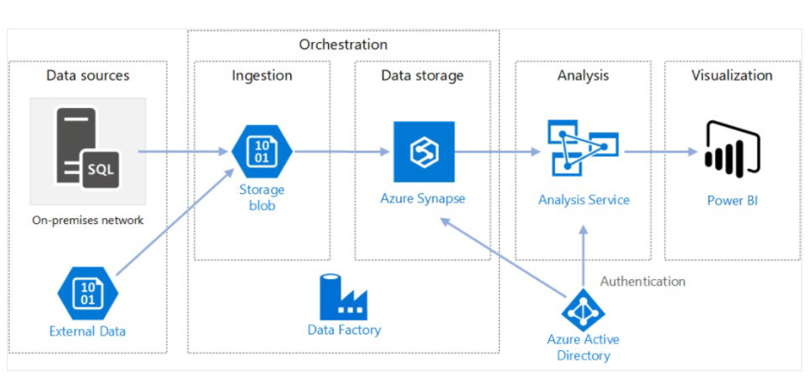

### Veri Odaklı İş Akışları (Data-Driven Workflows)
Azure Data Factory'de veri odaklı bir iş akışı oluşturmanın ve uygulamanın 4 ana adımı vardır:

1. Bağlan ve Topla (Connect and collect): Veri alımı (ingestion), tüm verilerin farklı kaynaklardan merkezi bir konuma toplanmasındaki ilk adımdır.
2. Dönüştür ve Zenginleştir (Transform and enrich): Verileri dönüştürmek için Azure Databricks ve Azure HDInsight Hadoop gibi bir hesaplama servisi kullanılır.
3. Sürekli Entegrasyon ve Teslimat (CI/CD) ve Yayınla (Publish): GitHub ve Azure DevOps aracılığıyla CI/CD desteği, verileri analitik motoruna yayınlamadan önce ETL sürecinizi artımlı (incrementally) olarak sunmanızı sağlar.
4. İzle (Monitor): Azure Portal aracılığıyla zamanlanmış etkinlikler ve olası arızalar için işlem hattını (pipeline) izleyebilirsiniz.

### Azure Data Factory Ne Zaman Kullanılır?
* Veri Entegrasyonu Gereksinimleri: Hem Büyük Veri (Big Data) topluluğuna hem de SQL Server Integration Services (SSIS) kullanan İlişkisel Veri Ambarı topluluğuna hizmet eder.
* Kodlama Kaynakları: İşlem hatlarını ayarlamak için görsel bir arayüz tercih ediyorsanız, low-code/no-code süreç sunan Data Factory yazma ve izleme aracı tam size göredir.
* Çoklu Veri Kaynağı Desteği: Farklı veri kaynaklarıyla entegre olmak için 90'dan fazla bağlayıcıyı (connectors) destekler.
* Sunucusuz Altyapı (Serverless): Sunucuları koruma, konfigüre etme veya dağıtma ihtiyacı duymadan dalgalanan iş yükleriyle ölçeklenme yeteneği sağlar.

### Azure Data Factory Bileşenleri (Components)

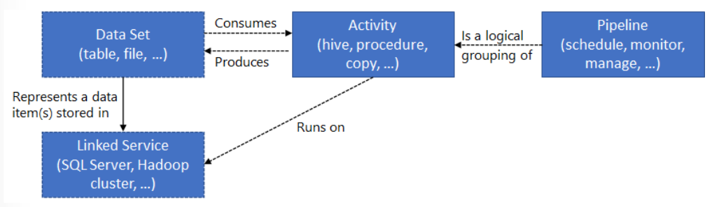

* Pipelines ve Activities: Bir görevi gerçekleştiren etkinliklerin mantıksal gruplamasıdır. Etkinlik (activity), bir işlem hattındaki tek bir işlem adımıdır. Data Factory; veri hareketi, veri dönüşümü ve kontrol etkinliklerini destekler.
* Datasets: Veri depolarınız içindeki veri yapılarıdır (data structures).
* Linked Services: Data Factory'nin harici kaynaklara bağlanması için gereken bağlantı bilgilerini tanımlar.
* Data Flows: Veri mühendislerinin kod yazmadan veri dönüştürme mantığı geliştirmesini sağlar.
* Integration Runtimes (IR): Etkinlik (Activity) ve Bağlı Servisler (Linked Services) nesneleri arasındaki köprüdür. 3 türü bulunur: Azure, Self-hosted (şirket içi erişim için) ve Azure-SSIS.

---

## Azure Data Lake İçin Tasarım (Design for Azure Data Lake)
Tailwind Traders; web sitelerinden POS sistemlerine, sosyal medyadan IoT cihazlarına kadar çok sayıda veri kaynağına sahiptir. Yüksek performanslı büyük veri analitiği amacıyla muazzam miktarda yapılandırılmamış veriyi yükleyip saklayabileceğiniz bir havuz sunan Azure Data Lake Storage Gen2 önerilir.

### Azure Data Lake Storage Gen2 Özellikleri:
Data Lake Storage Gen2, büyük veri analitiği iş yükleri için özel olarak optimize edilmek üzere Azure Blob depolama yetenekleri üzerine inşa edilmiştir.

* Veri Erişimi: Hadoop ve veri erişim katmanı olarak Apache Hadoop Distributed File System (HDFS) kullanan tüm çerçevelerle çalışacak şekilde tasarlanmıştır.
* Veri Güvenliği: Erişim kontrol modeli hem Azure RBAC hem de POSIX Access Control Lists (ACLs) yapısını destekler.
* Veri Ölçeklenebilirliği: Yapılandırılmış, yarı yapılandırılmış ve yapılandırılmamış tüm veri türlerini yerel formatında kabul eder.
* Veri Depolama Hiyerarşisi: Hiyerarşik Ad Alanı (Hierarchical Namespace - HNS) özelliğini destekler. Bu özellik, nesneleri performanslı analitik erişimi için bir dizin/dosya hiyerarşisi şeklinde düzenler.

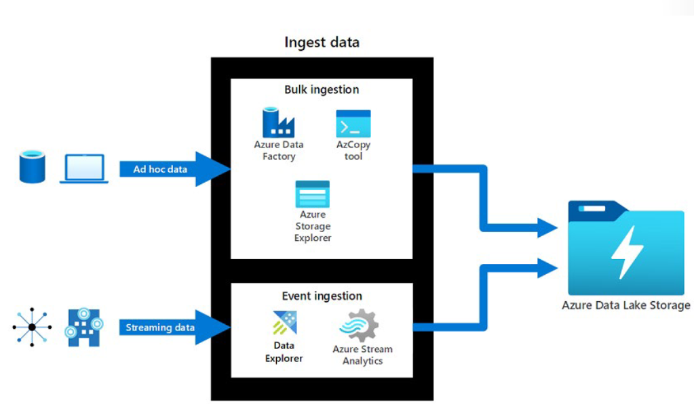

### Azure Data Lake Storage Ne Zaman Seçilmeli?
* JSON, CSV, log dosyaları gibi çeşitli veri türlerini tek bir yerde toplayıp "veri silosunu" (data silos) ortadan kaldırmak istediğinizde.
* Depolama maliyetlerini hesaplama (compute) maliyetlerinden ayırarak ölçeklenebilir bir büyük veri havuzu kurmak istediğinizde.
* Apache Storm, IoT Hub, Event Hubs veya Stream Analytics üzerinden gerçek zamanlı veri akışlarını doğrudan depolamak istediğinizde.

### Azure Data Lake vs Azure Blob Storage Karşılaştırması:

* Hiyerarşik Ad Alanı (HNS): Azure Data Lake Gen2 destekler (Klasör/Dizin yapısı bulunur); Azure Blob Storage düz (Flat) ad alanı kullanır (Sanal klasörler).
* Hadoop Uyumluluğu: Azure Data Lake Gen2 tam HDFS uyumludur; Azure Blob Storage Hadoop uyumlu değildir.
* Erişim Güvenliği: Azure Data Lake Gen2 ince taneli POSIX ACL ve RBAC destekler; Azure Blob Storage dosya seviyesi ince taneli ACL sunmaz.
* Veri Türü Optimizasyonu: Azure Data Lake Gen2 metin ve büyük verisetleri analitiği için idealdir; Azure Blob Storage fotoğraf, video, yedekleme gibi nesne depolama için idealdir.

---

## Azure Databricks İçin Tasarım (Design for Azure Databricks)
Azure Databricks, geliştiricilerin yapay zeka ve inovasyonu hızlandırmasını sağlayan tam yönetilen, bulut tabanlı bir Büyük Veri ve Makine Öğrenimi platformudur. Yönetilen Apache Spark platformu, büyük ölçekli Spark iş yüklerini çalıştırmayı kolaylaştırır.

### Databricks Çalışma Ortamları (Environments):
1. Databricks SQL: Veri gölü (data lake) üzerinde SQL sorguları çalıştırmak, görselleştirmeler ve panolar (dashboards) oluşturmak isteyen analistler için basit bir platform sağlar.
2. Databricks Data Science & Engineering: Veri mühendisleri, veri bilimcileri ve makine öğrenimi mühendisleri arasında iş birliğini sağlayan etkileşimli bir çalışma alanıdır (workspace). Python, Scala, R ve SQL dillerini destekler.
3. Databricks Machine Learning: Deney takibi, model eğitimi ve model sunumu için yönetilen servisleri içeren uçtan uca bir ML ortamıdır.

### Çalışma Mimarisi:
* Control Plane (Kontrol Düzlemi): İşleri, notebook sonuçlarını, web uygulamasını ve Hive metastore'u barındırır. Databricks/Microsoft tarafından yönetilir.
* Data Plane (Veri Düzlemi): Müşteri aboneliği içinde çalışan Spark kümelerini (clusters) içerir. Veri işleme tamamen müşterinin kendi aboneliğinde gerçekleşir.

---

## Azure Synapse Analytics İçin Tasarım (Design for Azure Synapse Analytics)
Azure Synapse Analytics; kurumsal veri ambarı (Data Warehouse) ve Büyük Veri analitiğini tek bir bütünleşik deneyimde birleştiren sınırsız bir analitik hizmetidir.

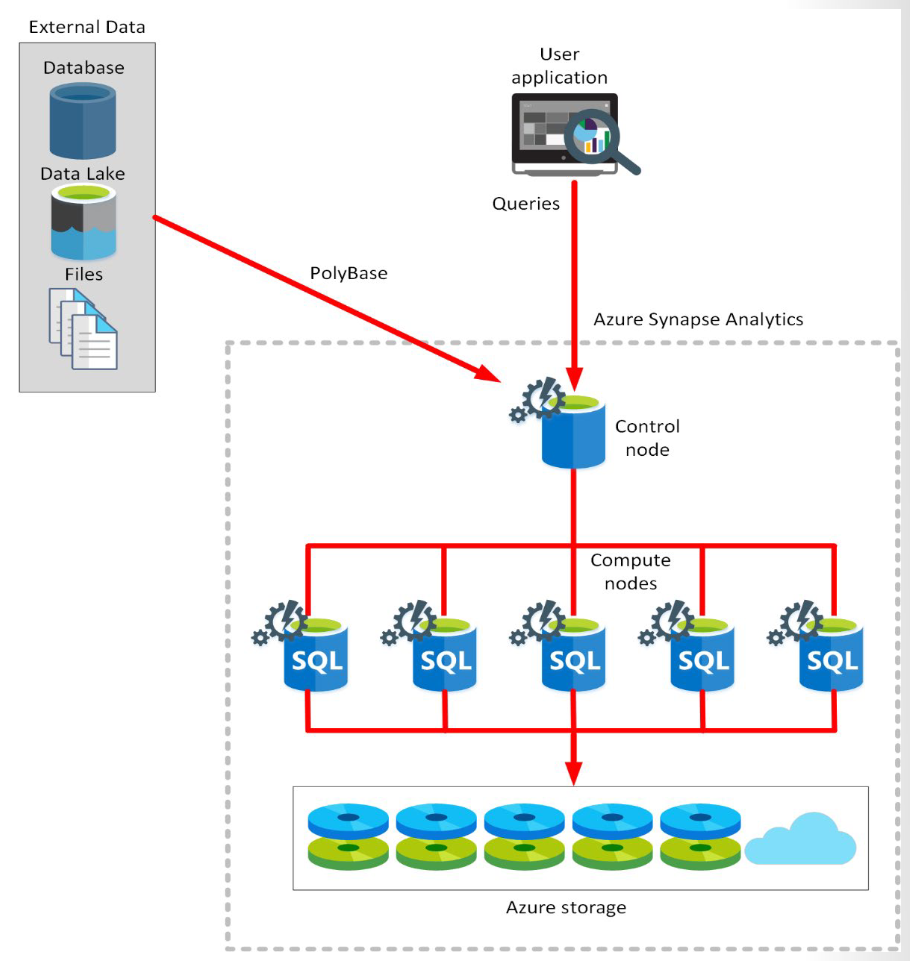

### Mimari Yapı:
Azure Synapse Analytics, Kitlesel Paralel İşleme (Massively Parallel Processing - MPP) mimarisini kullanır. Bu mimari bir Control Node (Kontrol Düğümü) ve bir Compute Nodes (Hesaplama Düğümleri) havuzundan oluşur.
* PolyBase / Synapse Data Movement: İlişkisel ve ilişkisel olmayan kaynaklardan T-SQL ifadeleriyle veri çekmeyi sağlar.

### Azure Synapse Analytics Bileşenleri:

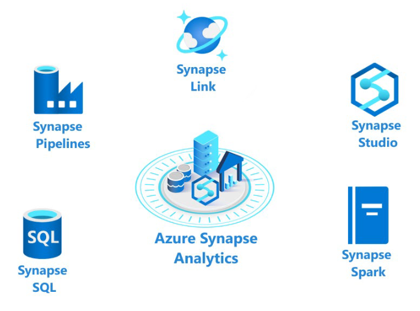

* Synapse SQL Pool:
  - Dedicated SQL Pool (Tahsis Edilmiş): Öngörülebilir performans ve maliyet için düğüm tabanlı T-SQL veri ambarı altyapısı.
  - Serverless SQL Pool (Sunucusuz): Data Lake üzerindeki verileri anlık sorgulamak (ad-hoc) için kullanılan, her an hazır ve yalnızca sorgu başına ödenen model.
* Synapse Spark Pool: Veri hazırlama, ETL ve makine öğrenimi için kullanılan Apache Spark kümesidir.
* Synapse Pipelines: Azure Data Factory yeteneklerini temel alan veri entegrasyonu ve ETL motorudur.
* Synapse Link: Cosmos DB veya SQL veritabanlarındaki operasyonel veriler üzerinde ETL süreçlerine gerek kalmadan gerçek zamanlı analitik (HTAP) çalıştırmayı sağlar.
* Synapse Studio: Tüm bu bileşenlerin tek bir web arayüzünden yönetildiği IDE ortamıdır.

### Analiz Türleri (Types of Analytics):
* Diagnostic Analytics ("Neden oluyor?"): Serverless SQL pool ile Data Lake verilerini etkileşimli keşfetme.
* Predictive Analytics ("Ne olması muhtemel?"): Spark pool ve Azure Machine Learning / Databricks entegrasyonuyla geleceği tahmin etme.
* Prescriptive Analytics ("Ne yapılması gerekiyor?"): Stream Analytics ve Synapse Link ile gerçek zamanlı karar mekanizmaları çalıştırma.
* Descriptive Analytics ("Ne oluyor?"): Dedicated SQL pool ile kurumsal raporlama ve veri ambarı oluşturma.

---

## Sıcak (Hot), Ilık (Warm) ve Soğuk (Cold) Veri Yolları Stratejisi

Cloud mimarilerinde verinin erişim sıklığına ve işlenme hızına göre veri yolları tanımlanır:

* Sıcak Yol (Hot Path):
  - İşlev: Anlık Analiz ve Alarmlar
  - İşleme Hızı: Gecikme 1 saniyenin altındadır.
  - Kullanılan Servisler: Azure Stream Analytics, Event Hubs.

* Ilık Yol (Warm Path):
  - İşlev: Akan Veriyi İşleme
  - İşleme Hızı: Milisaniye ve saniyeler düzeyindedir.
  - Kullanılan Servisler: Azure Cosmos DB, Azure SQL Database.

* Soğuk Yol (Cold Path):
  - İşlev: Toplu (Batch) ETL ve Geçmiş Veri Analitiği
  - İşleme Hızı: Saatler ve günler alabilir.
  - Kullanılan Servisler: Azure Data Lake Storage Gen2, Azure Blob Storage, Azure Synapse Analytics, Azure Data Factory.

---

## Azure Stream Analytics Çözümü Tasarlama

Azure Stream Analytics, cihazlardan, sensörlerden, web sitelerinden ve sosyal medyadan gelen birden fazla veri akışı üzerinde gerçek zamanlı analitik ve karmaşık olay işleme (complex event-processing) gerçekleştiren tam yönetilen (PaaS) bir motordur.

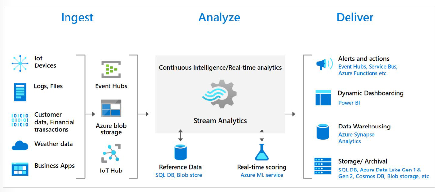

### Temel Özellikler:
* Girdiler (Inputs): Azure Event Hubs, Azure IoT Hub veya Azure Blob Storage'dan veri alır.
* Sorgulama (Query): SQL sözdizimi tabanlı sorgu dili kullanılır. Zaman pencereleri (Tumbling, Hopping, Sliding Windows) üzerinde kümeleme yapabilir. JavaScript ve C# kullanıcı tanımlı fonksiyonları (UDF) ile genişletilebilir.
* Çıktılar (Outputs):
  - Gerçek zamanlı görselleştirme için Power BI panolarına yönlendirme.
  - Depolama için Azure Data Lake Storage, Cosmos DB veya Azure SQL Database'e yazma.
  - Olay güdümlü tetiklemeler için Azure Functions, Service Bus Topics/Queues servislerine gönderme.

### Kullanım Senaryoları:
* Tıklama Akışı (Clickstream) Analitiği: E-ticaret sitelerinde kullanıcı hareketlerine göre anlık ürün önerileri sunma.
* Coğrafi Analiz (Geospatial): Nakliye kamyonlarının GPS verilerini izleme ve araçların canlı konumlarını Power BI üzerinde haritada gösterme.
* IoT Telemetri İşleme: Akıllı binalardaki sıcaklık/nem sensör verilerini işleyip maliyetleri düşürecek anlık iklimlendirme ayarları yapma.
* Kestirimci Bakım (Predictive Maintenance): Yüksek değerli sanayi ekipmanlarının arızalanmasını önlemek için sensör verilerini sürekli izleme.
* Sahtekarlık Tespiti (Fraud Detection): POS noktalarındaki olağandışı kredi kartı harcamalarını anında tespit edip alarm üretme.

---

## Güncel Mimari ve Sınav İpuçları (2026 Notları)
1. ETL ve Orkestrasyon: Saf veri taşıma, şirket içi veri kaynaklarına erişim (Self-hosted IR) ve SSIS paketlerini bulutta çalıştırmak için Azure Data Factory; veri ambarı ile entegre uçtan uca analitik platformu için Azure Synapse Analytics seçilmelidir.
2. Büyük Veri Depolama: Analitik iş yüklerinde Azure Blob Storage yerine hiyerarşik ad alanı (HNS) ve POSIX ACL desteği sunan Azure Data Lake Storage Gen2 mimari standart olarak önerilir.
3. Canlı Görselleştirme: Hareket halindeki araçların GPS verilerini veya canlı sensör verilerini gecikmesiz olarak Power BI ekranında göstermek için ideal ikili Azure Event Hubs + Azure Stream Analytics'tir.